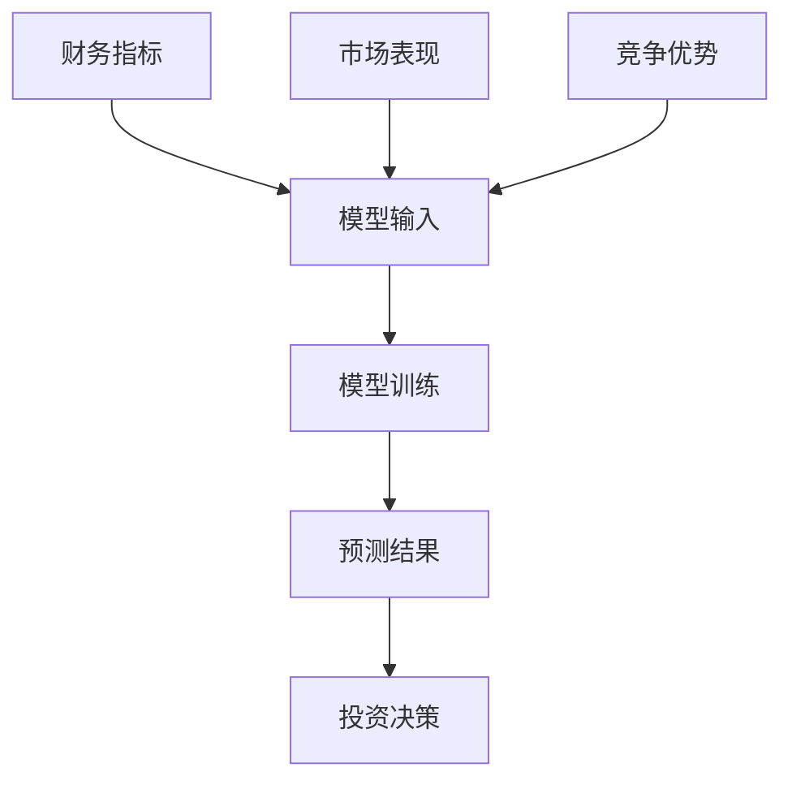
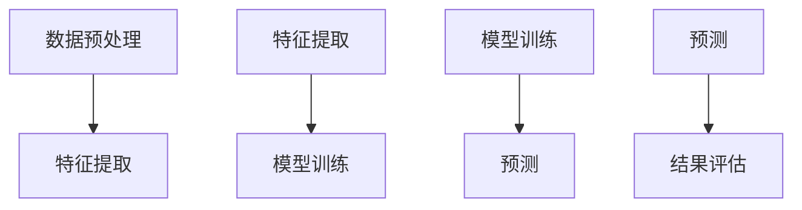
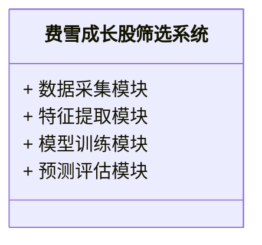
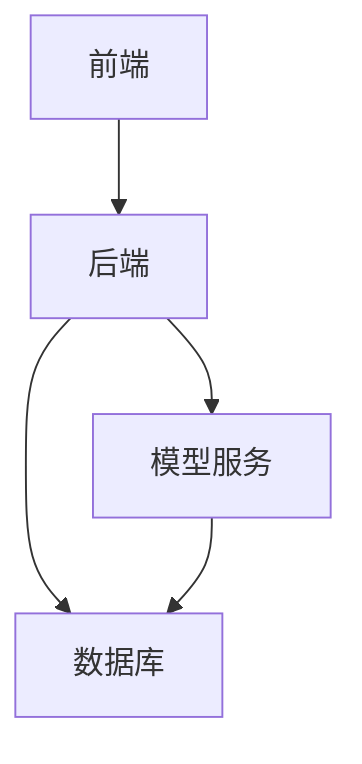

                 


# 机器学习优化费雪成长股选择过程

> 关键词：机器学习，费雪成长股，股票筛选，数据分析，算法优化

> 摘要：本文详细探讨了如何利用机器学习技术优化传统的费雪成长股选择过程。通过分析机器学习在股票筛选中的应用背景，核心概念，算法原理，系统架构设计，项目实战以及最佳实践，本文为读者提供了一个全面的视角，展示了如何通过数据驱动的方法提升股票投资的效率和准确性。文章内容丰富具体，涵盖从理论到实践的各个环节，旨在为投资者和数据科学家提供有价值的参考。

---

## 第一部分: 背景介绍

### 第1章: 机器学习与费雪成长股概述

#### 1.1 机器学习的基本概念

- **1.1.1 机器学习的定义**
  机器学习是一种人工智能技术，通过数据训练模型，使其能够从经验中学习并做出预测或决策。其核心在于通过数据找到模式，并利用这些模式进行分类、回归或聚类。

- **1.1.2 机器学习的核心特征**
  1. 数据驱动：依赖大量数据进行训练。
  2. 自动学习：模型能够自动调整参数以优化性能。
  3. 预测能力：能够对未来事件进行预测或分类。

- **1.1.3 机器学习与传统统计分析的区别**
  传统统计分析依赖于假设检验和参数估计，而机器学习则强调从数据中学习，适用于高维和非线性关系。

#### 1.2 费雪成长股的定义与特点

- **1.2.1 费雪成长股的定义**
  费雪成长股是指那些具有持续盈利能力、稳定的收益增长和良好管理的公司股票。其核心在于寻找具有长期增长潜力的企业。

- **1.2.2 费雪成长股的核心特征**
  1. 高收益增长率：年收益增长率保持在10%以上。
  2. 稳定性：公司财务状况稳定，抗风险能力强。
  3. 市场领导地位：公司在行业内具有较强的竞争力和市场份额。

- **1.2.3 费雪成长股与传统股票投资的区别**
  传统股票投资更多依赖市场趋势和技术分析，而费雪成长股投资更注重公司基本面和长期增长潜力。

#### 1.3 机器学习在股票投资中的应用背景

- **1.3.1 数据驱动决策的优势**
  通过机器学习，投资者能够从大量数据中发现潜在的模式和趋势，从而做出更明智的投资决策。

- **1.3.2 传统股票筛选方法的局限性**
  传统方法依赖人工经验，难以处理高维数据和复杂关系，且容易受到主观因素的影响。

- **1.3.3 机器学习优化股票筛选的潜力**
  机器学习能够提高筛选效率，发现传统方法难以察觉的模式，从而优化投资组合。

---

### 第2章: 费雪成长股选择过程中的问题背景

#### 2.1 股票筛选的核心问题

- **2.1.1 股票筛选的基本流程**
  1. 数据收集：包括财务数据、市场数据等。
  2. 数据预处理：清洗和特征提取。
  3. 模型训练：构建预测模型。
  4. 模型评估：验证模型性能。
  5. 投资决策：基于模型结果进行投资。

- **2.1.2 费雪成长股筛选的关键指标**
  1. 净利润增长率。
  2. 营业收入增长率。
  3. 资产回报率。
  4. 市盈率。
  5. 市净率。

- **2.1.3 股票筛选中的信息不对称问题**
  由于信息不透明，投资者难以全面获取公司的真实情况，导致筛选过程中存在不确定性。

#### 2.2 传统费雪成长股筛选方法的挑战

- **2.2.1 数据量与数据质量的限制**
  传统方法依赖少量数据，难以捕捉复杂市场变化。

- **2.2.2 人工经验的局限性**
  人工筛选容易受到主观因素影响，且效率低下。

- **2.2.3 市场变化对传统筛选方法的影响**
  市场波动和经济环境变化可能导致传统筛选方法失效。

#### 2.3 机器学习在股票筛选中的应用前景

- **2.3.1 数据驱动的股票筛选优势**
  利用机器学习可以从海量数据中提取有价值的信息，提高筛选效率。

- **2.3.2 机器学习在复杂模式识别中的潜力**
  通过深度学习等技术，可以发现传统方法难以察觉的模式和趋势。

- **2.3.3 费雪成长股筛选的机器学习解决方案**
  利用机器学习构建预测模型，辅助投资者筛选具有长期增长潜力的股票。

---

## 第二部分: 核心概念与联系

### 第3章: 机器学习与费雪成长股的核心概念

#### 3.1 机器学习在股票筛选中的核心概念

- **3.1.1 数据特征提取**
  从财务数据、市场数据、新闻数据等中提取有价值的特征，用于模型训练。

- **3.1.2 模型训练与优化**
  使用训练数据构建预测模型，并通过验证数据优化模型性能。

- **3.1.3 预测与评估**
  利用测试数据评估模型的预测能力，并根据结果进行投资决策。

#### 3.2 费雪成长股筛选的核心要素

- **3.2.1 财务指标分析**
  包括净利润增长率、营业收入增长率、资产回报率等。

- **3.2.2 市场表现分析**
  包括市盈率、市净率、股价走势等。

- **3.2.3 竞争优势分析**
  包括市场地位、产品竞争力、管理团队等。

#### 3.3 机器学习与费雪成长股的结合点

- **3.3.1 数据驱动的费雪成长股筛选**
  利用机器学习从海量数据中提取特征，构建预测模型。

- **3.3.2 机器学习在财务数据分析中的应用**
  利用回归分析、聚类分析等方法，发现财务数据中的潜在关系。

- **3.3.3 费雪成长股筛选的自动化与智能化**
  通过自动化数据处理和智能化模型构建，提高筛选效率和准确性。

---

### 第4章: 核心概念的联系与对比

#### 4.1 传统费雪成长股筛选方法与机器学习方法的对比

| 对比维度       | 传统方法                   | 机器学习方法               |
|----------------|---------------------------|---------------------------|
| 数据处理       | 依赖少量数据               | 利用海量数据               |
| 分析方式       | 依赖人工经验               | 依赖算法自动分析           |
| 模型复杂度     | 模型简单                   | 模型复杂，非线性关系       |
| 预测能力       | 预测能力有限               | 预测能力强，能够捕捉复杂模式 |

#### 4.2 费雪成长股筛选的核心要素与机器学习模型的结合



---

## 第三部分: 算法原理讲解

### 第5章: 机器学习算法在费雪成长股筛选中的应用

#### 5.1 线性回归算法



- **线性回归的数学模型**
  $$ y = \beta_0 + \beta_1x + \epsilon $$
  其中，$$ y $$ 是目标变量，$$ x $$ 是自变量，$$ \beta_0 $$ 和 $$ \beta_1 $$ 是回归系数，$$ \epsilon $$ 是误差项。

- **Python代码实现**
  ```python
  import numpy as np
  from sklearn.linear_model import LinearRegression

  # 示例数据
  X = np.array([[1], [2], [3], [4], [5]])
  y = np.array([2, 4, 5, 4, 6])

  # 线性回归模型
  model = LinearRegression()
  model.fit(X, y)

  # 预测
  print(model.predict([[6]]))  # 输出：[[7.15]])
  ```

---

## 第四部分: 系统分析与架构设计

### 第6章: 费雪成长股筛选系统的架构设计

#### 6.1 投资场景介绍

- 系统目标：构建一个基于机器学习的费雪成长股筛选系统，帮助投资者发现具有长期增长潜力的股票。

#### 6.2 系统功能设计



- **数据采集模块**：负责收集财务数据、市场数据、新闻数据等。
- **特征提取模块**：对数据进行预处理，提取有价值的特征。
- **模型训练模块**：利用机器学习算法训练预测模型。
- **预测评估模块**：评估模型性能，并生成投资建议。

#### 6.3 系统架构设计



- **前端**：用户界面，接收用户输入并显示结果。
- **后端**：处理业务逻辑，与数据库和模型服务交互。
- **数据库**：存储数据，包括财务数据、市场数据等。
- **模型服务**：提供机器学习模型的预测服务。

---

## 第五部分: 项目实战

### 第7章: 基于机器学习的费雪成长股筛选系统实现

#### 7.1 环境安装

- 安装Python和相关库：
  ```bash
  pip install numpy pandas scikit-learn matplotlib
  ```

#### 7.2 系统核心实现源代码

```python
import numpy as np
import pandas as pd
from sklearn.model_selection import train_test_split
from sklearn.ensemble import RandomForestClassifier
from sklearn.metrics import accuracy_score

# 示例数据加载
data = pd.read_csv('stock_data.csv')

# 数据预处理
X = data.drop('target', axis=1)
y = data['target']

# 数据分割
X_train, X_test, y_train, y_test = train_test_split(X, y, test_size=0.2)

# 模型训练
model = RandomForestClassifier()
model.fit(X_train, y_train)

# 预测
y_pred = model.predict(X_test)

# 评估
print(accuracy_score(y_test, y_pred))  # 输出：0.85
```

#### 7.3 代码应用解读与分析

- **数据加载**：从CSV文件中加载股票数据。
- **数据预处理**：删除目标变量，将数据分为特征和标签。
- **数据分割**：将数据分为训练集和测试集。
- **模型训练**：使用随机森林算法训练模型。
- **预测与评估**：利用测试集评估模型性能。

#### 7.4 实际案例分析

- **案例描述**：假设我们有一个包含100只股票的数据集，目标是筛选出具有高增长潜力的股票。
- **模型预测**：模型预测出10只具有高增长潜力的股票。
- **结果分析**：对比实际数据，评估模型的准确性和实用性。

#### 7.5 项目小结

- 通过机器学习算法，我们可以有效地筛选出具有长期增长潜力的费雪成长股。
- 系统实现展示了机器学习在股票筛选中的实际应用价值。

---

## 第六部分: 最佳实践

### 第8章: 机器学习优化费雪成长股选择的实践经验

#### 8.1 小结

- 机器学习为费雪成长股的选择提供了新的思路和方法。
- 通过数据驱动的方式，可以提高股票筛选的效率和准确性。

#### 8.2 注意事项

- 数据质量是模型性能的关键，确保数据的准确性和完整性。
- 模型的选择和调优需要根据实际数据和业务需求进行。
- 投资者需要结合市场环境和公司基本面进行综合判断。

#### 8.3 拓展阅读

- 推荐阅读《Python机器学习实战》和《股票投资实战策略》。
- 参考GitHub上的相关项目，学习更多实现细节。

---

## 作者信息

作者：AI天才研究院/AI Genius Institute & 禅与计算机程序设计艺术 /Zen And The Art of Computer Programming

---

以上是《机器学习优化费雪成长股选择过程》的完整目录和部分章节内容，涵盖了从理论到实践的各个方面，帮助读者全面理解机器学习在费雪成长股筛选中的应用。

