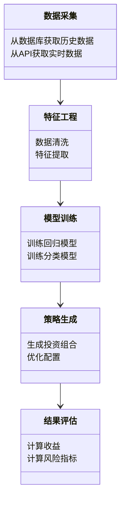
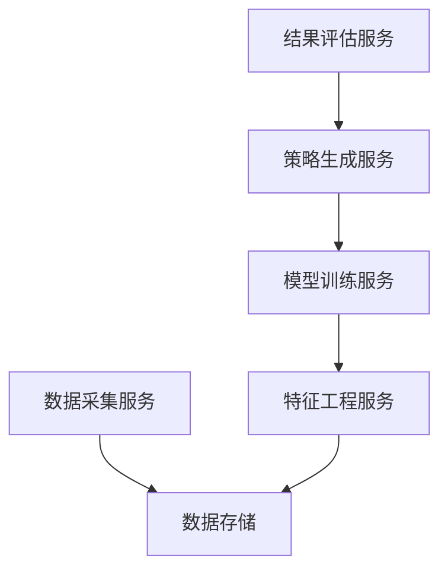

                 


# 机器学习优化长期价值投资策略

> 关键词：机器学习，长期投资，投资策略，价值投资，优化算法

> 摘要：本文深入探讨了机器学习在长期价值投资策略中的应用，结合实际案例分析，系统地介绍了如何利用机器学习算法优化投资决策。通过详细讲解算法原理、数学模型和系统架构设计，本文为读者提供了一套从理论到实践的完整解决方案。

---

## 第一部分: 机器学习与长期价值投资概述

### 第1章: 机器学习与长期价值投资的背景

#### 1.1 机器学习的核心概念
机器学习是一种人工智能技术，通过数据训练模型，使其能够从经验中学习并做出预测或决策。它主要分为监督学习、非监督学习和强化学习三类。监督学习适用于回归和分类问题，非监督学习用于聚类分析，而强化学习则通过试错优化策略。

长期价值投资强调投资于具有持续增长潜力的公司，关注其基本面和长期盈利能力。将机器学习应用于长期价值投资，可以通过数据分析识别潜在的优质股票，优化投资组合，降低风险。

#### 1.2 问题背景与解决方案
在传统投资中，分析师依赖经验和基本面分析，但这种方法存在主观性和效率低下的问题。随着市场数据的爆炸式增长，人工分析难以覆盖所有相关信息，且容易受到情绪影响。

机器学习通过自动化数据处理和模式识别，帮助投资者更高效地分析市场动态，识别潜在的投资机会。例如，使用回归算法预测股票价格趋势，或利用聚类算法发现具有相似财务表现的公司群体。

#### 1.3 投资策略优化的解决方案
通过机器学习，我们可以构建投资组合优化模型，自动调整资产配置，降低风险。具体来说，使用随机森林算法分析公司财务数据，筛选出具有高成长潜力的公司；利用支持向量机进行分类，识别市场中的低估股票。

#### 1.4 边界与外延
机器学习优化投资策略的应用边界在于数据质量和模型泛化能力。如果数据不足或存在偏差，模型可能失效。此外，市场是动态变化的，模型需要定期更新以适应新数据。

### 第2章: 机器学习在投资策略中的核心概念

#### 2.1 数据特征与投资决策
数据特征是模型的基础，包括财务指标（如市盈率、ROE）和市场指标（如波动率、成交量）。特征工程需要将这些数据转化为适合算法输入的格式。

例如，使用归一化处理财务指标，使其具有可比性。特征的重要性可以通过LASSO回归或随机森林的特征重要性得分来评估。

#### 2.2 机器学习算法与投资策略的关系
不同算法适用于不同的投资场景。回归算法适合预测连续型变量，如股票价格；分类算法适合二分类问题，如判断股票是否为“买入”或“卖出”。

#### 2.3 投资策略优化的数学模型
优化目标通常包括最大化收益、最小化风险或平衡两者。常用的风险指标包括夏普比率和最大回撤。模型需要考虑约束条件，如投资组合的总金额和资产配置比例。

---

## 第二部分: 机器学习算法与投资策略优化

### 第3章: 机器学习算法原理

#### 3.1 监督学习算法
##### 3.1.1 线性回归
线性回归是最简单的回归算法，适用于预测连续型变量。其目标是最小化预测值与真实值的平方差之和。公式如下：
$$ \text{损失函数} = \sum_{i=1}^{n}(y_i - \hat{y}_i)^2 $$
其中，$\hat{y}_i$是预测值，$y_i$是真实值。

##### 3.1.2 支持向量机
SVM适用于分类问题，通过构建超平面将数据分为两类。对于非线性数据，可以使用核函数将其映射到高维空间。

##### 3.1.3 随机森林
随机森林是一种集成学习方法，通过训练多个决策树并取其投票结果来提高准确性和鲁棒性。

#### 3.2 非监督学习算法
##### 3.2.1 K-means聚类
K-means将数据分成K个簇，目标是使簇内数据点的相似性最大化。适用于无监督场景，如发现市场中的相似股票。

##### 3.2.2 层次聚类
层次聚类通过构建树状结构将数据分成层次，适用于分析市场结构的变化。

##### 3.2.3 DBSCAN算法
DBSCAN基于密度的聚类算法，能够发现任意形状的簇，适用于处理噪声数据。

### 第4章: 投资策略优化的数学模型与公式

#### 4.1 线性回归模型
线性回归用于预测股票价格，公式为：
$$ y = \beta_0 + \beta_1x_1 + \beta_2x_2 + ... + \beta_nx_n $$
其中，$x_i$是特征，$\beta_i$是回归系数。

#### 4.2 随机森林模型
随机森林通过集成多个决策树的预测结果，公式如下：
$$ \text{最终预测} = \text{多数投票结果} $$

---

## 第三部分: 系统分析与架构设计

### 第4章: 投资策略优化系统

#### 4.1 系统功能设计
系统分为数据采集、特征工程、模型训练、策略生成和结果评估五个模块。功能模块图如下：



#### 4.2 系统架构设计
系统架构采用微服务架构，分为数据层、计算层和应用层。架构图如下：



---

## 第四部分: 项目实战

### 第5章: 实战案例分析

#### 5.1 环境安装
安装必要的库：
```bash
pip install numpy pandas scikit-learn
```

#### 5.2 核心代码实现
以下是一个简单的随机森林模型实现：
```python
from sklearn.ensemble import RandomForestClassifier
import pandas as pd
import numpy as np

# 数据加载与预处理
data = pd.read_csv('stock_data.csv')
X = data.drop('target', axis=1)
y = data['target']

# 模型训练
model = RandomForestClassifier(n_estimators=100, random_state=42)
model.fit(X, y)

# 预测与评估
预测结果 = model.predict(X测试集)
评估指标 = model.score(X测试集, y测试集)
```

#### 5.3 结果分析
根据模型输出的预测结果，生成投资组合并计算收益和风险指标，如夏普比率。

---

## 第五部分: 总结与展望

### 第6章: 总结

#### 6.1 核心要点回顾
- 机器学习在长期价值投资中的应用前景广阔。
- 算法选择和特征工程是关键。
- 系统架构设计决定了模型的稳定性和可扩展性。

#### 6.2 未来展望
随着AI技术的进步，投资策略优化将更加智能化。强化学习和深度学习的应用将进一步提升模型的预测能力。

---

## 注意事项

1. 数据质量和完整性对模型性能影响重大，建议使用清洗和特征工程处理数据。
2. 模型调优需要结合实际情况，选择合适的参数和评估指标。
3. 投资有风险，使用机器学习模型进行投资需谨慎。

---

## 参考文献

1. 《机器学习实战》
2. 《投资学原理》
3. 《Python机器学习》

---

作者：AI天才研究院 & 禅与计算机程序设计艺术

