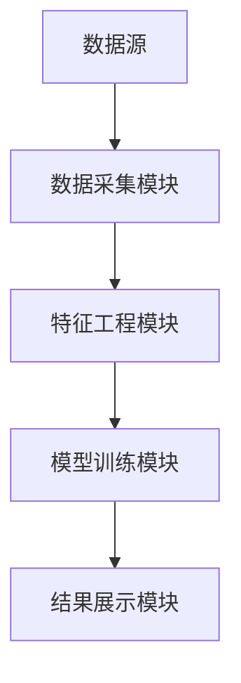

                 


# 机器学习增强技术面与基本面分析

> 关键词：机器学习、技术面分析、基本面分析、金融预测、特征工程、系统架构

> 摘要：本文探讨了机器学习在技术面与基本面分析中的应用，详细介绍了结合机器学习算法提升金融分析准确性的方法，包括特征工程、算法选择、系统架构设计以及实际项目案例的分析。通过本文，读者将了解如何利用机器学习技术增强金融分析能力。

---

## 第一部分: 背景介绍

### 第1章: 机器学习与金融分析的结合

#### 1.1 机器学习的基本概念与分类
机器学习是一种人工智能技术，通过数据训练模型，使其能够从经验中学习并做出预测。主要分为监督学习、无监督学习和强化学习。监督学习用于有标签数据的预测，无监督学习用于无标签数据的聚类，强化学习通过奖励机制优化决策。

#### 1.2 技术面分析与基本面分析的定义
- **技术面分析**：基于价格和成交量等市场数据，通过技术指标和图表模式预测价格走势。
- **基本面分析**：通过分析公司的财务报表、行业状况和宏观经济指标，评估其内在价值。

#### 1.3 机器学习在金融分析中的应用背景
随着金融数据的爆炸式增长，传统分析方法的局限性日益显现。机器学习能够处理海量数据，提取复杂模式，提升预测精度，成为现代金融分析的重要工具。

---

## 第二部分: 技术面分析与机器学习结合

### 第2章: 技术面分析的核心概念与特征工程

#### 2.1 技术面分析的常见指标
| 指标名称 | 定义 | 作用 |
|----------|------|------|
| 均线 | 一定时期内的平均价格 | 确认趋势和支撑/阻力位 |
| MACD | 移动平均收敛散度 | 识别趋势和潜在的买卖信号 |
| RSI | 相对强度指数 | 判断超买超卖状态 |

#### 2.2 基于技术面数据的特征工程
- 数据预处理：处理缺失值、标准化、去噪。
- 特征提取：提取均值、波动率、趋势等特征。

### 第3章: 机器学习算法在技术面分析中的应用

#### 3.1 算法选择
- **线性回归**：用于预测价格趋势。
- **随机森林**：用于分类和回归任务。
- **LSTM**：用于时间序列预测。

#### 3.2 使用Python实现技术面预测
```python
import pandas as pd
import numpy as np
from sklearn.ensemble import RandomForestRegressor

# 示例数据
data = pd.DataFrame({'close': [100, 105, 110, 108, 112]})
data['label'] = data['close'].shift(-1)
data = data.dropna()

X = data[['close']]
y = data['label']
```

### 第4章: 技术面分析的机器学习模型

#### 4.1 模型训练与评估
- 训练模型并评估其准确率、召回率等指标。
- 使用交叉验证优化模型参数。

---

## 第三部分: 基本面分析与机器学习结合

### 第5章: 基本面分析的核心概念与特征工程

#### 5.1 基本面分析的关键指标
| 指标名称 | 定义 | 作用 |
|----------|------|------|
| 市盈率 | 每股价格与每股收益的比值 | 评估股票估值 |
| 营业收入增长率 | 收入增长速度 | 判断公司成长性 |

#### 5.2 基于基本面数据的特征工程
- 数据清洗：处理异常值、缺失值。
- 特征选择：提取对公司价值影响大的指标。

### 第6章: 机器学习算法在基本面分析中的应用

#### 6.1 算法选择
- **逻辑回归**：用于分类任务。
- **支持向量机**：用于高维数据分类。
- **梯度提升树**：用于处理复杂特征关系。

#### 6.2 使用Python实现基本面预测
```python
import pandas as pd
from sklearn.svm import SVC

# 示例数据
data = pd.DataFrame({'revenue_growth': [10, 15, 20, 25], 'profit_margin': [5, 10, 15, 20]})
data['label'] = data['revenue_growth'].apply(lambda x: 'high' if x > 20 else 'low')

X = data[['revenue_growth', 'profit_margin']]
y = data['label']
```

---

## 第四部分: 综合技术面与基本面分析的机器学习模型

### 第7章: 综合分析的特征工程

#### 7.1 综合特征提取
- 结合技术面和基本面特征，进行降维和标准化。

### 第8章: 系统架构设计

#### 8.1 系统功能设计
- 数据采集模块：实时采集市场数据。
- 特征工程模块：提取和处理特征。
- 模型训练模块：训练和优化模型。
- 结果展示模块：可视化预测结果。

#### 8.2 系统架构图（Mermaid）


---

## 第五部分: 项目实战

### 第9章: 环境安装与数据收集

#### 9.1 安装依赖
- Python环境：Python 3.8+
- 库：pandas, scikit-learn, keras, tensorflow

### 第10章: 核心实现与分析

#### 10.1 技术面分析代码
```python
import numpy as np
from sklearn.linear_model import LinearRegression

# 示例数据
X = np.array([1, 2, 3, 4, 5])
y = np.array([2, 4, 5, 4, 6])

model = LinearRegression()
model.fit(X.reshape(-1, 1), y)

print(model.predict([[6]]))
```

#### 10.2 基本面分析代码
```python
import pandas as pd
from sklearn.svm import SVC

data = pd.DataFrame({'feature': [1, 2, 3, 4], 'label': [0, 1, 0, 1]})
model = SVC()
model.fit(data[['feature']], data['label'])

print(model.predict([[5]]))
```

---

## 第六部分: 总结与展望

### 第11章: 最佳实践与小结

#### 11.1 小结
机器学习能够显著提升技术面与基本面分析的准确性和效率，但需要结合具体场景选择合适的算法和特征工程方法。

#### 11.2 注意事项
- 数据质量直接影响模型性能。
- 需要定期更新模型以适应市场变化。

### 第12章: 拓展阅读与参考资料

- 推荐书籍：《机器学习实战》、《金融时间序列分析》。
- 推荐网站：Kaggle金融数据集。

---

## 作者信息

作者：AI天才研究院/AI Genius Institute & 禅与计算机程序设计艺术/Zen And The Art of Computer Programming

