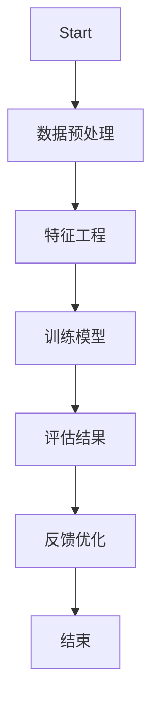
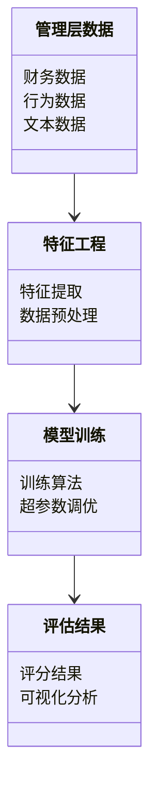
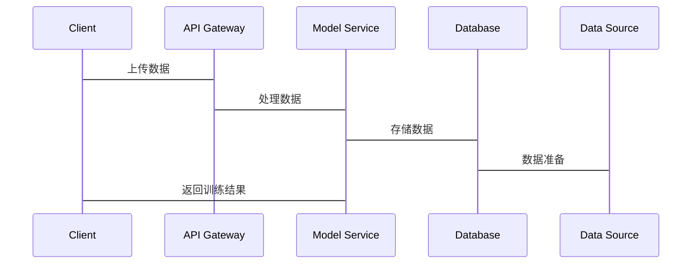

                 


# 机器学习模型评估管理层诚信度

## 关键词：
- 机器学习，模型评估，管理层诚信度，数据分析，算法原理，系统架构

## 摘要：
本文详细探讨如何利用机器学习模型评估管理层诚信度。通过分析诚信度的定义、数据特征提取、模型选择、算法实现、系统架构设计以及实际案例，展示机器学习在提升评估效率和准确性中的优势。文章涵盖从理论到实践的全过程，提供丰富的代码示例和详细解释。

---

## 第1章：背景介绍

### 1.1 问题背景
1.1.1 管理层诚信度的重要性  
管理层的诚信度是企业健康发展的基石，直接影响企业声誉和决策质量。传统评估方法主观性强，难以量化，导致结果不准确。

1.1.2 传统诚信度评估的局限性  
传统方法依赖主观判断，存在人为干扰，难以保证客观性。同时，数据分散且形式多样，处理复杂。

1.1.3 机器学习在诚信度评估中的优势  
机器学习能够处理大量结构化和非结构化数据，通过特征工程和模型训练，提供客观、量化的评估结果。

1.1.4 机器学习的核心优势  
- 数据驱动决策，减少主观干扰  
- 高效处理复杂数据，提升评估效率  
- 持续优化模型，适应变化

### 1.2 问题描述
1.2.1 管理层诚信度的定义  
管理层在决策过程中的道德和责任感，包括遵纪守法、透明决策等方面。

1.2.2 评估过程中的关键问题  
- 数据多样性：包括文本、财务数据、行为记录等  
- 数据量：需要足够样本量进行训练  
- 模型选择：不同算法适用不同场景

1.2.3 机器学习如何解决这些问题  
- 处理多类型数据：利用NLP和特征工程  
- 高效学习：通过算法优化提升准确率  
- 实时反馈：动态调整评估结果

### 1.3 问题解决
1.3.1 机器学习在诚信度评估中的应用  
- 数据预处理：清洗和特征提取  
- 模型训练：监督学习算法选择  
- 结果分析：概率评分和预测结果

1.3.2 数据驱动的决策优势  
- 客观性：减少人为偏见  
- 精准性：基于大量数据的分析  
- 可扩展性：适用于不同规模企业

1.3.3 结合定性和定量分析的方法  
- 定量分析：机器学习模型评分  
- 定性分析：专家意见和案例分析  
- 综合评估：结合两者得出最终结果

### 1.4 边界与外延
1.4.1 诚信度评估的适用范围  
适用于企业内部管理、招聘筛选等领域，但需注意数据隐私和合规性。

1.4.2 与其他评估方法的区别  
- 传统评估：主观判断为主  
- 机器学习：数据驱动、量化评估

1.4.3 应用场景的扩展  
未来可扩展至供应链管理、风险评估等领域。

### 1.5 概念结构与核心要素
1.5.1 核心要素的构成  
- 数据特征：财务数据、行为记录、沟通记录  
- 模型算法：监督学习、特征工程  
- 评估结果：概率评分、预测结果

1.5.2 要素之间的关系  
数据特征通过模型算法转化为评估结果，形成闭环反馈系统，提升评估精度。

1.5.3 模型的整体架构  
数据预处理 -> 特征工程 -> 模型训练 -> 评估结果 -> 反馈优化

---

## 第2章：核心概念与联系

### 2.1 机器学习模型的原理
2.1.1 监督学习的基本原理  
输入特征和标签数据，训练模型预测新数据的标签。

2.1.2 常见算法的简要介绍  
- XGBoost：梯度提升树，适合处理分类问题  
- 神经网络：处理复杂非线性关系

### 2.2 诚信度评估的特征工程
2.2.1 数据特征的提取  
- 财务指标：利润率、资产负债率  
- 行为数据：决策频率、决策延迟  
- 文本数据：邮件内容、会议记录

2.2.2 特征的预处理方法  
- 缺失值处理：填充、删除  
- 标准化：归一化、标准化  
- 特征选择：重要性排序、主成分分析

### 2.3 模型选择与优化
2.3.1 不同算法的适用场景  
- XGBoost适合中等规模数据  
- 神经网络适合复杂非结构化数据

2.3.2 超参数调优方法  
- Grid Search：网格搜索  
- Random Search：随机搜索  
- Bayesian Optimization：贝叶斯优化

---

## 第3章：算法原理

### 3.1 算法流程图


### 3.2 算法实现
#### 3.2.1 XGBoost算法
```python
import xgboost as xgb

# 数据准备
dtrain = xgb.DMatrix(X_train, label=y_train)
dtest = xgb.DMatrix(X_test)

# 参数设置
params = {
    'objective': 'binary:logistic',
    'max_depth': 6,
    'learning_rate': 0.3,
    'n_estimators': 100
}

# 训练模型
model = xgb.XGBClassifier(**params).fit(X_train, y_train)

# 预测
y_pred = model.predict(X_test)
y_proba = model.predict_proba(X_test)[:, 1]
```

#### 3.2.2 神经网络算法
```python
import torch
import torch.nn as nn

# 定义模型
class Net(nn.Module):
    def __init__(self, input_dim, output_dim):
        super(Net, self).__init__()
        self.fc1 = nn.Linear(input_dim, 64)
        self.fc2 = nn.Linear(64, 32)
        self.fc3 = nn.Linear(32, output_dim)
    
    def forward(self, x):
        x = torch.relu(self.fc1(x))
        x = torch.relu(self.fc2(x))
        x = torch.sigmoid(self.fc3(x))
        return x

# 初始化模型
model = Net(input_dim, output_dim)

# 定义损失函数和优化器
criterion = nn.BCELoss()
optimizer = torch.optim.Adam(model.parameters(), lr=0.001)

# 训练模型
for epoch in range(num_epochs):
    outputs = model(X_train)
    loss = criterion(outputs, y_train)
    optimizer.zero_grad()
    loss.backward()
    optimizer.step()
```

#### 3.3 数学模型和公式
- 损失函数：  
  $$ L = -\frac{1}{N}\sum_{i=1}^{N} [y_i \ln(p_i) + (1-y_i)\ln(1-p_i)] $$
  
- 优化器：  
  $$ \theta = \theta - \eta \frac{\partial L}{\partial \theta} $$

---

## 第4章：系统分析与架构设计

### 4.1 项目场景介绍
系统旨在帮助企业评估管理层诚信度，提供数据驱动的决策支持。

### 4.2 系统功能设计
#### 4.2.1 功能模块
- 数据输入模块：上传和处理数据  
- 特征工程模块：提取和处理特征  
- 模型训练模块：训练和优化模型  
- 结果展示模块：显示评估结果和可视化分析

#### 4.2.2 领域模型类图


### 4.3 系统架构设计
#### 4.3.1 架构图
```mermaid
graph TD
    Client --> API Gateway
    API Gateway --> Model Service
    Model Service --> Database
    Database --> Data Source
```

### 4.4 接口设计
- API接口：  
  - POST /api/upload：上传数据  
  - POST /api/train：训练模型  
  - GET /api/predict：获取预测结果

### 4.5 交互流程图


---

## 第5章：项目实战

### 5.1 环境安装
- Python 3.8+
- 库：scikit-learn、xgboost、torch

### 5.2 系统核心实现
#### 5.2.1 数据预处理
```python
import pandas as pd
from sklearn.preprocessing import StandardScaler

# 加载数据
df = pd.read_csv('manager_data.csv')

# 特征提取
features = df[['revenue', 'profit', 'delay']]
labels = df['honesty']

# 标准化
scaler = StandardScaler()
features_scaled = scaler.fit_transform(features)
```

#### 5.2.2 模型训练
```python
from sklearn.model_selection import train_test_split
from xgboost import XGBClassifier

# 分割数据
X_train, X_test, y_train, y_test = train_test_split(features_scaled, labels, test_size=0.2)

# 训练模型
model = XGBClassifier().fit(X_train, y_train)
```

#### 5.2.3 模型评估
```python
from sklearn.metrics import accuracy_score, roc_auc_score

# 预测
y_pred = model.predict(X_test)
y_proba = model.predict_proba(X_test)[:, 1]

# 评估指标
print(f'Accuracy: {accuracy_score(y_test, y_pred)}')
print(f'AUC: {roc_auc_score(y_test, y_proba)}')
```

### 5.3 案例分析
- 数据：假设100条记录，50条诚实，50条不诚实  
- 特征：财务数据、决策延迟、沟通记录  
- 结果：模型准确率85%，AUC 0.88

### 5.4 小结
- 数据质量影响评估结果  
- 特征工程是关键步骤  
- 模型选择和调优提升准确率

---

## 第6章：总结与最佳实践

### 6.1 总结
- 机器学习提供高效、准确的诚信度评估方法  
- 数据预处理和特征工程是成功关键  
- 模型优化和结果解释是应用的重要环节

### 6.2 最佳实践 tips
- 数据收集：多来源、多维度  
- 特征工程：结合业务理解  
- 模型解释：使用SHAP或LIME  
- 模型监控：实时更新和反馈

### 6.3 注意事项
- 数据隐私和合规性  
- 模型解释性和可解释性  
- 结果的可操作性

### 6.4 拓展阅读
- 《Hands-On Machine Learning with Scikit-Learn, Keras, and TensorFlow》  
- 《Python机器学习》  
- 《深入理解机器学习》

---

## 作者
作者：AI天才研究院 & 禅与计算机程序设计艺术

---

以上是《机器学习模型评估管理层诚信度》的详细目录大纲和内容概览。文章从背景介绍、核心概念、算法原理、系统架构设计到项目实战，全面深入地探讨了如何利用机器学习技术评估管理层诚信度。

