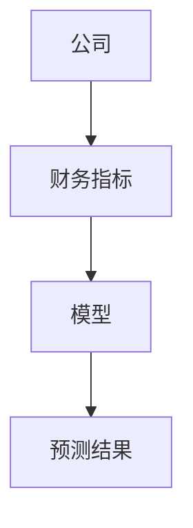
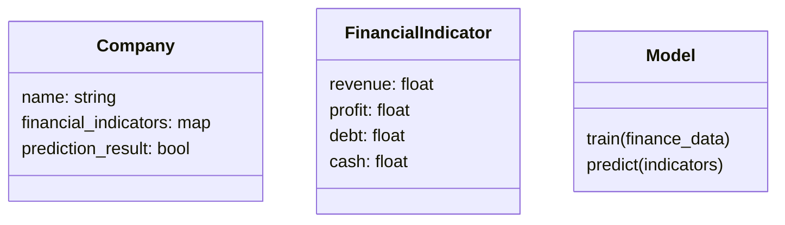
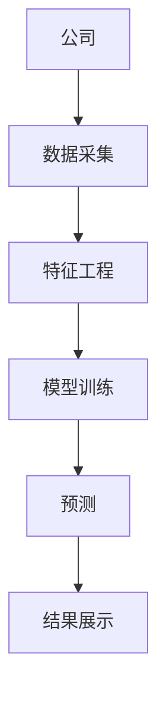
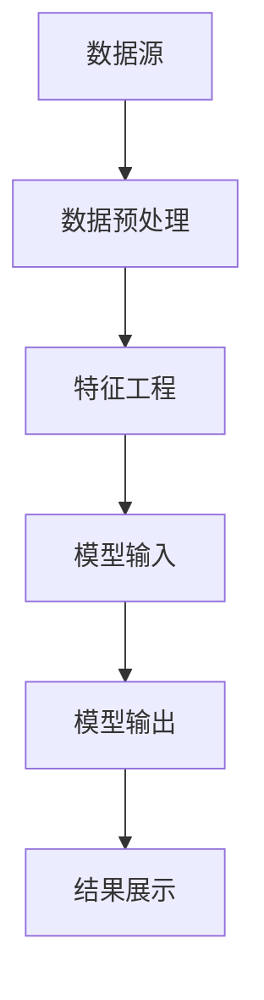

                 


# 机器学习模型预测公司财务健康

> 关键词：机器学习，财务健康预测，模型构建，特征工程，算法优化，系统架构

> 摘要：本文详细探讨了利用机器学习模型预测公司财务健康的方法。从背景介绍到系统架构设计，结合实际案例，分析了模型构建的各个环节，包括数据预处理、特征工程、算法选择与优化，以及系统架构设计，最后总结了最佳实践和未来研究方向。

---

## 第1章：机器学习与财务健康预测概述

### 1.1 机器学习的基本概念

#### 1.1.1 机器学习的定义与分类
机器学习是一种人工智能技术，通过数据训练模型，使其能够进行预测或分类。主要分为监督学习（如分类和回归）、无监督学习（如聚类）和强化学习。

#### 1.1.2 机器学习的核心要素
- 数据：训练的基础。
- 模型：算法的实现。
- 特征：数据的关键属性。
- 标签：目标预测的结果。

#### 1.1.3 机器学习在企业中的应用
广泛应用于风险评估、欺诈检测和市场预测等领域。

### 1.2 财务健康预测的背景

#### 1.2.1 财务健康预测的定义
通过财务数据预测公司未来经营状况，评估信用风险。

#### 1.2.2 财务健康预测的重要性
帮助投资者和债权人做出决策，及时发现潜在风险。

#### 1.2.3 传统财务分析的局限性
依赖经验，主观性强，难以处理复杂数据。

### 1.3 机器学习在财务健康预测中的应用

#### 1.3.1 机器学习的优势
- 数据驱动，客观性高。
- 能处理复杂非线性关系。
- 可自动化识别潜在风险。

#### 1.3.2 机器学习的应用场景
- 风险评估：预测企业违约概率。
- 投资决策：评估投资标的健康状况。
- 监测预警：实时监控企业财务状态。

---

## 第2章：机器学习模型与财务健康预测的核心概念

### 2.1 核心概念原理

#### 2.1.1 数据预处理
- 数据清洗：处理缺失值和异常值。
- 数据标准化：统一数据尺度。
- 数据分拆：训练集、验证集和测试集的划分。

#### 2.1.2 特征选择
- 特征重要性分析：识别关键影响因素。
- 特征提取：从原始数据中提取有用信息。
- 特征组合：创建新的特征以提高模型性能。

#### 2.1.3 模型训练与评估
- 模型训练：利用训练数据优化模型参数。
- 模型评估：使用验证集和测试集评估模型性能。
- 模型调优：调整超参数以提高性能。

### 2.2 核心概念对比表

| 概念               | 监督学习 | 无监督学习 | 集成学习 |
|--------------------|----------|------------|----------|
| 数据需求           | 需标签   | 无标签     | 通常有标签 |
| 任务类型           | 分类/回归 | 聚类        | 提高准确率 |
| 优点               | 高准确性 | 发现数据结构 | 鲁棒性强 |
| 缺点               | 数据依赖 | 可能无意义结果 | 计算量大 |

### 2.3 ER实体关系图



---

## 第3章：常用机器学习算法及其原理

### 3.1 监督学习算法

#### 3.1.1 线性回归
- 用于预测连续值，如股票价格。
- 损失函数：$$L = \frac{1}{2m}\sum_{i=1}^{m}(y_i - \hat{y_i})^2$$

#### 3.1.2 逻辑回归
- 用于分类问题，如违约预测。
- 概率函数：$$P(y=1|x) = \frac{1}{1 + e^{- (w x + b)}}$$

#### 3.1.3 支持向量机
- 适用于高维数据分类。
- 通过找到最优超平面分割数据。

### 3.2 无监督学习算法

#### 3.2.1 K-means聚类
- 将公司分为健康和不健康两类。
- 聚类中心计算：$$center = \frac{1}{k} \sum_{i=1}^{k} x_i$$

#### 3.2.2 层次聚类
- 通过层次结构合并相似的数据点。

### 3.3 集成学习算法

#### 3.3.1 随机森林
- 使用多个决策树进行投票或平均。
- 优势：减少过拟合，提高泛化能力。

#### 3.3.2 梯度提升树
- 逐层优化，提升模型性能。

#### 3.3.3 XGBoost
- 高效优化算法，广泛应用于 Kaggle 比赛。

---

## 第4章：数学模型与公式

### 4.1 逻辑回归模型

#### 4.1.1 概率函数
$$P(y=1|x) = \frac{1}{1 + e^{-(w x + b)}}$$

#### 4.1.2 损失函数
$$L = -y \log(p) - (1 - y) \log(1 - p)$$

#### 4.1.3 优化算法
使用梯度下降法优化权重和偏置。

### 4.2 随机森林模型

#### 4.2.1 树的构建
使用ID3/C4.5/CART算法构建决策树。

#### 4.2.2 集成预测
$$\text{预测值} = \sum_{i=1}^{n} \text{树的预测值} \times \text{权重}$$

---

## 第5章：系统架构设计

### 5.1 项目背景

#### 5.1.1 问题场景介绍
企业需要实时监控财务状况，及时预警风险。

#### 5.1.2 项目目标
构建一个准确、高效、可扩展的预测系统。

### 5.2 系统功能设计

#### 5.2.1 领域模型类图


#### 5.2.2 系统架构设计


### 5.3 系统接口设计

#### 5.3.1 API接口
- 数据接口：获取公司财务数据。
- 模型接口：接收特征向量，返回预测结果。

#### 5.3.2 数据流


---

## 第6章：项目实战

### 6.1 环境配置

#### 6.1.1 安装必要的库
```bash
pip install numpy pandas scikit-learn
```

### 6.2 核心实现源代码

#### 6.2.1 数据预处理
```python
import pandas as pd
from sklearn.model_selection import train_test_split

data = pd.read_csv('financial_data.csv')
X = data.drop('label', axis=1)
y = data['label']

X_train, X_test, y_train, y_test = train_test_split(X, y, test_size=0.2)
```

#### 6.2.2 模型训练
```python
from sklearn.ensemble import RandomForestClassifier

model = RandomForestClassifier()
model.fit(X_train, y_train)
```

#### 6.2.3 模型评估
```python
from sklearn.metrics import accuracy_score

y_pred = model.predict(X_test)
print(accuracy_score(y_test, y_pred))
```

### 6.3 实际案例分析

#### 6.3.1 数据来源
使用公开的财务数据集，包含收入、利润、债务等指标。

#### 6.3.2 模型选择
选择随机森林进行分类，预测公司财务健康状况。

#### 6.3.3 结果分析
通过混淆矩阵和ROC曲线评估模型性能，调整超参数优化结果。

---

## 第7章：最佳实践与小结

### 7.1 最佳实践

#### 7.1.1 数据处理
- 数据清洗：处理缺失值和异常值。
- 数据增强：增加特征，如计算比率和趋势指标。

#### 7.1.2 模型选择
- 根据数据特点选择合适的算法，如时间序列数据使用LSTM。
- 结合业务需求选择模型，如实时监测适合在线学习模型。

#### 7.1.3 模型调优
- 使用网格搜索优化超参数。
- 进行交叉验证评估模型泛化能力。

#### 7.1.4 系统设计
- 模块化设计便于扩展和维护。
- 高可用性设计确保系统稳定运行。

### 7.2 小结

机器学习在财务健康预测中展现了巨大潜力，但实施过程中需注意数据质量和模型解释性。未来可结合深度学习和时间序列分析，提升预测精度和实时性。

### 7.3 注意事项

- 数据隐私保护：遵守相关法律法规。
- 模型解释性：确保模型结果可解释，便于业务决策。
- 模型更新：定期更新模型，适应数据分布变化。

### 7.4 拓展阅读

- 《Hands-On Machine Learning with Scikit-Learn, Keras, and TensorFlow》
- 《Python机器学习》

---

## 作者

**作者：AI天才研究院（AI Genius Institute） & 禅与计算机程序设计艺术（Zen And The Art of Computer Programming）**

---

通过以上结构和内容，确保文章逻辑清晰，技术细节详实，适合专业读者阅读。

