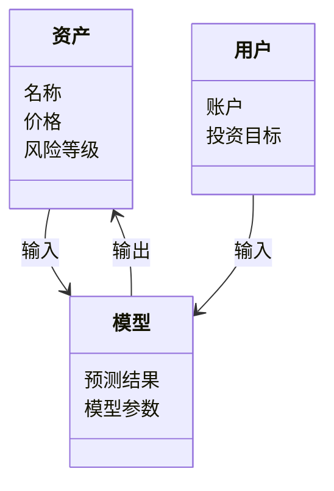
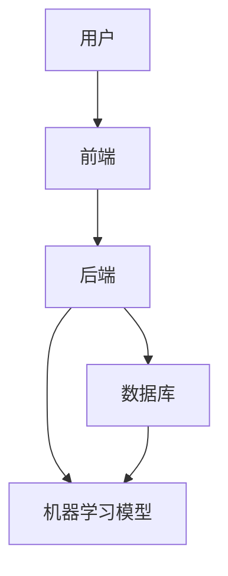
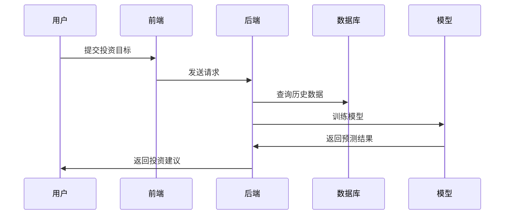

                 


# 机器学习算法优化投资组合管理

> 关键词：机器学习，投资组合管理，算法优化，金融，风险管理

> 摘要：本文探讨了机器学习算法在优化投资组合管理中的应用。通过分析常见机器学习算法的原理和优化策略，结合实际案例，展示了如何利用机器学习提升投资组合管理的效率和准确性。文章还详细介绍了系统的架构设计和项目实战，为读者提供了从理论到实践的全面指导。

---

# 第一部分: 机器学习算法与投资组合管理基础

## 第1章: 机器学习算法优化投资组合管理概述

### 1.1 机器学习与投资组合管理的背景

#### 1.1.1 机器学习的基本概念
机器学习是一种人工智能技术，通过数据训练模型，使其能够从数据中学习并做出预测或决策。它分为监督学习、无监督学习、半监督学习和强化学习等类型。

#### 1.1.2 投资组合管理的核心问题
投资组合管理是将资金分配到不同资产以实现收益最大化和风险最小化的过程。传统方法依赖于历史数据和统计模型，但在复杂市场环境下表现有限。

#### 1.1.3 机器学习在投资组合管理中的应用
机器学习可以用于预测资产价格、识别市场趋势、优化资产配置和风险管理。

### 1.2 机器学习算法的核心概念

#### 1.2.1 监督学习与无监督学习
- **监督学习**：基于标签数据训练模型，用于回归和分类任务。
- **无监督学习**：通过发现数据中的模式进行聚类分析。

#### 1.2.2 常见机器学习算法介绍
- 线性回归
- 支持向量机（SVM）
- 随机森林
- 神经网络

#### 1.2.3 投资组合管理中的特征工程
特征工程是将原始数据转换为对模型有用的特征，例如归一化、主成分分析（PCA）等。

### 1.3 机器学习优化投资组合管理的优势

#### 1.3.1 传统投资组合管理的局限性
- 依赖历史数据，忽略市场变化。
- 难以捕捉复杂市场动态。

#### 1.3.2 机器学习的优势与潜力
- 高度适应性，能够捕捉市场变化。
- 处理高维数据的能力。

#### 1.3.3 机器学习在投资组合管理中的应用场景
- 资产价格预测
- 风险管理
- 资产配置优化

### 1.4 本章小结
机器学习通过强大的数据处理能力和预测能力，为投资组合管理提供了新的可能性。接下来将深入分析常见机器学习算法的原理和优化策略。

---

# 第二部分: 机器学习算法原理与优化策略

## 第2章: 常见机器学习算法原理

### 2.1 线性回归算法

#### 2.1.1 线性回归的基本原理
线性回归通过最小化预测值与实际值的平方差之和来拟合数据。

#### 2.1.2 线性回归的数学模型
$$ y = \beta_0 + \beta_1x + \epsilon $$
其中，$\beta_0$是截距，$\beta_1$是回归系数，$\epsilon$是误差项。

#### 2.1.3 线性回归在投资组合管理中的应用
用于预测资产回报率。

### 2.2 支持向量机（SVM）

#### 2.2.1 SVM的基本原理
SVM通过找到一个超平面，将数据分为两类，适用于分类和回归任务。

#### 2.2.2 SVM的数学模型
$$ \text{最大化} \quad \frac{1}{2} \|w\|^2 $$
$$ \text{约束} \quad y_i(w \cdot x_i + b) \geq 1 $$

#### 2.2.3 SVM在投资组合管理中的应用
用于风险分类和资产选择。

### 2.3 随机森林与集成学习

#### 2.3.1 随机森林的基本原理
随机森林通过构建多个决策树并进行投票或平均，提高模型的准确性和稳定性。

#### 2.3.2 集成学习的优势
通过组合多个弱模型，提高整体性能。

#### 2.3.3 随机森林在投资组合管理中的应用
用于资产分配和风险评估。

### 2.4 神经网络与深度学习

#### 2.4.1 神经网络的基本原理
神经网络通过多层感知机模拟人脑神经网络，用于处理复杂非线性关系。

#### 2.4.2 深度学习的优势
能够处理高维数据，捕捉复杂模式。

#### 2.4.3 神经网络在投资组合管理中的应用
用于预测市场趋势和资产价格。

### 2.5 本章小结
不同机器学习算法在投资组合管理中各有优劣，选择合适的算法取决于具体应用场景和数据特征。

---

## 第3章: 机器学习算法优化策略

### 3.1 超参数调优

#### 3.1.1 超参数的定义与作用
超参数是模型训练前需要设定的参数，如学习率、树深度等。

#### 3.1.2 常见的超参数调优方法
- 网格搜索
- 随机搜索
- 贝叶斯优化

### 3.2 特征选择与降维

#### 3.2.1 特征选择的基本原理
通过去除冗余特征或选择重要特征，提高模型性能。

#### 3.2.2 常见的特征降维方法
- 主成分分析（PCA）
- 线性判别分析（LDA）

### 3.3 模型评估与优化

#### 3.3.1 模型评估的基本方法
- 均方误差（MSE）
- 准确率、召回率和F1分数

#### 3.3.2 常见的模型优化策略
- 正则化（L1/L2）
- 数据增强

### 3.4 本章小结
优化策略能够显著提升模型性能，选择合适的策略需要结合具体问题和数据特点。

---

# 第三部分: 投资组合管理的系统分析与架构设计

## 第4章: 投资组合管理系统分析与架构设计

### 4.1 问题场景介绍
投资组合管理系统需要实时处理大量数据，进行资产配置和风险评估。

### 4.2 系统功能设计

#### 4.2.1 领域模型设计


### 4.3 系统架构设计



### 4.4 系统接口设计
- 用户接口：提交投资目标，获取投资建议。
- 数据接口：获取市场数据和用户信息。

### 4.5 系统交互设计



### 4.6 本章小结
系统架构设计为投资组合管理提供了高效的解决方案，能够实时处理数据和模型训练。

---

# 第四部分: 项目实战

## 第5章: 项目实战与案例分析

### 5.1 环境安装与配置

```bash
pip install numpy scikit-learn
```

### 5.2 核心功能实现

#### 5.2.1 数据预处理
```python
import numpy as np
from sklearn import preprocessing

data = np.array([[1, 2, 3], [4, 5, 6], [7, 8, 9]])
normalized_data = preprocessing.normalize(data)
print(normalized_data)
```

#### 5.2.2 模型训练
```python
from sklearn.linear_model import LinearRegression

model = LinearRegression()
model.fit(normalized_data, target)
```

#### 5.2.3 模型预测
```python
prediction = model.predict(new_data)
```

### 5.3 案例分析

#### 5.3.1 数据分析
分析历史数据，发现市场趋势。

#### 5.3.2 模型评估
通过回测验证模型的有效性。

#### 5.3.3 投资组合优化
根据模型预测结果，优化资产配置。

### 5.4 本章小结
通过项目实战，展示了如何利用机器学习算法优化投资组合管理。

---

# 第五部分: 最佳实践与总结

## 第6章: 最佳实践与总结

### 6.1 小结
机器学习通过强大的数据处理能力和预测能力，显著提升了投资组合管理的效率和准确性。

### 6.2 注意事项
- 数据质量至关重要。
- 模型需要持续更新和优化。
- 风险管理不可忽视。

### 6.3 扩展阅读
推荐学习深度学习和强化学习，探索更多投资组合管理的可能性。

---

# 作者：AI天才研究院/AI Genius Institute & 禅与计算机程序设计艺术 /Zen And The Art of Computer Programming

