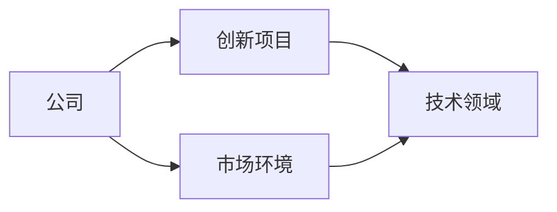
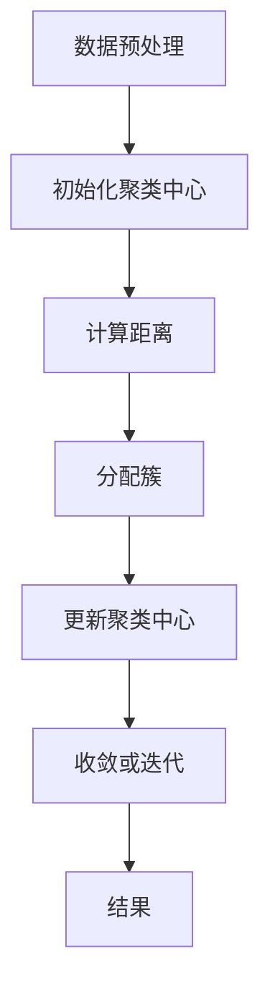
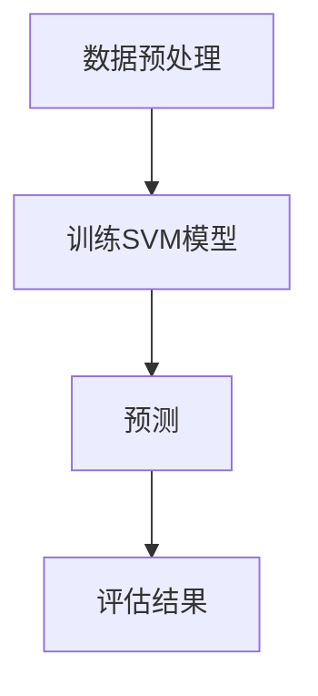
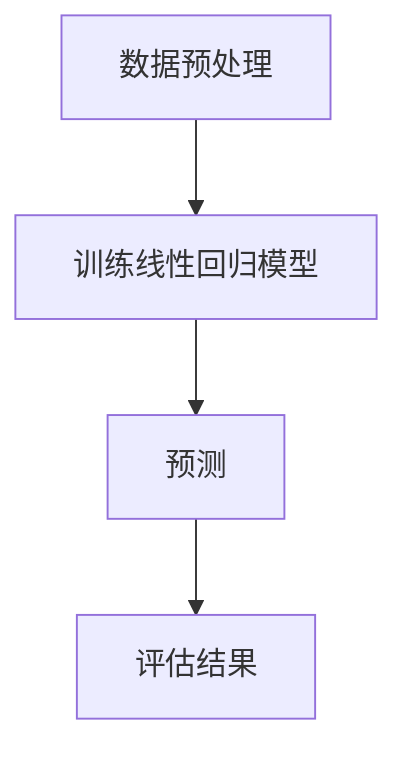
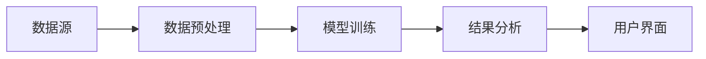

                 


# 机器学习辅助公司创新生态分析

> **关键词**: 机器学习，创新生态，数据分析，算法原理，系统架构，案例分析

> **摘要**: 本文探讨了机器学习如何辅助公司分析其创新生态系统。通过背景介绍、核心概念、算法原理、系统架构设计、项目实战、最佳实践等部分，详细阐述了机器学习在创新生态分析中的应用，结合实际案例和代码实现，为读者提供了从理论到实践的全面指导。

---

## 第1章: 背景介绍

### 1.1 机器学习与公司创新生态的概念

#### 1.1.1 机器学习的基本概念

机器学习是一种人工智能技术，通过数据训练模型，使其能够从数据中学习并做出预测或决策。它主要分为监督学习（带标签数据）、无监督学习（无标签数据）和强化学习（通过奖励机制学习）。

#### 1.1.2 公司创新生态的定义

公司创新生态是指围绕企业创新活动的所有要素，包括内部资源、外部环境、合作伙伴、市场需求等。创新生态的健康与否直接影响企业的创新能力和发展潜力。

#### 1.1.3 机器学习在创新生态分析中的作用

机器学习可以帮助企业从大量数据中识别创新机会、优化创新流程、评估创新绩效，并预测创新趋势。

### 1.2 问题背景与描述

#### 1.2.1 当前公司创新面临的挑战

- 市场变化快，创新需求多样。
- 数据分散，难以整合分析。
- 创新项目评估缺乏科学方法。

#### 1.2.2 机器学习如何解决创新分析问题

- 自动化数据处理和模式识别。
- 提供数据驱动的决策支持。
- 发现潜在的创新机会。

#### 1.2.3 创新生态分析的边界与外延

- 边界：聚焦于企业内部创新项目和外部市场环境。
- 外延：扩展到合作伙伴、行业趋势等外部因素。

### 1.3 核心概念与要素

#### 1.3.1 创新生态的核心要素

- **内部要素**：研发能力、团队结构、资金投入。
- **外部要素**：市场需求、政策环境、竞争状况。
- **互动要素**：合作伙伴关系、知识共享。

#### 1.3.2 机器学习模型的关键属性

- **数据驱动**：依赖高质量数据。
- **可扩展性**：处理大量数据。
- **可解释性**：便于决策者理解。

#### 1.3.3 创新生态与机器学习的结合点

- 数据采集与整合。
- 模型训练与优化。
- 结果分析与应用。

---

## 第2章: 核心概念与联系

### 2.1 机器学习的核心原理

#### 2.1.1 监督学习与无监督学习的对比

| 对比维度      | 监督学习            | 无监督学习          |
|---------------|--------------------|---------------------|
| 数据类型      | 标签数据            | 无标签数据          |
| 目标          | 预测特定结果        | 发现数据结构         |
| 常见算法      | 线性回归、SVM        | K-means、聚类分析    |

#### 2.1.2 深度学习与传统机器学习的区别

- **输入数据处理**：深度学习可处理复杂数据，传统方法需特征工程。
- **模型复杂度**：深度学习模型复杂，传统方法更简单。
- **计算资源**：深度学习需要大量计算资源。

#### 2.1.3 算法选择与数据特征的关系

- 数据特征影响算法性能，特征工程是关键。

### 2.2 创新生态的实体关系图



---

## 第3章: 机器学习算法原理

### 3.1 常用算法及其流程图

#### 3.1.1 K-means聚类算法流程



#### 3.1.2 支持向量机分类流程



#### 3.1.3 线性回归预测流程



### 3.2 算法实现与代码示例

#### 3.2.1 Python代码实现K-means聚类

```python
from sklearn.cluster import KMeans
import numpy as np

# 示例数据
X = np.array([[1, 2], [3, 4], [5, 6], [7, 8]])

# 初始化模型
kmeans = KMeans(n_clusters=2, random_state=0)

# 训练模型
kmeans.fit(X)

# 预测簇
print(kmeans.predict(X))
```

#### 3.2.2 用scikit-learn库训练SVM模型

```python
from sklearn import svm

# 示例数据
X = [[0, 0], [1, 1], [2, 2], [3, 3]]
y = [0, 1, 1, 0]

# 初始化模型
clf = svm.SVC()

# 训练模型
clf.fit(X, y)

# 预测结果
print(clf.predict([[4,4]]))
```

#### 3.2.3 用线性回归预测创新绩效

```python
from sklearn.linear_model import LinearRegression

# 示例数据
X = [[1], [2], [3], [4]]
y = [2, 4, 5, 7]

# 初始化模型
reg = LinearRegression()

# 训练模型
reg.fit(X, y)

# 预测结果
print(reg.predict([[5]]))
```

### 3.3 算法数学模型

#### 3.3.1 K-means算法

目标函数：
$$ \text{argmin}_{c_1,...,c_k} \sum_{i=1}^{n} \min_{j} ||x_i - c_j||^2 $$

#### 3.3.2 支持向量机

优化目标：
$$ \text{max} \sum_{i=1}^{n} \alpha_i (1 - y_i (w \cdot x_i + b)) + \frac{1}{2}w^Tw $$

#### 3.3.3 线性回归

损失函数：
$$ \text{min}_{\theta} \sum_{i=1}^{m} (h_\theta(x_i) - y_i)^2 $$

---

## 第4章: 系统分析与架构设计

### 4.1 项目需求分析

#### 4.1.1 创新生态分析的目标

- 识别创新趋势。
- 优化创新流程。
- 评估创新绩效。

#### 4.1.2 系统功能模块划分

- 数据采集模块。
- 数据预处理模块。
- 模型训练模块。
- 结果分析模块。

#### 4.1.3 数据来源与处理方法

- 数据来源：公司内部数据、公开市场数据、合作伙伴数据。
- 处理方法：数据清洗、特征提取、数据标准化。

### 4.2 系统架构设计



---

## 第5章: 项目实战

### 5.1 环境安装

- Python 3.8+
- Jupyter Notebook
- scikit-learn、pandas、numpy

### 5.2 系统核心实现源代码

#### 5.2.1 数据预处理

```python
import pandas as pd
from sklearn.preprocessing import StandardScaler

# 读取数据
data = pd.read_csv('innovation_data.csv')

# 删除缺失值
data.dropna(inplace=True)

# 标准化数据
scaler = StandardScaler()
data_scaled = scaler.fit_transform(data)
```

#### 5.2.2 模型训练

```python
from sklearn.cluster import KMeans

# 训练K-means模型
kmeans = KMeans(n_clusters=3, random_state=0)
kmeans.fit(data_scaled)

# 可视化结果
print(kmeans.labels_)
```

### 5.3 实际案例分析

#### 5.3.1 案例背景

某科技公司希望分析其创新项目的分布情况。

#### 5.3.2 数据分析

使用K-means聚类算法将项目分为3类：基础研究、产品开发、市场推广。

#### 5.3.3 结果解读

- 类别1：高投入、低风险。
- 类别2：中等投入、中等风险。
- 类别3：低投入、高风险。

### 5.4 项目小结

通过机器学习分析，公司能够更科学地分配资源，优化创新流程，提高创新效率。

---

## 第6章: 最佳实践与小结

### 6.1 最佳实践

- 数据质量：确保数据准确性和完整性。
- 模型调优：选择合适算法，调整参数。
- 持续优化：根据反馈不断优化模型。

### 6.2 小结

机器学习为公司创新生态分析提供了强大的工具，能够帮助企业在复杂环境中做出更明智的决策。

### 6.3 注意事项

- 数据隐私：确保数据安全。
- 模型泛化：避免过拟合。
- 结果解释：确保结果易于理解。

### 6.4 拓展阅读

- 《机器学习实战》
- 《创新生态系统》
- 《深度学习》

---

## 作者

作者：AI天才研究院 & 禅与计算机程序设计艺术

---

通过以上目录，您可以按照章节逐步深入理解机器学习如何辅助公司创新生态分析。每一章都提供了丰富的理论知识和实际案例，帮助您从基础到实践全面掌握相关内容。

