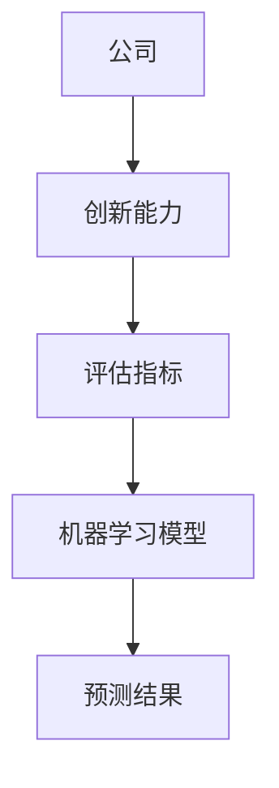
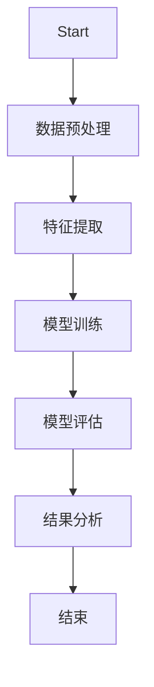

                 


# 机器学习辅助公司创新能力评估

> 关键词：机器学习，创新能力评估，公司创新，数据驱动，算法模型

> 摘要：本文探讨了如何利用机器学习技术辅助公司创新能力评估。通过分析创新能力的多维度评估指标，结合机器学习算法和数据驱动的方法，构建高效、准确的创新能力评估模型，为公司提供数据支持的决策依据。

---

# 第1章: 背景介绍与核心概念

## 1.1 问题背景与问题描述
### 1.1.1 公司创新能力的重要性
在现代商业环境中，创新能力是公司竞争力的核心。创新能力不仅决定了公司的市场适应能力，还直接影响公司的成长性和可持续发展能力。传统的创新能力评估方法通常依赖于主观判断和经验分析，存在效率低、结果不精确的问题。

### 1.1.2 问题描述
传统的创新能力评估方法存在以下问题：
- **主观性**：依赖专家经验，缺乏客观量化标准。
- **效率低**：评估过程繁琐，耗时长。
- **不准确**：难以捕捉数据中的细微变化。

### 1.1.3 解决方法
机器学习通过数据驱动的方式，能够自动提取特征、建立模型，并对创新能力进行量化评估。这不仅提高了评估的效率，还能够提供更加准确的结果。

### 1.1.4 边界与外延
本方法仅适用于基于历史数据和现有指标的创新能力评估，不考虑公司外部环境的突发性变化。

## 1.2 核心概念与结构
### 1.2.1 创新能力的多维度评估
创新能力可以从多个维度进行评估，例如：
- 创新投入：研发支出、人才储备等。
- 创新产出：专利数量、新产品数量等。
- 创新效率：单位投入产出比。

### 1.2.2 机器学习在创新能力评估中的作用
机器学习通过以下方式辅助创新能力评估：
- 数据清洗与特征提取。
- 模型训练与预测。
- 结果分析与优化。

### 1.2.3 概念结构与核心要素
创新能力评估的核心要素包括：
- **输入数据**：公司历史数据、行业数据。
- **模型构建**：选择合适的机器学习算法。
- **评估结果**：预测公司创新能力的等级或分数。

---

# 第2章: 核心概念与联系

## 2.1 核心概念原理
### 2.1.1 创新能力评估的核心要素
创新能力评估的核心要素包括：
- 公司规模。
- 研发投入。
- 专利数量。
- 市场表现。

### 2.1.2 机器学习模型的作用机制
机器学习模型通过以下步骤实现创新能力评估：
1. 数据预处理。
2. 特征提取。
3. 模型训练。
4. 模型评估。
5. 结果分析。

### 2.1.3 数据驱动的评估方法
数据驱动的评估方法通过分析历史数据，发现数据中的潜在规律，从而实现创新能力的量化评估。

## 2.2 核心概念属性对比
### 2.2.1 创新能力评估的维度对比
| 评估维度 | 输入数据 | 输出结果 |
|----------|----------|----------|
| 创新投入 | 研发支出 | 高/中/低 |
| 创新产出 | 专利数量 | 高/中/低 |
| 创新效率 | 投入产出比 | 高/中/低 |

### 2.2.2 机器学习模型的性能对比
| 算法类型 | 优点 | 缺点 |
|----------|------|------|
| 线性回归 | 简单易懂 | 无法处理非线性关系 |
| 支持向量机 | 高精度 | 计算复杂 |
| 随机森林 | 抗过拟合 | 需要较多计算资源 |

### 2.2.3 不同评估方法的优缺点
| 方法类型 | 优点 | 缺点 |
|----------|------|------|
| 传统评估 | 主观判断 | 结果不准确 |
| 数据驱动 | 客观量化 | 需要大量数据支持 |

## 2.3 ER实体关系图


---

# 第3章: 算法原理与数学模型

## 3.1 算法原理讲解
### 3.1.1 线性回归模型
线性回归模型用于预测连续型变量，适用于创新能力的量化评估。

### 3.1.2 支持向量机
支持向量机适用于分类问题，可用于创新能力的等级划分。

### 3.1.3 随机森林
随机森林适用于分类和回归问题，能够处理高维数据。

## 3.2 算法流程图


## 3.3 数学模型与公式
### 3.3.1 线性回归模型
$$ y = \beta_0 + \beta_1x + \epsilon $$

### 3.3.2 支持向量机
$$ \text{max} \{ \frac{1}{2}\|w\|^2 | y_i(w \cdot x_i + b) \geq 1 \} $$

### 3.3.3 随机森林
$$ y = \sum_{i=1}^n \text{tree}_i(x) $$`

## 3.4 举例说明
### 3.4.1 线性回归案例
假设有公司研发投入与创新能力评分的线性关系，可以使用线性回归模型进行预测。

### 3.4.2 支持向量机案例
使用支持向量机对公司的创新能力进行分类，预测其创新能力等级。

### 3.4.3 随机森林案例
使用随机森林模型对公司的创新能力进行综合评估，预测其创新能力评分。

---

# 第4章: 系统分析与架构设计

## 4.1 项目场景介绍
### 4.1.1 项目目标
构建一个基于机器学习的公司创新能力评估系统。

### 4.1.2 项目范围
涵盖公司历史数据的收集、处理、建模、评估和结果分析。

## 4.2 系统功能设计
### 4.2.1 领域模型
```mermaid
classDiagram
    class 公司 {
        +名称: string
        +研发投入: float
        +专利数量: int
        +创新能力评分: float
    }
    class 机器学习模型 {
        +特征提取: function
        +模型训练: function
        +预测评估: function
    }
    company -> 机器学习模型
```

## 4.3 系统架构设计
### 4.3.1 系统架构图


---

# 第5章: 项目实战

## 5.1 环境安装
### 5.1.1 安装Python
```bash
python --version
pip install numpy
pip install scikit-learn
```

## 5.2 系统核心实现
### 5.2.1 数据预处理
```python
import numpy as np
import pandas as pd

# 加载数据
data = pd.read_csv('company.csv')
# 数据清洗
data = data.dropna()
```

### 5.2.2 特征提取
```python
from sklearn.feature_extraction import DictVectorizer

vectorizer = DictVectorizer()
X = vectorizer.fit_transform(data[['公司名称', '研发投入']].to_dict('records'))
```

### 5.2.3 模型训练
```python
from sklearn.linear_model import LinearRegression

model = LinearRegression()
model.fit(X, data['创新能力评分'])
```

### 5.2.4 模型评估
```python
from sklearn.metrics import r2_score

y_pred = model.predict(X)
print(r2_score(data['创新能力评分'], y_pred))
```

## 5.3 案例分析
### 5.3.1 数据分析
分析公司研发投入与创新能力评分的关系。

### 5.3.2 结果解读
通过模型预测，评估公司的创新能力评分，并与实际值进行对比。

## 5.4 项目小结
通过本项目，我们实现了基于机器学习的公司创新能力评估系统，验证了机器学习在实际应用中的有效性。

---

# 第6章: 总结与展望

## 6.1 本文总结
本文探讨了如何利用机器学习技术辅助公司创新能力评估，提出了基于数据驱动的方法，构建了高效的创新能力评估模型。

## 6.2 未来展望
未来可以进一步研究以下方向：
- 结合自然语言处理技术，分析公司新闻、专利文档等非结构化数据。
- 实现实时数据流处理，提升评估的时效性。

## 6.3 最佳实践 Tips
- 数据预处理是关键，确保数据的完整性和准确性。
- 选择合适的算法，根据数据特点和问题类型进行调整。
- 模型调优时，注意过拟合和欠拟合的问题。

---

# 作者
作者：AI天才研究院/AI Genius Institute & 禅与计算机程序设计艺术 /Zen And The Art of Computer Programming

