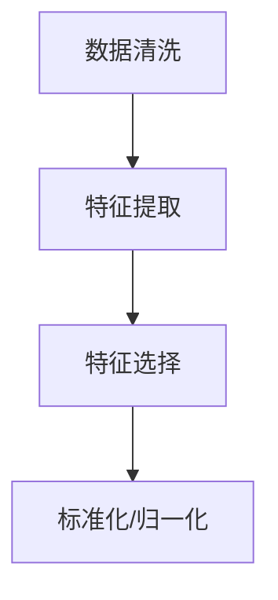
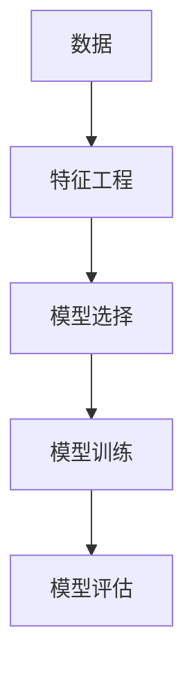
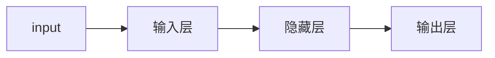
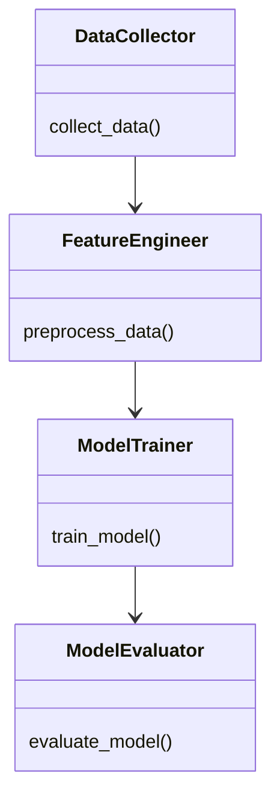
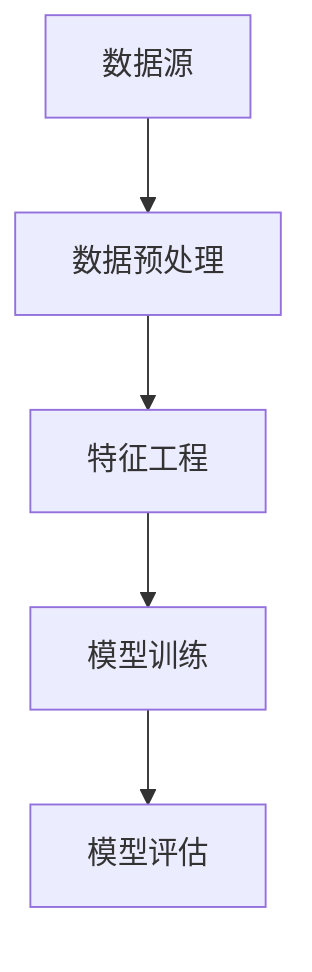
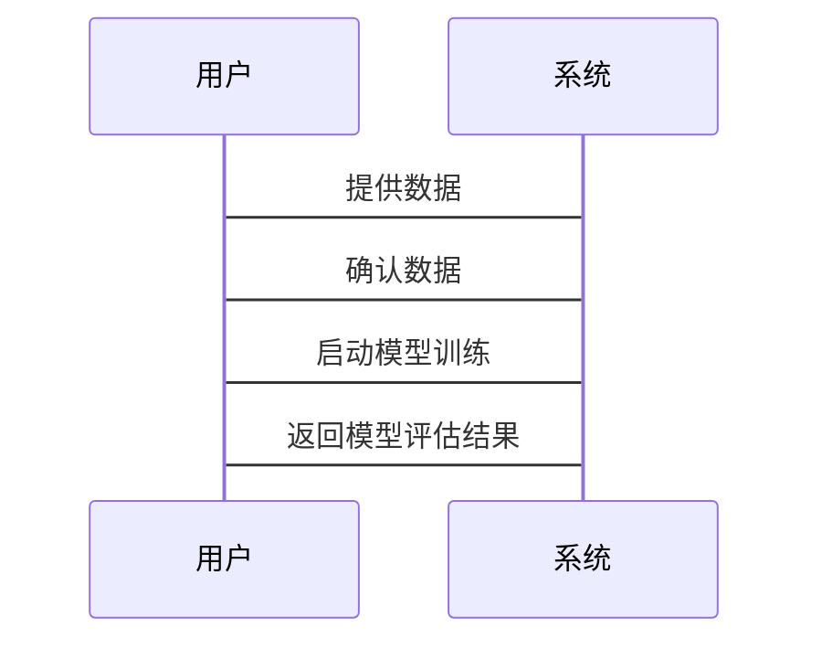
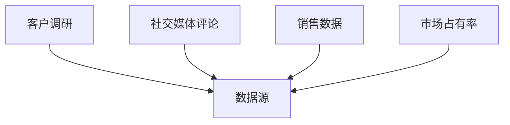

                 


# 《机器学习辅助公司品牌价值量化》

## 关键词：品牌价值，机器学习，量化评估，特征工程，算法模型，数据挖掘

## 摘要：  
随着企业竞争的日益激烈，品牌价值的量化评估成为企业管理和投资决策中的重要环节。传统的品牌价值评估方法往往依赖于主观判断和定性分析，难以满足现代化企业对数据驱动决策的需求。机器学习作为一种强大的数据分析工具，能够从海量数据中提取有价值的信息，帮助准确量化品牌价值。本文将从品牌价值的多维度构成出发，结合机器学习算法，详细探讨如何通过数据特征工程、模型选择与调优实现品牌价值的科学量化。文章还将通过实际案例分析，展示机器学习在品牌价值评估中的应用效果，并总结实践经验，为企业提供可操作的指导建议。

---

# 第一部分：机器学习与品牌价值量化背景

## 第1章：问题背景与核心概念

### 1.1 问题背景
品牌价值是企业在市场中竞争力的体现，是企业无形资产的重要组成部分。传统的品牌价值评估方法主要依赖于专家判断、市场调研和定性分析，存在主观性强、数据支持不足、难以量化等问题。随着大数据和人工智能技术的发展，机器学习为品牌价值的量化提供了新的可能性。

### 1.2 核心概念
品牌价值的量化涉及多个维度，包括品牌知名度、美誉度、忠诚度、影响力和传播力。这些维度可以通过数据化的方式进行测量和建模。机器学习通过分析这些数据，能够帮助企业更准确地评估品牌价值，并制定相应的品牌管理策略。

### 1.3 问题解决与边界条件
机器学习能够从海量数据中提取特征，并构建预测模型，从而实现品牌价值的量化。然而，品牌价值的评估受到数据质量、模型选择和业务场景的限制，需要在实际应用中明确边界条件，例如数据来源的范围和模型的适用性。

---

## 第2章：品牌价值量化的核心概念与联系

### 2.1 核心概念原理
品牌价值的多维度特征可以通过数据进行建模。例如，品牌知名度可以通过市场调研数据和媒体提及量来衡量，而品牌美誉度可以通过用户评价和社交媒体数据来分析。这些数据的特征提取和建模是机器学习的核心任务。

### 2.2 核心概念属性特征对比表
以下是品牌价值核心概念的属性特征对比：

| **维度**      | **品牌知名度**       | **品牌美誉度**       | **品牌忠诚度**       |
|----------------|---------------------|---------------------|---------------------|
| **数据来源**   | 市场调研、媒体提及   | 用户评价、社交媒体   | 用户购买行为         |
| **数据类型**   | 数值型             | 文本型             | 行为型             |
| **数据量级**   | 中等规模           | 大规模             | 高频行为数据         |

### 2.3 实体关系图（ER图）
以下是品牌价值量化中的实体关系图：

```mermaid
erDiagram
    customer[客户] {
        name : 文本
        age : 数值
        gender : 文本
        purchase_history : 文本
    }
    brand[品牌] {
        name : 文本
        market_share : 数值
        reputation : 文本
    }
    interaction[客户与品牌的互动] {
        time : 时间戳
        type : 文本
        intensity : 数值
    }
    customer --> interaction : 参与了
    brand --> interaction : 与...互动
```

---

# 第二部分：算法原理

## 第3章：特征工程与数据预处理

### 3.1 特征工程原理
特征工程是机器学习的核心步骤之一，涉及数据清洗、特征提取和特征选择。以下是特征工程的流程：



### 3.2 特征工程实现
以下是特征工程的Python代码示例：

```python
import pandas as pd
from sklearn.preprocessing import StandardScaler

# 数据清洗
df = pd.read_csv('brand_data.csv')
df.dropna(inplace=True)

# 特征提取
text_features = df['customer_reviews'].apply(lambda x: x.lower())
numeric_features = df[['sales', 'market_share']]

# 特征选择
selected_features = numeric_features[['sales']]

# 标准化
scaler = StandardScaler()
scaled_features = scaler.fit_transform(selected_features)
```

### 3.3 实例分析
以品牌美誉度为例，可以通过分词和情感分析提取文本特征。以下是具体步骤：

1. 使用jieba进行中文分词。
2. 统计关键词频率。
3. 使用情感分析模型（如SVM）对文本进行分类。

---

## 第4章：模型选择与调优

### 4.1 模型选择
常见的机器学习模型包括线性回归、随机森林和神经网络。以下是模型选择的流程图：



### 4.2 线性回归模型
线性回归是一种简单但有效的模型，适用于品牌价值的初步预测。其数学公式为：

$$ y = \beta_0 + \beta_1 x_1 + \beta_2 x_2 + ... + \beta_n x_n $$

其中，$y$ 是品牌价值，$x_i$ 是特征变量，$\beta_i$ 是回归系数。

### 4.3 随机森林模型
随机森林是一种基于树的集成模型，适用于高维特征的数据。其核心思想是通过构建多个决策树并进行投票或平均来提高模型的准确性和鲁棒性。

### 4.4 神经网络模型
神经网络适用于复杂的非线性关系，但需要更多的数据和计算资源。以下是神经网络的基本结构：



---

# 第三部分：系统分析与架构设计

## 第5章：系统分析与架构设计

### 5.1 项目场景介绍
本项目旨在通过机器学习算法量化公司品牌价值。数据来源包括客户调研、社交媒体评论、销售数据和市场占有率等。

### 5.2 系统功能设计
以下是系统功能模块的类图：



### 5.3 系统架构设计
以下是系统架构的流程图：



---

## 第6章：系统接口与交互设计

### 6.1 接口设计
系统接口包括数据输入接口、模型训练接口和结果输出接口。以下是接口的交互流程图：



---

# 第四部分：项目实战

## 第7章：数据收集与预处理

### 7.1 数据来源
数据来源包括客户调研、社交媒体评论、销售数据和市场占有率等。以下是数据来源的分类图：



### 7.2 数据清洗
数据清洗是特征工程的第一步，包括处理缺失值、重复值和异常值。

---

## 第8章：模型实现与评估

### 8.1 模型实现
以下是品牌价值量化模型的实现代码：

```python
from sklearn.ensemble import RandomForestRegressor
from sklearn.metrics import mean_squared_error

# 训练模型
model = RandomForestRegressor()
model.fit(X_train, y_train)

# 模型评估
y_pred = model.predict(X_test)
print(mean_squared_error(y_test, y_pred))
```

### 8.2 模型调优
通过网格搜索优化模型参数，例如调整树的深度和叶子节点数。

---

## 第9章：案例分析与结果解读

### 9.1 实际案例
以某公司品牌价值评估为例，通过机器学习模型预测其品牌价值。

### 9.2 结果解读
模型预测结果与实际值进行对比，分析误差来源和模型的鲁棒性。

---

# 第五部分：最佳实践与总结

## 第10章：总结与改进建议

### 10.1 项目总结
总结机器学习在品牌价值量化中的应用效果和优势。

### 10.2 改进建议
提出模型优化、数据来源扩展和实时监测等改进建议。

## 第11章：注意事项与拓展阅读

### 11.1 注意事项
提醒读者注意数据质量和模型选择的重要性。

### 11.2 拓展阅读
推荐相关书籍和资源，供读者深入学习。

---

# 结语

通过本文的详细讲解，读者可以掌握机器学习在品牌价值量化中的应用方法，并能够实际操作相关技术。未来，随着技术的进步，机器学习在品牌价值评估中的应用将更加广泛和深入。

---

# 作者

作者：AI天才研究院 & 禅与计算机程序设计艺术

---

感谢您的耐心阅读！希望本文对您有所帮助！

