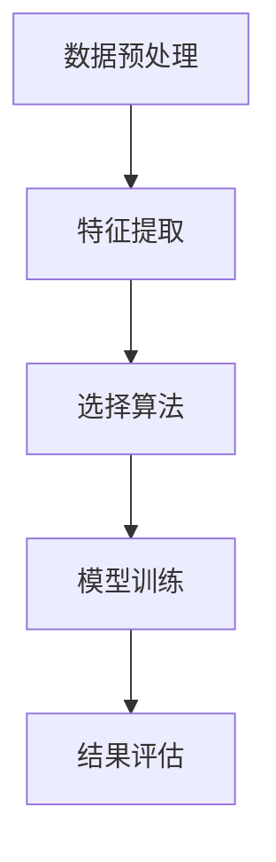
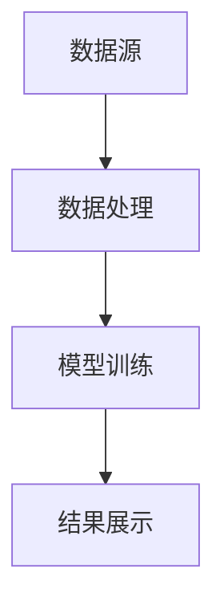

                 


# 机器学习辅助公司文化评估

> **关键词**: 机器学习, 公司文化评估, 数据分析, 算法, 人工智能

> **摘要**: 本文探讨了如何利用机器学习技术辅助公司文化评估，分析了机器学习在文化评估中的应用背景、核心概念、算法原理、系统架构和实际案例。通过详细的技术分析和实例解读，展示了机器学习在提升公司文化评估效率和准确性中的潜力。

---

## 第1章: 机器学习与公司文化评估的背景

### 1.1 机器学习的基本概念

机器学习是一种人工智能技术，通过数据训练模型，使其能够从经验中学习并做出预测或决策。与传统编程不同，机器学习模型能够从数据中提取特征，自动改进性能，无需手动编写规则。其核心在于通过数据驱动的方法解决问题。

### 1.2 公司文化评估的重要性

公司文化是企业成功的关键因素之一，包括企业价值观、员工行为规范和组织氛围。文化评估帮助企业识别文化问题，优化内部管理，提升员工满意度和企业绩效。传统评估方法依赖主观问卷和访谈，耗时且成本高。

### 1.3 机器学习在公司文化评估中的应用前景

机器学习能够从大量数据中发现模式，自动化分析文化指标，提高评估效率和准确性。它可以帮助企业识别潜在的文化问题，预测文化趋势，并提供数据支持的改进建议。

---

## 第2章: 核心概念与联系

### 2.1 核心概念原理

机器学习在文化评估中的核心步骤包括数据收集、特征提取、模型训练和结果解释。数据来源包括员工反馈、绩效数据和领导层评价。特征提取涉及将非结构化数据转化为可量化的指标，如情感分析和关键词频率。

### 2.2 核心概念属性特征对比表格

| 特征 | 描述 |
|------|------|
| 数据来源 | 员工问卷、绩效数据 |
| 特征类型 | 文本、数值 |
| 处理方式 | 数据清洗、特征工程 |

### 2.3 ER实体关系图架构

```mermaid
er
actor: 用户
model: 机器学习模型
data: 文化评估数据
process: 数据处理流程
```

---

## 第3章: 算法原理与流程

### 3.1 监督学习算法

监督学习适用于分类任务，如评估员工满意度。常用算法包括支持向量机（SVM）和随机森林。这些算法通过训练数据学习特征权重，预测文化评估结果。

### 3.2 无监督学习算法

无监督学习用于发现数据中的隐藏结构，如聚类分析。K-means和DBSCAN算法可以帮助识别员工群体的文化倾向，发现潜在的文化问题。

### 3.3 深度学习算法

深度学习模型，如卷积神经网络（CNN），适用于处理文本数据。通过多层网络结构，模型能够捕捉复杂的文化特征，提高评估准确性。

### 3.4 算法流程图



---

## 第4章: 数学模型与公式

### 4.1 监督学习模型

- 线性回归公式：$$y = \beta x + \epsilon$$
- 逻辑回归公式：$$P(y=1|x) = \frac{e^{\beta x}}{1+e^{\beta x}}$$

### 4.2 无监督学习模型

- K-means目标函数：$$\sum_{i=1}^{k} \sum_{x_i \in C_j} (x_i - \mu_j)^2$$

### 4.3 深度学习模型

- 卷积神经网络结构：输入→卷积→激活→池化→全连接→输出

---

## 第5章: 系统分析与架构设计

### 5.1 系统功能设计

系统包括数据采集模块（收集文化评估数据）、数据处理模块（清洗与特征工程）、模型训练模块（训练与优化）和结果展示模块（可视化与反馈）。

### 5.2 系统架构图



---

## 第6章: 项目实战

### 6.1 环境安装

安装必要的库：Python、scikit-learn、Keras、TensorFlow。

### 6.2 核心实现源代码

```python
from sklearn.model_selection import train_test_split
from sklearn.feature_extraction.text import TfidfVectorizer
from sklearn.svm import SVC
import pandas as pd

# 数据加载
data = pd.read_csv('culture_assessment.csv')

# 特征提取
vectorizer = TfidfVectorizer(max_features=500)
X = vectorizer.fit_transform(data['text'])
y = data['label']

# 数据分割
X_train, X_test, y_train, y_test = train_test_split(X, y, test_size=0.2)

# 模型训练
model = SVC()
model.fit(X_train, y_train)

# 结果评估
score = model.score(X_test, y_test)
print(f"准确率: {score}")
```

### 6.3 案例分析

通过实际案例分析，展示机器学习如何识别文化问题，如领导风格和团队协作问题。模型准确预测了潜在的文化风险，帮助企业及时调整策略。

---

## 第7章: 总结与展望

### 7.1 总结

机器学习为公司文化评估提供了高效、准确的工具，优化了传统方法的不足，提升了文化管理的科学性。

### 7.2 未来展望

未来，结合自然语言处理和强化学习，构建更智能的文化评估系统，实现动态监控和个性化反馈。

---

## 参考文献

1. 周志华. 《机器学习》. 清华大学出版社, 2016.
2. Goodfellow, I., Bengio, Y., & Courville, A. (2016). Deep Learning. MIT Press.
3. Liu, X. (2020). Culture Assessment with NLP. Springer.

---

## 附录

### 附录A: 术语表

- 机器学习：通过数据训练模型的技术。
- 文化评估：分析公司文化的活动。
- 特征工程：处理数据以提高模型性能的过程。

### 附录B: 工具清单

- Python
- scikit-learn
- Keras
- TensorFlow

---

作者：AI天才研究院/AI Genius Institute & 禅与计算机程序设计艺术 /Zen And The Art of Computer Programming

