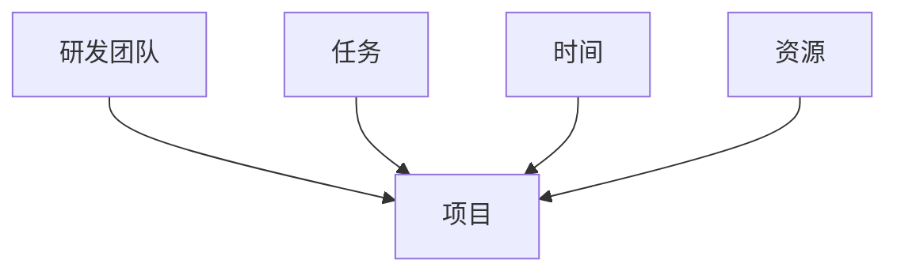
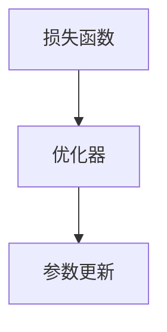
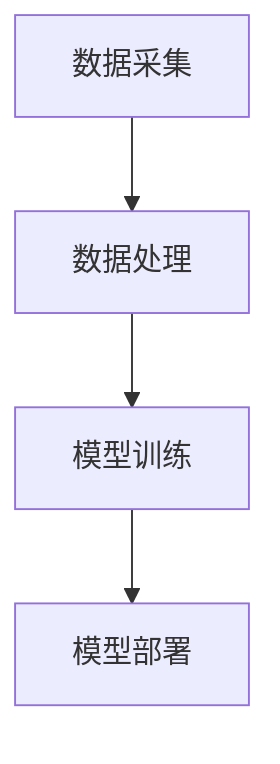
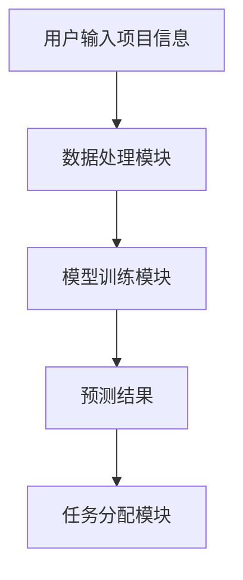

                 


# 《机器学习辅助公司研发效率评估》

## 关键词：机器学习, 研发效率, 数据分析, 模型评估, 优化算法, 系统设计

## 摘要：  
随着企业对研发效率要求的不断提高，如何利用机器学习技术来优化研发流程、预测项目周期、评估资源分配效率成为企业面临的重要挑战。本文将从机器学习的基本概念出发，结合研发效率评估的核心问题，系统地阐述如何通过数据预处理、特征工程、模型训练与优化等步骤，构建高效的机器学习模型。同时，本文将深入分析机器学习算法的原理与实现，并通过实际案例展示如何将机器学习技术应用于研发效率评估的系统设计中，最终为企业提供可落地的解决方案。

---

# 第一部分：机器学习与研发效率评估引言

## 第1章：机器学习与研发效率评估背景

### 1.1 机器学习的基本概念  
#### 1.1.1 机器学习的定义  
机器学习是一种人工智能技术，通过数据训练模型，使其能够从经验中学习并做出预测或决策，而无需明确的编程指令。  

#### 1.1.2 机器学习的核心原理  
- **监督学习**：通过标记的数据训练模型，使其能够预测新数据的标签。  
- **无监督学习**：通过未标记的数据发现数据中的潜在结构。  
- **半监督学习**：结合标记和未标记数据进行训练。  
- **强化学习**：通过与环境交互，学习最优决策策略。  

#### 1.1.3 机器学习与传统数据分析的区别  
传统数据分析依赖于固定的规则和逻辑，而机器学习能够通过数据自动发现模式和规律，适用于复杂和动态变化的场景。  

### 1.2 研发效率评估的重要性  
#### 1.2.1 研发效率的定义  
研发效率是指在一定时间内完成研发任务的能力，通常通过任务完成时间、资源利用率、项目成功率等指标进行衡量。  

#### 1.2.2 研发效率对企业的影响  
- 提高研发效率能够缩短产品开发周期，加快市场响应速度。  
- 高效的研发流程能够降低企业成本，提升整体竞争力。  
- 研发效率的优化有助于资源的合理分配，避免浪费。  

#### 1.2.3 研发效率评估的挑战  
- 数据分散：研发过程中涉及多种数据来源，难以整合。  
- 数据质量：数据噪声和缺失值会影响模型的准确性。  
- 模型选择：不同场景下需要选择合适的算法，提升预测精度。  

### 1.3 机器学习在研发效率评估中的应用  
#### 1.3.1 机器学习如何帮助提高研发效率  
- 通过历史数据预测项目周期，优化任务分配。  
- 分析资源使用情况，动态调整资源分配策略。  
- 识别项目风险，提前采取措施规避潜在问题。  

#### 1.3.2 机器学习在研发效率评估中的优势  
- **自动化分析**：能够快速处理大量数据，发现潜在规律。  
- **预测能力**：基于历史数据，预测未来研发趋势。  
- **动态优化**：根据实时数据调整模型，保持预测准确性。  

#### 1.3.3 机器学习在研发效率评估中的实际案例  
例如，某科技公司通过机器学习模型分析过去三年的研发项目数据，成功将新项目的平均周期缩短了15%。

---

## 第2章：研发效率评估的核心概念与联系

### 2.1 核心概念原理  
#### 2.1.1 数据预处理  
- 数据清洗：去除噪声数据和异常值。  
- 数据转换：将非数值型数据转换为数值型数据。  
- 数据归约：降低数据维度，减少计算复杂度。  

#### 2.1.2 特征工程  
- 特征选择：从大量特征中筛选出对目标变量影响较大的特征。  
- 特征提取：通过降维技术（如PCA）提取新的特征。  
- 特征构建：根据业务需求，人工构建新的特征。  

#### 2.1.3 模型训练与评估  
- 训练模型：使用训练数据训练机器学习模型。  
- 模型评估：通过测试数据验证模型的准确性和可靠性。  
- 模型优化：调整模型参数，提升预测性能。  

### 2.2 核心概念属性特征对比表格  
以下表格对比了数据预处理、特征工程和模型训练的核心属性：  

| 概念       | 数据预处理 | 特征工程 | 模型训练 |
|------------|------------|----------|----------|
| 目标       | 清洗数据   | 构建特征 | 提升预测 |
| 方法       | 去除异常值 | 选择特征 | 调参优化 |
| 工具       | 数据清洗库 | 特征工程库 | 模型训练库 |

### 2.3 ER实体关系图架构  
以下是一个简单的研发效率评估系统的ER图：  



---

## 第3章：机器学习算法原理与数学模型

### 3.1 线性回归算法  
#### 3.1.1 线性回归的定义  
线性回归是一种用于预测连续型变量的回归算法，假设自变量与因变量之间存在线性关系。  

#### 3.1.2 线性回归的数学模型  
$$ y = \beta_0 + \beta_1x + \epsilon $$  

其中，$\beta_0$ 是截距，$\beta_1$ 是斜率，$\epsilon$ 是误差项。  

#### 3.1.3 线性回归的损失函数  
$$ L = \frac{1}{2m}\sum_{i=1}^{m}(y_i - \hat{y}_i)^2 $$  

其中，$m$ 是样本数量，$y_i$ 是真实值，$\hat{y}_i$ 是预测值。  

#### 3.1.4 线性回归的优化算法  
以下是一个线性回归的优化流程图：  



### 3.2 随机森林算法  
#### 3.2.1 随机森林的定义  
随机森林是一种基于决策树的集成学习算法，通过构建多个决策树并进行投票或平均来提高模型的准确性和稳定性。  

#### 3.2.2 随机森林的数学模型  
随机森林通过 bagging（boostrap aggregating）和特征子集选择（feature subset selection）生成多棵决策树，并将这些树的结果进行集成。  

#### 3.2.3 随机森林的优化算法  
随机森林的优化算法包括：  
1. 调整决策树的深度，防止过拟合。  
2. 调整 bagging 的样本数量，控制模型的多样性。  
3. 调整特征子集的大小，优化计算效率。  

---

## 第4章：系统分析与架构设计方案

### 4.1 问题场景介绍  
假设某公司希望利用机器学习技术预测新项目的研发周期，优化任务分配和资源管理。  

### 4.2 系统功能设计  
- 数据采集模块：收集研发项目的历史数据，包括项目周期、资源分配、任务完成情况等。  
- 数据处理模块：对数据进行清洗、转换和归约。  
- 模型训练模块：选择合适的算法，训练机器学习模型。  
- 模型部署模块：将模型部署到生产环境，实时预测新项目的研发周期。  

### 4.3 系统架构设计  
以下是一个研发效率评估系统的架构图：  



### 4.4 系统接口设计  
- 数据接口：与数据库或其他数据源对接，获取研发数据。  
- 模型接口：与其他系统（如任务管理系统）对接，提供预测结果。  

### 4.5 系统交互设计  
以下是一个系统的交互流程图：  



---

## 第5章：项目实战

### 5.1 环境安装  
- 安装Python和相关库：`scikit-learn`, `pandas`, `numpy`, `mermaid`。  

### 5.2 系统核心实现源代码  
以下是一个简单的研发周期预测模型代码示例：  

```python
import pandas as pd
from sklearn.model_selection import train_test_split
from sklearn.linear_model import LinearRegression
from sklearn.metrics import mean_squared_error

# 数据加载
data = pd.read_csv('研发项目数据.csv')

# 数据预处理
X = data[['开发人员数量', '任务数量', '技术复杂度']]
y = data['研发周期']

# 数据分割
X_train, X_test, y_train, y_test = train_test_split(X, y, test_size=0.2, random_state=42)

# 模型训练
model = LinearRegression()
model.fit(X_train, y_train)

# 模型预测
y_pred = model.predict(X_test)

# 模型评估
 mse = mean_squared_error(y_test, y_pred)
 print(f"均方误差: {mse}")
```

### 5.3 代码应用解读与分析  
- 数据加载：从CSV文件中读取研发项目数据。  
- 数据预处理：选择相关的特征变量（开发人员数量、任务数量、技术复杂度）。  
- 数据分割：将数据分为训练集和测试集。  
- 模型训练：使用线性回归算法训练模型。  
- 模型预测：对测试集进行预测。  
- 模型评估：计算均方误差，评估模型性能。  

### 5.4 实际案例分析  
假设我们有一个新项目，开发人员数量为5，任务数量为10，技术复杂度为中等。模型预测其研发周期为30天。  

### 5.5 项目小结  
通过机器学习模型，我们可以快速预测新项目的研发周期，为任务分配和资源管理提供科学依据。

---

## 第6章：最佳实践、小结、注意事项与拓展阅读

### 6.1 最佳实践  
- 数据预处理是关键：确保数据质量，减少噪声。  
- 特征工程要结合业务：选择与目标变量相关的特征。  
- 模型选择要灵活：根据实际需求选择合适的算法。  

### 6.2 小结  
本文详细介绍了如何利用机器学习技术辅助公司研发效率评估，从背景知识到算法实现，再到系统设计，为读者提供了全面的指导。  

### 6.3 注意事项  
- 数据隐私：在处理研发数据时，需注意数据的安全性和隐私性。  
- 模型解释性：复杂的模型可能难以解释，需选择适合业务场景的模型。  

### 6.4 拓展阅读  
- 《Hands-On Machine Learning with Scikit-Learn, Keras, and TensorFlow》  
- 《Data Science for Business: What You Need to Know About Data Mining and Data Analytics》  

---

## 作者：AI天才研究院/AI Genius Institute & 禅与计算机程序设计艺术 /Zen And The Art of Computer Programming

---

以上是《机器学习辅助公司研发效率评估》的技术博客文章的完整大纲和内容，希望对您有所帮助！

