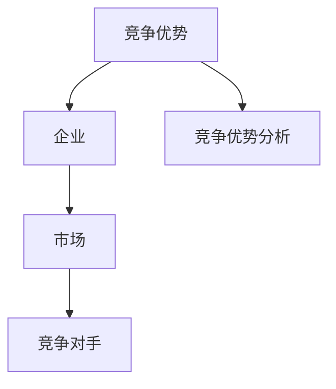
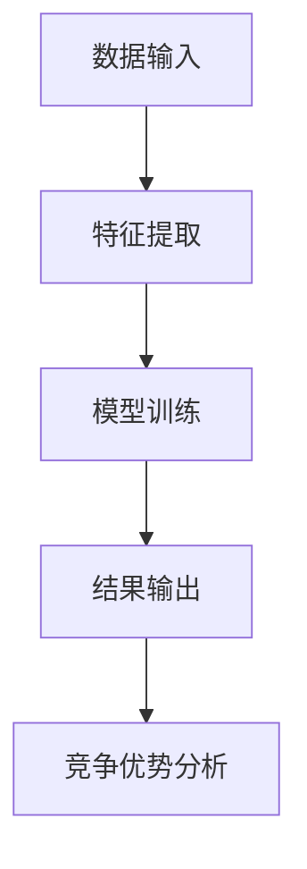

                 


# 机器学习辅助公司竞争优势分析

**关键词**：机器学习，竞争优势分析，企业战略，数据驱动决策，技术应用

**摘要**：  
机器学习作为一种强大的数据分析工具，正在被越来越多的企业用于竞争优势分析。本文将从机器学习的基本原理出发，探讨其在公司竞争优势分析中的具体应用，包括核心算法、系统架构设计、项目实战以及最佳实践。通过详细的案例分析和代码实现，帮助读者理解如何利用机器学习技术提升企业的竞争优势，从而在激烈的市场竞争中占据领先地位。

---

## 第1章: 背景介绍

### 1.1 问题背景  
企业竞争优势的核心在于市场定位、资源分配和决策效率。然而，传统的竞争优势分析方法往往依赖人工经验，存在主观性强、效率低、覆盖面窄等问题。随着数据量的爆炸式增长和计算能力的提升，机器学习逐渐成为解决这一问题的重要工具。

### 1.2 问题描述  
竞争优势分析的目标是通过对企业内外部因素的综合分析，识别企业的优势、劣势、机会和威胁（SWOT分析）。机器学习可以通过对海量数据的挖掘和建模，提供更加客观、精准的分析结果。

### 1.3 核心概念与联系  
- **竞争优势分析**：通过对市场、客户、产品等多维度数据的分析，识别企业的核心竞争力。  
- **机器学习**：利用算法从数据中提取模式和洞察，辅助决策。  
- **数据驱动决策**：通过数据而非直觉或经验来指导企业战略。

---

## 第2章: 核心概念与联系

### 2.1 机器学习模型的核心原理  
- **监督学习**：基于标签数据，预测目标变量（如客户满意度预测）。  
- **无监督学习**：发现数据中的隐含结构（如客户群体聚类）。  
- **特征工程**：通过数据预处理和特征选择，提升模型性能。  

### 2.2 核心概念对比表格  
| 概念 | 监督学习 | 无监督学习 | 主要区别 |
|------|----------|------------|----------|
| 数据类型 | 标签数据 | 无标签数据 | 是否需要标签 |
| 目标 | 预测目标变量 | 发现数据结构 | - |
| 应用场景 | 分类、回归 | 聚类、降维 | - |

### 2.3 ER实体关系图架构  
以下是竞争优势分析的实体关系图：



---

## 第3章: 算法原理讲解

### 3.1 机器学习算法原理  
- **线性回归（Linear Regression）**：用于预测连续型变量（如销售额）。  
  - 模型公式：$y = \beta_0 + \beta_1x + \epsilon$  
  - 示例代码：
  ```python
  import numpy as np
  from sklearn.linear_model import LinearRegression

  X = np.array([1, 2, 3, 4, 5]).reshape(-1, 1)
  y = np.array([2, 4, 5, 4, 6])
  model = LinearRegression()
  model.fit(X, y)
  print(model.coef_)
  ```

- **逻辑回归（Logistic Regression）**：用于分类问题（如客户 churn 预测）。  
  - 损失函数：$$L(\theta) = -\frac{1}{m}\sum_{i=1}^{m} [y^{(i)}\log(h_{\theta}(x^{(i)})) + (1-y^{(i)})\log(1-h_{\theta}(x^{(i)}))]$$  
  - 示例代码：
  ```python
  from sklearn.linear_model import LogisticRegression

  X = np.array([[1, 0], [1, 1], [0, 1], [0, 0]])
  y = np.array([0, 1, 1, 0])
  model = LogisticRegression()
  model.fit(X, y)
  print(model.predict(X))
  ```

---

## 第4章: 系统分析与架构设计

### 4.1 问题场景介绍  
企业希望通过机器学习分析竞争对手的产品、市场份额和客户反馈，识别自身的优势和改进空间。

### 4.2 系统功能设计  
- **数据采集**：从市场报告、客户反馈、财务数据中提取相关信息。  
- **特征提取**：将文本、数值数据转化为模型可处理的特征向量。  
- **模型训练**：基于历史数据，训练分类或回归模型。  
- **结果分析**：生成可视化报告，辅助决策。

### 4.3 系统架构图  


---

## 第5章: 项目实战

### 5.1 环境安装  
- 安装必要的库：`numpy`, `pandas`, `scikit-learn`, `matplotlib`。  
  ```bash
  pip install numpy pandas scikit-learn matplotlib
  ```

### 5.2 核心代码实现  
```python
import pandas as pd
from sklearn.preprocessing import StandardScaler
from sklearn.model_selection import train_test_split
from sklearn.svm import SVC

# 数据加载与预处理
data = pd.read_csv('competition.csv')
X = data.drop('label', axis=1)
y = data['label']

# 特征标准化
scaler = StandardScaler()
X_scaled = scaler.fit_transform(X)

# 数据分割
X_train, X_test, y_train, y_test = train_test_split(X_scaled, y, test_size=0.2)

# 模型训练
model = SVC()
model.fit(X_train, y_train)

# 模型评估
print("Accuracy:", model.score(X_test, y_test))
```

### 5.3 案例分析  
以某互联网公司为例，通过分析竞争对手的市场份额和客户满意度，构建一个分类模型，预测自身产品的市场表现。

---

## 第6章: 最佳实践与总结

### 6.1 最佳实践  
- 数据质量至关重要，需做好清洗和特征工程。  
- 模型调优时，需关注过拟合和欠拟合问题。  
- 结果分析时，结合业务背景，避免片面解读。  

### 6.2 小结  
机器学习为竞争优势分析提供了强大的工具，但其成功依赖于高质量的数据和合理的模型选择。企业应结合自身特点，灵活运用这些技术，以提升竞争力。

---

## 附录

### 附录A: 工具安装与配置  
- Python版本要求：3.6及以上  
- 安装命令：`pip install numpy pandas scikit-learn jupyter`

### 附录B: 数据集格式  
- 数据格式：CSV  
- 数据字段：企业名称、市场份额、客户满意度、产品特性等。

---

## 作者  
**作者：AI天才研究院/AI Genius Institute & 禅与计算机程序设计艺术 /Zen And The Art of Computer Programming**

---

通过以上结构，文章将系统地介绍机器学习如何辅助公司竞争优势分析，从理论到实践，为读者提供全面的指导。

