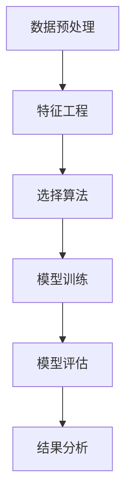

                 


# 机器学习辅助公司管理层能力评估

> 关键词：机器学习、管理层能力评估、数据分析、人工智能、管理决策

> 摘要：本文探讨了如何利用机器学习技术辅助公司管理层能力评估，通过数据驱动的方法，提升企业管理效率和决策质量。文章从背景、核心概念、算法原理、系统架构到项目实战，全面阐述了机器学习在管理层能力评估中的应用。

---

## 第1章: 问题背景与目标

### 1.1 管理层能力评估的重要性

#### 1.1.1 领导力对企业绩效的影响
领导力是企业成功的关键因素之一。研究表明，高效的领导者能够显著提升团队绩效和员工满意度。然而，传统的领导力评估方法往往依赖主观评价，缺乏客观性和系统性。

#### 1.1.2 传统评估方法的局限性
传统的管理层能力评估方法通常基于主观评分或问卷调查，存在以下问题：
- 数据收集成本高，难以量化。
- 评估结果缺乏客观性，容易受到主观偏见的影响。
- 无法实时更新，难以适应快速变化的商业环境。

#### 1.1.3 机器学习在评估中的潜力
机器学习通过分析海量数据，能够提取出传统方法难以捕捉的模式和规律。具体优势包括：
- 自动化处理大量数据，提高评估效率。
- 基于数据的客观性，提供更准确的评估结果。
- 实时更新模型，适应动态变化的商业环境。

### 1.2 机器学习的基本概念

#### 1.2.1 机器学习的定义与核心概念
机器学习是一种人工智能技术，通过数据训练模型，使其能够从经验中学习并做出预测或决策。核心概念包括：
- **监督学习**：基于标记数据进行模型训练。
- **无监督学习**：在未标记数据中发现隐藏模式。
- **强化学习**：通过奖励机制优化决策过程。

#### 1.2.2 机器学习在企业管理中的应用领域
机器学习在企业管理中的应用广泛，包括：
- **预测分析**：预测销售、风险等。
- **决策优化**：优化资源配置、制定战略。
- **行为分析**：分析员工行为，提升生产力。

#### 1.2.3 机器学习与管理层能力评估的关系
通过机器学习，可以将管理层的决策、行为和绩效数据化，建立数学模型，量化其能力。

### 1.3 本章小结
本章介绍了管理层能力评估的重要性，分析了传统方法的局限性，并提出了机器学习在这一领域的巨大潜力。

---

## 第2章: 管理层能力评估的核心要素

### 2.1 管理能力的关键维度

#### 2.1.1 领导力
领导力是管理层的核心能力之一，包括团队管理、激励员工等方面。可以通过员工满意度、团队绩效等指标进行评估。

#### 2.1.2 战略思维能力
战略思维能力涉及制定和执行战略计划的能力。可以通过分析管理层的战略决策和企业绩效来衡量。

#### 2.1.3 决策能力
决策能力是管理层的关键能力，包括分析问题和做出决策的能力。可以通过决策的准确性和速度来评估。

#### 2.1.4 团队协作能力
团队协作能力涉及沟通、协调和合作能力。可以通过团队项目的成功与否来衡量。

### 2.2 数据特征与评估指标

#### 2.2.1 数据特征的分类
数据特征可以分为定量特征（如销售额）和定性特征（如员工满意度）。定量特征易于量化，定性特征需要进一步处理。

#### 2.2.2 评估指标的设计原则
评估指标应具备客观性、可量化性、可操作性和可解释性。例如，可以使用员工满意度、团队绩效等指标。

#### 2.2.3 数据预处理与特征工程
数据预处理包括数据清洗、特征提取等。特征工程则是将原始数据转化为更有用的特征，如将员工满意度分为高、中、低三个等级。

### 2.3 管理层能力评估的数学模型

#### 2.3.1 线性回归模型
线性回归模型可以用于预测管理层的绩效评分。例如：
$$ \text{绩效评分} = \beta_0 + \beta_1 \times \text{员工满意度} + \epsilon $$
其中，$\beta_0$和$\beta_1$是回归系数，$\epsilon$是误差项。

#### 2.3.2 非线性模型
非线性模型如随机森林可以处理复杂的非线性关系。例如：
$$ \text{绩效评分} = f(\text{员工满意度}, \text{团队绩效}) $$
其中，$f$是随机森林模型。

#### 2.3.3 混合模型
混合模型结合了多种模型的优势，例如：
$$ \text{绩效评分} = \alpha \times \text{线性回归结果} + (1-\alpha) \times \text{随机森林结果} $$
其中，$\alpha$是融合权重。

### 2.4 本章小结
本章分析了管理层能力的关键维度，介绍了数据特征与评估指标的设计原则，并详细讲解了线性回归、随机森林等数学模型。

---

## 第3章: 机器学习算法在能力评估中的应用

### 3.1 常用算法概述

#### 3.1.1 线性回归
线性回归用于预测管理层的绩效评分。例如：
$$ \text{绩效评分} = \beta_0 + \beta_1 \times \text{员工满意度} $$
其中，$\beta_0$和$\beta_1$是回归系数，可以通过最小二乘法求解。

#### 3.1.2 支持向量机
支持向量机用于分类问题，如区分优秀和一般的管理层。例如：
$$ y = \text{sign}(w \cdot x + b) $$
其中，$w$是权重向量，$b$是偏置项，$x$是输入特征。

#### 3.1.3 随机森林
随机森林用于特征重要性分析和预测。例如：
$$ \text{绩效评分} = \text{随机森林}(x_1, x_2, \ldots, x_n) $$
其中，$x_1, x_2, \ldots, x_n$是输入特征。

#### 3.1.4 神经网络
神经网络用于复杂的模式识别。例如：
$$ \text{绩效评分} = \sigma(w \cdot x + b) $$
其中，$\sigma$是激活函数，$w$是权重，$b$是偏置项。

### 3.2 算法选择与优化

#### 3.2.1 算法选择的依据
算法选择应考虑数据类型、问题性质和计算资源。例如，线性回归适用于线性关系，随机森林适用于非线性关系。

#### 3.2.2 超参数调优
超参数调优是通过网格搜索或随机搜索找到最佳参数组合。例如，随机森林的超参数包括树的深度、树的数量等。

#### 3.2.3 模型评估与验证
模型评估可以通过交叉验证进行。例如，5折交叉验证可以提高模型的泛化能力。

### 3.3 算法流程图



### 3.4 本章小结
本章详细讲解了线性回归、随机森林和神经网络等算法，并展示了算法选择与优化的流程。

---

## 第4章: 系统架构设计

### 4.1 系统功能模块划分

#### 4.1.1 数据采集模块
数据采集模块负责从企业管理系统中获取管理层的相关数据，如员工满意度、团队绩效等。

#### 4.1.2 数据处理模块
数据处理模块包括数据清洗、特征提取等预处理步骤。

#### 4.1.3 模型训练模块
模型训练模块选择合适的算法，训练评估模型。

#### 4.1.4 结果展示模块
结果展示模块可视化评估结果，生成报告。

### 4.2 系统架构图


### 4.3 接口设计

#### 4.3.1 数据接口
数据接口负责与企业管理系统对接，获取管理层数据。

#### 4.3.2 模型接口
模型接口用于与其他系统或工具集成，如与企业绩效管理系统对接。

#### 4.3.3 用户接口
用户接口供管理层查看评估结果的界面。

### 4.4 本章小结
本章设计了系统的功能模块、架构图和接口设计，展示了各模块之间的关系。

---

## 第5章: 系统实现与优化

### 5.1 环境搭建

#### 5.1.1 开发工具安装
安装Python、Jupyter Notebook等开发工具。

#### 5.1.2 数据集准备
收集管理层的历史绩效数据、员工满意度数据等。

#### 5.1.3 环境配置
配置开发环境，如安装必要的库（pandas、scikit-learn）。

### 5.2 核心代码实现

#### 5.2.1 数据预处理代码
使用pandas进行数据清洗：

```python
import pandas as pd

# 读取数据
data = pd.read_csv('manager_data.csv')

# 删除缺失值
data.dropna(inplace=True)

# 转换分类变量
data['department'].astype('category')
```

#### 5.2.2 模型训练代码
使用scikit-learn训练随机森林模型：

```python
from sklearn.ensemble import RandomForestClassifier
from sklearn.model_selection import train_test_split

# 划分数据集
X_train, X_test, y_train, y_test = train_test_split(data.drop('performance', axis=1), data['performance'], test_size=0.2)

# 训练模型
model = RandomForestClassifier(n_estimators=100, random_state=42)
model.fit(X_train, y_train)

# 预测结果
y_pred = model.predict(X_test)
```

#### 5.2.3 模型评估代码
计算准确率和召回率：

```python
from sklearn.metrics import accuracy_score, recall_score

print('Accuracy:', accuracy_score(y_test, y_pred))
print('Recall:', recall_score(y_test, y_pred))
```

### 5.3 系统优化

#### 5.3.1 模型优化
调整超参数，如增加树的数量或调整树的深度。

#### 5.3.2 性能优化
优化代码运行效率，减少计算时间。

### 5.4 本章小结
本章详细讲解了系统的实现过程，并提出了优化策略，如超参数调优和性能优化。

---

## 第6章: 项目实战

### 6.1 项目背景
以一家中型公司为例，收集管理层的历史绩效数据和员工满意度数据，评估其领导力和决策能力。

### 6.2 数据收集与处理
使用Excel或数据库收集数据，清洗数据并提取特征。

### 6.3 模型训练与评估
训练随机森林模型，评估其准确率和召回率。

### 6.4 结果分析与优化
分析模型结果，找出影响管理层能力的关键因素，优化模型。

### 6.5 项目小结
通过项目实战，验证了机器学习在管理层能力评估中的有效性，提升了企业的管理效率。

---

## 第7章: 总结与展望

### 7.1 全文总结
机器学习通过数据驱动的方法，为管理层能力评估提供了新的思路，提高了评估的客观性和准确性。

### 7.2 未来展望
未来，可以探索多模态数据的应用，如结合文本、语音等数据进行更全面的评估。同时，实时评估系统的发展方向也值得关注。

---

## 参考文献
1. 周志华. 机器学习. 清华大学出版社, 2016.
2. 张学龙. 数据挖掘与机器学习. 清华大学出版社, 2018.

---

## 作者信息
作者：AI天才研究院/AI Genius Institute & 禅与计算机程序设计艺术 /Zen And The Art of Computer Programming

---

通过以上内容，您可以获得关于机器学习辅助公司管理层能力评估的全面了解，从理论到实践，帮助您更好地应用这一技术提升企业管理效率。

