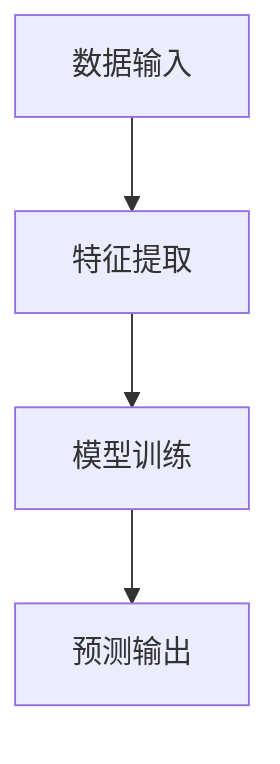
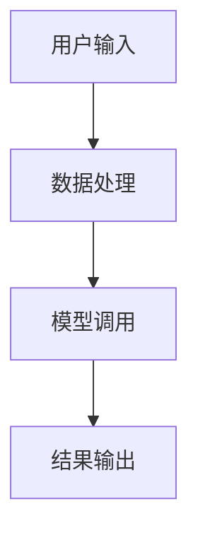

                 


# 《机器学习辅助公司管理层评估》

## 关键词：  
机器学习、公司管理层评估、数据分析、预测模型、算法实现、系统架构

## 摘要：  
本文探讨了机器学习在公司管理层评估中的应用，从问题背景、核心概念到算法实现、系统架构，全面分析了机器学习如何辅助公司管理层评估，提供了详细的实战项目和最佳实践建议。

---

## 目录大纲

### 第1章: 机器学习辅助公司管理层评估的背景介绍

#### 1.1 问题背景与描述
- **1.1.1 公司管理层评估的传统方法与挑战**
  - 传统评估方法的局限性
  - 管理层评估中的关键问题
- **1.1.2 问题的解决方法与目标**
  - 引入机器学习的目的
  - 管理层评估的预期成果
- **1.1.3 问题的边界与外延**
  - 适用场景与限制条件
  - 与其他管理工具的结合

#### 1.2 核心概念与联系
- **1.2.1 核心概念原理**
  - 数据驱动的决策
  - 机器学习的基本概念
- **1.2.2 核心概念属性特征对比**
  - 算法类型对比表
  - 数据特征分析
- **1.2.3 ER实体关系图**
  ```mermaid
  graph TD
    A[管理层] --> B[评估指标]
    B --> C[历史数据]
    C --> D[机器学习模型]
    D --> E[预测结果]
  ```

---

### 第2章: 机器学习的核心概念与联系

#### 2.1 机器学习的基本原理
- **2.1.1 监督学习、无监督学习与深度学习的区别**
  - 监督学习：输入-输出关系
  - 无监督学习：数据模式识别
  - 深度学习：多层神经网络
- **2.1.2 核心算法的特征对比**
  - 表格对比：算法类型、适用场景、优缺点
- **2.1.3 算法选择的依据**
  - 数据类型、任务需求、计算资源

#### 2.2 核心概念的数学模型
- **2.2.1 线性回归模型**
  - 方程：$y = \beta_0 + \beta_1x + \epsilon$
  - 示例：预测管理层绩效
- **2.2.2 决策树模型**
  - 示例：ID3算法的决策树构建
- **2.2.3 支持向量机模型**
  - 方程：最大化分类间隔
  - 示例：分类问题
- **2.2.4 随机森林模型**
  - 方程：集成学习的投票机制

#### 2.3 算法原理的 Mermaid 流程图


---

### 第3章: 机器学习算法

#### 3.1 算法实现步骤
- **3.1.1 数据预处理**
  - 清洗、转换、归一化
  - 示例：Python代码实现数据清洗
- **3.1.2 模型训练**
  - 线性回归模型实现
  - 代码示例：
    ```python
    import numpy as np
    from sklearn.linear_model import LinearRegression
    # 数据准备
    X = np.array([[1], [2], [3], [4]])
    y = np.array([2, 4, 6, 8])
    # 模型训练
    model = LinearRegression()
    model.fit(X, y)
    ```
- **3.1.3 模型评估**
  - 评估指标：均方误差、R²分数
  - 示例：评估结果分析

---

### 第4章: 系统分析与架构设计

#### 4.1 问题场景介绍
- **4.1.1 系统功能设计**
  - 领域模型设计：ER图
  - 数据流设计：数据来源、处理、存储
- **4.1.2 系统架构设计**
  ```mermaid
  graph TD
    A[管理层] --> B[数据处理层]
    B --> C[模型训练层]
    C --> D[结果输出层]
  ```
- **4.1.3 系统接口设计**
  - 输入接口：数据输入格式
  - 输出接口：结果展示格式

#### 4.2 系统交互流程图


---

### 第5章: 项目实战

#### 5.1 环境安装与数据准备
- **5.1.1 环境配置**
  - Python版本、库安装
  - 示例：`pip install numpy pandas scikit-learn`
- **5.1.2 数据集准备**
  - 数据来源：公司历史数据
  - 数据格式：CSV文件

#### 5.2 核心代码实现
- **5.2.1 数据预处理**
  ```python
  import pandas as pd
  data = pd.read_csv('management_data.csv')
  data_cleaned = data.dropna()
  ```
- **5.2.2 模型训练与优化**
  ```python
  from sklearn.model_selection import train_test_split
  X_train, X_test, y_train, y_test = train_test_split(data_cleaned.drop('label', axis=1), data_cleaned['label'])
  model.fit(X_train, y_train)
  ```

#### 5.3 案例分析与结果解读
- **5.3.1 案例分析**
  - 示例：预测某管理层的绩效
  - 结果分析：模型输出结果解读
- **5.3.2 实际应用中的问题**
  - 模型鲁棒性分析
  - 数据偏差的处理

---

### 第6章: 最佳实践与注意事项

#### 6.1 小结
- 机器学习在公司管理层评估中的优势
- 模型选择与优化的关键点

#### 6.2 注意事项
- 数据质量的重要性
- 模型解释性与可解释性
- 模型部署与维护

#### 6.3 拓展阅读
- 推荐书籍与论文
- 在线课程与资源

---

## 作者：  
AI天才研究院/AI Genius Institute & 禅与计算机程序设计艺术 /Zen And The Art of Computer Programming

---

希望这个目录大纲能满足您的需求。如果需要进一步扩展或调整，请随时告知！

