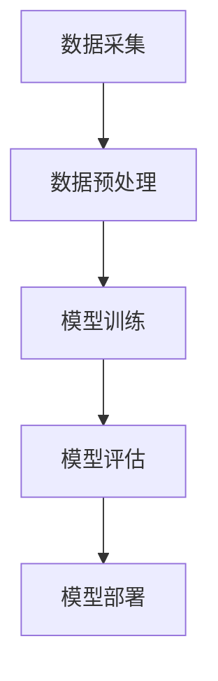

                 

# 机器学习预测公司现金流波动性

## 关键词：
机器学习，现金流波动性，预测模型，算法原理，系统架构

## 摘要：
现金流波动性是企业财务健康的重要指标，机器学习通过分析历史数据和市场动态，能够有效预测现金流的波动性，帮助企业做出更明智的财务决策。本文将详细探讨如何利用机器学习算法预测现金流波动性，从背景、核心概念、算法原理、系统架构到实战案例，全面解析其实现过程和应用价值。

---

## 第1章: 现金流波动性预测的背景与意义

### 1.1 现金流波动性的定义与重要性
现金流是企业的生命线，其波动性反映了企业的财务稳定性。现金流波动性是指企业在一定时期内现金流的波动程度，通常通过标准差或波动率来衡量。预测现金流波动性对企业制定财务策略、优化资金管理具有重要意义。

#### 1.1.1 现金流波动性的定义
现金流波动性可以分为正向波动和负向波动。正向波动意味着现金流的增长，而负向波动则意味着现金流的减少或负值。预测现金流波动性可以帮助企业提前应对潜在的财务风险。

#### 1.1.2 现金流波动性对企业的影响
现金流波动性直接影响企业的偿债能力、投资能力和运营稳定性。例如，现金流波动过大可能导致企业难以偿还短期债务，从而影响信用评级。通过预测现金流波动性，企业可以更好地规划资金使用，降低财务风险。

#### 1.1.3 现金流波动性预测的必要性
现金流预测是企业财务管理的核心任务之一。传统的财务预测方法依赖于历史数据和假设，而机器学习可以通过分析大量非结构化数据（如市场趋势、行业动态等），提供更精准的预测结果。

### 1.2 机器学习在金融领域的应用
机器学习是一种人工智能技术，通过训练模型从数据中提取特征，进而进行预测或分类。在金融领域，机器学习被广泛应用于股票价格预测、风险评估、欺诈检测等场景。

#### 1.2.1 机器学习的基本概念
机器学习分为监督学习、无监督学习和强化学习。监督学习通过训练数据预测目标变量，无监督学习通过聚类分析发现数据中的模式，强化学习通过不断试错优化决策。

#### 1.2.2 机器学习在金融中的应用现状
机器学习在金融中的应用主要包括股票价格预测、信用评分、欺诈检测等。例如，银行可以利用机器学习模型评估客户的信用风险，从而决定是否批准贷款。

#### 1.2.3 机器学习在现金流预测中的优势
机器学习能够处理大量的结构化和非结构化数据，具有高精度和高效率的特点。与传统财务模型相比，机器学习能够捕捉数据中的复杂模式，提供更准确的预测结果。

---

## 第2章: 机器学习预测现金流波动性的核心概念

### 2.1 现金流波动性的特征分析
现金流波动性预测的核心在于分析影响现金流的主要因素，如营业收入、成本、市场环境等。

#### 2.1.1 现金流波动性的统计特征
统计特征包括均值、方差、标准差等。这些指标可以帮助我们理解现金流的分布情况和波动程度。

#### 2.1.2 现金流波动性的时序特性
现金流波动性具有时序性，即近期波动可能影响未来波动。例如，如果某企业在过去三个月内现金流波动较大，未来可能也会出现较大的波动。

#### 2.1.3 现金流波动性的相关性分析
现金流波动性可能与多个因素相关，如市场波动、行业趋势、企业内部管理等。通过相关性分析，可以识别出影响现金流波动性的关键因素。

### 2.2 机器学习算法简介
机器学习算法是预测现金流波动性的核心工具。常用的算法包括线性回归、随机森林、神经网络等。

#### 2.2.1 线性回归
线性回归是一种简单而有效的预测方法，适用于线性关系明显的数据。其基本思想是通过最小二乘法找到最佳拟合直线。

#### 2.2.2 随机森林
随机森林是一种基于决策树的集成学习算法，具有高精度和高鲁棒性的特点。它通过随机选择特征和样本进行多次训练，最终将所有决策树的结果进行投票或平均。

#### 2.2.3 神经网络
神经网络是一种模拟人脑神经网络结构的深度学习算法，适用于复杂非线性关系的预测。神经网络通过多层神经元的非线性变换，能够捕捉数据中的复杂模式。

---

## 第3章: 机器学习预测现金流波动性的算法原理

### 3.1 线性回归模型
线性回归是一种简单而有效的预测方法，适用于线性关系明显的数据。

#### 3.1.1 线性回归的基本原理
线性回归通过最小二乘法找到最佳拟合直线，公式为：
$$ y = \beta_0 + \beta_1 x + \epsilon $$
其中，$\beta_0$ 是截距，$\beta_1$ 是斜率，$\epsilon$ 是误差项。

#### 3.1.2 线性回归的数学模型
线性回归的目标是最小化预测值与实际值之间的平方差之和，即：
$$ \text{最小化} \sum_{i=1}^n (y_i - (\beta_0 + \beta_1 x_i))^2 $$

#### 3.1.3 线性回归在现金流预测中的应用
线性回归适用于现金流与单一变量（如营业收入）之间存在线性关系的情况。

### 3.2 随机森林模型
随机森林是一种基于决策树的集成学习算法，具有高精度和高鲁棒性的特点。

#### 3.2.1 随机森林的基本原理
随机森林通过随机选择特征和样本进行多次训练，最终将所有决策树的结果进行投票或平均。

#### 3.2.2 随机森林的数学模型
随机森林通过集成多个决策树的结果，可以显著提高模型的准确性和稳定性。

#### 3.2.3 随机森林在现金流预测中的应用
随机森林适用于现金流与多个特征（如营业收入、成本、市场环境等）之间存在复杂关系的情况。

### 3.3 神经网络模型
神经网络是一种模拟人脑神经网络结构的深度学习算法，适用于复杂非线性关系的预测。

#### 3.3.1 神经网络的基本原理
神经网络通过多层神经元的非线性变换，能够捕捉数据中的复杂模式。

#### 3.3.2 神经网络的数学模型
神经网络的输入层、隐藏层和输出层通过激活函数和权重参数进行非线性变换，最终输出预测结果。

#### 3.3.3 神经网络在现金流预测中的应用
神经网络适用于现金流与复杂市场环境、行业趋势等非线性关系的情况。

---

## 第4章: 现金流波动性预测的系统架构设计

### 4.1 系统功能设计
现金流波动性预测系统需要具备数据采集、数据预处理、模型训练、模型评估和模型部署等功能。

#### 4.1.1 数据采集模块
数据采集模块负责收集企业的财务数据和市场数据，包括营业收入、成本、市场指数等。

#### 4.1.2 数据预处理模块
数据预处理模块对采集到的数据进行清洗、归一化和特征工程处理，确保数据适合模型训练。

#### 4.1.3 模型训练模块
模型训练模块利用训练数据对机器学习模型进行训练，得到最优模型参数。

#### 4.1.4 模型评估模块
模型评估模块通过测试数据对模型的预测能力进行评估，计算模型的准确率、召回率等指标。

#### 4.1.5 模型部署模块
模型部署模块将训练好的模型部署到生产环境中，实时预测现金流波动性。

### 4.2 系统架构设计
现金流波动性预测系统的架构设计需要考虑数据流、模型训练和模型部署的效率。

#### 4.2.1 系统架构图

#### 4.2.2 系统接口设计
系统需要提供数据接口、模型接口和用户接口，方便数据输入、模型调用和用户查询。

#### 4.2.3 系统交互流程
系统交互流程包括数据采集、数据预处理、模型训练、模型评估和模型部署五个阶段。

---

## 第5章: 机器学习预测现金流波动性的项目实战

### 5.1 环境安装与配置
#### 5.1.1 安装Python和相关库
安装Python和Scikit-learn、XGBoost、TensorFlow等机器学习库。

#### 5.1.2 数据集准备
收集企业的财务数据和市场数据，进行数据清洗和特征工程处理。

### 5.2 系统核心实现
#### 5.2.1 数据预处理
对数据进行归一化、标准化等处理，确保数据适合模型训练。

#### 5.2.2 特征工程
通过主成分分析（PCA）等方法提取关键特征，降低维度。

#### 5.2.3 模型训练
利用训练数据对线性回归、随机森林和神经网络模型进行训练。

#### 5.2.4 模型调优
通过网格搜索（Grid Search）等方法优化模型参数，提高预测精度。

#### 5.2.5 模型部署
将训练好的模型部署到生产环境中，实时预测现金流波动性。

### 5.3 实际案例分析
#### 5.3.1 数据分析
对实际案例中的数据进行分析，识别影响现金流波动性的关键因素。

#### 5.3.2 模型比较
比较不同机器学习算法的预测效果，选择最优模型。

#### 5.3.3 模型解释
解释模型的预测结果，帮助企业理解现金流波动性的驱动因素。

### 5.4 项目小结
通过实际案例分析，验证了机器学习在现金流波动性预测中的有效性和准确性。

---

## 第6章: 总结与展望

### 6.1 总结
机器学习通过分析历史数据和市场动态，能够有效预测现金流波动性，帮助企业制定更明智的财务决策。

### 6.2 展望
未来，随着人工智能技术的不断发展，机器学习在现金流波动性预测中的应用将更加广泛和深入。

---

## 第7章: 最佳实践 tips

### 7.1 数据处理
在数据处理阶段，需要注意数据的完整性和准确性，避免因数据质量问题影响模型性能。

### 7.2 模型选择
在模型选择阶段，需要根据具体问题和数据特征选择合适的算法，避免盲目使用复杂模型。

### 7.3 模型评估
在模型评估阶段，需要综合考虑准确率、召回率等指标，选择最优模型。

### 7.4 模型部署
在模型部署阶段，需要注意模型的实时性和可扩展性，确保模型能够适应实际应用的需要。

---

## 作者：AI天才研究院/AI Genius Institute & 禅与计算机程序设计艺术 /Zen And The Art of Computer Programming

---

本文通过详细讲解机器学习在现金流波动性预测中的应用，从背景、核心概念、算法原理、系统架构到项目实战，全面解析其实现过程和应用价值。希望本文能够为相关领域的研究者和企业提供有价值的参考和启示。

