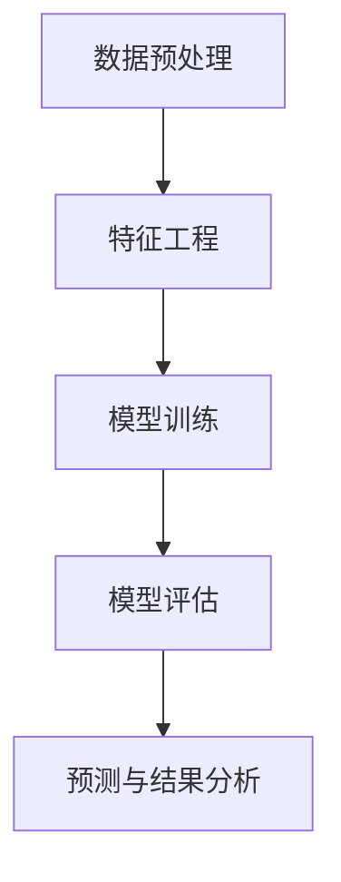
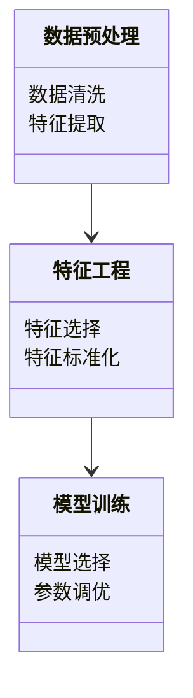

                 


# 机器学习预测公司盈利质量

> 关键词：机器学习，盈利质量，财务预测，算法实现，系统架构

> 摘要：本文探讨了如何利用机器学习技术预测公司盈利质量，涵盖背景、算法原理、系统设计及项目实战，旨在帮助读者掌握相关知识和技能。

---

# 第一部分: 机器学习预测公司盈利质量的背景与基础

## 第1章: 机器学习与公司盈利质量概述

### 1.1 机器学习的基本概念
#### 1.1.1 机器学习的定义与核心概念
- 机器学习是一种人工智能技术，通过数据训练模型以做出预测或决策。
- 核心概念包括特征、标签、模型训练等。

#### 1.1.2 公司盈利质量的定义与重要性
- 盈利质量指公司在一定时期内实现净利润的能力。
- 预测盈利质量对投资者和管理层决策至关重要。

#### 1.1.3 机器学习在公司盈利预测中的应用前景
- 提供自动化、高精度的预测能力。
- 帮助识别影响盈利的关键因素。

### 1.2 机器学习的核心概念与联系
#### 1.2.1 机器学习模型的基本原理
- 模型通过学习数据模式进行预测。
- 包括监督学习、无监督学习等方法。

#### 1.2.2 公司盈利质量预测的核心要素
- 财务指标（如净利润率、毛利率）。
- 市场因素（如行业趋势、竞争状况）。

#### 1.2.3 数据、特征与模型的关系
- 数据是模型训练的基础。
- 特征工程影响模型性能。
- 模型选择依赖于数据特征和问题类型。

#### 1.2.4 机器学习模型的分类与对比
| 模型类型 | 描述 | 优点 | 缺点 |
|---------|------|------|------|
| 线性模型 | 假设线性关系 | 简单 | 无法处理非线性 |
| 树模型   | 基于决策树 | 处理非线性 | � prone to overfitting |
| 神经网络 | 多层感知机 | 强大学习能力 | 需大量数据 |

### 1.3 本章小结
本章介绍了机器学习的基本概念和其在公司盈利预测中的应用，为后续内容打下基础。

---

# 第二部分: 机器学习算法原理与实现

## 第2章: 常见机器学习算法原理

### 2.1 线性回归
#### 2.1.1 线性回归的数学模型
$$ y = w_1x_1 + w_2x_2 + \dots + w_nx_n + b $$

#### 2.1.2 线性回归的实现步骤


#### 2.1.3 线性回归的优缺点
- 优点：简单易懂，计算效率高。
- 缺点：只能处理线性关系。

### 2.2 支持向量机
#### 2.2.1 SVM的基本原理
- 使用超平面进行分类或回归。

#### 2.2.2 SVM的数学模型
$$ \text{minimize } \frac{1}{2}||w||^2 + C \sum_{i=1}^n \xi_i $$
$$ \text{subject to } y_i(w \cdot x_i + b) \geq 1 - \xi_i $$
$$ \xi_i \geq 0 $$

### 2.3 随机森林
#### 2.3.1 随机森林的基本原理
- 使用多棵决策树进行投票或平均。

#### 2.3.2 随机森林的数学模型
- 通过集成学习减少过拟合。

---

## 第3章: 神经网络与深度学习
### 3.1 神经网络的基本原理
#### 3.1.1 神经网络的结构
- 输入层、隐藏层、输出层。

#### 3.1.2 神经网络的数学模型
$$ y = f(Wx + b) $$

### 3.2 深度学习的实现
#### 3.2.1 卷积神经网络（CNN）
- 适合图像数据，但公司盈利预测中应用有限。

---

# 第三部分: 系统分析与架构设计

## 第4章: 机器学习预测系统设计

### 4.1 问题场景介绍
- 数据获取与预处理。
- 特征工程与模型选择。

### 4.2 系统功能设计
#### 4.2.1 领域模型（Mermaid类图）


### 4.3 系统架构设计


---

# 第四部分: 项目实战

## 第5章: 机器学习项目实战

### 5.1 环境安装
- Python、Scikit-learn、Pandas、Matplotlib。

### 5.2 数据预处理与特征工程
#### 5.2.1 数据清洗
- 删除缺失值。
- 处理异常值。

#### 5.2.2 特征选择
- 使用相关性分析或Lasso回归。

### 5.3 模型训练与评估
#### 5.3.1 模型训练
```python
from sklearn.linear_model import LinearRegression
model = LinearRegression()
model.fit(X_train, y_train)
```

#### 5.3.2 模型评估
```python
from sklearn.metrics import mean_squared_error
y_pred = model.predict(X_test)
print(mean_squared_error(y_test, y_pred))
```

### 5.4 项目总结与优化
- 模型调优。
- 引入其他算法进行对比。

---

# 第五部分: 总结与展望

## 第6章: 总结与未来展望

### 6.1 本章小结
- 系统地介绍了机器学习预测公司盈利质量的方法。
- 提供了完整的项目实施步骤。

### 6.2 未来展望
- 引入深度学习模型。
- 处理时间序列数据。
- 结合自然语言处理分析文本数据。

### 6.3 最佳实践 tips
- 数据预处理是关键。
- 特征工程提升模型性能。
- 模型调优和评估不可忽视。

---

# 作者：AI天才研究院 & 禅与计算机程序设计艺术

