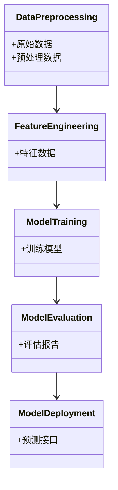
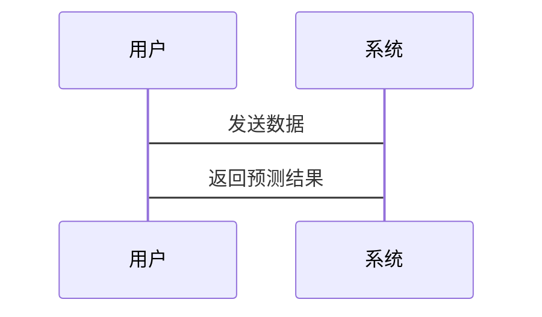

                 


# 《机器学习预测公司盈利质量变化》

## 关键词：机器学习, 公司盈利, 质量预测, 算法, 系统架构, 项目实战

## 摘要：  
本文深入探讨了如何利用机器学习技术预测公司盈利质量的变化。首先，我们从背景和意义出发，介绍了机器学习在公司盈利预测中的重要性。接着，详细讲解了机器学习的核心概念与算法原理，包括线性回归、随机森林和神经网络等模型。然后，我们设计了一个完整的系统架构，从数据预处理到模型部署进行了详细说明。最后，通过项目实战，展示了如何利用Python代码实现盈利质量预测，并总结了最佳实践和未来研究方向。

---

# 第1章: 机器学习与公司盈利质量预测概述

## 1.1 机器学习的基本概念

### 1.1.1 机器学习的定义与特点  
机器学习（Machine Learning）是人工智能（AI）的一个分支，通过数据和经验来训练模型，使其能够完成特定任务。其特点包括：数据驱动、自动化学习、适应性更新等。  

### 1.1.2 机器学习的核心概念  
- **特征（Feature）**：输入数据的属性，如公司收入、利润等。  
- **标签（Label）**：目标输出，如公司盈利质量的变化。  
- **模型（Model）**：算法通过训练数据得到的函数，用于预测。  

### 1.1.3 机器学习与传统统计分析的区别  
- **数据驱动 vs. 假设驱动**：机器学习依赖大量数据，而传统统计分析依赖假设检验。  
- **非线性建模**：机器学习能够捕捉复杂非线性关系，而传统方法通常依赖线性假设。  

## 1.2 公司盈利质量预测的背景与意义

### 1.2.1 公司盈利质量的定义  
公司盈利质量是指公司在一定时期内实现的利润质量，不仅关注利润的大小，还关注利润的来源和可持续性。  

### 1.2.2 盈利质量预测的重要性  
- **投资决策**：投资者可以根据预测结果做出更明智的投资决策。  
- **企业战略**：帮助企业制定更有效的财务和运营策略。  
- **风险控制**：提前识别潜在风险，优化资源配置。  

### 1.2.3 机器学习在盈利质量预测中的应用优势  
- **高维度数据处理**：机器学习能够处理多维度的财务和市场数据。  
- **非线性关系捕捉**：能够发现传统方法难以察觉的模式。  

## 1.3 机器学习预测公司盈利质量的目标与边界

### 1.3.1 预测目标的设定  
- **短期预测**：预测未来1-3年的盈利变化。  
- **长期预测**：预测未来3-5年的趋势。  

### 1.3.2 预测的边界与限制  
- **数据质量**：模型依赖高质量的数据，数据缺失或噪声会影响预测效果。  
- **模型泛化能力**：模型在不同市场环境下的表现可能不同。  

### 1.3.3 预测模型的适用场景  
- **行业差异**：不同行业的财务指标权重不同，需定制化模型。  
- **市场波动**：模型需能适应市场波动和宏观经济变化。  

---

# 第2章: 机器学习核心概念与公司盈利质量预测的关系

## 2.1 机器学习模型的分类

### 2.1.1 监督学习  
- **输入特征（X）**：如收入、成本、市场增长率等。  
- **输出标签（Y）**：如公司盈利质量评分（0-1）。  

### 2.1.2 非监督学习  
- **聚类分析**：将公司按盈利能力分为几类。  

### 2.1.3 强化学习  
- **策略优化**：通过模拟市场环境优化投资策略。  

## 2.2 公司盈利质量预测的核心要素

### 2.2.1 财务指标分析  
- **收入与成本**：如收入增长率、成本占比。  
- **利润与现金流**：如净利润率、现金流健康度。  

### 2.2.2 市场因素分析  
- **行业竞争**：如行业集中度、市场份额。  
- **宏观经济**：如GDP增长率、利率水平。  

### 2.2.3 公司内部管理因素  
- **管理效率**：如管理层稳定性、战略决策能力。  
- **研发投入**：如研发支出占收入的比例。  

## 2.3 机器学习模型与公司盈利质量预测的关联

### 2.3.1 数据特征提取  
- **特征工程**：如差分、归一化、分箱等。  

### 2.3.2 模型选择与优化  
- **超参数调优**：如学习率、树深度等。  

### 2.3.3 结果解释与应用  
- **解释性模型**：如线性回归系数解释。  

---

# 第3章: 机器学习算法原理与数学模型

## 3.1 线性回归模型

### 3.1.1 线性回归的数学模型  
$$y = \beta_0 + \beta_1x_1 + \beta_2x_2 + ... + \beta_nx_n + \epsilon$$  

### 3.1.2 普通最小二乘法的原理  
- **目标函数**：最小化预测值与实际值的平方差之和。  

### 3.1.3 线性回归的优缺点  
- **优点**：简单、易于解释。  
- **缺点**：难以捕捉非线性关系。  

## 3.2 随机森林模型

### 3.2.1 随机森林的原理与优势  
- **袋装法**：通过随机抽取样本构建多棵决策树。  
- **投票法**：预测结果取多数投票结果。  

### 3.2.2 随机森林的数学模型  
$$P(y|x) = \frac{1}{N}\sum_{i=1}^{N}f_i(x)$$  

### 3.2.3 随机森林与线性回归的对比  
- **可解释性**：线性回归 > 随机森林。  
- **非线性捕捉**：随机森林 > 线性回归。  

## 3.3 神经网络模型

### 3.3.1 神经网络的基本结构  
- **输入层**：接收输入特征。  
- **隐藏层**：通过非线性变换提取特征。  
- **输出层**：输出预测结果。  

### 3.3.2 深度学习与神经网络的关系  
- **深度学习**：多层神经网络的变体，如CNN、RNN等。  

### 3.3.3 神经网络在盈利预测中的应用  
- **时间序列预测**：如LSTM网络用于预测未来盈利。  

---

# 第4章: 公司盈利质量预测的系统架构设计

## 4.1 问题场景介绍

### 4.1.1 项目背景  
- **目标**：构建一个基于机器学习的盈利预测系统。  
- **用户**：投资者、企业管理者。  

## 4.2 系统功能设计

### 4.2.1 领域模型类图  


## 4.3 系统架构设计

### 4.3.1 系统架构图  


## 4.4 系统接口设计

### 4.4.1 API接口  
- **输入**：公司财务数据。  
- **输出**：盈利预测结果。  

## 4.5 系统交互设计

### 4.5.1 用户与系统的交互流程  


---

# 第5章: 项目实战

## 5.1 环境安装

### 5.1.1 安装Python与机器学习库  
```bash
pip install numpy pandas scikit-learn tensorflow
```

## 5.2 数据预处理与特征工程

### 5.2.1 数据加载与清洗  
```python
import pandas as pd
data = pd.read_csv('company_profit.csv')
data.dropna(inplace=True)
```

### 5.2.2 特征工程  
```python
from sklearn.preprocessing import StandardScaler
scaler = StandardScaler()
X_scaled = scaler.fit_transform(data.drop('profit_quality', axis=1))
```

## 5.3 模型训练与评估

### 5.3.1 线性回归模型  
```python
from sklearn.linear_model import LinearRegression
model = LinearRegression()
model.fit(X_scaled, data['profit_quality'])
```

### 5.3.2 模型评估  
```python
from sklearn.metrics import r2_score
y_pred = model.predict(X_scaled)
print(r2_score(data['profit_quality'], y_pred))
```

## 5.4 模型部署与预测

### 5.4.1 保存与加载模型  
```python
import joblib
joblib.dump(model, 'profit_predictor.pkl')
```

### 5.4.2 预测接口实现  
```python
def predict_profit(X):
    model = joblib.load('profit_predictor.pkl')
    return model.predict(X)
```

## 5.5 实际案例分析

### 5.5.1 案例背景  
假设我们有一家公司的财务数据，我们需要预测其未来一年的盈利质量。  

### 5.5.2 数据输入与预测  
```python
import numpy as np
test_data = np.array([[收入, 成本, 利润率]])
print(predict_profit(test_data))
```

---

# 第6章: 最佳实践与总结

## 6.1 项目小结  
- **数据质量**：数据清洗与特征工程是关键。  
- **模型选择**：根据业务需求选择合适的模型。  

## 6.2 注意事项  
- **模型解释性**：确保模型结果可解释。  
- **数据隐私**：注意数据安全与隐私保护。  

## 6.3 未来研究方向  
- **多模态数据**：结合文本、图像等多模态数据。  
- **在线学习**：实现模型的在线更新与自适应。  

## 6.4 拓展阅读  
- 推荐书籍：《机器学习实战》、《深入理解机器学习》。  

---

# 作者：AI天才研究院 & 禅与计算机程序设计艺术

