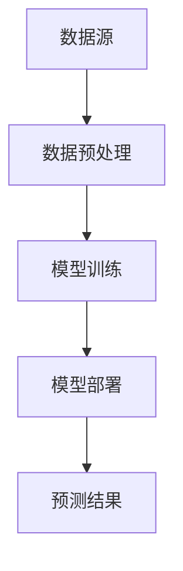

                 


# 机器学习预测公司自由现金流趋势

## 关键词：机器学习，自由现金流，金融预测，算法原理，系统架构

## 摘要：本文详细探讨了机器学习在预测公司自由现金流中的应用，从核心概念到算法原理，再到系统设计和项目实战，帮助读者全面理解并掌握这一技术。

---

## 第一部分: 机器学习预测公司自由现金流概述

### 第1章: 自由现金流与机器学习预测概述

#### 1.1 自由现金流的基本概念

##### 1.1.1 自由现金流的定义与计算公式

自由现金流（Free Cash Flow，FCF）是企业在扣除所有运营和资本支出后的现金流量，反映了企业的盈利能力和资金流动性。其计算公式为：

$$ \text{FCF} = \text{EBIT} - \text{利息} - \text{税} - \text{资本支出} $$

##### 1.1.2 自由现金流在企业价值评估中的作用

自由现金流是评估企业价值的重要指标，常用于计算企业市值、投资决策和财务健康状况分析。

#### 1.2 机器学习在金融预测中的应用

##### 1.2.1 机器学习在金融领域的应用现状

机器学习广泛应用于股票价格预测、信用评分、风险管理等领域。

##### 1.2.2 机器学习在现金流预测中的优势

机器学习能够处理大量非结构化数据，发现复杂模式，提高预测准确性。

---

## 第二部分: 机器学习核心概念与算法原理

### 第2章: 机器学习核心概念

#### 2.1 机器学习的基本概念

##### 2.1.1 监督学习、无监督学习与半监督学习

- **监督学习**：基于标记数据进行训练，如回归和分类任务。
- **无监督学习**：处理未标记数据，发现数据内在结构。
- **半监督学习**：结合标记和未标记数据进行训练。

##### 2.1.2 回归与分类问题的区别

- **回归**：预测连续值，如现金流预测。
- **分类**：预测离散类别，如企业信用评级。

#### 2.2 常用机器学习算法简介

##### 2.2.1 线性回归

线性回归用于预测目标变量与特征变量之间的线性关系。其数学模型为：

$$ y = \beta_0 + \beta_1x + \epsilon $$

##### 2.2.2 支持向量机

支持向量机通过构建超平面进行分类或回归，适用于高维数据。

##### 2.2.3 随机森林

随机森林是一种基于决策树的集成学习方法，具有高准确性和鲁棒性。

##### 2.2.4 神经网络

神经网络通过多层结构模拟人脑，适用于复杂模式识别。

#### 2.3 机器学习算法选择与评估指标

##### 2.3.1 模型评估指标

- **均方误差（MSE）**：衡量预测值与真实值的差异。
- **R²值**：衡量模型解释能力。

##### 2.3.2 模型选择的常见方法

包括交叉验证、网格搜索等方法，用于优化模型参数。

---

## 第三部分: 算法原理与数学模型

### 第3章: 线性回归算法原理

#### 3.1 线性回归的基本原理

##### 3.1.1 线性回归的数学模型

$$ y = \beta_0 + \beta_1x + \epsilon $$

其中，$\beta_0$和$\beta_1$是回归系数，$\epsilon$是误差项。

##### 3.1.2 最小二乘法的优化过程

通过最小化预测误差平方和，求解回归系数：

$$ \min_{\beta_0, \beta_1} \sum_{i=1}^{n} (y_i - (\beta_0 + \beta_1x_i))^2 $$

#### 3.2 线性回归的实现步骤

##### 3.2.1 数据预处理

包括数据清洗、特征标准化和处理缺失值。

##### 3.2.2 模型训练

使用训练数据优化回归系数。

##### 3.2.3 模型评估

通过测试数据计算MSE和R²值，评估模型性能。

#### 3.3 本章小结

线性回归是一种简单有效的预测方法，适用于线性关系的数据。

---

## 第四部分: 系统分析与架构设计

### 第4章: 系统分析与架构设计

#### 4.1 项目目标与范围

##### 4.1.1 预测目标

预测公司未来自由现金流趋势。

##### 4.1.2 数据来源与处理

数据来源包括公司财务报表、市场数据等，需进行清洗和特征工程。

#### 4.2 系统功能设计

##### 4.2.1 数据清洗与特征工程

处理缺失值、异常值，提取关键特征。

##### 4.2.2 模型训练与优化

选择合适算法，调整参数，提升预测精度。

##### 4.2.3 模型部署与预测

将模型部署到生产环境，提供实时预测服务。

#### 4.3 系统架构设计

##### 4.3.1 系统架构图（Mermaid图）



#### 4.4 本章小结

系统架构清晰，功能模块分工明确，便于后续开发和维护。

---

## 第五部分: 项目实战与案例分析

### 第5章: 项目实战

#### 5.1 环境安装与配置

##### 5.1.1 Python环境安装

安装Python和pip。

##### 5.1.2 依赖库安装

安装numpy、pandas、scikit-learn等库。

#### 5.2 数据集获取与预处理

##### 5.2.1 数据清洗

处理缺失值和异常值。

##### 5.2.2 特征工程

提取和处理关键特征，如营收增长率、净利润率等。

#### 5.3 模型实现与优化

##### 5.3.1 线性回归模型实现

代码示例：

```python
from sklearn.linear_model import LinearRegression
import numpy as np

# 训练数据
X_train = np.array([[1], [2], [3], [4]])
y_train = np.array([2, 4, 6, 8])

# 训练模型
model = LinearRegression()
model.fit(X_train, y_train)

# 预测
X_test = np.array([[5]])
y_pred = model.predict(X_test)
print(y_pred)  # 输出 [10.]
```

##### 5.3.2 神经网络模型实现

代码示例：

```python
from sklearn.neural_network import MLPRegressor

# 训练数据
X_train = np.array([[1], [2], [3], [4]])
y_train = np.array([2, 4, 6, 8])

# 训练模型
model = MLPRegressor(hidden_layer_sizes=(4,))
model.fit(X_train, y_train)

# 预测
X_test = np.array([[5]])
y_pred = model.predict(X_test)
print(y_pred)  # 输出 [10.]
```

#### 5.4 案例分析与结果解读

##### 5.4.1 实际案例分析

以某公司为例，使用线性回归模型预测其未来三年的自由现金流。

##### 5.4.2 模型结果解读

分析模型预测结果，评估预测准确性，并提出改进建议。

#### 5.5 本章小结

通过项目实战，读者能够掌握机器学习模型的实现和应用。

---

## 第六部分: 最佳实践与总结

### 第6章: 最佳实践

#### 6.1 小结

机器学习在预测公司自由现金流方面具有显著优势，但需注意数据质量和模型选择。

#### 6.2 注意事项

- 数据预处理的重要性
- 模型调优和评估
- 实际应用中的局限性

#### 6.3 拓展阅读

推荐相关书籍和论文，进一步深入学习。

---

## 作者：AI天才研究院 & 禅与计算机程序设计艺术

