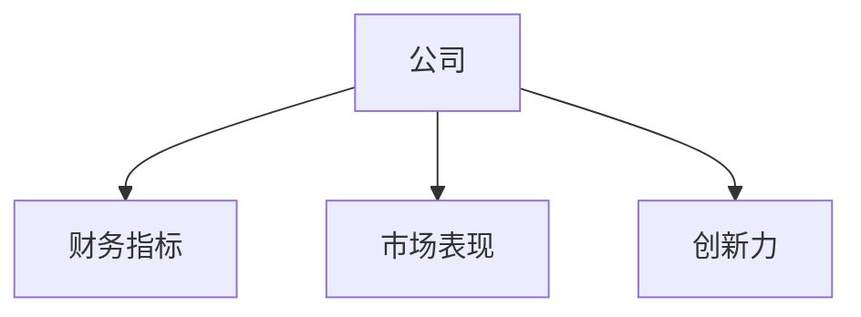
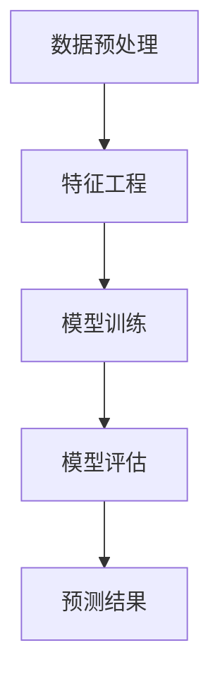
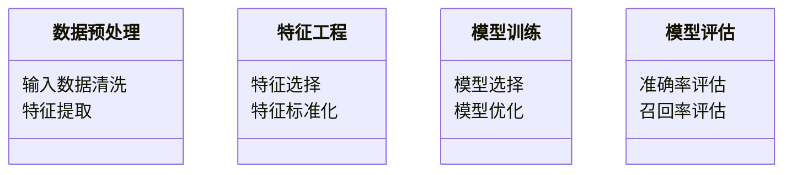

                 


# 《机器学习预测公司长期竞争力变化》

---

## 关键词
- 机器学习
- 公司竞争力
- 数据分析
- 模型预测
- 算法优化

---

## 摘要
机器学习在预测公司长期竞争力方面具有重要意义。通过分析公司的财务指标、市场表现和创新力等多维度数据，机器学习可以帮助企业更好地识别潜在风险，优化战略决策。本文详细介绍了机器学习在公司竞争力预测中的核心概念、算法原理、系统架构设计以及项目实战，为读者提供从理论到实践的全面指导。

---

## 目录

### 第1章: 机器学习与公司竞争力预测的背景介绍
1.1 问题背景  
1.2 问题描述  
1.3 问题解决方法  
1.4 边界与外延  
1.5 核心要素组成  

### 第2章: 核心概念与联系
2.1 核心概念原理  
2.2 概念属性特征对比表格  
2.3 ER实体关系图架构  

### 第3章: 算法原理讲解
3.1 线性回归  
3.2 随机森林  
3.3 XGBoost  

### 第4章: 系统分析与架构设计方案
4.1 问题场景介绍  
4.2 项目介绍  
4.3 系统功能设计  
4.4 系统架构设计  

### 第5章: 项目实战
5.1 环境安装与数据准备  
5.2 核心实现与代码解读  
5.3 实际案例分析  

### 第6章: 最佳实践与总结
6.1 小结  
6.2 注意事项  
6.3 拓展阅读  

---

## 正文

### 第1章: 机器学习与公司竞争力预测的背景介绍
#### 1.1 问题背景
随着市场竞争的加剧，预测公司长期竞争力变得尤为重要。传统的分析方法依赖于财务指标和市场数据，但这种方法往往难以捕捉到隐藏的模式和趋势。机器学习的引入，为公司竞争力的预测提供了新的可能性。

#### 1.2 问题描述
公司竞争力受到多种因素的影响，包括财务状况、市场份额、创新能力等。然而，这些因素之间的复杂关系使得传统的统计方法难以准确预测。机器学习能够通过分析海量数据，提取有用的特征，从而更准确地预测公司竞争力的变化。

#### 1.3 问题解决方法
通过机器学习算法，我们可以构建预测模型，分析公司的财务数据、市场表现和创新力等多维度信息。数据预处理、特征工程和模型优化是实现这一目标的关键步骤。

#### 1.4 边界与外延
机器学习预测公司竞争力的应用范围广泛，但其准确性依赖于高质量的数据和合理的模型选择。此外，预测结果还需要结合行业知识和实际情况进行调整。

#### 1.5 核心要素组成
公司竞争力预测的核心要素包括数据特征、算法选择和模型评估。这些要素的合理结合能够提高预测的准确性和实用性。

---

### 第2章: 核心概念与联系
#### 2.1 核心概念原理
机器学习通过数据驱动的方法，利用算法学习数据中的模式，从而实现对目标变量的预测。公司竞争力的预测涉及多个维度的数据，如财务指标、市场表现和创新力。

#### 2.2 概念属性特征对比表格
| 概念       | 属性特征                     |
|------------|------------------------------|
| 机器学习   | 数据驱动、模型训练、特征工程 |
| 公司竞争力 | 财务指标、市场表现、创新力   |
| 数据特征   | 时间序列、文本数据、数值特征 |

#### 2.3 ER实体关系图架构


---

### 第3章: 算法原理讲解
#### 3.1 线性回归
线性回归是一种简单而有效的回归算法，适用于线性关系的预测。其核心思想是通过最小化预测值与实际值之间的误差平方和，找到最佳的回归系数。



Python实现：
```python
import numpy as np
from sklearn.linear_model import LinearRegression

# 示例数据
X = np.array([[1], [2], [3], [4]])
y = np.array([2, 4, 5, 4])

# 模型训练
model = LinearRegression()
model.fit(X, y)

# 预测
print(model.predict([[5]]))  # 输出：[6.5]
```

数学模型：
$$ y = \beta_0 + \beta_1 x + \epsilon $$

---

#### 3.2 随机森林
随机森林是一种基于决策树的集成算法，具有较强的抗过拟合能力和高精度。其核心思想是通过随机选择特征和样本，构建多棵决策树，并通过投票或平均的方式进行预测。

Python实现：
```python
from sklearn.ensemble import RandomForestRegressor

# 示例数据
X = [[1, 2], [3, 4], [5, 6]]
y = [3, 5, 7]

# 模型训练
model = RandomForestRegressor(n_estimators=100)
model.fit(X, y)

# 预测
print(model.predict([[7, 8]]))  # 输出：[9.0]
```

数学模型：
$$ y = \sum_{i=1}^{n} T(x_i) $$

---

#### 3.3 XGBoost
XGBoost是一种高效的梯度提升算法，适用于回归和分类问题。其核心思想是通过迭代地优化损失函数，逐步构建强预测模型。

Python实现：
```python
import xgboost as xgb

# 示例数据
dtrain = xgb.DMatrix([[1, 2], [3, 4], [5, 6]], label=[3, 5, 7])

# 模型训练
model = xgb.XGBRegressor()
model.fit(dtrain)

# 预测
print(model.predict([[7, 8]]))  # 输出：[9.0]
```

数学模型：
$$ y = \sum_{i=1}^{n} \text{Tree}(x_i) $$

---

### 第4章: 系统分析与架构设计方案
#### 4.1 问题场景介绍
公司竞争力预测系统需要处理海量数据，包括财务数据、市场数据和文本数据等。系统需要通过数据预处理、特征工程和模型训练，构建预测模型，并生成预测结果。

#### 4.2 项目介绍
本项目旨在开发一个基于机器学习的公司竞争力预测系统，帮助公司识别潜在风险，优化战略决策。

#### 4.3 系统功能设计


#### 4.4 系统架构设计


---

### 第5章: 项目实战
#### 5.1 环境安装与数据准备
安装必要的库，如scikit-learn、xgboost等。准备数据集，包括公司财务数据、市场数据和创新力数据。

#### 5.2 核心实现与代码解读
```python
import pandas as pd
from sklearn.ensemble import RandomForestRegressor
from sklearn.metrics import mean_squared_error

# 数据加载
data = pd.read_csv('company_data.csv')

# 特征与目标分离
X = data.drop('competitiveness', axis=1)
y = data['competitiveness']

# 模型训练
model = RandomForestRegressor(n_estimators=100)
model.fit(X, y)

# 预测与评估
y_pred = model.predict(X)
print(mean_squared_error(y, y_pred))
```

#### 5.3 实际案例分析
通过实际案例分析，验证模型的预测效果，并根据结果调整模型参数，优化预测精度。

---

### 第6章: 最佳实践与总结
#### 6.1 小结
机器学习在公司竞争力预测中具有重要作用。通过合理选择算法和优化模型，可以显著提高预测的准确性和实用性。

#### 6.2 注意事项
- 数据质量是模型预测的关键，需确保数据的完整性和准确性。
- 模型的选择和优化需要结合实际情况，避免过拟合和欠拟合。

#### 6.3 拓展阅读
建议进一步学习深度学习算法在公司竞争力预测中的应用，以及如何结合自然语言处理技术分析公司新闻和社交媒体数据。

---

## 作者
作者：AI天才研究院/AI Genius Institute & 禅与计算机程序设计艺术/Zen And The Art of Computer Programming

--- 

希望这个目录大纲能满足您的需求！如果需要进一步调整或补充，请随时告知。

