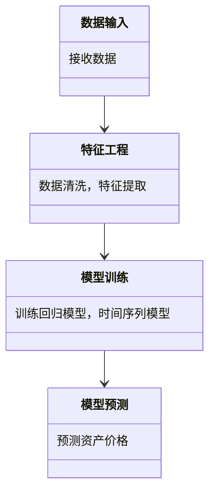
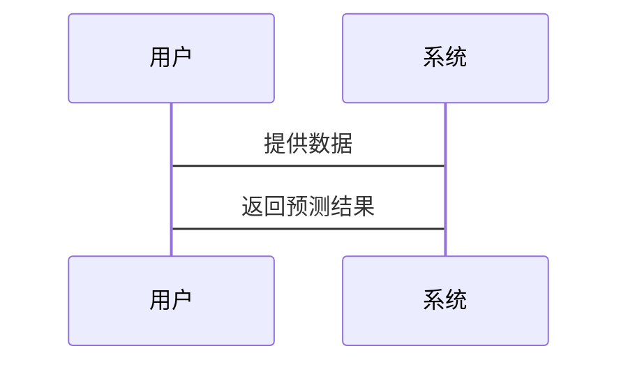

                 


# 机器学习驱动的动态资产定价模型

> 关键词：机器学习，动态资产定价，资产定价模型，金融数据分析，量化投资

> 摘要：本文探讨了如何利用机器学习技术构建动态资产定价模型，分析了其核心概念、算法原理和系统架构，同时结合实际案例展示了模型的应用和优化方法。

---

## 第1章: 背景介绍与核心概念

### 1.1 机器学习与动态资产定价的背景

#### 1.1.1 传统资产定价模型的局限性
传统资产定价模型，如CAPM和APT，假设市场是有效的且投资者是理性的。然而，现实中市场常常存在非理性行为、信息不对称和结构性问题，导致传统模型在实际应用中效果有限。

#### 1.1.2 机器学习在金融领域的应用前景
机器学习在金融中的应用日益广泛，特别是在高频交易、风险管理、信用评分和资产定价等领域。机器学习能够处理海量数据，发现传统模型难以捕捉的模式，提供更精准的预测。

#### 1.1.3 动态资产定价的核心问题与挑战
动态资产定价需要实时更新定价模型，以应对市场变化。这要求模型具备高实时性和适应性，同时需要处理大量的实时数据。

---

### 1.2 动态资产定价模型的基本概念

#### 1.2.1 资产定价的基本原理
资产定价旨在确定资产的公允价值，考虑其风险、收益和市场环境等因素。

#### 1.2.2 动态资产定价的定义与特征
动态资产定价模型强调实时更新和适应性，能够根据市场变化快速调整定价。

#### 1.2.3 机器学习在资产定价中的作用
机器学习能够处理非线性关系，发现数据中的隐含模式，提高定价的准确性。

---

### 1.3 问题背景与目标

#### 1.3.1 传统定价模型的局限性
传统模型假设稳定，无法应对市场波动。

#### 1.3.2 机器学习驱动定价的优势
机器学习能够处理复杂数据，实时更新模型。

#### 1.3.3 动态资产定价的目标与边界
目标是实时、准确地定价，边界包括数据质量和模型假设。

---

## 第2章: 机器学习基础

### 2.1 监督学习与回归分析

#### 2.1.1 线性回归模型
线性回归模型公式为：
$$ y = \beta_0 + \beta_1 x + \epsilon $$
其中，$\beta_0$和$\beta_1$是回归系数，$\epsilon$是误差项。

#### 2.1.2 支持向量回归
支持向量回归通过寻找一个管状区域，使得预测值与实际值的偏差在区域内。

#### 2.1.3 随机森林回归
随机森林通过集成多个决策树模型，提高预测的准确性和鲁棒性。

---

### 2.2 特征工程与数据预处理

#### 2.2.1 特征选择与降维
使用主成分分析（PCA）等方法进行特征降维。

#### 2.2.2 数据标准化与归一化
数据标准化公式为：
$$ x' = \frac{x - \mu}{\sigma} $$
数据归一化公式为：
$$ x' = \frac{x - \min}{\max - \min} $$

#### 2.2.3 时间序列数据的处理
处理时间序列数据时，可以使用LSTM网络捕捉长期依赖关系。

---

## 第3章: 资产定价理论与机器学习结合

### 3.1 资产定价的经典模型

#### 3.1.1 CAPM模型
CAPM公式为：
$$ E(r_i) = r_f + \beta_i (E(r_m) - r_f) $$
其中，$r_f$是无风险利率，$\beta_i$是资产的贝塔系数，$E(r_m)$是市场预期收益。

#### 3.1.2 APT模型
APT模型认为资产收益可以分解为多个因素的线性组合。

#### 3.1.3 Fama三因子模型
Fama三因子模型公式为：
$$ E(r_i) = r_f + \beta_i (E(r_m) - r_f) + \gamma_i (SMB) + \delta_i (HML) $$

---

### 3.2 机器学习在资产定价中的应用

#### 3.2.1 回归模型的应用
使用机器学习模型预测资产收益，例如使用随机森林回归模型。

#### 3.2.2 时间序列预测
使用LSTM网络进行时间序列预测，捕捉市场波动。

#### 3.2.3 聚类分析与风险分组
将资产分为不同风险类别，进行风险管理和投资组合优化。

---

## 第4章: 机器学习模型在资产定价中的应用

### 4.1 回归分析与资产定价

#### 4.1.1 线性回归模型
用于简单关系建模，例如预测股票收益。

#### 4.1.2 支持向量回归
用于处理非线性关系，例如预测债券收益率。

#### 4.1.3 随机森林回归
用于高维数据的特征重要性分析，例如分析影响股票价格的因素。

---

### 4.2 时间序列预测模型

#### 4.2.1 ARIMA模型
ARIMA模型用于时间序列预测，适用于具有趋势和季节性的数据。

#### 4.2.2 LSTM网络
LSTM网络通过门控机制捕捉长期依赖关系，适用于复杂的时间序列预测。

#### 4.2.3 Prophet模型
Prophet模型通过分解时间序列数据，进行趋势预测和周期预测。

---

### 4.3 组合模型与优化

#### 4.3.1 基于机器学习的组合优化
使用集成学习提高预测准确性，例如将多个回归模型的结果进行融合。

#### 4.3.2 超参数优化
使用网格搜索或随机搜索选择最佳参数，例如选择最佳的树深度和叶子数量。

#### 4.3.3 模型融合与集成学习
将不同模型的结果进行融合，例如将随机森林和LSTM的结果进行加权平均。

---

## 第5章: 系统架构

### 5.1 系统功能设计

#### 5.1.1 领域模型Mermaid类图


### 5.2 系统架构设计

#### 5.2.1 Mermaid架构图


### 5.3 系统交互Mermaid序列图

#### 5.3.1 用户与系统交互


---

## 第6章: 项目实战

### 6.1 环境安装

- Python
- 机器学习库：Scikit-learn, XGBoost
- 时间序列库：Prophet
- 可视化库：Matplotlib, Seaborn
- Mermaid工具：Visual Studio Code插件

---

### 6.2 核心实现源代码

#### 6.2.1 数据预处理代码
```python
import pandas as pd
import numpy as np

# 数据加载
data = pd.read_csv('stock_data.csv')

# 数据清洗
data = data.dropna()

# 特征提取
features = data[['open', 'high', 'low', 'volume']]
label = data['close']
```

#### 6.2.2 模型训练代码
```python
from sklearn.ensemble import RandomForestRegressor

# 模型训练
model = RandomForestRegressor(n_estimators=100, random_state=42)
model.fit(features, label)
```

#### 6.2.3 时间序列预测代码
```python
from prophet import Prophet

# 数据转换为Prophet格式
df_prophet = data[['date', 'close']]
df_prophet.columns = ['ds', 'y']
model_prophet = Prophet()
model_prophet.fit(df_prophet)
```

#### 6.2.4 系统架构实现
```python
from flask import Flask

app = Flask(__name__)

@app.route('/predict', methods=['POST'])
def predict():
    # 获取数据
    data = request.get_json()
    # 处理数据
    # 返回结果
    return jsonify(result)
```

---

### 6.3 代码应用解读与分析

- 数据预处理代码展示了如何清洗和提取特征。
- 模型训练代码使用随机森林回归模型进行训练。
- 时间序列预测代码使用Prophet模型进行预测。
- 系统架构实现展示了Flask接口的设计，用于接收请求和返回结果。

---

### 6.4 实际案例分析

#### 6.4.1 案例介绍
以某只股票为例，展示模型的应用和预测结果。

#### 6.4.2 详细讲解
分析模型在实际案例中的表现，比较不同模型的效果，并提出优化方向。

---

## 第7章: 最佳实践、小结与扩展阅读

### 7.1 最佳实践 tips

- **数据质量**: 确保数据的完整性和准确性。
- **模型选择**: 根据问题选择合适的模型。
- **实时更新**: 定期更新模型以适应市场变化。
- **风险管理**: 结合风险管理策略使用模型。

### 7.2 小结

本文探讨了机器学习在动态资产定价中的应用，分析了传统模型的局限性和机器学习的优势，详细介绍了相关算法和系统架构，并结合实际案例展示了模型的应用和优化方法。

### 7.3 注意事项

- 注意模型过拟合的问题，避免在测试集上过度优化。
- 注意数据泄漏的问题，确保训练数据和测试数据的独立性。

### 7.4 拓展阅读

- 建议阅读相关书籍和论文，如《Python机器学习实战》和《金融中的大数据分析》。

---

**作者：AI天才研究院/AI Genius Institute & 禅与计算机程序设计艺术 /Zen And The Art of Computer Programming**

---

以上是《机器学习驱动的动态资产定价模型》的完整目录和内容概要，每一章都详细展开了核心内容，结合了理论、算法和实际应用，帮助读者全面理解和掌握机器学习在动态资产定价中的应用。

