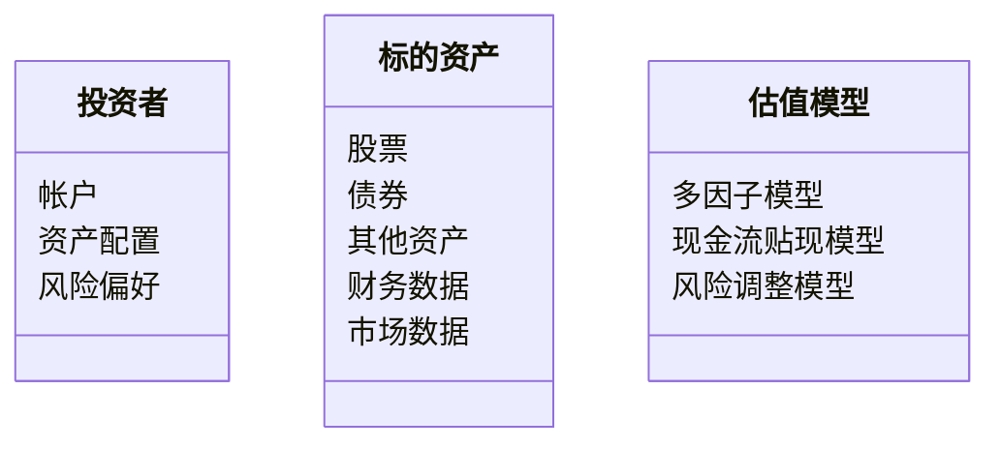
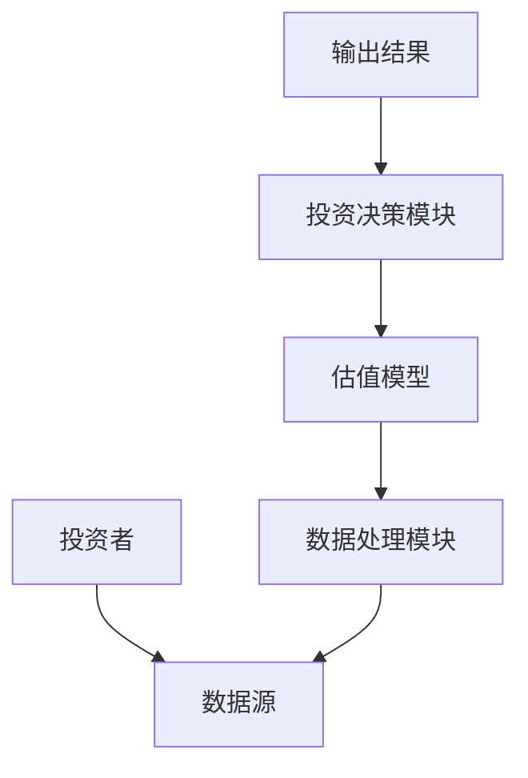

                 


# 杰里米·格兰瑟姆的价值投资新定义

> 关键词：价值投资，新定义，杰里米·格兰瑟姆，投资策略，量化分析

> 摘要：本文详细探讨了杰里米·格兰瑟姆提出的价值投资新定义，从传统价值投资的局限性出发，结合当前金融市场的新特点，分析了新定义的核心理念、数学模型与算法原理，并通过系统架构设计、项目实战和最佳实践等部分，深入解读了这一新定义在实际投资中的应用与意义。

---

## 第一部分：价值投资新定义的背景与核心概念

### 第1章：价值投资的起源与演变

#### 1.1 价值投资的起源

价值投资是一种以基本面分析为基础的投资策略，起源于20世纪初。其核心理念是通过分析公司的财务状况、行业地位和未来前景，寻找市场价格低于其内在价值的标的资产进行投资。

##### 1.1.1 价值投资的定义与核心理念

- **定义**：价值投资强调买入被市场低估的资产，长期持有，等待其价值回归。
- **核心理念**：
  1. 质量优先：选择具有强大财务状况和竞争优势的公司。
  2. 价格敏感：关注市场价格与内在价值的差异。
  3. 长期视角：耐心持有，等待市场重新认识其价值。

##### 1.1.2 格兰瑟姆在价值投资中的地位

杰里米·格兰瑟姆是价值投资的重要代表人物之一，他是本杰明·格雷厄姆的学生，继承和发展了价值投资理论，提出了许多创新性的投资策略。

##### 1.1.3 价值投资的发展历程

价值投资从最初的“烟屁股”策略（即寻找被市场忽视的低增长公司）逐渐发展为更加多样化的策略，包括寻找成长型公司、防御性公司等。

---

#### 1.2 价值投资新定义的背景

##### 1.2.1 当前金融市场的新特点

- **全球化**：市场的波动性和复杂性增加。
- **量化投资**：越来越多的投资者采用量化模型进行投资决策。
- **技术驱动**：大数据、人工智能等技术的应用改变了投资方式。

##### 1.2.2 传统价值投资的局限性

- **信息不对称**：传统分析难以捕捉实时市场变化。
- **效率低下**：手动分析耗时且成本高。
- **可扩展性差**：难以应对大规模数据和复杂场景。

##### 1.2.3 新定义的必要性与意义

- **适应性**：新定义将传统价值投资与现代量化方法结合，适应市场变化。
- **效率提升**：通过量化分析提高投资决策的效率和准确性。
- **可扩展性**：新方法适用于更大规模和更复杂的投资场景。

---

### 第2章：格兰瑟姆的价值投资新定义

#### 2.1 新定义的核心理念

##### 2.1.1 新定义的提出

杰里米·格兰瑟姆提出的新定义强调在传统价值投资的基础上，引入更多的量化指标和动态分析方法，以更准确地评估资产的内在价值。

##### 2.1.2 新定义与传统定义的对比

| 对比维度 | 传统价值投资 | 格兰瑟姆新定义 |
|----------|---------------|----------------|
| 核心理念 | 价格低于价值 | 价格与价值动态平衡 |
| 分析方法 | 主观判断为主 | 量化分析为主 |
| 应用场景 | 单一资产分析 | 多资产组合优化 |

##### 2.1.3 新定义的理论基础

- **动态平衡**：市场价格与内在价值的动态关系。
- **多因子模型**：结合多个量化指标进行综合评估。

---

## 第二部分：格兰瑟姆新定义的数学模型与算法原理

### 第3章：算法原理讲解

#### 3.1 算法流程

1. 数据收集：获取标的资产的财务数据、市场数据等。
2. 数据预处理：清洗和标准化数据。
3. 特征提取：提取关键量化指标（如市盈率、市净率、股息率等）。
4. 模型训练：构建多因子模型，计算内在价值。
5. 结果输出：生成投资建议或信号。

#### 3.2 数学模型与公式

##### 3.2.1 核心公式

$$ \text{内在价值} = \sum_{t=1}^{n} \frac{CF_t}{(1 + r)^t} $$

其中，\( CF_t \) 为第 \( t \) 年的现金流，\( r \) 为贴现率。

##### 3.2.2 示例

假设某公司未来5年的现金流分别为10、12、15、18、20，贴现率 \( r = 8\% \)。

计算内在价值：

$$ \text{内在价值} = \frac{10}{1.08} + \frac{12}{1.08^2} + \frac{15}{1.08^3} + \frac{18}{1.08^4} + \frac{20}{1.08^5} $$

---

### 第4章：系统分析与架构设计方案

#### 4.1 问题场景介绍

- **问题场景**：投资者需要快速、准确地评估多个资产的内在价值，并制定投资策略。
- **系统目标**：构建一个基于格兰瑟姆新定义的量化投资系统，实现资产筛选、估值和组合优化。

#### 4.2 系统功能设计

##### 4.2.1 领域模型类图



#### 4.3 系统架构设计



---

## 第三部分：项目实战与最佳实践

### 第5章：项目实战

#### 5.1 环境安装

- **工具安装**：安装Python、Pandas、NumPy等库。
- **数据源**：获取标的资产的财务数据和市场数据。

#### 5.2 核心代码实现

```python
import pandas as pd
import numpy as np

def calculate_intrinsic_value(cash_flows, discount_rate):
    return sum(cash_flow / (1 + discount_rate) ** t for t, cash_flow in enumerate(cash_flows))

# 示例数据
cash_flows = [10, 12, 15, 18, 20]
discount_rate = 0.08

iv = calculate_intrinsic_value(cash_flows, discount_rate)
print(f"内在价值：{iv}")
```

#### 5.3 案例分析

- **案例背景**：某科技公司财务数据和市场数据。
- **分析过程**：使用多因子模型计算其内在价值。
- **结果解读**：根据计算结果制定投资策略。

---

### 第6章：最佳实践

#### 6.1 小结

- 格兰瑟姆的价值投资新定义结合了传统价值投资和量化分析的优势，提高了投资决策的效率和准确性。

#### 6.2 注意事项

- 数据质量至关重要。
- 模型需定期更新和优化。
- 投资者需根据自身风险偏好调整策略。

#### 6.3 拓展阅读

- 推荐阅读杰里米·格兰瑟姆的著作《投资的艺术》。
- 关注量化投资领域的最新研究。

---

## 作者：AI天才研究院/AI Genius Institute & 禅与计算机程序设计艺术 /Zen And The Art of Computer Programming

---

以上是《杰里米·格兰瑟姆的价值投资新定义》的完整目录和内容框架，涵盖从理论到实践的各个方面，结合技术分析和实际案例，帮助读者深入理解这一新定义的投资策略。

