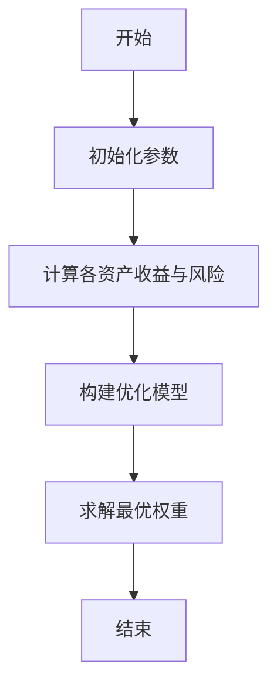
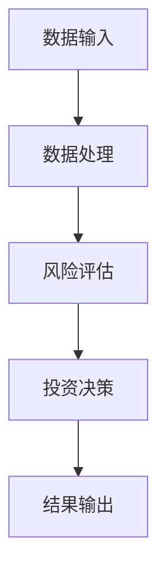

                 


# 杰里米·格兰瑟姆的气候变化投资影响

> **关键词**：气候变化，投资影响，杰里米·格兰瑟姆，投资策略，风险管理，系统架构  
> **摘要**：本文探讨杰里米·格兰瑟姆的气候变化投资影响，分析其对资产配置、投资组合优化、风险管理等方面的影响，并结合技术方法进行详细解读。

---

## 第1章：背景介绍

### 1.1 气候变化的定义与影响

#### 1.1.1 气候变化的科学定义
气候变化是地球气候系统长期的变化，主要由人类活动（如化石燃料使用、森林砍伐等）导致。  
$$气候变化 = \text{人类活动} + \text{自然因素}$$

#### 1.1.2 气候变化对全球经济的影响
- **经济损失**：极端天气事件（如洪水、干旱）导致的损失增加。
- **行业影响**：能源、农业、建筑等行业面临转型压力。

#### 1.1.3 投资与气候变化的关联
- 气候变化影响企业盈利、资产价值和投资风险。
- 投资者需将气候变化因素纳入决策。

---

## 第2章：杰里米·格兰瑟姆的气候变化投资策略

### 2.1 格兰瑟姆的投资哲学

#### 2.1.1 长期投资视角
- 以长期趋势为导向，关注结构性变化。
- 重点分析行业周期和政策影响。

#### 2.1.2 气候变化的经济影响
- 气候变化导致的资源短缺和行业重组。
- 可再生能源和绿色技术的投资机会。

---

## 第3章：气候变化对投资组合的影响

### 3.1 投资组合优化的数学模型

#### 3.1.1 均值-方差模型
$$\text{投资组合收益} = \sum_{i=1}^{n} w_i r_i$$
$$\text{投资组合风险} = \sqrt{\sum_{i=1}^{n} \sum_{j=1}^{n} w_i w_j \sigma_i \sigma_j \rho_{ij}}$$

#### 3.1.2 气候变化对收益和风险的影响
- 收益：绿色行业收益增加，传统行业收益下降。
- 风险：极端天气事件导致资产价格波动。

### 3.2 投资组合优化算法

#### 3.2.1 算法流程图


---

## 第4章：气候变化对资产类别的影响

### 4.1 股票投资的影响

#### 4.1.1 行业分析
- 高碳行业（如化石能源）风险上升。
- 低碳行业（如可再生能源）机会增加。

#### 4.1.2 公司估值
$$\text{调整后的估值} = \text{传统估值} - \text{碳排放成本} + \text{绿色技术价值}$$

### 4.2 债券投资的影响

#### 4.2.1 信用风险
- 碳排放较高的企业信用评级下降。
- 绿色债券需求增加。

#### 4.2.2 利率风险
- 气候政策变化影响债券流动性。

---

## 第5章：系统架构与风险管理

### 5.1 系统架构设计

#### 5.1.1 模块化架构


#### 5.1.2 关键模块功能
- 数据处理：收集气候变化相关数据。
- 风险评估：计算资产的气候风险敞口。
- 投资决策：优化投资组合。

### 5.2 风险管理策略

#### 5.2.1 情景分析
- 不同气候变化情景下的资产表现。

#### 5.2.2 压力测试
$$\text{压力测试} = \text{极端气候事件} \times \text{资产敏感性}$$

---

## 第6章：项目实战

### 6.1 案例分析

#### 6.1.1 投资组合优化
假设投资组合包含股票和债券：
```python
import numpy as np
import pandas as pd

# 示例数据
returns = pd.DataFrame({
    '股票': [0.1, 0.05, -0.02],
    '债券': [0.02, 0.03, 0.05]
})

# 优化模型
weights = np.array([0.6, 0.4])
expected_return = np.sum(weights * returns.mean())
risk = np.std(np.dot(weights, returns.values))
print(f"预期收益：{expected_return:.2f}%，风险：{risk:.2f}")
```

#### 6.1.2 碳排放分析
计算某公司的碳排放成本：
$$\text{碳成本} = \text{排放量} \times \text{碳价格}$$

---

## 第7章：总结与展望

### 7.1 核心观点总结
- 气候变化是投资决策的重要因素。
- 绿色技术投资潜力巨大。

### 7.2 未来展望
- 更多政策支持绿色投资。
- 技术进步降低气候风险。

---

## 作者：AI天才研究院/AI Genius Institute & 禅与计算机程序设计艺术 /Zen And The Art of Computer Programming

