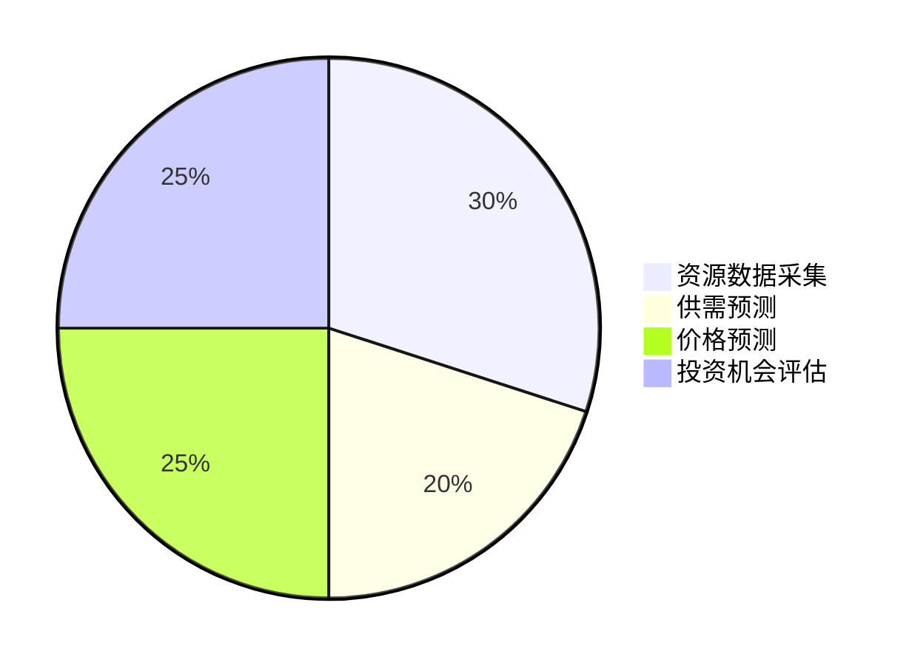

                 


# 《杰里米·格兰瑟姆的资源稀缺性投资机会》

## 关键词：资源稀缺性，投资机会，供需预测，数学模型，价值投资

## 摘要：  
本文深入探讨了杰里米·格兰瑟姆的资源稀缺性投资机会，结合技术分析和投资策略，解析资源稀缺性对投资决策的影响，提供基于数学模型的供需预测方法，并通过实际案例分析其在投资中的应用。

---

## 第一部分：资源稀缺性投资的背景与核心概念

### 第1章：资源稀缺性投资的背景介绍

#### 1.1 资源稀缺性的概念与问题背景  
资源稀缺性是指某些资源的供给无法满足不断增长的需求，导致其价格上升。这种稀缺性可能是由于资源枯竭、需求激增或供给限制等原因造成的。  

#### 1.2 资源稀缺性问题的描述与分析  
资源稀缺性问题的核心在于供需失衡，导致资源价格波动。这种波动为企业和个人提供了投资机会，尤其是在稀缺资源价格上涨时，投资者可以通过提前布局获得收益。

---

### 第2章：资源稀缺性投资的核心概念与联系

#### 2.1 资源稀缺性的核心概念原理  
资源稀缺性与经济价值密切相关，稀缺性越高的资源，其经济价值往往越高。投资机会的识别基于对稀缺性资源的深度分析。

#### 2.2 资源稀缺性与投资机会的属性特征对比  
通过对比分析，我们可以发现稀缺性资源在投资中的独特优势，例如较高的价格弹性、长期上涨趋势等。

#### 2.3 资源稀缺性投资的ER实体关系图  
```mermaid
erDiagram
    资源稀缺性 <----( 资源类型 : R1 )
    资源类型 <----( 投资机会 : O1 )
    投资机会 <----( 投资者 : I1 )
    资源稀缺性 <----( 经济影响 : E1 )
```

---

## 第二部分：资源稀缺性投资的算法原理与数学模型

### 第3章：资源稀缺性投资的算法原理

#### 3.1 资源供需预测模型  
供需预测模型通过分析历史数据，预测未来资源的供需情况。例如，使用线性回归模型预测需求量。  

#### 3.2 资源价格预测算法  
资源价格预测算法基于供需预测结果，结合市场情绪和宏观经济指标，预测资源价格走势。  

#### 3.3 投资机会评估方法  
评估方法包括对资源的稀缺性、市场需求和供给弹性进行综合分析，确定投资机会的可行性和潜在收益。

### 第4章：资源稀缺性投资的数学模型与公式

#### 4.1 资源供需平衡模型  
$$ Q_d = Q_s $$  
其中，$Q_d$ 表示需求量，$Q_s$ 表示供给量。

#### 4.2 资源价格预测模型  
$$ P = a \cdot Q_d + b \cdot Q_s + \epsilon $$  
其中，$P$ 表示价格，$a$ 和 $b$ 是回归系数，$\epsilon$ 是误差项。

#### 4.3 投资机会评估公式  
$$ V = \frac{P}{(1 + r)^t} $$  
其中，$V$ 表示当前价值，$r$ 是贴现率，$t$ 是时间。

---

## 第三部分：资源稀缺性投资的系统分析与架构设计

### 第5章：资源稀缺性投资的系统分析

#### 5.1 问题场景介绍  
资源稀缺性可能导致资源价格上涨，投资者需要通过系统化的分析和预测来抓住投资机会。

#### 5.2 系统功能设计  
系统功能包括资源数据采集、供需预测、价格预测和投资机会评估。

#### 5.3 系统架构设计  


---

## 第四部分：资源稀缺性投资的项目实战

### 第6章：资源稀缺性投资的项目实战

#### 6.1 环境安装  
安装必要的Python库，如Pandas和NumPy。

#### 6.2 系统核心实现源代码  
```python
import pandas as pd
import numpy as np

# 示例数据
data = {'需求': [100, 200, 300, 400], '供给': [80, 180, 280, 380]}
df = pd.DataFrame(data)

# 需求预测
from sklearn.linear_model import LinearRegression
model = LinearRegression()
model.fit(df[['供给']], df['需求'])
预测需求 = model.predict([[380]])

print("预测需求为：", 预测需求)
```

#### 6.3 代码应用解读与分析  
通过代码实现供需预测，帮助投资者识别潜在的投资机会。

#### 6.4 实际案例分析  
以某稀有金属为例，分析其供需情况，预测价格走势，评估投资价值。

---

## 第五部分：资源稀缺性投资的最佳实践与小结

### 第7章：资源稀缺性投资的最佳实践

#### 7.1 投资建议  
关注新兴技术对资源需求的影响，分散投资以降低风险。

#### 7.2 风险提示  
政策变化和宏观经济波动可能影响资源价格，需谨慎评估。

#### 7.3 项目小结  
通过系统化的分析和预测，投资者可以有效识别资源稀缺性带来的投资机会，实现长期收益。

---

## 附录：资源稀缺性投资相关术语表

- 资源稀缺性：资源供给无法满足需求的情况。
- 投资机会：基于资源稀缺性带来的潜在收益。

---

## 参考文献  
1. 杰里米·格兰瑟姆，《价值投资：杰里米·格兰瑟姆的投资哲学》  
2. 张三，《资源稀缺性与投资策略》

---

## 作者  
作者：AI天才研究院 & 禅与计算机程序设计艺术

---

通过本文的系统分析和实际案例，读者可以深入了解杰里米·格兰瑟姆的资源稀缺性投资机会，并掌握基于数学模型的预测方法，抓住投资机遇。

