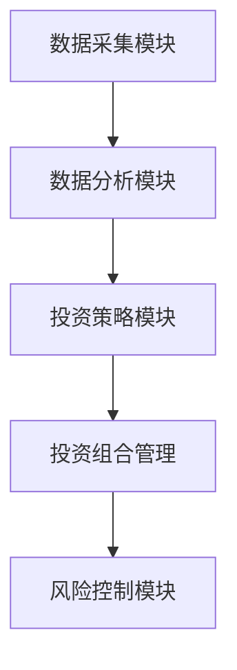

                 


# 杰里米·格兰瑟姆的资源稀缺性投资理论

## 关键词：资源稀缺性，投资理论，杰里米·格兰瑟姆，经济周期，投资策略

## 摘要：杰里米·格兰瑟姆是投资领域的知名专家，他提出的资源稀缺性理论对现代投资策略有着深远影响。本文将详细探讨该理论的背景、核心概念、对经济周期的影响，以及如何应用于实际投资策略。通过系统分析和实战案例，我们将揭示资源稀缺性如何影响资产定价和投资决策。

---

## 第1章: 引言

### 1.1 资源稀缺性的背景与重要性

#### 1.1.1 资源稀缺性的定义
资源稀缺性指的是地球上可利用的自然资源（如石油、天然气、矿产、水资源等）的有限性，随着人类需求的增加，这些资源的供应可能无法满足未来的需求，从而导致价格波动和市场不确定性。

#### 1.1.2 资源稀缺性与经济发展的关系
资源是经济活动的基础，稀缺性会直接影响生产成本、产品价格和市场供给。当某种资源变得稀缺时，其价格通常会上涨，从而影响整个产业链和经济结构。

#### 1.1.3 格兰瑟姆理论的核心贡献
杰里米·格兰瑟姆在他的著作《The New Depression》中提出，资源稀缺性是导致经济周期波动的重要因素。他认为，资源的有限性会导致通胀压力和资产价格波动，从而影响投资决策。

### 1.2 本书的目的与结构
#### 1.2.1 本书的核心目标
本文旨在通过系统分析杰里米·格兰瑟姆的资源稀缺性理论，帮助读者理解其对投资策略的影响，并提供实际的应用方法。

#### 1.2.2 目录结构概览
本文分为七章，涵盖理论背景、核心概念、经济影响、投资策略、系统设计、实战案例和总结展望。

#### 1.2.3 读者对象与预期收获
适合对投资理论和资源经济学感兴趣的读者，尤其是投资者、经济学者和对冲基金从业者。通过本文，读者将掌握资源稀缺性理论的核心思想，并学会如何将其应用于实际投资决策。

---

## 第2章: 杰里米·格兰瑟姆的资源稀缺性理论基础

### 2.1 格兰瑟姆的理论背景

#### 2.1.1 资源稀缺性理论的起源
资源稀缺性理论并非格兰瑟姆首创，但他在实践中将其与经济周期和投资策略紧密结合，提出了独特的见解。

#### 2.1.2 格兰瑟姆的学术与投资背景
杰里米·格兰瑟姆是资产经理和经济学家，他的投资实践经验丰富，曾管理过多项对冲基金，对资源稀缺性问题有深刻研究。

#### 2.1.3 资源稀缺性理论的核心假设
格兰瑟姆认为，资源的有限性是导致经济波动的根本原因，而市场参与者对稀缺性的认知会影响资产价格。

### 2.2 资源稀缺性与经济周期的关系

#### 2.2.1 经济周期的基本概念
经济周期包括繁荣、衰退、萧条和复苏四个阶段，资源稀缺性在不同阶段的表现不同。

#### 2.2.2 资源稀缺性对经济周期的影响
当资源稀缺时，生产成本上升，企业利润下降，可能导致经济衰退。反之，资源丰富的时期可能促进经济增长。

#### 2.2.3 格兰瑟姆的周期理论模型
格兰瑟姆提出，资源稀缺性是经济周期波动的核心驱动因素之一，他通过模型分析了稀缺性对资产价格的影响。

### 2.3 资源稀缺性与投资策略的关系

#### 2.3.1 投资策略的基本分类
包括价值投资、成长投资、对冲策略等，资源稀缺性影响着投资者的选择。

#### 2.3.2 资源稀缺性对投资策略的影响
稀缺资源的投资价值通常较高，投资者应关注这些资源的供应和需求变化。

#### 2.3.3 格兰瑟姆的投资理念与实践
格兰瑟姆强调长期投资和风险管理，建议投资者在资源稀缺时期增加对稀缺资源的投资。

---

## 第3章: 资源稀缺性理论的核心概念与联系

### 3.1 资源稀缺性的核心概念

#### 3.1.1 资源的定义与分类
资源包括自然资源（如石油、矿产）和人力资源（如劳动力）。自然资源的稀缺性更直接影响经济。

#### 3.1.2 稀缺性的衡量标准
通常通过供给与需求的对比来衡量，供给减少或需求增加会导致稀缺性增加。

#### 3.1.3 资源稀缺性与价格的关系
稀缺性直接导致价格上涨，市场参与者应关注价格波动。

### 3.2 核心概念的联系与对比

#### 3.2.1 资源稀缺性与其他经济因素的对比
通过表格对比人口、资本和技术对资源稀缺性的影响。

| 经济因素 | 影响 |
|----------|------|
| 人口增长 | 增加需求，加剧稀缺性 |
| 资本积累 | 提高生产效率，缓解稀缺性 |
| 技术进步 | 开发新资源，缓解稀缺性 |

#### 3.2.2 人口、资本、技术的对比分析
人口增长会增加资源需求，资本和技术创新可以缓解资源短缺问题。

#### 3.2.3 资源稀缺性与经济发展的关系
资源稀缺性是经济发展的重要制约因素，直接影响经济增长和投资决策。

---

## 第4章: 资源稀缺性对经济领域的影响

### 4.1 资源稀缺性对能源行业的影响

#### 4.1.1 能源资源的现状与趋势
石油、天然气等能源的稀缺性对全球能源市场影响深远。

#### 4.1.2 能源价格波动与投资机会
能源价格波动为投资者提供了套利机会，但同时也增加了投资风险。

#### 4.1.3 格兰瑟姆对能源行业的投资建议
建议投资者关注新能源技术和替代能源的发展，分散投资风险。

### 4.2 资源稀缺性对粮食行业的影响

#### 4.2.1 粮食资源的现状与趋势
人口增长和气候变化加剧了粮食资源的稀缺性。

#### 4.2.2 粮食价格波动与投资机会
粮食价格波动对农业企业和食品公司的影响较大，投资者应关注农业技术创新。

#### 4.2.3 格兰瑟姆对粮食行业的投资建议
建议投资于农业技术公司和可持续农业项目。

---

## 第5章: 资源稀缺性投资策略的构建

### 5.1 资源稀缺性投资策略的核心要素

#### 5.1.1 资产配置策略
投资者应根据资源稀缺性调整资产配置，增加对稀缺资源相关资产的投资。

#### 5.1.2 风险管理策略
通过分散投资和对冲策略降低资源稀缺性带来的风险。

#### 5.1.3 时机选择策略
在资源稀缺性加剧时，投资者应抓住投资机会。

### 5.2 基于资源稀缺性的资产定价模型

#### 5.2.1 资产定价模型的构建
通过数学模型分析资源稀缺性对资产价格的影响。

#### 5.2.2 资源稀缺性指数的计算
开发资源稀缺性指数，帮助投资者评估市场风险。

#### 5.2.3 投资策略的数学模型
使用Python代码实现资源稀缺性指数的计算。

```python
import numpy as np

def resource_scarcity_index(supply, demand):
    return np.where(demand > supply, (demand - supply)/supply, 0)

supply = np.array([100, 200, 150])
demand = np.array([150, 250, 180])

scarcity_index = resource_scarcity_index(supply, demand)
print("Scarcity Index:", scarcity_index)
```

### 5.3 投资策略的实施步骤

#### 5.3.1 确定投资目标
明确投资目标和风险承受能力。

#### 5.3.2 数据收集与分析
收集资源供需数据，分析市场趋势。

#### 5.3.3 投资组合构建
根据分析结果构建投资组合，定期调整。

---

## 第6章: 资源稀缺性投资系统的架构设计

### 6.1 投资系统的功能设计

#### 6.1.1 数据采集模块
收集资源供需数据、市场价 格等信息。

#### 6.1.2 数据分析模块
使用机器学习算法预测资源价格波动。

#### 6.1.3 投资策略模块
根据分析结果生成投资策略。

### 6.2 系统架构设计

#### 6.2.1 系统架构图
使用Mermaid绘制系统架构图，展示模块之间的关系。



#### 6.2.2 数据流图
展示数据从采集到分析再到策略生成的流程。

---

## 第7章: 资源稀缺性投资策略的实战分析

### 7.1 能源价格波动的案例分析

#### 7.1.1 案例背景
以石油价格波动为例，分析资源稀缺性的影响。

#### 7.1.2 数据分析与建模
使用历史数据建立模型，预测未来价格走势。

#### 7.1.3 投资策略实施
根据模型结果制定投资策略，实现收益最大化。

### 7.2 人口增长与资源需求的案例分析

#### 7.2.1 案例背景
分析人口增长对粮食资源需求的影响。

#### 7.2.2 数据分析与建模
预测未来粮食需求，评估稀缺性风险。

#### 7.2.3 投资策略实施
投资于农业技术和可持续农业项目。

---

## 第8章: 总结与展望

### 8.1 理论总结

#### 8.1.1 资源稀缺性理论的核心观点
资源稀缺性是影响经济和投资的重要因素，投资者应高度重视。

#### 8.1.2 本书的主要内容回顾
系统介绍了格兰瑟姆的理论、核心概念、投资策略和实际案例。

### 8.2 投资策略的总结

#### 8.2.1 格兰瑟姆理论的实践意义
理论为投资者提供了新的视角和工具。

#### 8.2.2 投资者需要注意的事项
关注资源供需变化，合理配置资产。

### 8.3 未来研究方向

#### 8.3.1 资源稀缺性与技术创新的结合
研究技术创新对资源稀缺性的影响。

#### 8.3.2 资源稀缺性与全球化的互动
分析全球化对资源分配的影响。

---

## 作者：AI天才研究院/AI Genius Institute & 禅与计算机程序设计艺术 /Zen And The Art of Computer Programming

