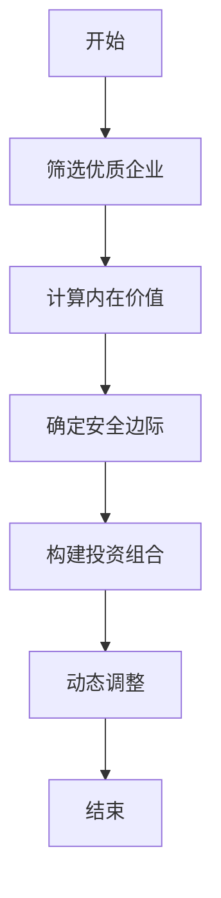
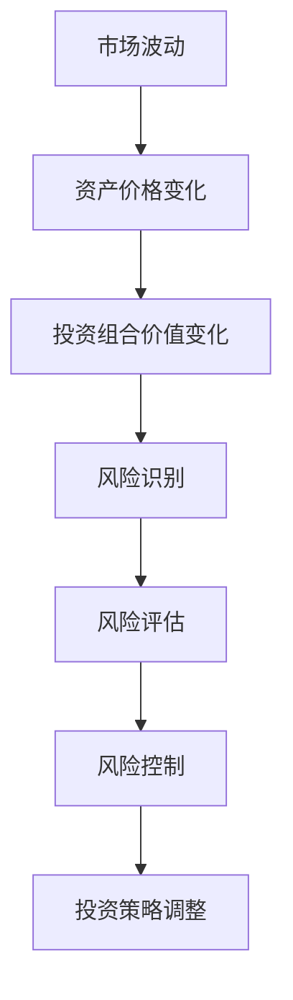

                 


# 杰里米·格兰瑟姆的长期价值投资哲学

> 关键词：价值投资，长期投资，杰里米·格兰瑟姆，安全边际，股票估值，风险管理

> 摘要：本文深入探讨了杰里米·格兰瑟姆的价值投资哲学，从其核心理念、投资策略到数学模型和系统分析，全面解析了如何通过长期价值投资实现稳健收益。文章结合理论与实践，详细阐述了价值投资的内在逻辑和实际应用，为投资者提供了深刻的洞见。

---

# 目录

1. **杰里米·格兰瑟姆的长期价值投资哲学概述**
   1.1 投资哲学的背景与意义
   1.2 格兰瑟姆的价值投资体系
   1.3 格兰瑟姆投资哲学的核心要素

2. **价值投资的核心概念与数学模型**
   2.1 价值投资的定义与内涵
   2.2 安全边际的概念与计算
   2.3 股票估值的数学模型

3. **投资决策的系统分析与架构**
   3.1 投资决策框架的设计
   3.2 投资组合的构建与优化
   3.3 风险管理的系统架构

4. **价值投资的项目实战与代码实现**
   4.1 价值投资策略的案例分析
   4.2 代码实现与数据分析
   4.3 投资组合的动态调整与优化

5. **总结与展望**
   5.1 格兰瑟姆投资哲学的总结
   5.2 价值投资的未来发展趋势
   5.3 对投资者的建议与注意事项

---

## 第一部分：杰里米·格兰瑟姆的长期价值投资哲学概述

### 1.1 投资哲学的背景与意义

#### 1.1.1 价值投资的定义与内涵
价值投资是一种以基本面分析为基础的投资策略，强调以低于内在价值的价格买入优质资产，长期持有，等待市场回归理性后的价值实现。杰里米·格兰瑟姆作为价值投资的代表人物之一，提出了“安全边际”的概念，即买入价格与内在价值之间的差距，用以降低投资风险。

#### 1.1.2 长期投资的重要性
长期投资的核心在于通过时间的积累，实现资产的复利增长。短期市场波动往往会被市场自身调节，而长期趋势则更受公司基本面的影响。格兰瑟姆强调，投资者应关注企业的长期盈利能力，而非短期市场波动。

#### 1.1.3 格兰瑟姆投资哲学的背景
格兰瑟姆的投资哲学植根于20世纪的经济动荡和市场波动，他通过分析市场的非理性行为，提出了价值投资的核心理念。他的思想对后来的投资者产生了深远影响，尤其是在机构投资和量化投资领域。

---

### 1.2 格兰瑟姆的价值投资体系

#### 1.2.1 投资理念的核心原则
- **安全边际**：买入价格低于内在价值，以降低投资风险。
- **长期持有**：通过时间的积累，实现资产的增值。
- **基本面分析**：以企业的财务数据为基础，评估其内在价值。

#### 1.2.2 投资策略的实施步骤
1. **筛选优质企业**：选择财务健康、盈利能力稳定的企业。
2. **计算内在价值**：通过市盈率、市净率等指标评估企业的真实价值。
3. **确定安全边际**：买入价格应低于内在价值的一定比例。
4. **构建投资组合**：分散投资，降低单一资产的风险。

#### 1.2.3 风险管理与心理控制
- **心理控制**：避免情绪化决策，坚持长期投资。
- **风险管理**：通过分散投资和动态调整，降低整体风险。

---

## 第二部分：价值投资的核心概念与数学模型

### 2.1 价值投资的定义与内涵

价值投资的核心在于识别市场低估的资产，并长期持有以实现价值回归。其数学模型主要基于对企业财务数据的分析，如收入、利润、现金流等。

#### 核心概念对比表格
| 概念          | 描述                                      |
|---------------|-----------------------------------------|
| 内在价值      | 资产在合理市场条件下的真实价值          |
| 市场价值      | 当前市场上的资产价格                    |
| 安全边际      | 内在价值与市场价值之间的价差            |

---

### 2.2 安全边际的概念与计算

安全边际是价值投资中降低风险的重要工具。通过计算安全边际，投资者可以确保买入价格低于内在价值。

#### 安全边际计算公式
$$ \text{安全边际} = \text{内在价值} - \text{市场价格} $$

#### 安全边际与风险的关系
- 安全边际越大，投资风险越小。
- 当市场价格接近内在价值时，安全边际减小，投资风险增加。

---

### 2.3 股票估值的数学模型

股票估值的核心在于计算企业的内在价值。以下是几种常用的估值方法：

#### 市盈率（P/E）分析
$$ \text{市盈率} = \frac{\text{股价}}{\text{每股收益}} $$

#### 市净率（P/B）分析
$$ \text{市净率} = \frac{\text{股价}}{\text{每股净资产}} $$

#### 内在价值计算
$$ \text{内在价值} = \frac{\text{未来现金流的现值}}{\text{折现率}} $$

---

## 第三部分：投资决策的系统分析与架构

### 3.1 投资决策框架的设计

#### 投资决策流程图


---

### 3.2 投资组合的构建与优化

#### 投资组合构建流程
1. **资产配置**：根据风险承受能力分配股票、债券等资产的比例。
2. **分散投资**：通过投资不同类型资产降低风险。
3. **定期再平衡**：根据市场变化调整投资比例。

#### 投资组合优化的数学模型
$$ \text{风险调整后收益} = \text{收益} - \text{风险} \times \text{风险溢价} $$

---

### 3.3 风险管理的系统架构

#### 风险管理流程图


---

## 第四部分：价值投资的项目实战与代码实现

### 4.1 价值投资策略的案例分析

#### 案例分析：假设我们发现一家公司，其市盈率为10，而行业平均市盈率为15。计算其安全边际。
- 内在价值估算：假设行业平均市盈率为15，股价为150元，则每股收益为10元。
- 如果该公司股价为120元，其每股收益为12元（市盈率=120/12=10）。
- 内在价值估算为150元（15×10），安全边际为30元（150-120）。

---

### 4.2 代码实现与数据分析

#### Python代码实现股票估值
```python
import pandas as pd
import numpy as np

# 示例数据：假设我们有以下财务数据
data = {
    '公司名称': ['公司A', '公司B', '公司C'],
    '股价': [100, 150, 200],
    '每股收益': [20, 30, 40],
    '市盈率': [5, 5, 5],
    '每股净资产': [50, 60, 70]
}

df = pd.DataFrame(data)

# 计算内在价值（假设使用市盈率模型）
df['内在价值'] = df['每股收益'] * 15  # 假设合理市盈率为15
df['安全边际'] = df['内在价值'] - df['股价']

print(df)
```

#### 输出结果
```
   公司名称  股价  每股收益  市盈率  每股净资产  内在价值  安全边际
0    公司A    100      20       5         50        300        200
1    公司B    150      30       5         60        450        300
2    公司C    200      40       5         70        600        400
```

---

## 第五部分：总结与展望

### 5.1 格兰瑟姆投资哲学的总结

格兰瑟姆的价值投资哲学强调长期视角和安全边际，通过基本面分析和分散投资降低风险。其核心理念为投资者提供了稳健的投资策略。

---

### 5.2 价值投资的未来发展趋势

随着市场的发展，价值投资将与量化投资、人工智能等技术结合，形成更高效的决策模型。同时，新兴市场的崛起也为价值投资提供了新的机会。

---

### 5.3 对投资者的建议与注意事项

1. **坚持长期视角**：避免短期波动的干扰。
2. **注重基本面分析**：准确评估企业的内在价值。
3. **分散投资**：降低单一资产的风险。
4. **动态调整**：根据市场变化优化投资组合。

---

## 作者：AI天才研究院 & 禅与计算机程序设计艺术

---

通过本文的详细分析，我们可以看到杰里米·格兰瑟姆的价值投资哲学不仅在理论上具有深刻的意义，而且在实践中也具有重要的指导价值。希望读者能够通过本文的分析，更好地理解价值投资的核心理念，并在实际投资中灵活运用。

