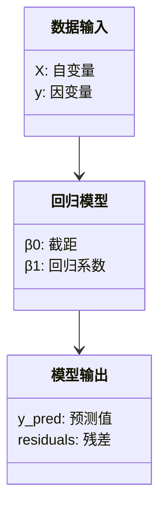

                 


# 杰里米格兰瑟姆的均值回归理论

> 关键词：均值回归，杰里米格兰瑟姆，投资理论，统计学，回归分析

> 摘要：本文系统地介绍了杰里米格兰瑟姆的均值回归理论，从理论背景、数学模型、投资应用到系统架构设计，全面深入地分析了均值回归的核心概念、算法原理及其在实际投资中的应用。文章通过详细的公式推导、系统架构设计和项目实战案例，帮助读者全面理解并掌握均值回归理论的应用方法。

---

## 第一部分: 杰里米格兰瑟姆的均值回归理论概述

### 第1章: 均值回归理论的背景与核心概念

#### 1.1 均值回归理论的背景介绍

##### 1.1.1 统计学基础与回归分析的起源

统计学是研究数据收集、分析和推断的学科，而回归分析是统计学中的一个重要分支。回归分析的起源可以追溯到19世纪末，英国统计学家弗朗西斯·高尔顿在研究遗传学时发现，子代的身高往往会向平均值回归。这一发现启发了现代回归分析的发展。

##### 1.1.2 均值回归的核心概念与问题背景

均值回归（Mean Reversion）是指变量在长期趋势中会向其均值回归的特性。在统计学和投资学中，均值回归理论广泛应用于预测和风险管理。例如，在股票市场中，高价股票可能会下跌，低价股票可能会上涨，最终回归到其历史平均水平。

##### 1.1.3 均值回归的定义与问题描述

均值回归理论的核心假设是：任何偏离均值的现象最终会回归到均值。数学上，均值回归可以通过回归模型来描述，其中因变量（Y）与自变量（X）之间的关系可以通过回归系数（β）来量化。

##### 1.1.4 均值回归的边界与外延

均值回归理论的应用需要考虑数据的分布、样本大小、回归模型的适用性等因素。此外，均值回归并不是适用于所有情况，例如在趋势性很强的市场中，回归模型可能失效。

#### 1.2 杰里米格兰瑟姆与均值回归理论

##### 1.2.1 杰里米格兰瑟姆的学术背景

杰里米·格兰瑟姆（Jeremy Grantham）是著名的投资学家和统计学家，他在投资理论和风险管理领域有着深厚的造诣。他的研究为均值回归理论在投资中的应用提供了理论基础。

##### 1.2.2 均值回归理论的提出与完善

格兰瑟姆在他的著作《The New York Stock Exchange: 1970-1980》中首次系统地提出了均值回归理论，并将其应用于股票市场的分析。他指出，股票价格往往会围绕其内在价值波动，并最终回归到其均值。

##### 1.2.3 均值回归理论的核心要素与概念结构

均值回归理论的核心要素包括：回归系数、拟合优度、显著性水平等。这些要素共同构成了回归模型的结构，帮助投资者理解和预测市场走势。

---

### 第2章: 均值回归理论的核心概念与联系

#### 2.1 均值回归的数学模型与公式

##### 2.1.1 回归分析的基本公式

$$ y = \beta_0 + \beta_1x + \epsilon $$

其中，\( y \) 是因变量，\( x \) 是自变量，\( \beta_0 \) 是截距项，\( \beta_1 \) 是回归系数，\( \epsilon \) 是误差项。

##### 2.1.2 均值回归的核心数学模型

$$ E(y|x) = \beta_0 + \beta_1x $$

该公式表示在给定 \( x \) 的情况下，\( y \) 的条件期望值。

#### 2.2 均值回归的核心概念与属性对比

##### 2.2.1 核心概念属性对比表

| 概念       | 描述                                         |
|------------|----------------------------------------------|
| 回归系数   | 衡量变量之间的关系强度                       |
| 拟合优度   | 衡量模型拟合数据的能力                       |
| 显著性水平 | 衡量变量关系的统计显著性                     |

#### 2.3 均值回归的ER实体关系图


---

### 第3章: 均值回归理论的算法原理

#### 3.1 均值回归的算法流程


#### 3.2 均值回归的Python实现

```python
import numpy as np
from sklearn.linear_model import LinearRegression

# 示例数据
X = np.array([[1], [2], [3], [4], [5]])
y = np.array([2, 3, 5, 6, 7])

# 均值回归模型
model = LinearRegression()
model.fit(X, y)

# 预测
print(model.predict([[6]]))
```

---

### 第4章: 均值回归理论的数学模型与公式

#### 4.1 均值回归的核心数学模型

$$ y = \beta_0 + \beta_1x + \epsilon $$

---

## 第五部分: 项目实战与系统架构设计

### 第5章: 均值回归理论的系统分析与架构设计

#### 5.1 问题场景介绍

在股票市场中，我们可以使用均值回归模型来预测股票价格的变化趋势。通过分析历史价格数据，我们可以识别出偏离均值的情况，并制定相应的交易策略。

#### 5.2 系统功能设计

##### 5.2.1 领域模型Mermaid类图



##### 5.2.2 系统架构设计Mermaid架构图


##### 5.2.3 系统接口设计

- 数据输入接口：接收自变量和因变量的数据。
- 模型训练接口：训练回归模型，计算回归系数。
- 模型预测接口：根据输入数据，输出预测值。

##### 5.2.4 系统交互Mermaid序列图

```mermaid
sequenceDiagram
    participant 用户
    participant 数据输入
    participant 回归模型
    participant 模型输出
    用户 -> 数据输入: 提供数据
    数据输入 -> 回归模型: 训练模型
    回归模型 -> 模型输出: 输出预测值
    用户 <- 模型输出: 预测结果
```

---

## 总结

杰里米格兰瑟姆的均值回归理论为投资学和统计学提供了重要的理论基础。通过本文的分析，我们可以看到，均值回归理论不仅在学术上有重要意义，还在实际投资中得到了广泛应用。通过系统的设计和实现，我们可以更好地理解和应用均值回归理论，从而在投资决策中做出更明智的选择。

---

## 作者

作者：AI天才研究院/AI Genius Institute & 禅与计算机程序设计艺术 /Zen And The Art of Computer Programming

