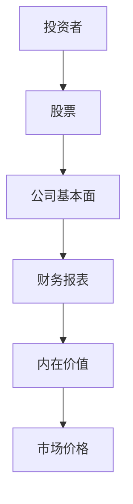
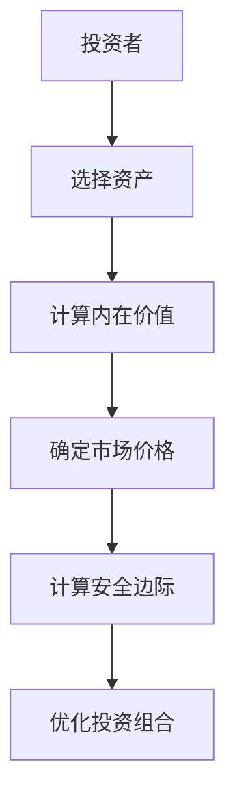
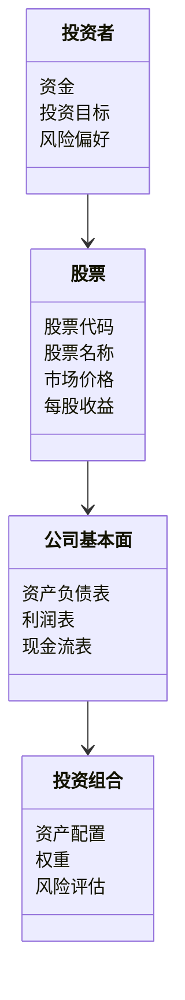
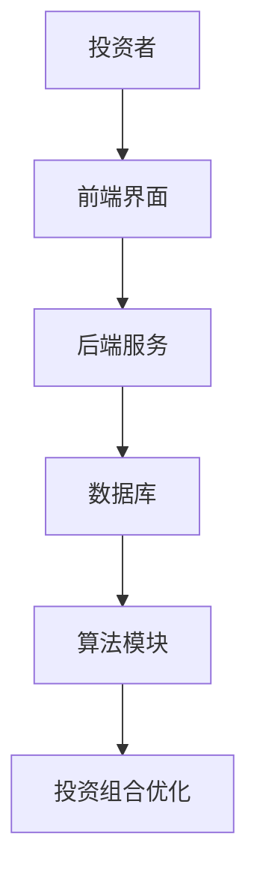
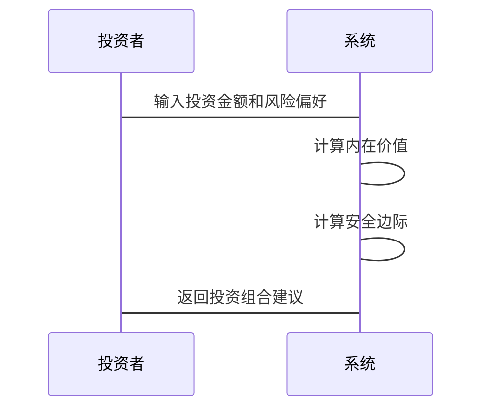

                 


```markdown
# 杰里米格兰瑟姆的长期价值投资

> 关键词：价值投资，长期投资，杰里米格兰瑟姆，内在价值，安全边际，投资策略，基本面分析

> 摘要：杰里米格兰瑟姆的长期价值投资是一种基于基本面分析的投资策略，强调长期持有优质资产，注重安全边际和内在价值。本文将详细阐述长期价值投资的核心理念、数学模型、算法原理以及在实际投资中的应用，帮助读者全面理解这一投资策略的精髓。

---

# 第一部分: 长期价值投资的背景与核心概念

## 第1章: 长期价值投资的定义与背景

### 1.1 长期价值投资的定义
#### 1.1.1 价值投资的核心理念
- 价值投资是一种以低于内在价值的价格买入优质资产的投资策略。
- 强调安全边际：买入价格低于内在价值，确保投资的安全性。
- 长期持有：通过时间的推移，内在价值逐步转化为市场价值。

#### 1.1.2 长期投资的策略特点
- 长期投资强调 patience，而非短期波动。
- 通过复利效应实现财富增长。
- 避免频繁交易，降低交易成本和税务负担。

#### 1.1.3 格兰瑟姆投资体系的形成与发展
- 格兰瑟姆是价值投资的鼻祖，其理论奠定了现代价值投资的基础。
- 格兰瑟姆的投资理念强调“以合理的价格买入优质的资产”，并长期持有。

### 1.2 价值投资与其它投资策略的对比
#### 1.2.1 价值投资与成长投资的区别
- 价值投资注重内在价值，寻找被市场低估的资产。
- 成长投资关注高增长的公司，愿意为未来的增长支付较高的价格。

#### 1.2.2 价值投资与趋势投资的差异
- 价值投资基于基本面分析，寻找被市场错估的资产。
- 趋势投资基于技术分析，关注价格走势和市场趋势。

#### 1.2.3 价值投资与技术分析的对比
- 价值投资强调内在价值，技术分析关注价格走势。
- 价值投资是自下而上的分析，技术分析是自上而下的分析。

### 1.3 长期价值投资的适用场景
#### 1.3.1 长期价值投资的市场环境
- 稳定的市场环境，避免频繁的市场波动。
- 经济周期中的衰退期或复苏期，寻找被低估的资产。

#### 1.3.2 不同经济周期下的投资策略
- 经济繁荣期：寻找具有竞争优势的公司。
- 经济衰退期：寻找被市场低估的优质资产。

#### 1.3.3 长期价值投资的局限性
- 短期市场波动可能会影响投资收益。
- 需要较长的时间才能看到投资回报。

### 1.4 本章小结
- 本章介绍了长期价值投资的核心理念、策略特点以及与其它投资策略的区别。
- 强调了长期价值投资的适用场景和局限性。

---

## 第2章: 价值投资的核心理论

### 2.1 格兰瑟姆的价值投资理论
#### 2.1.1 格兰瑟姆的投资理念
- 买入低于内在价值的资产，长期持有。
- 强调安全边际，避免过度支付。

#### 2.1.2 安全边际的概念与计算
- 安全边际 = 内在价值 - 市场价格。
- 计算公式：$$安全边际 = 内在价值 - 市场价格$$

#### 2.1.3 内在价值的评估方法
- 内在价值是未来现金流的现值。
- 计算公式：$$内在价值 = \sum_{t=1}^{\infty} \frac{CF_t}{(1 + r)^t}$$
- 其中，\(CF_t\) 为第 \(t\) 年的现金流，\(r\) 为折现率。

#### 2.1.4 市盈率与市净率的对比
- 市盈率：$$市盈率 = \frac{股价}{每股收益}$$
- 市净率：$$市净率 = \frac{股价}{每股净资产}$$

### 2.2 长期投资的核心原则
#### 2.2.1 长期投资的纪律性
- 避免情绪化交易，坚持长期持有。
- 遵守投资纪律，严格执行投资策略。

#### 2.2.2 风险控制的重要性
- 通过分散投资降低风险。
- 保持足够的安全边际，避免过度投资。

#### 2.2.3 投资组合的分散化策略
- 将资金分散投资于不同行业和资产类别。
- 通过分散化降低特定资产的风险。

### 2.3 价值投资的决策框架
#### 2.3.1 基本面分析的核心要素
- 公司财务状况：包括资产负债表、利润表和现金流。
- 行业地位：公司是否具有竞争优势。
- 管理团队：公司管理层的能力和稳定性。

#### 2.3.2 财务报表分析的关键指标
- 净利润：$$净利润 = 收入 - 成本 - 费用$$
- 净资产收益率：$$ROE = \frac{净利润}{净资产}$$
- 偿债能力：$$负债率 = \frac{总负债}{总资产}$$

#### 2.3.3 行业分析与竞争优势评估
- 行业生命周期：处于成熟期还是衰退期。
- 市场地位：是否是行业龙头。
- 竞争优势：是否具有独特的竞争优势。

### 2.4 核心概念对比表格
#### 2.4.1 价值投资与成长投资对比表

| 对比维度 | 价值投资 | 成长投资 |
|----------|----------|----------|
| 投资目标 | 买入低估资产 | 买入高增长资产 |
| 估值方法 | 市盈率、市净率 | 市盈率、市净率 |
| 风险偏好 | 低风险 | 高风险 |

#### 2.4.2 长期投资与短期投资对比表

| 对比维度 | 长期投资 | 短期投资 |
|----------|----------|----------|
| 投资期限 | 5年以上 | 1年以内 |
| 投资目标 | 资本增值 | 资本增值 |
| 风险控制 | 较低 | 较高 |

#### 2.4.3 格兰瑟姆模型与其它价值评估模型对比

| 模型名称 | 格兰瑟姆模型 | 多因素模型 | 股权自由现金流模型 |
|----------|--------------|------------|---------------------|
| 核心假设 | 现金流折现 | 多因素分析 | 自由现金流折现 |
| 适用场景 | 价值投资 | 成长投资 | 成熟企业 |

### 2.5 ER实体关系图


### 2.6 本章小结
- 本章详细介绍了格兰瑟姆的价值投资理论，包括安全边际、内在价值和财务报表分析。
- 通过对比表格和ER图，帮助读者更好地理解价值投资的核心概念。

---

## 第3章: 价值投资的数学模型与算法原理

### 3.1 内在价值的计算公式
#### 3.1.1 格兰瑟姆模型的数学表达
$$内在价值 = \sum_{t=1}^{\infty} \frac{CF_t}{(1 + r)^t}$$
- 其中，\(CF_t\) 为第 \(t\) 年的现金流，\(r\) 为折现率。

#### 3.1.2 市盈率与市净率的计算
- 市盈率：$$市盈率 = \frac{股价}{每股收益}$$
- 市净率：$$市净率 = \frac{股价}{每股净资产}$$

### 3.2 安全边际的计算方法
#### 3.2.1 安全边际的公式
$$安全边际 = 内在价值 - 市场价格$$

#### 3.2.2 安全边际的计算步骤
1. 计算内在价值。
2. 找出市场价格。
3. 计算安全边际。

### 3.3 投资组合的优化算法
#### 3.3.1 投资组合优化的数学模型
$$最大化收益 = \sum_{i=1}^{n} w_i r_i - \lambda \sum_{i=1}^{n} w_i^2$$
- 其中，\(w_i\) 为第 \(i\) 资产的权重，\(r_i\) 为第 \(i\) 资产的预期收益率，\(\lambda\) 为风险厌恶系数。

#### 3.3.2 风险控制的算法实现
```python
def calculate_risk(weights, covariance_matrix):
    portfolio_variance = np.dot(weights.T, np.dot(covariance_matrix, weights))
    return np.sqrt(portfolio_variance)
```

### 3.4 算法原理的图解


### 3.5 本章小结
- 本章详细介绍了价值投资的数学模型和算法原理。
- 通过公式和代码示例，帮助读者理解内在价值和安全边际的计算方法。

---

## 第4章: 系统分析与架构设计

### 4.1 问题场景介绍
#### 4.1.1 投资目标
- 实现长期资本增值。
- 通过价值投资策略选择优质资产。

#### 4.1.2 项目介绍
- 开发一个基于价值投资策略的投资管理系统。
- 实现内在价值计算、安全边际评估和投资组合优化功能。

### 4.2 系统功能设计
#### 4.2.1 领域模型


#### 4.2.2 系统架构设计


#### 4.2.3 系统接口设计
- 前端接口：用户输入投资金额和风险偏好。
- 后端接口：计算内在价值、安全边际和投资组合。

#### 4.2.4 系统交互流程


### 4.3 本章小结
- 本章介绍了系统分析与架构设计。
- 通过领域模型和架构图，帮助读者理解投资管理系统的核心组成部分。

---

## 第5章: 项目实战

### 5.1 环境安装
- 安装Python和相关库（如numpy、pandas）。
- 安装Jupyter Notebook用于数据分析和可视化。

### 5.2 核心实现
#### 5.2.1 内在价值计算
```python
import numpy as np

def calculate_intrinsic_value(cash_flows, discount_rate):
    return np.sum(cash_flows / (1 + discount_rate) ** np.arange(len(cash_flows)))
```

#### 5.2.2 安全边际计算
```python
def calculate_margin_of_safety(intrinsic_value, market_price):
    return intrinsic_value - market_price
```

#### 5.2.3 投资组合优化
```python
import numpy as np

def optimize_portfolio(weights, covariance_matrix):
    portfolio_variance = np.dot(weights.T, np.dot(covariance_matrix, weights))
    return np.sqrt(portfolio_variance)
```

### 5.3 案例分析
#### 5.3.1 案例背景
- 某公司的财务数据和市场数据。

#### 5.3.2 数据分析
- 计算内在价值和安全边际。
- 优化投资组合。

#### 5.3.3 结果展示
- 内在价值计算结果。
- 安全边际计算结果。
- 投资组合优化结果。

### 5.4 本章小结
- 本章通过实际案例展示了价值投资策略的应用。
- 通过代码实现，帮助读者理解理论在实践中的应用。

---

## 第6章: 最佳实践与小结

### 6.1 最佳实践 tips
- 长期投资需要耐心和纪律。
- 选择优质资产，注重安全边际。
- 定期审视投资组合，及时调整。

### 6.2 小结
- 本文详细介绍了杰里米格兰瑟姆的长期价值投资策略。
- 通过数学模型、算法原理和实际案例，帮助读者全面理解这一投资策略。

### 6.3 注意事项
- 避免情绪化交易，坚持长期持有。
- 定期审视投资组合，及时调整。

### 6.4 拓展阅读
- 格兰瑟姆的《The Intelligent Investor》。
- 其他价值投资的经典著作。

---

# 作者：AI天才研究院/AI Genius Institute & 禅与计算机程序设计艺术 /Zen And The Art of Computer Programming
```

