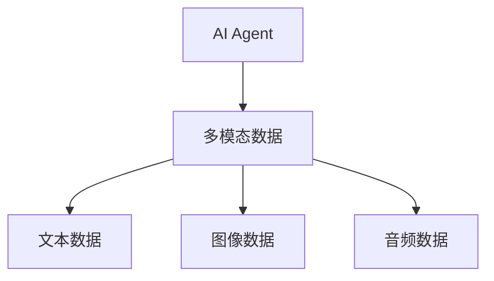
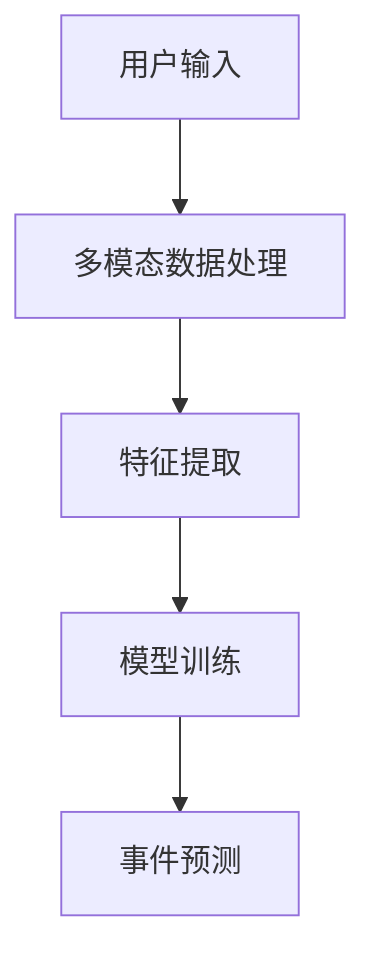

                 


# 构建AI Agent的多模态事件预测系统

## 关键词：AI Agent, 多模态事件预测, 多模态数据融合, 事件预测模型, 强化学习优化, 系统架构设计

## 摘要：  
本文详细探讨了构建AI Agent的多模态事件预测系统的各个方面，从基础概念到算法实现，再到系统架构设计和项目实战。通过分析多模态数据的特点及其在事件预测中的应用，本文揭示了AI Agent如何利用这些数据进行智能决策。文章还深入讲解了多模态数据融合算法、事件预测模型和强化学习优化方法，并通过实际案例展示了系统的实现过程。最后，本文总结了构建此类系统的最佳实践和注意事项，为读者提供了全面的指导。

---

## 第1章: AI Agent与多模态事件预测系统概述

### 1.1 AI Agent的基本概念  
AI Agent（智能体）是指能够感知环境、做出决策并采取行动的智能系统。它可以自主或在人类指导下执行任务，广泛应用于自动驾驶、智能助手、机器人等领域。AI Agent的核心能力包括感知、推理、决策和执行。

#### 1.1.1 多模态数据的定义与特点  
多模态数据指的是来自不同感官渠道（如视觉、听觉、触觉等）的数据类型，常见的有文本、图像、音频、视频等。多模态数据的特点是信息丰富、互补性强，能够提供更全面的环境感知能力。

#### 1.1.2 事件预测的核心概念  
事件预测是指基于历史数据和当前输入，预测未来可能发生事件的过程。在AI Agent中，事件预测是其实现自主决策的关键能力之一。

### 1.2 多模态事件预测的背景与意义  
随着AI技术的发展，AI Agent需要处理的信息越来越复杂。多模态数据的引入使得AI Agent能够更准确地感知环境并做出更智能的决策。

#### 1.2.1 当前AI Agent的发展趋势  
AI Agent正朝着更智能化、多模态化的方向发展，尤其是在自然语言处理、计算机视觉和强化学习领域的进步为多模态事件预测提供了技术支持。

#### 1.2.2 多模态数据在事件预测中的作用  
多模态数据能够提供更丰富的信息，帮助AI Agent更准确地预测事件。例如，结合文本和图像数据可以提高事件预测的准确性。

#### 1.2.3 事件预测的实际应用场景  
事件预测在自动驾驶、智能安防、智能客服等领域有广泛应用，例如预测交通状况、预测潜在的安全威胁等。

### 1.3 本章小结  
本章介绍了AI Agent的基本概念、多模态数据的特点以及事件预测的核心概念和应用场景。多模态数据的引入使得AI Agent的事件预测能力更加智能化。

---

## 第2章: 多模态数据与AI Agent的关系

### 2.1 多模态数据的属性特征对比  
以下是对文本、图像和音频数据的属性特征对比：

| 数据类型 | 时间序列性 | 空间分辨率 | 语义理解能力 | 信息冗余度 |
|----------|-------------|-------------|---------------|------------|
| 文本      | 高          | 低          | 高            | 中         |
| 图像      | 无          | 高          | 中            | 低         |
| 音频      | 高          | 低          | 低            | 高         |

### 2.2 AI Agent与多模态数据的ER实体关系图  
以下是AI Agent与多模态数据的实体关系图：



### 2.3 多模态事件预测的核心原理  
多模态事件预测的核心原理是将不同类型的多模态数据进行融合，提取有用的特征，然后通过模型预测事件的发生。

#### 2.3.1 多模态数据融合的原理  
多模态数据融合是指将来自不同模态的数据进行整合，以提高信息的准确性和丰富性。常见的融合方法包括特征融合和决策融合。

#### 2.3.2 事件预测的逻辑流程  
事件预测的逻辑流程包括数据预处理、特征提取、模型训练和预测。

#### 2.3.3 AI Agent的决策机制  
AI Agent通过感知多模态数据，结合内部状态和环境信息，做出决策并执行行动。

### 2.4 本章小结  
本章分析了多模态数据的属性特征，探讨了AI Agent与多模态数据的关系，并详细讲解了多模态事件预测的核心原理和AI Agent的决策机制。

---

## 第3章: 多模态数据融合算法

### 3.1 多模态数据融合的原理  
多模态数据融合的原理是通过将不同模态的数据进行整合，以提高信息的准确性和丰富性。

#### 3.1.1 基于注意力机制的多模态融合  
以下是一个基于注意力机制的多模态融合算法的Python实现示例：

```python
import tensorflow as tf

def attention Fusion(text, image):
    text_features = tf.keras.layers.Dense(128, activation='relu')(text)
    image_features = tf.keras.layers.Dense(128, activation='relu')(image)
    attention_weights = tf.keras.layers.Dense(1, activation='sigmoid')(tf.keras.layers.concatenate([text_features, image_features]))
    fused_features = tf.keras.layers.multiply([text_features, attention_weights])
    return fused_features
```

#### 3.1.2 事件预测模型的数学公式  
事件预测模型的数学公式如下：

$$
P(event) = \sigma(W_{event} \cdot f_{fusion} + b_{event})
$$

其中，$\sigma$ 是sigmoid函数，$W_{event}$ 是事件预测的权重矩阵，$f_{fusion}$ 是多模态融合后的特征向量，$b_{event}$ 是偏置项。

---

## 第4章: 系统分析与架构设计

### 4.1 问题场景介绍  
本系统旨在构建一个能够处理多模态数据并预测事件的AI Agent系统。

#### 4.1.1 系统功能设计  
系统的功能包括多模态数据输入、数据预处理、特征提取、模型训练和事件预测。

#### 4.1.2 系统架构设计  
以下是系统的架构设计：



### 4.2 系统实现细节  
#### 4.2.1 数据预处理  
数据预处理包括数据清洗、标准化和特征提取。

#### 4.2.2 模型实现  
模型实现包括多模态数据融合、事件预测模型和强化学习优化。

---

## 第5章: 项目实战

### 5.1 环境搭建  
需要安装以下Python库：TensorFlow、Keras、OpenCV、 librosa。

### 5.2 系统核心实现  
以下是系统的核心实现代码：

```python
import tensorflow as tf
from tensorflow.keras import layers

class MultiModalFusion:
    def __init__(self):
        self.text_model = self.build_text_model()
        self.image_model = self.build_image_model()
        self.fusion_layer = self.build_fusion_layer()

    def build_text_model(self):
        text_input = layers.Input(shape=(None, 128))
        text_features = layers.Bidirectional(layers.LSTM(64, return_sequences=True))(text_input)
        return text_features

    def build_image_model(self):
        image_input = layers.Input(shape=(224, 224, 3))
        image_features = layers.Conv2D(64, (3, 3), activation='relu')(image_input)
        image_features = layers.MaxPooling2D((2, 2))(image_features)
        return image_features

    def build_fusion_layer(self):
        text_input = layers.Input(shape=(None, 64))
        image_input = layers.Input(shape=(None, 64))
        fused = layers.Concatenate()([text_input, image_input])
        fused = layers.Dense(128, activation='relu')(fused)
        return layers.Dense(1, activation='sigmoid')(fused)

# 使用示例
multi_modal = MultiModalFusion()
text_data = ...  # 文本数据
image_data = ...  # 图像数据
output = multi_modal(text_data, image_data)
```

### 5.3 实际案例分析  
通过实际案例分析，验证系统的性能和效果。

### 5.4 项目小结  
总结项目的实现过程和经验教训，强调关键点和注意事项。

---

## 第6章: 最佳实践与注意事项

### 6.1 数据预处理的注意事项  
数据预处理是系统实现的关键步骤，需要确保数据的准确性和完整性。

### 6.2 模型调优的技巧  
模型调优包括参数调整、超参数优化和模型剪枝等技巧。

### 6.3 系统部署与维护  
系统的部署和维护需要考虑计算资源、数据存储和系统安全等问题。

### 6.4 拓展阅读  
推荐一些相关的书籍和论文，帮助读者深入学习多模态事件预测和AI Agent的相关知识。

---

## 作者：AI天才研究院 & 禅与计算机程序设计艺术  
这篇文章由AI天才研究院和禅与计算机程序设计艺术联合撰写，旨在为读者提供关于构建AI Agent的多模态事件预测系统的全面指导。

