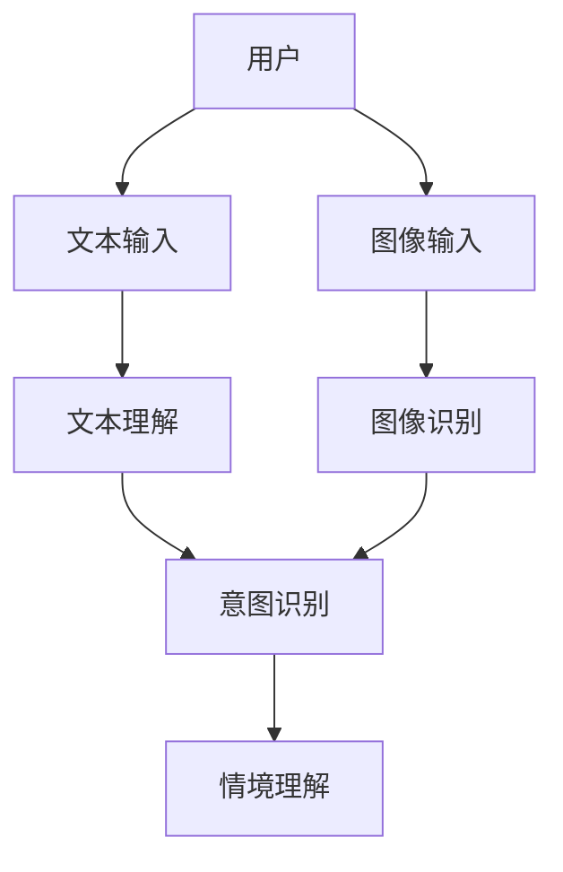
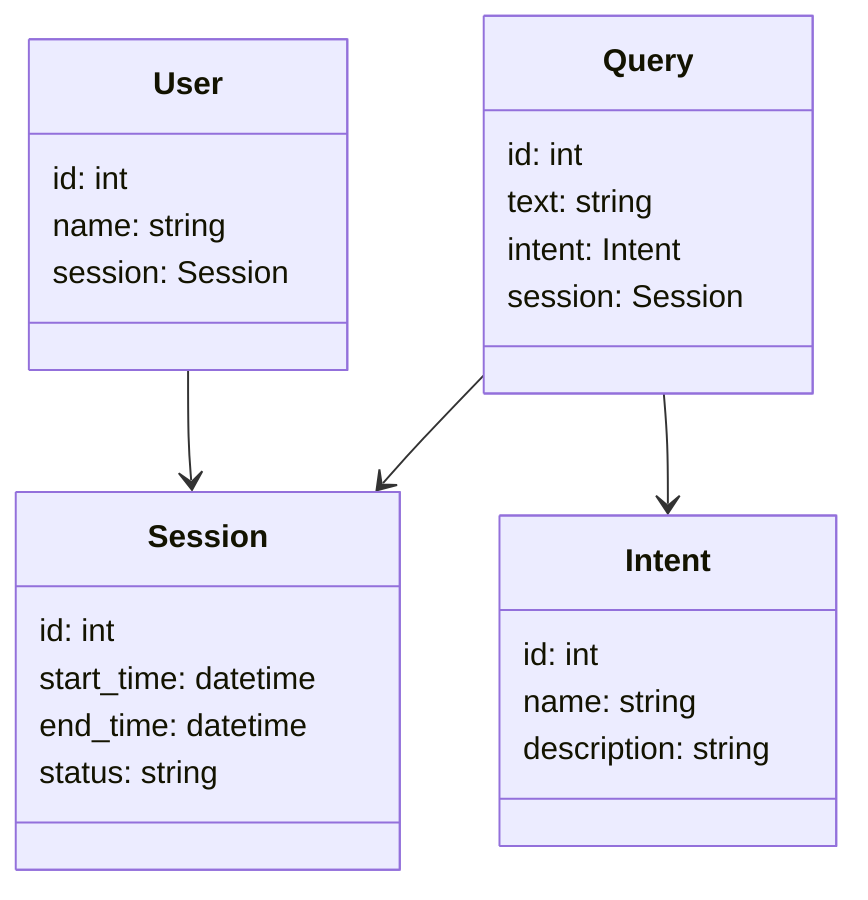
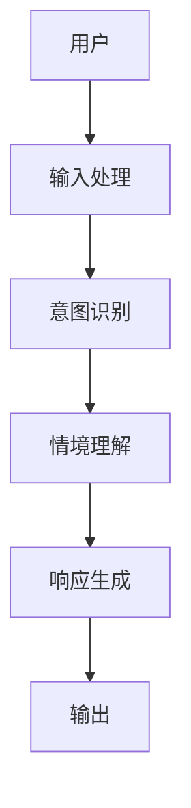
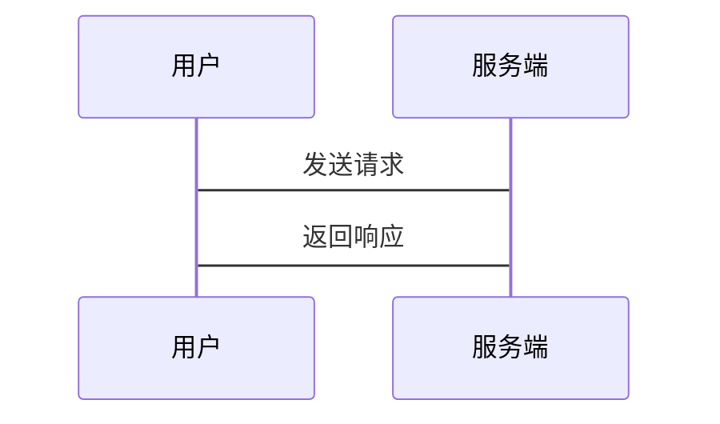

                 


# 《构建AI Agent的多模态情境理解系统》

> 关键词：AI Agent, 多模态情境理解, 意图识别, 多模态数据融合, 情境理解系统, 实时性优化

> 摘要：本文详细探讨了构建AI Agent的多模态情境理解系统的各个方面，从基础概念到算法原理，再到系统架构和项目实战，旨在为读者提供全面的技术指导。文章首先介绍了AI Agent和多模态情境理解的基本概念，随后深入分析了多模态数据的表示方法和融合策略，详细讲解了多模态情境理解的算法原理，包括注意力机制和融合方法。接着，文章探讨了系统架构设计，包括功能模块划分和接口设计。最后，通过一个实际项目案例，展示了如何将理论应用于实践，确保系统在实际场景中的高效运行和优化。

---

## 第一章: AI Agent与多模态情境理解概述

### 1.1 AI Agent的基本概念
#### 1.1.1 AI Agent的定义与特点
AI Agent（人工智能代理）是指能够感知环境并采取行动以实现目标的智能实体。其特点包括自主性、反应性、目标导向性和学习能力。AI Agent可以是软件程序、机器人或其他智能系统，能够执行复杂任务，如信息处理、决策制定和与人类交互。

#### 1.1.2 多模态情境理解的背景与意义
多模态情境理解是指AI Agent能够同时处理多种类型的数据（如文本、图像、语音等），并根据上下文信息理解当前情境。其意义在于提升AI Agent的智能水平，使其能够更自然地与人类交互，并在复杂环境中做出准确的决策。

#### 1.1.3 多模态情境理解的应用场景
多模态情境理解广泛应用于多个领域，如智能客服、自动驾驶、智能家居和医疗辅助诊断等。例如，在智能客服中，AI Agent需要理解用户的问题，结合上下文信息提供准确的解答。

### 1.2 多模态数据的类型与特点
#### 1.2.1 文本数据
文本数据是最常见的模态之一，包括自然语言文本和结构化数据。文本数据的处理需要自然语言处理（NLP）技术，如分词、句法分析和情感分析。

#### 1.2.2 图像数据
图像数据是视觉信息的载体，包括照片、图表和图形。图像数据的处理需要计算机视觉技术，如目标检测和图像分割。

#### 1.2.3 语音数据
语音数据是音频信息的载体，包括说话人的声音和语调。语音数据的处理需要语音识别和语音合成技术。

#### 1.2.4 其他模态数据（如视频、传感器数据等）
视频数据结合了图像和语音的特点，传感器数据则包括温度、湿度等物理环境信息。

### 1.3 多模态情境理解的核心问题
#### 1.3.1 模态间信息融合的挑战
不同模态的数据具有不同的特征和表示方式，如何有效地将它们融合起来是一个挑战。

#### 1.3.2 情境理解的不确定性与多样性
情境理解需要处理多种不确定性，如数据的不完整性和环境的动态变化。

#### 1.3.3 系统实时性与计算效率的平衡
在实时应用场景中，系统需要在有限的时间内完成复杂的计算任务，这对计算效率提出了高要求。

---

## 第二章: 多模态情境理解的核心概念与联系

### 2.1 多模态数据的表示方法
#### 2.1.1 向量空间模型
向量空间模型将数据表示为向量，其中每个维度对应一个特征。例如，在文本处理中，词袋模型和词嵌入技术（如Word2Vec）常用于构建向量表示。

#### 2.1.2 图结构表示
图结构表示通过节点和边来描述数据之间的关系。例如，在知识图谱中，实体和关系可以用图结构表示。

#### 2.1.3 深度学习中的嵌入表示
深度学习模型（如卷积神经网络和循环神经网络）能够学习数据的高层次特征，并将其表示为低维嵌入向量。

### 2.2 多模态融合的策略与方法
#### 2.2.1 晚期融合与早期融合的对比
晚期融合将不同模态的数据分别处理后，再进行融合；早期融合则在特征提取阶段就进行跨模态的信息整合。

#### 2.2.2 模态权重的动态调整
模态权重可以根据任务需求和数据的重要性进行动态调整，以优化融合效果。

#### 2.2.3 跨模态注意力机制
跨模态注意力机制允许模型在不同模态之间分配注意力权重，从而更好地捕捉跨模态的相关性。

### 2.3 多模态情境理解的实体关系图
#### 2.3.1 实体关系的Mermaid流程图


---

## 第三章: 多模态情境理解的算法原理

### 3.1 多模态数据融合的算法
#### 3.1.1 多模态注意力网络（MMAN）
MMAN是一种基于注意力机制的多模态融合算法，能够同时捕捉模态内部和模态之间的相关性。

#### 3.1.2 多模态变换器（MM Transformer）
多模态变换器通过将不同模态的数据转换为统一的表示形式，并利用自注意力机制进行融合。

#### 3.1.3 多模态对比学习（MMCL）
多模态对比学习通过对比不同模态的数据，学习其共享特征和独特特征。

### 3.2 多模态情境理解的算法实现
#### 3.2.1 基于Transformer的多模态融合
```python
import torch
import torch.nn as nn

class MultiModalAttention(nn.Module):
    def __init__(self, embed_dim, num_heads):
        super().__init__()
        self.embed_dim = embed_dim
        self.num_heads = num_heads
        self.head_size = embed_dim // num_heads
        self.query = nn.Linear(embed_dim, embed_dim)
        self.key = nn.Linear(embed_dim, embed_dim)
        self.value = nn.Linear(embed_dim, embed_dim)
        self.dropout = nn.Dropout(0.1)

    def forward(self, x, mask=None):
        batch_size, _, embed_dim = x.size()
        head_size = self.head_size
        num_heads = self.num_heads

        q = self.query(x)
        k = self.key(x)
        v = self.value(x)

        q = q.view(batch_size, -1, num_heads, head_size)
        k = k.view(batch_size, -1, num_heads, head_size)
        v = v.view(batch_size, -1, num_heads, head_size)

        q = q.permute(0, 2, 1, 3)
        k = k.permute(0, 2, 1, 3)
        v = v.permute(0, 2, 1, 3)

        attn_weights = (q @ k.transpose(-2, -1)) * (1 / torch.sqrt(torch.tensor(head_size)))
        if mask is not None:
            attn_weights = attn_weights.masked_fill(mask == 0, -1e9)
        attn_weights = nn.Softmax(dim=-1)(attn_weights)
        attn_output = attn_weights @ v
        attn_output = attn_output.permute(0, 2, 1, 3).contiguous()
        attn_output = attn_output.view(batch_size, -1, embed_dim)

        return attn_output
```

---

## 第四章: 情境理解和意图识别

### 4.1 情境理解的算法实现
#### 4.1.1 基于上下文的意图识别
意图识别需要结合上下文信息，以提高识别的准确性。例如，在智能客服中，用户的问题可能与之前的对话内容相关。

#### 4.1.2 多模态意图识别模型
多模态意图识别模型结合了文本和图像信息，能够更准确地识别用户的意图。

### 4.2 意图识别的算法实现
#### 4.2.1 基于Transformer的意图识别
```python
import torch
import torch.nn as nn

class IntentClassifier(nn.Module):
    def __init__(self, input_dim, hidden_dim, output_dim):
        super().__init__()
        self.fc1 = nn.Linear(input_dim, hidden_dim)
        self.fc2 = nn.Linear(hidden_dim, output_dim)
        self.dropout = nn.Dropout(0.2)
        self.relu = nn.ReLU()

    def forward(self, x):
        x = self.fc1(x)
        x = self.relu(x)
        x = self.dropout(x)
        x = self.fc2(x)
        return x
```

---

## 第五章: 系统分析与架构设计方案

### 5.1 问题场景介绍
本章以一个多模态客服系统为例，介绍系统的需求分析和功能设计。

### 5.2 系统功能设计
#### 5.2.1 领域模型设计


### 5.3 系统架构设计
#### 5.3.1 系统架构图


### 5.4 系统接口设计
#### 5.4.1 接口设计
系统提供RESTful API接口，用于处理用户的输入和返回结果。

#### 5.4.2 交互图


---

## 第六章: 项目实战——构建一个多模态客服系统

### 6.1 环境安装
#### 6.1.1 安装依赖
```bash
pip install torch transformers mermaid4jupyter
```

### 6.2 系统核心实现
#### 6.2.1 数据预处理
```python
import pandas as pd

def preprocess_data(data):
    # 数据清洗和转换
    df = pd.DataFrame(data)
    df['text'] = df['text'].apply(lambda x: x.lower())
    return df
```

#### 6.2.2 模型训练
```python
import torch
import torch.nn as nn

class MultiModalModel(nn.Module):
    def __init__(self, vocab_size, embed_dim, num_heads, output_dim):
        super().__init__()
        self.embedding = nn.Embedding(vocab_size, embed_dim)
        self.attention = MultiModalAttention(embed_dim, num_heads)
        self.fc = nn.Linear(embed_dim, output_dim)
        self.dropout = nn.Dropout(0.2)

    def forward(self, input_ids, attention_mask=None):
        embeddings = self.embedding(input_ids)
        attn_output = self.attention(embeddings, attention_mask)
        output = self.fc(attn_output)
        return output

model = MultiModalModel(vocab_size, embed_dim, num_heads, output_dim)
criterion = nn.CrossEntropyLoss()
optimizer = torch.optim.Adam(model.parameters(), lr=0.001)
```

### 6.3 系统集成与优化
#### 6.3.1 系统集成
将训练好的模型部署到实际场景中，集成到客服系统中。

#### 6.3.2 系统优化
优化系统的实时性和准确性，如通过减少模型参数和优化算法加速推理。

---

## 第七章: 总结与展望

### 7.1 系统总结
本章总结了构建AI Agent的多模态情境理解系统的整体框架和实现过程，强调了多模态数据融合和意图识别的重要性。

### 7.2 未来展望
未来的发展方向包括更高效的融合算法、更强大的模型架构以及更广泛的应用场景。

### 7.3 最佳实践 Tips
- 在处理多模态数据时，需要充分考虑不同模态的特点和关联性。
- 系统优化需要从算法、硬件和数据预处理等多个方面入手。
- 在实际应用中，需要根据具体需求选择合适的算法和模型。

---

## 作者：AI天才研究院 & 禅与计算机程序设计艺术

---

**注：** 由于篇幅限制，以上仅为部分内容。完整文章将详细展开每个部分的内容，包括更多的算法实现、代码示例和实际案例分析。

