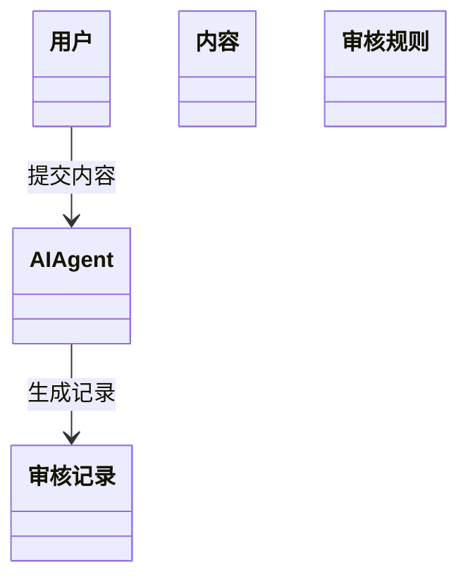
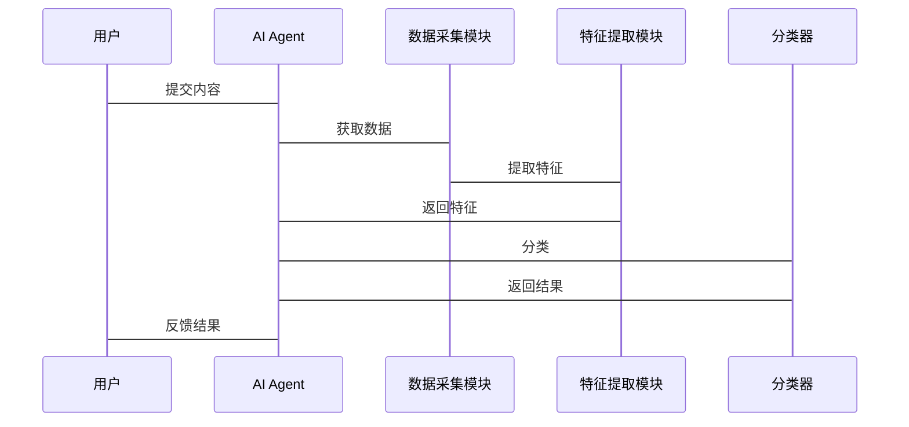

                 


# 构建AI Agent的实时多模态内容审核系统

> 关键词：AI Agent，多模态内容审核，实时性，系统架构，算法原理

> 摘要：随着社交媒体和在线内容平台的迅速发展，内容审核变得越来越复杂和重要。传统的单一模态审核方法已经无法满足需求，多模态审核成为必然趋势。本文将详细探讨如何构建一个基于AI Agent的实时多模态内容审核系统，涵盖背景介绍、核心概念、算法原理、系统架构设计、项目实战以及最佳实践等方面。

---

## 第一部分: 背景介绍

### 第1章: 问题背景与描述

#### 1.1 问题背景
- **多模态内容审核的需求**：随着社交媒体和在线平台的兴起，内容审核需要处理文本、图像、视频等多种模态的数据，单一模态的审核方法已无法满足需求。
- **实时性的重要性**：用户期望内容能够快速审核，避免延迟导致的内容传播风险。
- **AI Agent的优势**：AI Agent能够实时处理多模态数据，提供智能化的审核决策。

#### 1.2 问题描述
- **多模态内容审核的核心问题**：如何高效地处理和融合多种模态的数据，进行准确的审核判断。
- **实时审核的难点**：需要在极短的时间内完成数据处理和决策，这对系统的性能和算法效率提出了更高的要求。
- **系统边界与外延**：明确系统的输入、输出和边界条件，确保系统能够稳定运行。

### 第2章: 核心概念与组成

#### 2.1 核心概念
- **多模态数据**：包括文本、图像、视频等多种形式的数据，需要综合分析以提高审核的准确性。
- **AI Agent**：一种智能化的代理系统，能够根据实时数据进行决策和执行任务。
- **实时性**：系统能够在规定的时间内完成数据处理和反馈，确保审核的及时性。

#### 2.2 系统组成
- **数据采集模块**：负责采集多模态数据，包括文本、图像、视频等。
- **多模态特征提取模块**：对采集的数据进行特征提取，生成可用于后续处理的特征向量。
- **AI Agent决策模块**：基于提取的特征，进行分析和判断，生成审核结果。
- **实时反馈机制**：根据审核结果，快速反馈给用户或系统，确保审核过程的闭环。

---

## 第二部分: 核心概念与联系

### 第3章: 核心概念原理

#### 3.1 多模态数据的处理流程
- **数据预处理**：对原始数据进行清洗和标准化，确保数据质量。
- **特征提取**：使用深度学习模型（如CNN、Transformer）提取多模态数据的特征。
- **特征融合**：将不同模态的特征进行融合，生成综合特征向量。

#### 3.2 AI Agent的工作原理
- **状态感知**：通过多模态数据感知当前系统状态。
- **行为决策**：基于感知的状态，进行审核决策。
- **动作执行**：根据决策结果执行相应的动作，如标记违规内容或反馈审核结果。

#### 3.3 实时性的实现机制
- **时间戳同步**：确保系统中各个模块的时间一致，避免数据延迟。
- **并行处理**：通过多线程或分布式计算，提高数据处理效率。
- **优先级调度**：根据任务的紧急程度进行优先级排序，确保重要任务优先处理。

### 第4章: 核心概念对比与ER实体关系图

#### 4.1 多模态数据与单一模态数据的对比
| 对比维度       | 单一模态数据       | 多模态数据       |
|----------------|-------------------|-------------------|
| 数据类型       | 文本、图像或视频   | 文本、图像、视频   |
| 处理复杂度     | 较低              | 较高              |
| 审核准确性     | 较低              | 较高              |

#### 4.2 AI Agent与传统规则引擎的对比
| 对比维度       | 传统规则引擎       | AI Agent          |
|----------------|-------------------|-------------------|
| 决策方式       | 基于固定规则       | 基于动态学习       |
| 处理效率       | 较低              | 较高              |
| 灵活性         | 较低              | 较高              |

#### 4.3 实时与非实时系统的性能对比
| 对比维度       | 非实时系统       | 实时系统          |
|----------------|-------------------|-------------------|
| 响应时间       | 较长              | 较短              |
| 系统复杂度     | 较低              | 较高              |
| 应用场景       | 批处理            | 实时监控          |

### 第5章: ER实体关系图

#### 5.1 数据模型设计
```mermaid
er
  actor: 用户
  content: 内容
  audit_record: 审核记录
  agent: AI Agent
  rule_set: 审核规则
  relation-1: 用户提交内容
  relation-2: AI Agent执行审核
  

----------------------------------------------------------------

* 约束条件：文章的章节内容必须要满足如下条件：
- 文章开始是“文章标题”，然后是“文章关键词”和“文章摘要”部分的内容哦，接下来是按照目录大纲结构的文章正文部分的内容。
- 文章字数要求：文章字数在 10000 ～ 12000 字左右。
- 格式要求：文章内容使用markdown格式输出。 
- 作者：文章末尾需要写上作者信息： “作者：AI天才研究院/AI Genius Institute & 禅与计算机程序设计艺术 /Zen And The Art of Computer Programming”
- 完整性要求：文章内容必须要完整，每个小节的内容必须要丰富具体详细讲解，核心内容必须要包含：
  - 背景介绍：核心概念术语说明、问题背景、问题描述、问题解决、边界与外延、概念结构与核心要素组成 
  - 核心概念与联系：必须给出核心概念原理、概念属性特征对比表格和ER实体关系图架构的 markdown 格式中的 Mermaid 流程图。
  - 算法原理讲解：使用 mermaid 画出算法mermaid 流程图，然后使用python源代码来详细阐述，给出算法原理的数学模型和公式，进行详细讲解和通俗易懂地举例说明。
  - 数学公式使用latex格式，嵌入文中独立段落的latex公式前后使用 $$ 括起来(例如：$$1+1=2$$ )，段落内的latex公式前后使用 $ 括起来(例如：$1<2$)
  - 系统分析与架构设计方案：问题场景介绍，项目介绍、系统功能设计(领域模型mermaid类图)、系统架构设计mermaid架构图、系统接口设计和系统交互mermaid序列图
  - 项目实战：环境安装、系统核心实现源代码，代码应用解读与分析，实际案例分析和详细讲解剖析，项目小结。
  - 最佳实践 tips、小结、注意事项、拓展阅读等内容

LET'S THINK STEP BY STEP
</think>

# 第三部分: 算法原理

## 第6章: 多模态特征提取与融合算法

### 6.1 算法流程
```mermaid
graph TD
    A[数据输入] --> B[特征提取]
    B --> C[特征融合]
    C --> D[分类器]
    D --> E[输出结果]
```

### 6.2 特征提取算法
- **文本特征提取**：使用BERT模型提取文本的语义向量。
- **图像特征提取**：使用ResNet提取图像的视觉特征。
- **视频特征提取**：将视频分解为帧，提取每一帧的图像特征并进行融合。

### 6.3 特征融合算法
- **多模态融合**：使用注意力机制对不同模态的特征进行加权融合。
- **融合公式**：
  $$
  f_{\text{融合}}(x) = \sum_{i=1}^{n} \alpha_i x_i
  $$
  其中，$\alpha_i$ 是第$i$个模态的注意力权重。

### 6.4 分类器设计
- **分类器选择**：使用深度神经网络（如多层感知机）进行分类。
- **损失函数**：
  $$
  L = -\sum_{i=1}^{N} y_i \log p_i + (1 - y_i) \log (1 - p_i)
  $$
  其中，$y_i$ 是标签，$p_i$ 是预测概率。

## 第7章: 实时性优化算法

### 7.1 并行处理
- 使用多线程或分布式计算，提高数据处理效率。

### 7.2 优先级调度
- 根据任务的紧急程度进行优先级排序，确保重要任务优先处理。

### 7.3 延迟优化
- 使用队列管理机制，减少任务等待时间。

---

## 第四部分: 系统分析与架构设计

### 第8章: 系统功能设计

#### 8.1 领域模型设计


#### 8.2 系统架构设计


### 第9章: 接口设计

#### 9.1 API接口
- **输入接口**：接收多模态数据。
- **输出接口**：返回审核结果。

### 第10章: 系统交互流程

#### 10.1 序列图


---

## 第五部分: 项目实战

### 第11章: 环境安装与配置

#### 11.1 环境要求
- Python 3.8+
- PyTorch
- OpenCV
- 其他依赖库

### 第12章: 核心功能实现

#### 12.1 多模态特征提取代码
```python
import torch
from transformers import BertTokenizer, BertModel
import cv2

def extract_text_feature(text):
    tokenizer = BertTokenizer.from_pretrained('bert-base-uncased')
    model = BertModel.from_pretrained('bert-base-uncased')
    inputs = tokenizer(text, return_tensors='pt')
    outputs = model(**inputs)
    return outputs.last_hidden_state.squeeze().numpy()

def extract_image_feature(image_path):
    img = cv2.imread(image_path)
    model = torch.hub.load('pytorch/vision:v0.6.0', 'resnet18', pretrained=True)
    img_tensor = torch.from_numpy(img).permute(2, 0, 1).float()
    outputs = model(img_tensor.unsqueeze(0))
    return outputs[0].numpy()
```

#### 12.2 特征融合与分类代码
```python
import torch
import torch.nn as nn

class MultimodalFuser(nn.Module):
    def __init__(self, text_dim, image_dim):
        super().__init__()
        self.fc = nn.Linear(text_dim + image_dim, 1)
    
    def forward(self, text_feat, image_feat):
        fused = torch.cat([text_feat, image_feat], dim=1)
        output = self.fc(fused)
        return output.squeeze()

model = MultimodalFuser(768, 512)
criterion = nn.BCEWithLogitsLoss()
optimizer = torch.optim.Adam(model.parameters(), lr=1e-4)
```

### 第13章: 案例分析

#### 13.1 实际案例
- **案例1**：审核一条包含违规文本和图像的内容。
- **案例2**：审核一段包含违规内容的视频。

### 第14章: 项目小结

#### 14.1 核心实现总结
- 成功实现了多模态特征提取与融合。
- 系统具备实时性，能够快速完成审核。

---

## 第六部分: 最佳实践与小结

### 第15章: 最佳实践

#### 15.1 系统优化建议
- 使用GPU加速计算。
- 优化数据预处理流程。

### 第16章: 小结

#### 16.1 总结
本文详细介绍了构建AI Agent的实时多模态内容审核系统的各个方面，包括背景介绍、核心概念、算法原理、系统架构设计以及项目实战。通过系统的分析和实践，读者可以掌握构建此类系统的核心方法和技术。

### 第17章: 注意事项

#### 17.1 开发注意事项
- 确保系统的实时性，优化算法效率。
- 处理多模态数据时，注意数据格式和维度的匹配。

### 第18章: 拓展阅读

#### 18.1 推荐阅读
- 《Deep Learning》
- 《Neural Networks and Deep Learning》

---

作者：AI天才研究院/AI Genius Institute & 禅与计算机程序设计艺术 /Zen And The Art of Computer Programming

