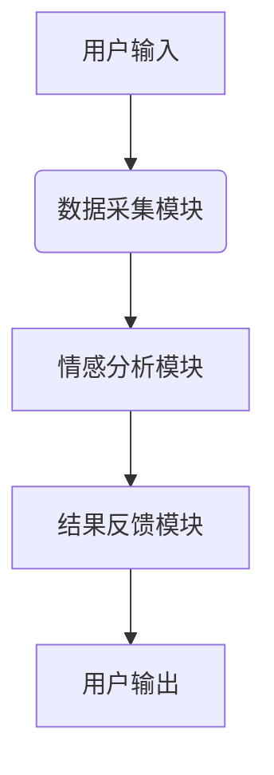
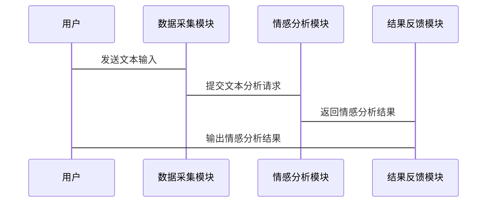

                 


# 构建AI Agent的实时情感分析引擎

## 关键词：AI Agent，实时情感分析，深度学习，自然语言处理，系统架构

## 摘要：  
本文详细探讨了构建AI Agent的实时情感分析引擎的背景、核心技术和系统架构。从情感分析的基本概念到AI Agent的实现原理，再到实时情感分析的算法优化和系统设计，本文为读者提供了一套完整的构建方案。通过结合深度学习和自然语言处理技术，本文提出了高效的实时情感分析引擎设计，为AI Agent在实际应用中的情感交互提供了有力支持。

---

# 第1章: 情感分析与AI Agent概述

## 1.1 情感分析的背景与意义

### 1.1.1 情感分析的定义与应用领域  
情感分析（Sentiment Analysis），又称情绪分析，是一种自然语言处理（NLP）技术，用于判断文本中表达的情感倾向（如正面、负面或中性）。情感分析广泛应用于社交媒体监控、舆情分析、客户反馈分析、智能客服等领域，帮助企业及时了解用户情感动态，优化产品和服务。

### 1.1.2 AI Agent在情感分析中的作用  
AI Agent（人工智能代理）是一种能够感知环境、执行任务并做出决策的智能实体。在情感分析场景中，AI Agent可以实时处理用户输入的情感信息，快速做出情感判断，并根据结果执行相应的操作（如反馈、推荐或报警）。AI Agent的引入使得情感分析从被动的文本处理转变为主动的智能交互。

### 1.1.3 实时情感分析的必要性  
实时情感分析是指在用户输入的瞬间完成情感判断，其优势在于快速响应和低延迟。在实时场景中（如在线客服、社交媒体实时监控等），实时情感分析能够帮助企业第一时间捕捉用户情绪变化，及时采取应对措施，提升用户体验和业务效率。

---

## 1.2 AI Agent的核心概念

### 1.2.1 AI Agent的基本定义  
AI Agent是一种能够感知环境、执行任务并做出决策的智能系统。它通常由感知模块（输入处理）、推理模块（逻辑分析）和行动模块（输出执行）组成。AI Agent可以是软件程序、机器人或其他智能设备。

### 1.2.2 AI Agent的分类与特点  
AI Agent可以根据智能水平分为简单反应式Agent、基于模型的反射式Agent和完全自治式Agent。简单反应式Agent仅根据当前输入做出反应；基于模型的反射式Agent具有内部状态和目标，能够根据历史信息做出决策；完全自治式Agent则具备自主学习和优化能力。

### 1.2.3 AI Agent与情感分析的结合  
AI Agent可以集成情感分析功能，使其具备情感理解能力。通过实时情感分析，AI Agent能够理解用户输入的情感倾向，并根据情感结果执行相应的操作。例如，在智能客服场景中，AI Agent可以实时分析用户情绪，调整回答语气，提升用户满意度。

---

## 1.3 本章小结  
本章介绍了情感分析的背景与意义，详细阐述了AI Agent的核心概念和其在情感分析中的作用。通过对比不同类型的AI Agent，明确了实时情感分析的重要性和必要性。

---

# 第2章: 情感分析的实现原理

## 2.1 情感分析的流程

### 2.1.1 数据预处理  
数据预处理是情感分析的关键步骤，包括文本清洗、分词、停用词去除和词干提取。例如，将“amazing”还原为“amaze”，以减少词汇变体的影响。

### 2.1.2 特征提取  
特征提取是将文本转换为数值特征的过程。常用方法包括词袋模型（Bag of Words, BoW）、TF-IDF和词嵌入（如Word2Vec、GloVe）。

### 2.1.3 模型训练与预测  
模型训练是通过监督学习算法（如SVM、随机森林、神经网络等）训练情感分类器，并在测试数据上进行预测。

---

## 2.2 常见情感分析模型

### 2.2.1 基于规则的方法  
基于规则的方法通过预定义的关键词和规则判断情感倾向。例如，将“great”归为正面情感，将“terrible”归为负面情感。这种方法简单但准确率较低。

### 2.2.2 统计学习方法  
统计学习方法（如朴素贝叶斯、SVM）通过统计特征（如词频、TF-IDF）进行情感分类。这些方法在中小规模数据上表现良好。

### 2.2.3 深度学习模型  
深度学习模型（如LSTM、Transformer）在大规模数据上表现出色，能够捕捉文本的上下文关系和语义信息。特别是Transformer架构在情感分析任务中取得了显著成果。

---

## 2.3 实时情感分析的技术挑战

### 2.3.1 数据流处理的实时性  
实时情感分析需要快速处理数据流，对系统响应时间提出严格要求。

### 2.3.2 模型的在线更新与维护  
情感分析模型需要根据数据分布的变化进行在线更新，以保持分类准确性。

### 2.3.3 多语言与多领域支持  
实时情感分析需要支持多种语言和不同领域的文本分析，增加了模型泛化的难度。

---

## 2.4 本章小结  
本章详细介绍了情感分析的实现流程和常见模型，分析了实时情感分析的技术挑战。这些内容为后续AI Agent的实时情感分析引擎设计奠定了基础。

---

# 第3章: AI Agent的系统架构

## 3.1 AI Agent的模块划分

### 3.1.1 感知模块  
感知模块负责接收输入数据并进行初步处理。在情感分析场景中，感知模块可以接收用户的文本输入并进行分词和特征提取。

### 3.1.2 处理模块  
处理模块负责对输入数据进行情感分析。处理模块可以集成深度学习模型，如Transformer架构，进行情感分类。

### 3.1.3 行动模块  
行动模块根据情感分析结果执行相应操作。例如，在智能客服场景中，行动模块可以根据用户情绪调整回答语气或内容。

---

## 3.2 实时情感分析引擎的架构设计

### 3.2.1 数据采集模块  
数据采集模块负责实时采集用户输入数据，例如社交媒体帖子、客服对话等。

### 3.2.2 情感分析模块  
情感分析模块负责对采集的数据进行情感分析，输出情感倾向（正面、负面或中性）。

### 3.2.3 结果反馈模块  
结果反馈模块将情感分析结果反馈给用户或相关系统，例如智能客服可以根据情感结果调整回答策略。

---

## 3.3 系统的交互流程

### 3.3.1 用户输入处理  
用户输入文本，例如“我非常不满意这个产品”。

### 3.3.2 情感分析执行  
系统对输入文本进行情感分析，判断其为负面情感。

### 3.3.3 结果输出与反馈  
系统将负面情感结果反馈给智能客服，后者调整回答语气，例如改为更礼貌和耐心的回应。

---

## 3.4 本章小结  
本章详细介绍了AI Agent的系统架构，重点讲解了实时情感分析引擎的模块划分和交互流程。这些设计为后续系统实现奠定了基础。

---

# 第4章: 情感分析的算法原理

## 4.1 基于词袋模型的文本表示

### 4.1.1 词袋模型的定义  
词袋模型是一种文本表示方法，将文本表示为单词的集合，不考虑单词顺序。例如，文本“我爱自然语言处理”可以表示为$\{我, 爱, 自然语言处理\}$。

### 4.1.2 TF-IDF特征提取  
TF-IDF（Term Frequency-Inverse Document Frequency）是一种常用的特征加权方法，通过计算单词在文档中的重要性来加权特征。

### 4.1.3 词袋模型的优缺点  
词袋模型简单易实现，但忽略了单词的顺序和语义信息。

---

## 4.2 基于深度学习的文本表示

### 4.2.1 卷积神经网络（CNN）  
CNN通过卷积操作提取文本的局部特征，常用于情感分类任务。例如，使用一维卷积提取单词级别的特征。

### 4.2.2 循环神经网络（RNN）  
RNN通过循环结构处理序列数据，能够捕捉文本的顺序信息。长短期记忆网络（LSTM）是RNN的一种变体，能够更好地捕捉长距离依赖关系。

### 4.2.3 变换器（Transformer）  
Transformer架构通过自注意力机制捕捉文本的全局关系，成为当前情感分析领域的主流模型。

---

## 4.3 情感分类的损失函数

### 4.3.1 交叉熵损失函数  
交叉熵损失函数用于分类任务，公式为：
$$
\text{Loss} = -\frac{1}{N}\sum_{i=1}^{N} \sum_{k=1}^{K} y_{ik}\log(p_{ik})
$$
其中，$y_{ik}$是标签，$p_{ik}$是预测概率。

### 4.3.2 Focal Loss  
Focal Loss是一种改进的损失函数，适用于类别不平衡的场景，公式为：
$$
\text{Loss} = -\alpha (1-p_{ik})^\gamma \log(p_{ik})
$$
其中，$\alpha$是平衡参数，$\gamma$是焦点调节参数。

### 4.3.3 损失函数的优化方法  
常用的优化方法包括随机梯度下降（SGD）、Adam优化器等。

---

## 4.4 本章小结  
本章详细介绍了情感分析的算法原理，重点讲解了深度学习模型和损失函数的实现细节。这些内容为后续系统实现提供了理论基础。

---

# 第5章: 系统分析与架构设计

## 5.1 问题场景介绍  
本文构建的AI Agent实时情感分析引擎主要用于智能客服、社交媒体监控等场景。系统需要实时处理用户的文本输入，快速返回情感分析结果。

## 5.2 系统功能设计  
系统功能包括数据采集、情感分析、结果反馈和日志记录。数据采集模块负责接收用户输入，情感分析模块负责分类，结果反馈模块负责输出结果，日志记录模块负责记录分析结果。

## 5.3 系统架构图  
以下是系统架构的Mermaid图：


## 5.4 系统接口设计  
系统接口包括数据采集接口（API）、情感分析接口和结果反馈接口。接口采用RESTful API设计，支持HTTP协议。

## 5.5 系统交互流程  
以下是系统交互的Mermaid序列图：


---

## 5.6 本章小结  
本章详细分析了AI Agent实时情感分析引擎的系统架构和交互流程，为后续实现提供了明确的设计方向。

---

# 第6章: 项目实战

## 6.1 环境安装  
需要安装Python、TensorFlow、Keras、Flask等库。安装命令如下：
```bash
pip install python==3.8
pip install tensorflow==2.5
pip install keras==2.4.3
pip install flask==2.0
```

## 6.2 核心实现代码

### 6.2.1 数据预处理代码
```python
import jieba
from sklearn.feature_extraction.text import TfidfVectorizer

def preprocess(text):
    words = jieba.lcut(text)
    return ' '.join(words)
```

### 6.2.2 情感分析模型代码
```python
from tensorflow.keras.models import Model
from tensorflow.keras.layers import Input, Dense, LSTM, Dropout, Bidirectional

input_layer = Input(shape=(None, 100,), dtype='int32')
bidirectional_lstm = Bidirectional(LSTM(64, return_sequences=True))(input_layer)
dropout = Dropout(0.5)(bidirectional_lstm)
dense_layer = Dense(3, activation='softmax')(dropout)
model = Model(inputs=input_layer, outputs=dense_layer)
model.compile(loss='sparse_categorical_crossentropy', optimizer='adam', metrics=['accuracy'])
```

### 6.2.3 结果反馈模块代码
```python
from flask import Flask, request, jsonify

app = Flask(__name__)

@app.route('/analyze', methods=['POST'])
def analyze():
    text = request.json['text']
    # 调用情感分析模型进行预测
    # 返回结果
    return jsonify({'result': 'positive'})
```

## 6.3 实际案例分析  
以智能客服场景为例，用户输入“我对你们的服务非常不满意”，系统分析为负面情感，并反馈给客服模块，要求客服人员联系用户处理问题。

## 6.4 优化与改进  
通过模型微调、增加数据增强和优化损失函数（如Focal Loss）来提升分类准确率。

---

## 6.5 本章小结  
本章通过实际案例详细讲解了AI Agent实时情感分析引擎的实现过程，包括环境安装、代码实现和结果分析。

---

# 第7章: 最佳实践与注意事项

## 7.1 最佳实践  
1. 数据预处理：确保文本清洗和分词质量，提升模型输入效果。
2. 模型选择：根据任务需求选择合适的模型，深度学习模型在大规模数据上表现更优。
3. 实时处理：采用分布式架构和队列机制，确保数据流的实时处理。

## 7.2 注意事项  
1. 数据隐私：确保用户数据的安全性和隐私性。
2. 模型更新：定期更新模型，避免数据漂移影响分类效果。
3. 系统监控：实时监控系统运行状态，及时发现和解决问题。

---

## 7.3 拓展阅读  
推荐阅读《深度学习》（Ian Goodfellow）、《自然语言处理实战》（Andrej Karpathy）等书籍，深入理解深度学习和NLP技术。

---

# 第8章: 本章小结

## 8.1 本章总结  
本文详细介绍了构建AI Agent实时情感分析引擎的背景、核心技术和系统架构。通过结合深度学习和自然语言处理技术，提出了高效的实时情感分析引擎设计，为AI Agent在实际应用中的情感交互提供了有力支持。

## 8.2 展望  
未来，随着深度学习和NLP技术的不断发展，实时情感分析引擎将更加智能化和高效化。通过引入多模态数据（如语音、图像）和强化学习，实时情感分析引擎将具备更强的交互能力和决策能力。

---

# 作者：AI天才研究院（AI Genius Institute） & 禅与计算机程序设计艺术（Zen And The Art of Computer Programming）

