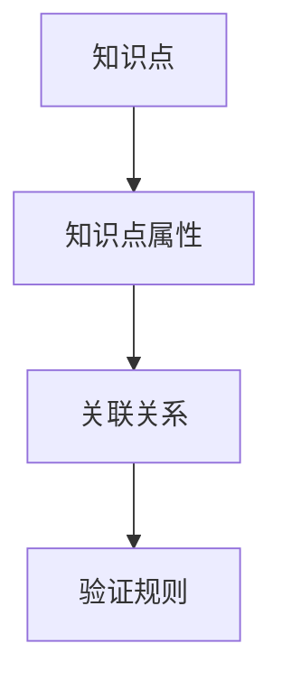
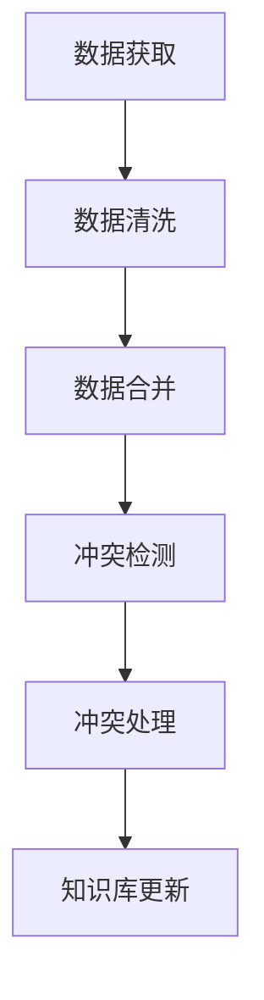
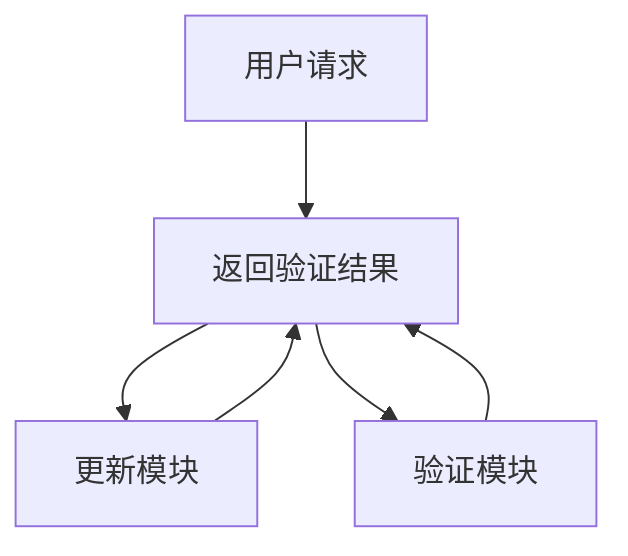

                 


# 构建AI Agent的知识库更新与验证流程

## 关键词：
AI Agent、知识库更新、数据验证、系统架构、算法原理

## 摘要：
本文详细探讨了构建AI Agent的知识库更新与验证流程，从背景到核心概念，再到算法原理和系统架构，最后通过项目实战和最佳实践，为读者提供系统化的指导。文章内容丰富，涵盖理论与实践，帮助读者全面理解并掌握相关知识。

---

# 第一部分：知识库更新与验证的背景与核心概念

## 第1章：问题背景与核心概念

### 1.1 问题背景

#### 1.1.1 AI Agent的定义与应用场景
AI Agent（智能体）是一种能够感知环境、自主决策并执行任务的智能系统，广泛应用于自然语言处理、推荐系统、自动驾驶等领域。

#### 1.1.2 知识库在AI Agent中的重要性
知识库是AI Agent的核心，存储结构化知识，帮助其理解和推理。

#### 1.1.3 知识库更新与验证的必要性
知识库需要持续更新以保持准确性，验证过程确保数据质量。

### 1.2 问题描述

#### 1.2.1 知识库更新的挑战
数据源多样、格式复杂，更新频率和效率是关键。

#### 1.2.2 知识库验证的核心问题
验证数据的准确性、一致性、完整性，确保知识库的可信度。

#### 1.2.3 知识库更新与验证的边界与外延
明确更新和验证的范围，包括数据来源和处理流程。

### 1.3 核心概念与联系

#### 1.3.1 核心概念原理
知识库、数据源、更新机制、验证规则是关键组成部分。

#### 1.3.2 核心概念属性特征对比表格
| 概念     | 属性       | 特征       |
|----------|------------|------------|
| 知识库   | 结构化数据   | 高效查询   |
| 数据源   | 来源多样     | 更新频率   |
| 更新机制 | 并发控制     | 冗余处理   |
| 验证规则 | 逻辑约束     | 反馈机制   |

#### 1.3.3 ER实体关系图架构


---

## 第2章：知识库更新与验证的核心原理

### 2.1 知识库更新机制

#### 2.1.1 数据源的分类与选择
- **结构化数据**：如数据库表。
- **非结构化数据**：如文本文件。
- **半结构化数据**：如JSON格式。

#### 2.1.2 知识抽取与转换
- 数据抽取：从各种数据源提取信息。
- 数据清洗：去除冗余和错误数据。
- 数据格式转换：将数据转换为统一格式。

#### 2.1.3 知识融合与冲突处理
- 数据合并：将不同来源的数据合并。
- 冲突检测：识别数据冲突。
- 冲突处理：选择优先级高的数据或进行融合。

### 2.2 知识库验证的核心原理

#### 2.2.1 数据验证方法
- **一致性检查**：确保数据内部一致。
- **完整性验证**：检查数据是否完整。
- **准确性评估**：验证数据准确性。

#### 2.2.2 验证规则的制定
- 基于领域知识的规则。
- 基于统计的规则。
- 基于机器学习的规则。

#### 2.2.3 验证结果的处理
- 修正错误数据。
- 记录验证日志。
- 提供反馈机制。

---

## 第3章：算法原理与实现

### 3.1 算法原理

#### 3.1.1 文本相似度计算
使用余弦相似度计算文本相似度：
$$ \text{余弦相似度} = \frac{\vec{A} \cdot \vec{B}}{|\vec{A}| |\vec{B}|} $$

#### 3.1.2 聚类算法
K-means算法步骤：
1. 初始化质心。
2. 计算每个样本到质心的距离。
3. 重新计算质心。
4. 重复步骤2和3，直到收敛。

#### 3.1.3 机器学习模型
训练监督学习模型，使用标签数据进行分类。

### 3.2 算法实现

#### 3.2.1 Python代码实现
```python
def update_knowledge_base():
    # 数据获取
    data = fetch_data()
    # 数据清洗
    cleaned_data = clean_data(data)
    # 数据合并
    merged_data = merge_data(cleaned_data)
    # 冲突检测
    conflict_data = detect_conflicts(merged_data)
    # 冲突处理
    resolved_data = resolve_conflicts(conflict_data)
    return resolved_data
```

#### 3.2.2 算法流程图


---

## 第4章：系统分析与架构设计

### 4.1 系统模块划分

#### 4.1.1 模块划分
- 知识库管理模块。
- 更新模块。
- 验证模块。

### 4.2 系统架构设计

#### 4.2.1 领域模型
```mermaid
classDiagram
    class 知识库管理模块 {
        +知识点列表
        +关联关系
        +验证规则
        -updateKnowledgeBase()
        -verifyKnowledgeBase()
    }
    class 更新模块 {
        +数据源
        +更新规则
        -fetchData()
        -mergeData()
    }
    class 验证模块 {
        +验证规则
        +验证结果
        -validateData()
        -generateReport()
    }
    知识库管理模块 <-- updateKnowledgeBase() --> 更新模块
    知识库管理模块 <-- verifyKnowledgeBase() --> 验证模块
```

#### 4.2.2 系统架构图


---

## 第5章：项目实战与实现

### 5.1 项目实战

#### 5.1.1 环境安装
安装必要的Python库：
```bash
pip install numpy pandas scikit-learn
```

#### 5.1.2 核心代码实现
```python
def validate_data(data, rules):
    validated_data = []
    for item in data:
        if satisfies_rules(item, rules):
            validated_data.append(item)
    return validated_data

def satisfies_rules(item, rules):
    for rule in rules:
        if not rule(item):
            return False
    return True
```

#### 5.1.3 案例分析
案例：更新产品知识库。
- 数据来源：产品文档和用户反馈。
- 更新步骤：清洗、合并、验证。
- 验证结果：报告错误率和准确率。

---

## 第6章：最佳实践与总结

### 6.1 最佳实践

#### 6.1.1 数据质量管理
确保数据来源可靠，格式统一。

#### 6.1.2 验证规则制定
结合领域知识和统计方法制定规则。

#### 6.1.3 系统性能优化
优化数据处理和验证的效率。

### 6.2 小结

本文详细介绍了构建AI Agent的知识库更新与验证流程，从背景到实现，提供了全面的指导。

### 6.3 注意事项

- 数据隐私和安全。
- 处理大规模数据时的性能优化。
- 验证规则的动态调整。

### 6.4 拓展阅读

推荐书籍和论文，深入学习相关知识。

---

# 结语

构建AI Agent的知识库更新与验证流程是一个复杂但重要的任务，需要结合理论与实践。希望本文能为读者提供有价值的指导。

---

# 作者

作者：AI天才研究院/AI Genius Institute & 禅与计算机程序设计艺术 /Zen And The Art of Computer Programming

