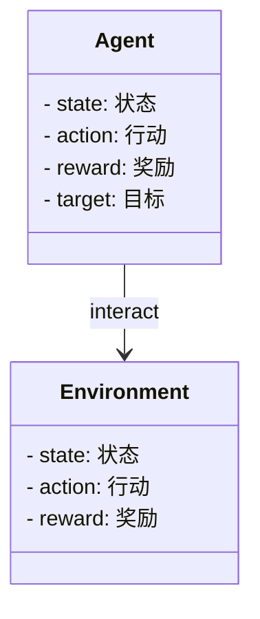
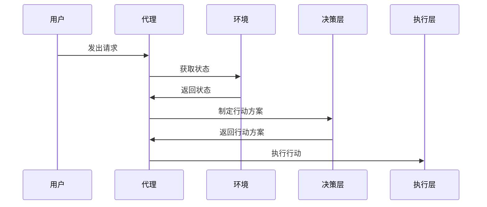

                 


# 《构建AI Agent的长期规划与决策系统》

## 关键词：AI Agent, 长期规划, 决策系统, 强化学习, 规划算法, 系统架构, 项目实战

## 摘要：  
本文详细探讨了构建AI Agent的长期规划与决策系统的各个方面，从核心概念到算法原理，再到系统架构设计和项目实战，帮助读者系统地理解并掌握AI Agent的长期规划与决策系统的构建方法。文章内容涵盖了AI Agent的背景与概念、长期规划与决策的核心概念、算法原理、系统架构设计、项目实战以及总结与展望。通过详细的讲解和丰富的实例，本文为读者提供了一套完整的构建AI Agent的长期规划与决策系统的解决方案。

---

# 第1章: AI Agent的背景与概念

## 1.1 AI Agent的定义与类型

### 1.1.1 什么是AI Agent
AI Agent（人工智能代理）是指能够感知环境并采取行动以实现目标的智能体。AI Agent可以是软件程序、机器人或其他智能系统，其核心在于通过感知和行动与环境交互，以实现预设的目标。

### 1.1.2 AI Agent的类型
AI Agent可以根据多种维度进行分类，常见的分类方式包括：

1. **简单反射型Agent**：这类Agent基于当前感知做出反应，没有内部状态，适用于简单的决策任务。
2. **基于模型的反射型Agent**：这类Agent维护内部状态，并基于当前感知和内部状态进行决策。
3. **目标驱动型Agent**：这类Agent具有明确的目标，并通过规划和推理来实现目标。
4. **效用驱动型Agent**：这类Agent通过最大化效用函数来做出决策，常用于复杂环境中的优化问题。

### 1.1.3 长期规划与决策的重要性
长期规划与决策是AI Agent在复杂动态环境中成功运作的关键。通过长期规划，AI Agent可以预测未来可能的状态和行动后果，从而做出更为合理和高效的决策。长期规划与决策的能力直接关系到AI Agent的智能水平和应用范围。

---

## 1.2 长期规划与决策的背景

### 1.2.1 当前AI Agent的发展现状
随着人工智能技术的飞速发展，AI Agent已经在许多领域得到了广泛应用，例如自动驾驶、智能助手、游戏AI等。然而，大多数现有的AI Agent主要依赖短途规划和即时决策，难以应对复杂的长期任务。

### 1.2.2 长期规划与决策的核心问题
长期规划与决策的核心问题在于如何在动态变化的环境中，制定出合理的长期目标，并通过分阶段的行动逐步实现这些目标。这需要AI Agent具备强大的环境建模能力、目标分解能力以及动态规划能力。

### 1.2.3 长期规划与决策的应用场景
长期规划与决策的应用场景广泛，例如：
1. **自动驾驶**：规划车辆的行驶路径和避开障碍。
2. **智能助手**：帮助用户完成复杂任务，如行程安排、信息检索等。
3. **机器人控制**：在复杂环境中完成任务，如工业机器人和家庭服务机器人。

---

# 第2章: 长期规划与决策的核心概念

## 2.1 长期规划与决策的定义

### 2.1.1 长期规划的定义
长期规划是指AI Agent在面对复杂任务时，制定出一系列分阶段的行动方案，以实现长期目标。长期规划的核心在于对未来可能的状态和行动后果进行预测和评估。

### 2.1.2 决策的定义
决策是指在给定环境下，AI Agent选择最优行动的过程。决策可以是即时的，也可以是基于长期规划的。

### 2.1.3 长期规划与决策的关系
长期规划与决策是相互依存的关系。规划为决策提供方向和目标，而决策则为规划的实施提供具体行动方案。

---

## 2.2 核心概念与联系

### 2.2.1 问题建模
问题建模是长期规划与决策的第一步，主要包括定义问题、确定目标和约束条件。

#### 问题建模的步骤：
1. **定义问题**：明确AI Agent需要解决的任务。
2. **确定目标**：设定AI Agent的长期和短期目标。
3. **约束条件**：明确环境中的限制条件。

### 2.2.2 状态空间
状态空间是指AI Agent在不同时间点可能处的状态的集合。每个状态代表环境中的一个情况，AI Agent需要通过感知环境来确定当前状态。

### 2.2.3 行动空间
行动空间是指AI Agent在每个状态下可以执行的所有可能行动的集合。每个行动会对环境的状态产生影响。

### 2.2.4 目标函数
目标函数是用来衡量AI Agent决策结果是否符合预期目标的函数。目标函数通常包括奖励函数和惩罚函数。

---

## 2.3 长期规划与决策的数学模型

### 2.3.1 状态转移方程
状态转移方程描述了AI Agent在执行某个行动后，环境状态的变化过程。数学表示为：
$$ P(s' | s, a) $$
其中，$s$是当前状态，$a$是当前行动，$s'$是下一个状态。

### 2.3.2 奖励函数
奖励函数是用来衡量AI Agent在特定状态下执行某个行动的价值。数学表示为：
$$ R(s, a) $$
其中，$s$是当前状态，$a$是当前行动。

### 2.3.3 动作选择策略
动作选择策略是AI Agent在给定状态下选择最优行动的概率分布。数学表示为：
$$ \pi(a | s) $$
其中，$a$是行动，$s$是当前状态。

---

# 第3章: 长期规划与决策的算法原理

## 3.1 基于模型的规划算法

### 3.1.1 状态空间模型
状态空间模型是基于模型的规划算法的基础，通过构建环境的状态空间，AI Agent可以预测未来可能的状态。

### 3.1.2 动作空间模型
动作空间模型描述了AI Agent在每个状态下可以执行的所有可能行动，是基于模型的规划算法的重要组成部分。

### 3.1.3 策略树的构建
策略树是一种基于模型的规划算法，通过构建树状结构来表示所有可能的行动路径，帮助AI Agent找到最优决策路径。

---

## 3.2 基于无模型的规划算法

### 3.2.1 Q-learning算法
Q-learning算法是一种基于无模型的强化学习算法，通过学习状态-行动值函数来优化决策。数学表示为：
$$ Q(s, a) = Q(s, a) + \alpha (r + \gamma \max Q(s', a') - Q(s, a)) $$
其中，$\alpha$是学习率，$\gamma$是折扣因子。

### 3.2.2 DQN算法
DQN（Deep Q-Network）算法是一种基于无模型的深度强化学习算法，通过使用深度神经网络来近似状态-行动值函数。DQN算法通过经验回放和目标网络来优化Q值函数。

---

## 3.3 算法比较与选择

### 3.3.1 Q-learning与DQN的对比
| 特性         | Q-learning                  | DQN                          |
|--------------|-----------------------------|-------------------------------|
| 是否基于模型  | 无模型                      | 无模型                      |
| 状态空间     | 离散状态                   | 连续状态                   |
| 动作空间     | 离散动作                   | 离散动作                   |
| 学习效率     | 低                         | 高                         |

### 3.3.2 算法选择的原则
1. **任务复杂度**：任务复杂度越高，越适合使用基于无模型的规划算法。
2. **环境动态性**：环境动态性越强，越适合使用基于无模型的规划算法。
3. **计算资源**：计算资源有限时，选择轻量级算法。

---

# 第4章: 系统架构设计

## 4.1 系统整体架构

### 4.1.1 感知层
感知层负责收集环境中的各种信息，包括视觉、听觉、触觉等多模态信息。感知层通过传感器、摄像头等设备获取环境数据。

### 4.1.2 决策层
决策层是系统的核心部分，负责根据感知层提供的信息，结合长期规划与决策算法，制定出最优行动方案。

### 4.1.3 执行层
执行层负责将决策层制定的行动方案转化为具体的行动，例如控制机器人执行动作、发送指令等。

---

## 4.2 系统功能设计

### 4.2.1 领域模型设计
领域模型是对问题领域的抽象和建模，通常使用Mermaid类图来表示。



### 4.2.2 系统架构设计
系统架构设计通常使用Mermaid架构图来表示。


### 4.2.3 系统接口设计
系统接口设计需要明确各个模块之间的接口定义，通常使用RESTful API或其他通信协议。

---

## 4.3 系统交互设计

### 4.3.1 交互流程
系统交互流程通常使用Mermaid序列图来表示。



---

# 第5章: 项目实战

## 5.1 环境搭建

### 5.1.1 安装Python
安装Python和必要的库，例如numpy、pandas、tensorflow等。

### 5.1.2 安装框架
安装强化学习框架，例如OpenAI Gym、TensorFlow等。

## 5.2 核心算法实现

### 5.2.1 Q-learning实现
```python
import numpy as np

class QLearning:
    def __init__(self, state_space, action_space, learning_rate=0.1, gamma=0.9):
        self.q_table = np.zeros((state_space, action_space))
        self.learning_rate = learning_rate
        self.gamma = gamma

    def choose_action(self, state):
        return np.argmax(self.q_table[state])

    def update(self, state, action, reward, next_state):
        self.q_table[state][action] += self.learning_rate * (reward + self.gamma * np.max(self.q_table[next_state]) - self.q_table[state][action])
```

### 5.2.2 DQN实现
```python
import numpy as np
import tensorflow as tf

class DQN:
    def __init__(self, input_dim, output_dim, hidden_units=64):
        self.model = tf.keras.Sequential([
            tf.keras.layers.Dense(hidden_units, activation='relu', input_dim=input_dim),
            tf.keras.layers.Dense(output_dim)
        ])
        self.model.compile(optimizer='adam', loss='mse')

    def choose_action(self, state):
        state = np.array([state])
        prediction = self.model.predict(state)
        return np.argmax(prediction[0])

    def update(self, state, action, reward, next_state):
        state = np.array([state])
        next_state = np.array([next_state])
        target = reward + self.gamma * np.max(self.model.predict(next_state))
        target = target * action
        self.model.fit(state, target, epochs=1, verbose=0)
```

---

## 5.3 项目小结

### 5.3.1 项目成果
通过项目实战，读者可以掌握AI Agent的长期规划与决策系统的构建方法，包括算法实现、系统设计和项目部署。

### 5.3.2 项目总结
项目总结需要对项目的整体情况、遇到的问题和解决方案进行总结，同时提出改进建议。

---

# 第6章: 总结与展望

## 6.1 总结
本文详细介绍了AI Agent的长期规划与决策系统的构建方法，包括核心概念、算法原理、系统架构设计和项目实战等内容。通过本文的学习，读者可以掌握构建AI Agent的长期规划与决策系统的相关知识。

## 6.2 展望
未来的研究方向包括：
1. **多智能体协作**：研究多个AI Agent之间的协作与竞争。
2. **动态环境适应**：提高AI Agent在动态环境中的适应能力。
3. **复杂任务规划**：研究更复杂的任务规划与决策算法。

## 6.3 最佳实践Tips
1. **选择合适的算法**：根据任务需求选择合适的规划算法。
2. **优化系统架构**：设计合理的系统架构，确保系统的可扩展性和维护性。
3. **注重实验与调优**：通过实验和调优，找到最优的参数设置。

---

作者：AI天才研究院/AI Genius Institute & 禅与计算机程序设计艺术 /Zen And The Art of Computer Programming

