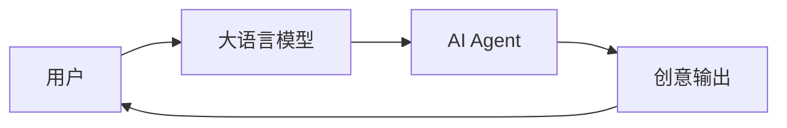
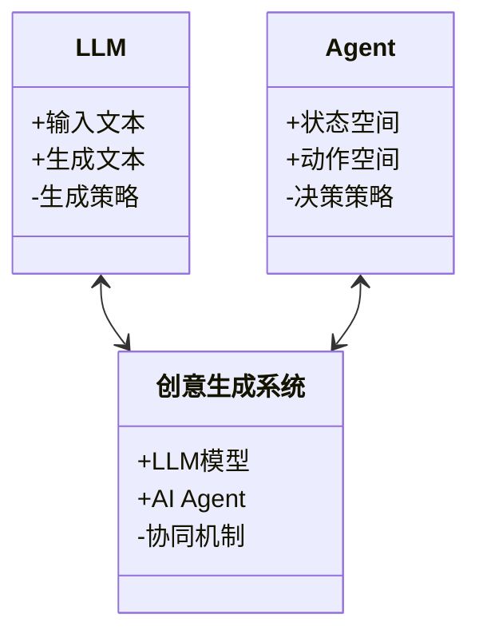
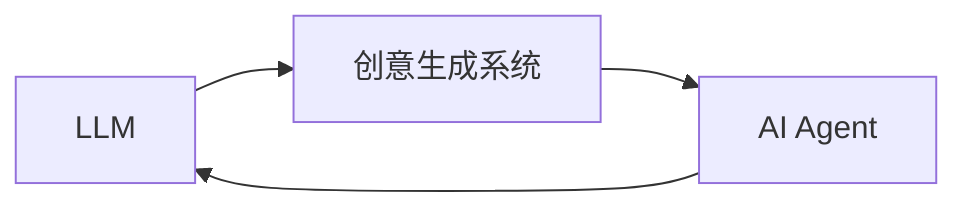

                 


# 构建LLM支持的AI Agent创意生成系统

> 关键词：LLM, AI Agent, 创意生成, 大语言模型, 人工智能, 创意系统

> 摘要：本文详细探讨了如何构建一个基于大语言模型（LLM）支持的AI Agent创意生成系统。文章从问题背景、核心概念、算法原理、系统架构、项目实战等多个维度进行深入分析，结合理论与实践，为读者提供一个系统化的解决方案。

---

## 第一部分: 背景介绍

### 第1章: 问题背景

#### 1.1 问题背景
随着人工智能技术的飞速发展，创意生成的需求日益增长。传统的创意生成方法依赖于固定规则或模板，难以应对复杂的场景和多样化的需求。而基于大语言模型（LLM）的AI Agent具备强大的自然语言处理能力和自主决策能力，能够为创意生成提供更灵活和高效的解决方案。

#### 1.2 问题描述
创意生成系统的核心目标是通过AI Agent与LLM的协同工作，实现高质量、多样化的创意输出。然而，现有系统在以下几个方面存在明显的局限性：
- **模型能力不足**：传统NLP模型缺乏对上下文的深度理解和生成能力。
- **决策机制单一**：AI Agent的决策依赖于预设规则，缺乏灵活性和自适应性。
- **创意评估困难**：缺乏有效的评估指标和反馈机制，难以优化生成结果。

#### 1.3 问题解决
通过结合LLM和AI Agent的技术优势，我们可以构建一个更加智能化的创意生成系统。LLM负责提供高质量的文本生成能力，而AI Agent则负责根据上下文和目标动态调整生成策略，从而实现更灵活和高效的创意生成。

#### 1.4 系统的核心要素
- **LLM模型**：负责文本生成和上下文理解。
- **AI Agent架构**：负责决策和策略优化。
- **创意生成算法**：结合LLM和AI Agent的协同机制。

---

## 第二部分: 核心概念与联系

### 第2章: 核心概念

#### 2.1 LLM与AI Agent的核心原理
- **LLM的工作原理**：基于Transformer架构，通过自注意力机制实现对上下文的深度理解。
- **AI Agent的决策机制**：通过状态空间和动作空间的定义，结合Q-learning算法实现动态决策。
- **协同机制**：LLM提供生成内容，AI Agent根据反馈调整生成策略。

#### 2.2 核心概念对比分析
| 对比维度 | LLM | AI Agent |
|----------|-----|-----------|
| 核心功能 | 文本生成 | 智能决策 |
| 技术基础 | Transformer | Q-learning |
| 优势 | 高质量生成 | 灵活性高 |

#### 2.3 实体关系图


---

## 第三部分: 算法原理讲解

### 第3章: LLM算法原理

#### 3.1 Transformer模型
- **编码器结构**：
  $$ z = \text{LayerNorm}(x + \text{MultiHead}(x)) $$
- **解码器结构**：
  $$ y = \text{LayerNorm}(y + \text{MultiHead}(y) + \text{MultiHead}(x,z)) $$

#### 3.2 损失函数
$$ L = -\sum_{i=1}^{n} \log p(y_i|x_i) $$

### 第4章: AI Agent决策算法

#### 4.1 Q-learning算法
$$ Q(s,a) = Q(s,a) + \alpha [r + \max_{a'} Q(s',a') - Q(s,a)] $$

#### 4.2 策略梯度算法
$$ \nabla \theta \log \pi_\theta(a|s) \cdot Q(s,a) $$

---

## 第四部分: 系统架构设计

### 第5章: 系统架构

#### 5.1 领域模型


#### 5.2 系统架构图


---

## 第五部分: 项目实战

### 第6章: 项目实战

#### 6.1 环境安装
```bash
pip install transformers gym
```

#### 6.2 核心代码实现
```python
from transformers import GPT2LMHeadModel, GPT2Tokenizer
import gym

# 初始化模型
model = GPT2LMHeadModel.from_pretrained('gpt2')
tokenizer = GPT2Tokenizer.from_pretrained('gpt2')

# AI Agent决策函数
def agent_decision(state):
    # 实现Q-learning算法
    pass

# 创意生成函数
def generate_creative(input_text):
    inputs = tokenizer(input_text, return_tensors='np')
    outputs = model.generate(**inputs)
    return tokenizer.decode(outputs[0])
```

#### 6.3 案例分析
- **输入**：用户需求描述
- **LLM生成**：初步创意内容
- **AI Agent优化**：根据反馈调整生成策略
- **输出**：优化后的创意内容

---

## 第六部分: 总结与展望

### 第7章: 总结

#### 7.1 最佳实践
- **模型优化**：定期更新LLM模型
- **算法改进**：优化AI Agent的决策机制
- **用户反馈**：建立有效的反馈机制

#### 7.2 小结
通过结合LLM和AI Agent的技术优势，我们可以构建一个高效、灵活的创意生成系统。本文从理论到实践，详细介绍了系统的构建过程，为未来的应用提供了重要参考。

---

作者：AI天才研究院/AI Genius Institute & 禅与计算机程序设计艺术 /Zen And The Art of Computer Programming

