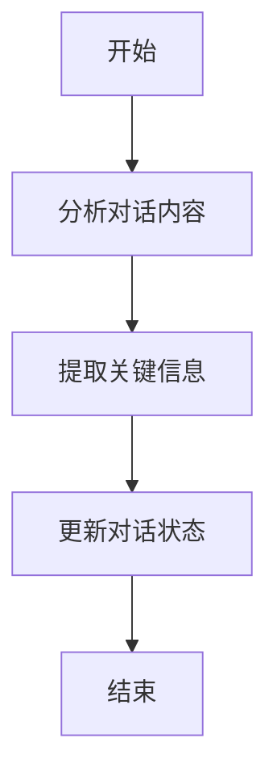
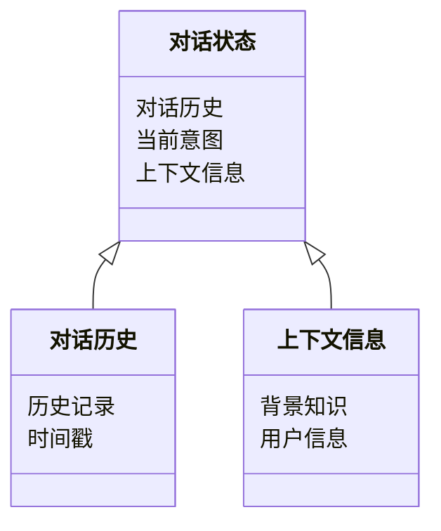
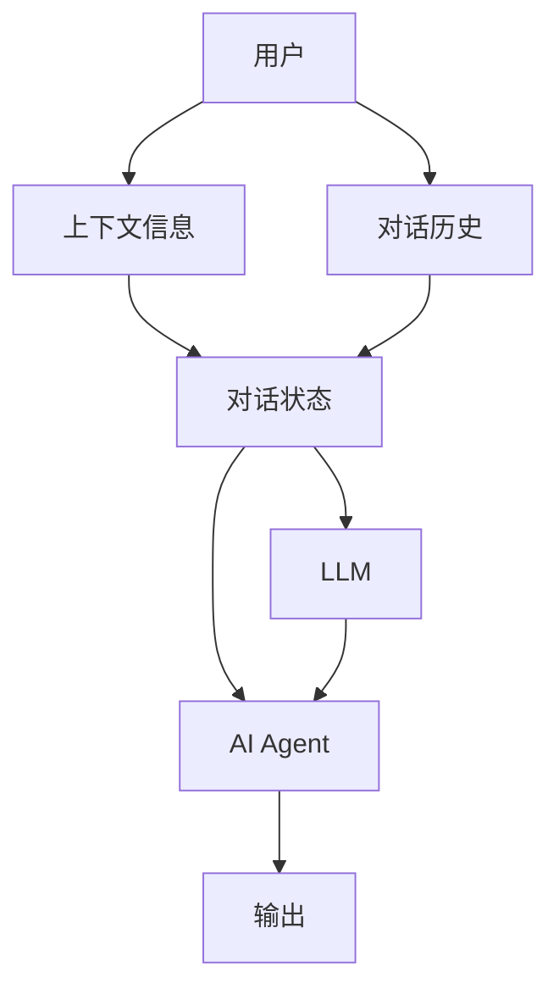
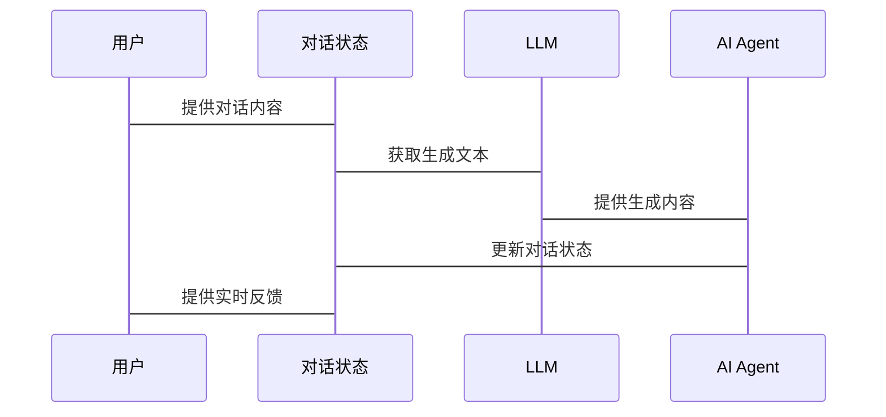

                 


# 构建LLM驱动的AI Agent多轮对话状态追踪

> 关键词：LLM, AI Agent, 多轮对话, 状态追踪, 算法原理, 系统架构, 项目实战

> 摘要：本文将详细介绍如何构建基于大语言模型（LLM）的AI Agent多轮对话状态追踪系统。从问题背景、核心概念到算法原理、系统架构设计，再到项目实战，我们将一步步深入探讨这一技术的实现细节和应用潜力。通过本文的学习，读者将能够掌握构建高效、智能的对话系统的核心方法。

---

# 第1章: 背景介绍与核心概念

## 1.1 问题背景

### 1.1.1 多轮对话状态追踪的定义
多轮对话状态追踪是指在多轮对话过程中，实时跟踪对话的状态，包括当前对话的主题、用户意图、上下文信息等。它是实现智能对话系统的核心技术之一。

### 1.1.2 当前对话系统中的挑战
- 对话历史信息的丢失或不完整
- 不同意图之间的冲突和干扰
- 实时更新和维护对话状态的复杂性
- 大语言模型（LLM）的输出不确定性和噪声问题

### 1.1.3 LLM驱动的AI Agent的潜力
- 利用LLM的强大生成能力，提升对话的自然性和流畅性
- 通过AI Agent的智能行为决策，实现更精准的状态追踪
- 结合上下文信息，提供更个性化的对话体验

## 1.2 核心概念与问题描述

### 1.2.1 LLM与AI Agent的关系
- LLM提供语言理解和生成能力
- AI Agent负责决策和行为执行
- 两者结合实现智能对话交互

### 1.2.2 对话状态追踪的核心要素
- 对话历史：记录用户和AI Agent的交互内容
- 当前意图：识别用户的当前需求
- 上下文信息：维护对话的相关背景知识

### 1.2.3 状态表示与更新机制
- 状态表示：使用向量、概率分布或符号表示
- 更新机制：基于对话内容实时更新状态

## 1.3 问题解决与边界定义

### 1.3.1 LLM驱动的解决方案
- 利用LLM生成对话内容
- 基于生成内容更新对话状态
- 使用AI Agent协调多轮对话流程

### 1.3.2 状态追踪的边界与外延
- 状态追踪的范围：仅限于当前对话
- 边界条件：对话的主题、参与者的身份等
- 外延：支持多轮对话的延续和扩展

### 1.3.3 核心概念的结构化分析
- 对话状态：对话的核心信息载体
- LLM：对话生成与理解的引擎
- AI Agent：行为决策的中枢

## 1.4 核心概念对比与ER图

### 1.4.1 LLM与传统NLP模型的对比
| 特性           | LLM                 | 传统NLP模型         |
|----------------|---------------------|--------------------|
| 模型复杂度      | 高                 | 较低               |
| 对话能力       | 强大               | 较弱               |
| 实时性          | 高                 | 较低               |

### 1.4.2 实体关系图（ER图）展示
```mermaid
er
    %%{init: {'title': '实体关系图', 'font': '宋体', 'fontSize': 14}}
    actor 用户;
    actor AI Agent;
    entity 对话状态;
    entity 对话历史;
    entity 上下文信息;
    
    用户 --> 对话历史: 提供对话内容;
    用户 --> 上下文信息: 提供背景知识;
    AI Agent --> 对话状态: 更新对话状态;
    对话历史 --> 对话状态: 提供历史信息;
    上下文信息 --> 对话状态: 提供背景支持;
```

---

# 第2章: 核心概念与联系

## 2.1 核心概念原理

### 2.1.1 LLM的内部工作机制
- 基于Transformer架构
- 利用自注意力机制捕捉上下文信息
- 通过解码器生成对话内容

### 2.1.2 AI Agent的行为决策逻辑
- 基于当前状态和意图，选择下一步动作
- 使用策略网络优化行为决策
- 支持多种决策模式（随机、贪心等）

### 2.1.3 对话状态的数学表示
- 向量表示：将状态转换为高维向量
- 概率表示：使用概率分布描述状态
- 符号表示：使用符号或关键词表示状态

## 2.2 核心概念对比表

| 特性           | LLM                 | AI Agent           |
|----------------|---------------------|--------------------|
| 主要功能        | 生成和理解语言       | 行为决策与协调     |
| 输入           | 文本数据            | 对话状态与历史     |
| 输出           | 生成文本            | 行为决策           |
| 依赖            | 大型训练数据        | 对话状态与意图     |

## 2.3 实体关系图（ER图）

```mermaid
er
    %%{init: {'title': '实体关系图', 'font': '宋体', 'fontSize': 14}}
    entity 对话状态;
    entity 对话历史;
    entity 上下文信息;
    
    对话状态 --> 对话历史: 包含;
    对话状态 --> 上下文信息: 包含;
```

---

# 第3章: 算法原理与数学模型

## 3.1 对话状态表示与更新算法

### 3.1.1 状态表示方法
- 向量表示：将状态转换为高维向量
- 概率表示：使用概率分布描述状态
- 符号表示：使用符号或关键词表示状态

### 3.1.2 状态更新流程
1. 分析当前对话内容
2. 提取关键信息
3. 更新对话状态

### 3.1.3 算法流程图



## 3.2 意图识别与上下文管理

### 3.2.1 意图识别算法
- 基于关键词匹配
- 基于模式匹配
- 基于机器学习的意图分类

### 3.2.2 上下文管理策略
- 基于时间的上下文管理
- 基于内容的上下文管理
- 基于用户的上下文管理

### 3.2.3 算法实现代码

```python
def update_state(current_state, new_info):
    # 更新对话状态
    new_state = current_state.copy()
    new_state.update(new_info)
    return new_state
```

## 3.3 数学模型与公式

### 3.3.1 概率模型公式
$$ P(state|message) = \frac{P(message|state) \cdot P(state)}{P(message)} $$

### 3.3.2 状态转移矩阵
$$
\begin{bmatrix}
    0.2 & 0.5 & 0.3 \\
    0.4 & 0.1 & 0.5 \\
    0.1 & 0.3 & 0.6 \\
\end{bmatrix}
$$

### 3.3.3 示例计算
给定初始状态概率分布：
$$ P(state) = [0.3, 0.5, 0.2] $$
经过一次转移后：
$$ P'(state) = P(state) \cdot 转移矩阵 $$

---

# 第4章: 系统分析与架构设计

## 4.1 问题场景介绍

### 4.1.1 项目背景
- 项目目标：构建基于LLM的AI Agent对话系统
- 项目范围：支持多轮对话状态追踪
- 项目约束：实时性、准确性和可扩展性

## 4.2 系统功能设计

### 4.2.1 领域模型类图



## 4.3 系统架构设计

### 4.3.1 系统架构图



## 4.4 系统接口与交互设计

### 4.4.1 接口定义
- 输入接口：用户输入、对话历史、上下文信息
- 输出接口：对话状态、行为决策、生成文本

### 4.4.2 交互流程图



---

# 第5章: 项目实战

## 5.1 环境安装

```bash
pip install transformers
pip install torch
pip install mermaid
```

## 5.2 系统核心实现源代码

```python
import torch
from transformers import AutoModelForSeq2Seq
from transformers import AutoTokenizer

class LLMDriv

