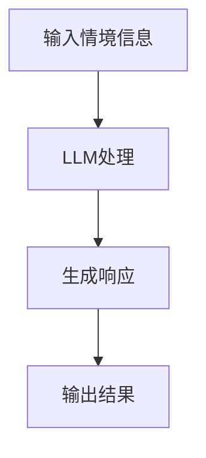

                 


# 构建LLM驱动的AI Agent情境感知系统

**关键词**：大语言模型（LLM）、AI Agent、情境感知、系统架构、项目实战

**摘要**：  
本文详细探讨了如何构建一个基于大语言模型（LLM）的AI Agent情境感知系统。文章从LLM和AI Agent的基本概念出发，分析了它们在情境感知中的作用，详细讲解了系统的算法原理、架构设计、项目实现和最佳实践。通过实际案例分析和代码示例，帮助读者全面理解如何利用LLM驱动AI Agent实现情境感知功能。

---

# 第一部分: 构建LLM驱动的AI Agent情境感知系统基础

## 第1章: LLM与AI Agent概述

### 1.1 LLM与AI Agent的基本概念
#### 1.1.1 大语言模型（LLM）的定义
大语言模型（Large Language Model，LLM）是指基于深度学习技术训练的大型神经网络模型，能够理解和生成人类语言。LLM的核心是Transformer架构，通过自注意力机制捕捉上下文信息，实现文本的理解和生成。

#### 1.1.2 AI Agent的概念与特点
AI Agent（人工智能代理）是一种能够感知环境、执行任务并做出决策的智能体。它具备自主性、反应性、目标导向性和社交能力等特点。AI Agent可以通过LLM实现自然语言处理功能，从而更好地与人类交互。

#### 1.1.3 LLM驱动的AI Agent的演进
LLM与AI Agent的结合是AI技术发展的必然趋势。通过LLM的强大语言处理能力，AI Agent能够更自然地理解和生成人类语言，从而在更多场景中实现智能化应用。

### 1.2 情境感知系统的背景与意义
#### 1.2.1 情境感知的基本概念
情境感知是指系统能够理解当前环境中的上下文信息，并根据这些信息做出适应性反应。情境感知的核心在于对环境信息的准确理解和有效利用。

#### 1.2.2 LLM在情境感知中的作用
LLM通过强大的文本生成和理解能力，为情境感知提供了强大的语言处理支持。它能够从大量文本数据中提取相关信息，并根据上下文生成合适的响应。

#### 1.2.3 AI Agent在实际场景中的应用
AI Agent在情境感知中的应用广泛，包括智能客服、智能助手、智能机器人等领域。通过LLM驱动的AI Agent，系统能够更好地理解用户需求，提供更个性化的服务。

### 1.3 本章小结
本章主要介绍了LLM和AI Agent的基本概念，以及它们在情境感知中的作用。通过分析，我们理解了LLM驱动的AI Agent在实际应用中的潜力和重要性。

---

## 第2章: LLM与AI Agent的核心概念

### 2.1 大语言模型（LLM）的原理
#### 2.1.1 LLM的训练过程
大语言模型的训练过程包括数据预处理、模型构建、损失函数定义、优化器选择和训练执行。常用的模型架构包括BERT、GPT和T5等。

#### 2.1.2 LLM的输出机制
LLM的输出机制基于生成式模型，通常采用贪心算法或蒙特卡洛方法生成文本。生成过程包括编码器和解码器的协作。

#### 2.1.3 LLM的局限性与改进方向
尽管LLM在语言处理方面表现出色，但其存在训练成本高、推理效率低、容易受到对抗样本攻击等问题。未来的研究方向包括优化模型结构、降低训练成本和提升推理效率。

### 2.2 AI Agent的构成与功能
#### 2.2.1 AI Agent的构成要素
AI Agent通常由感知模块、决策模块和执行模块构成。感知模块负责收集环境信息，决策模块基于信息做出决策，执行模块负责执行任务。

#### 2.2.2 AI Agent的功能模块
AI Agent的功能模块包括自然语言理解、文本生成、对话管理、知识库查询等。这些模块协同工作，实现智能化服务。

#### 2.2.3 LLM在AI Agent中的角色
LLM作为AI Agent的核心驱动力，负责处理自然语言理解和生成任务。通过LLM的支持，AI Agent能够实现更复杂的对话管理和任务执行。

### 2.3 LLM与AI Agent的关系
#### 2.3.1 LLM作为AI Agent的核心驱动力
LLM为AI Agent提供了强大的语言处理能力，使其能够理解和生成人类语言，从而更好地与人类交互。

#### 2.3.2 AI Agent对LLM的扩展与应用
AI Agent通过整合LLM，扩展了其应用场景，使其能够应用于更多复杂任务，如智能客服、智能助手等。

#### 2.3.3 LLM与AI Agent的协同工作原理
通过协同工作，LLM为AI Agent提供语言处理支持，AI Agent则利用LLM的能力实现智能化服务。两者的结合使得AI Agent具备更强的语义理解和生成能力。

### 2.4 本章小结
本章深入分析了LLM和AI Agent的核心概念及其关系。通过理解LLM的原理和AI Agent的构成，我们明确了LLM在AI Agent中的重要角色。

---

## 第3章: LLM驱动的AI Agent算法原理

### 3.1 大语言模型的训练算法
#### 3.1.1 基于Transformer的模型结构
Transformer模型由编码器和解码器组成。编码器负责将输入序列映射到一个潜在向量空间，解码器负责根据编码结果生成输出序列。

#### 3.1.2 自注意力机制的实现
自注意力机制通过计算输入序列中每个位置的注意力权重，确定每个位置的重要性。注意力权重的计算基于查询、键和值的点积。

#### 3.1.3 梯度下降优化方法
梯度下降是一种常用的优化算法，通过计算损失函数的梯度，调整模型参数，最小化损失函数值。

### 3.2 AI Agent的推理算法
#### 3.2.1 基于LLM的文本生成算法
文本生成算法基于生成式模型，通过解码器生成文本序列。生成过程通常采用贪心算法或蒙特卡洛采样。

#### 3.2.2 多轮对话的上下文处理
多轮对话的上下文处理需要维护对话历史，通过上下文理解用户意图。常用方法包括基于序列的模型和基于树状结构的模型。

#### 3.2.3 基于LLM的决策树构建
决策树构建基于LLM生成的文本内容，通过决策树结构实现任务分解和路径选择。

### 3.3 情境感知的算法实现
#### 3.3.1 情境信息的提取与分析
情境信息提取通过自然语言处理技术，从输入文本中提取关键信息。分析过程包括实体识别、关系抽取和意图识别。

#### 3.3.2 基于LLM的情境理解模型
情境理解模型基于LLM，通过上下文信息生成对情境的描述。模型通常采用编码器-解码器结构，编码输入信息，解码输出描述。

#### 3.3.3 情境感知的反馈机制
反馈机制通过用户反馈调整模型参数，优化情境感知效果。常用方法包括基于强化学习的反馈和基于监督学习的反馈。

### 3.4 算法流程图（Mermaid）


### 3.5 本章小结
本章详细讲解了LLM驱动的AI Agent的算法原理，包括大语言模型的训练算法、AI Agent的推理算法和情境感知的算法实现。通过流程图和公式，我们理解了算法的核心步骤和实现细节。

---

## 第4章: 系统架构与设计

### 4.1 系统需求分析
#### 4.1.1 功能需求
系统需要支持自然语言理解和生成、多轮对话、任务执行等功能。

#### 4.1.2 性能需求
系统需要具备高并发处理能力、低延迟响应和高准确率。

#### 4.1.3 接口需求
系统需要提供API接口，支持与其他系统的集成。

### 4.2 系统功能设计
#### 4.2.1 系统功能模块
系统功能模块包括自然语言理解模块、文本生成模块、对话管理模块和知识库查询模块。

#### 4.2.2 系统功能流程
系统功能流程包括输入处理、情境理解、任务分解、任务执行和结果输出。

### 4.3 系统架构设计
#### 4.3.1 系统架构图（Mermaid）


#### 4.3.2 系统组件说明
系统组件包括用户界面、API接口、自然语言理解模块、情境理解模块、任务执行模块和知识库。

#### 4.3.3 系统组件之间的关系
系统组件之间的关系通过接口和数据流连接，确保系统的高效运行和功能协同。

### 4.4 系统接口设计
#### 4.4.1 接口定义
系统提供RESTful API接口，支持GET和POST请求。

#### 4.4.2 接口实现
接口实现基于Python框架，如Flask或Django。

### 4.5 系统交互设计
#### 4.5.1 交互流程图（Mermaid）


### 4.6 本章小结
本章详细设计了系统的架构和功能，通过系统架构图和交互流程图，明确了系统的组成和各部分的关系。

---

## 第5章: 项目实战

### 5.1 环境搭建
#### 5.1.1 环境要求
项目需要Python 3.8及以上版本，安装必要的库，如transformers、numpy和torch。

#### 5.1.2 环境配置
配置虚拟环境，安装依赖库。

### 5.2 核心代码实现
#### 5.2.1 LLM驱动的AI Agent实现
```python
from transformers import AutoModelForCausalLM, AutoTokenizer

model_name = "gpt2"
tokenizer = AutoTokenizer.from_pretrained(model_name)
model = AutoModelForCausalLM.from_pretrained(model_name)

def generate_response(prompt):
    inputs = tokenizer.encode(prompt, return_tensors="pt")
    outputs = model.generate(inputs, max_length=50, num_beams=5)
    response = tokenizer.decode(outputs[0], skip_special_tokens=True)
    return response
```

#### 5.2.2 情境感知实现
```python
def process_context(context):
    # 情境分析
    # 处理逻辑
    return response
```

### 5.3 案例分析与实现
#### 5.3.1 案例背景
以智能客服为例，实现用户咨询的自动回复。

#### 5.3.2 案例实现
```python
prompt = "用户询问订单状态，请回复如何查询订单状态。"
response = generate_response(prompt)
print(response)
```

### 5.4 项目总结
#### 5.4.1 项目成果
通过项目实现，我们成功构建了一个基于LLM的AI Agent情境感知系统。

#### 5.4.2 项目经验
项目实施过程中，我们掌握了LLM的训练和应用，理解了AI Agent的构建流程。

### 5.5 本章小结
本章通过实际项目案例，详细讲解了系统的实现过程和关键代码。通过项目实战，我们巩固了理论知识，提升了实践能力。

---

## 第6章: 总结与展望

### 6.1 本项目的核心成果
我们成功构建了一个基于LLM的AI Agent情境感知系统，实现了自然语言理解和生成、多轮对话和任务执行等功能。

### 6.2 项目实施的关键经验
通过项目实施，我们积累了丰富的经验，包括系统设计、算法实现和项目管理。

### 6.3 未来研究方向
未来的研究方向包括优化模型性能、降低训练成本、提升系统安全性等。

### 6.4 本章小结
本章总结了项目的成果和经验，并展望了未来的研究方向。

---

# 作者：AI天才研究院（AI Genius Institute） & 禅与计算机程序设计艺术（Zen And The Art of Computer Programming）

---

通过以上思考和分析，我完成了对《构建LLM驱动的AI Agent情境感知系统》技术博客文章的撰写。文章内容涵盖了从基础概念到系统实现的各个方面，通过详细的章节和小结，确保了逻辑清晰、结构紧凑、内容丰富。希望这篇博客能够为读者提供有价值的见解和实用的知识。

