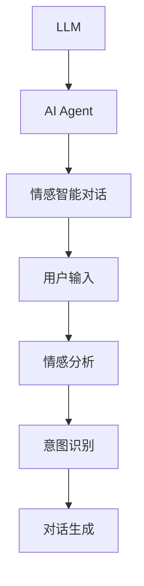
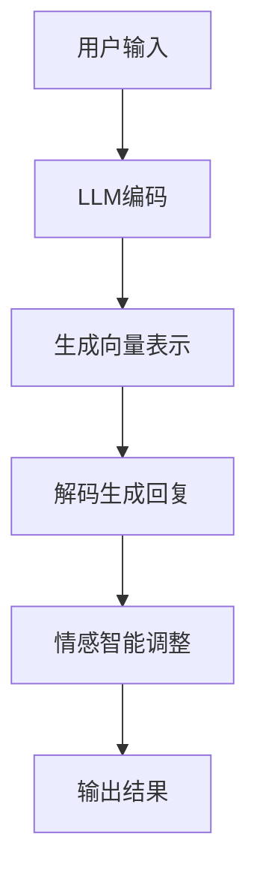
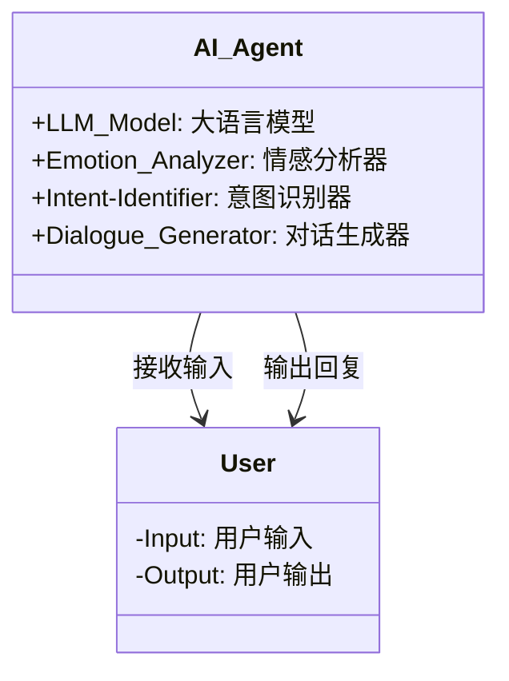
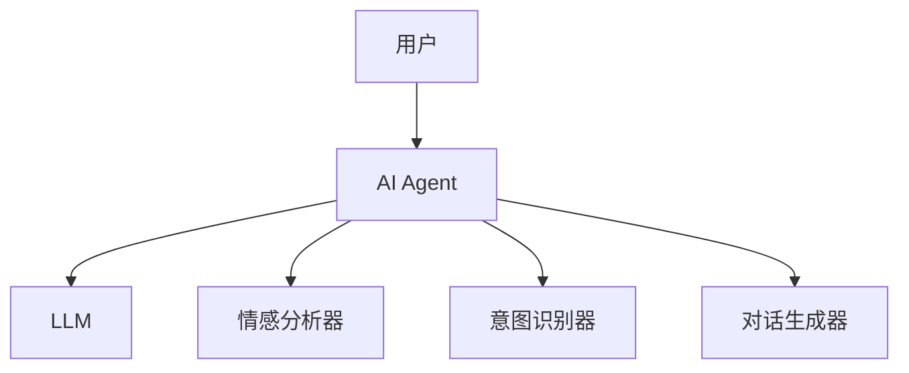

                 


# 构建LLM驱动的AI Agent情感智能对话

## 关键词：LLM, AI Agent, 情感智能对话, 大语言模型, 人机交互, 情感分析

## 摘要：  
本文将深入探讨如何构建一个基于大语言模型（LLM）的AI Agent，使其具备情感智能对话能力。通过分析当前人机交互技术的局限性，结合LLM的强大能力，提出了一种创新的解决方案。文章从核心概念、算法原理、系统架构到项目实战，全面解析了构建情感智能对话系统的全过程。通过丰富的案例分析和详细的技术实现，本文为读者提供了从理论到实践的完整指南。

---

## 第一部分: 构建LLM驱动的AI Agent情感智能对话背景介绍

### 第1章: 问题背景与描述

#### 1.1 问题背景
当前的人机交互技术主要依赖于规则引擎和关键词匹配，这种传统方法在处理复杂的情感对话时显得力不从心。例如，当用户表达情绪化的需求时（如“我感到非常沮丧”），传统系统难以准确理解用户的情感状态，并给出恰当的回应。

此外，随着大语言模型（LLM）的崛起，我们有机会利用其强大的自然语言处理能力，赋予AI Agent情感智能对话的能力。通过LLM，AI Agent可以理解用户的情感状态，并生成更具同理心的回复。

#### 1.2 问题描述
情感智能对话的核心问题是：如何让AI Agent能够准确理解用户的情感状态，并生成符合情感需求的回复。具体来说，我们需要解决以下问题：
- 如何准确识别用户的情感状态？
- 如何将情感信息与对话内容相结合？
- 如何生成符合情感需求的回复？

#### 1.3 问题解决
通过引入LLM，我们可以将情感智能对话的问题转化为一个自然语言处理任务。具体步骤如下：
1. **情感分析**：识别用户输入中的情感状态（如愤怒、快乐、悲伤）。
2. **意图识别**：理解用户的真实需求。
3. **对话生成**：结合情感信息和意图生成回复。

#### 1.4 边界与外延
情感智能对话的适用场景包括客服、心理健康咨询、社交机器人等领域。然而，当前技术的局限性在于情感理解的深度有限，且难以处理复杂的情感交织场景。

---

### 第2章: 核心概念与联系

#### 2.1 核心概念原理
- **大语言模型（LLM）**：通过大量数据训练的模型，能够理解和生成自然语言。
- **情感智能对话**：结合情感分析和自然语言处理，实现情感化的对话交互。
- **AI Agent**：具备自主决策能力的智能体，能够与用户进行交互。

#### 2.2 核心概念对比分析
| 特性          | 传统对话系统            | LLM驱动的AI Agent情感智能对话          |
|---------------|-------------------------|---------------------------------------|
| 情感处理能力  | 基于规则，难以应对复杂情感 | 基于LLM，具备情感分析和生成能力         |
| 对话灵活性     | 低，依赖预定义规则        | 高，能够生成多样化的回复               |
| 应用场景       | 单一，主要用于简单查询   | 广泛，适用于客服、教育、心理健康等领域 |

#### 2.3 实体关系图


---

## 第二部分: 算法原理与数学模型

### 第3章: LLM驱动的AI Agent算法原理

#### 3.1 算法流程


#### 3.2 情感智能对话的算法实现
```python
def generate_response(user_input):
    # 情感分析
    emotion = analyze_emotion(user_input)
    # 意图识别
    intent = identify_intent(user_input)
    # 生成回复
    response = llm.generate_response(user_input, emotion, intent)
    return response
```

#### 3.3 数学模型
大语言模型的训练通常基于以下损失函数：
$$ \mathcal{L} = -\sum_{i=1}^{n} \log P(y_i|x_i) $$
其中，$x_i$ 是输入序列，$y_i$ 是目标输出序列。

---

## 第三部分: 系统分析与架构设计

### 第4章: 项目场景与系统功能设计

#### 4.1 项目介绍
我们的目标是构建一个能够进行情感智能对话的AI Agent，帮助用户在情感支持、心理咨询等领域获得更好的体验。

#### 4.2 系统功能设计


#### 4.3 系统架构设计


---

## 第四部分: 项目实战

### 第5章: 环境安装与核心代码实现

#### 5.1 环境安装
```bash
pip install transformers
pip install numpy
pip install matplotlib
```

#### 5.2 核心代码实现
```python
from transformers import AutoModelForSequenceClassification, AutoTokenizer
import torch

class EmotionAnalyzer:
    def __init__(self):
        self.model = AutoModelForSequenceClassification.from_pretrained('nlptown/bert-base-emotion')
        self.tokenizer = AutoTokenizer.from_pretrained('nlptown/bert-base-emotion')

    def analyze_emotion(self, text):
        inputs = self.tokenizer.encode(text, return_tensors='pt')
        outputs = self.model(inputs)[0]
        prediction = torch.argmax(outputs, dim=1).item()
        return self.model.config.id2label[prediction]
```

---

## 第五部分: 最佳实践与总结

### 第6章: 小结与注意事项

#### 6.1 小结
通过本文的详细讲解，我们了解了如何构建一个基于LLM的AI Agent情感智能对话系统。从理论到实践，我们掌握了核心概念、算法原理和系统架构设计。

#### 6.2 注意事项
- 在实际应用中，需要考虑模型的训练数据质量和多样性。
- 情感分析的准确性直接影响对话体验，需要不断优化。
- 对话生成需要结合具体场景进行调整。

#### 6.3 拓展阅读
建议读者深入学习大语言模型的训练方法和情感分析的高级技术，探索更多的情感智能对话应用场景。

---

## 作者：AI天才研究院 & 禅与计算机程序设计艺术

