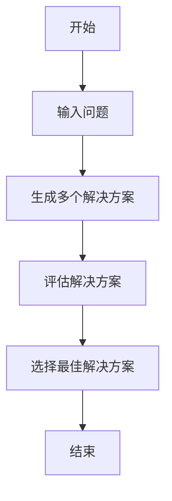
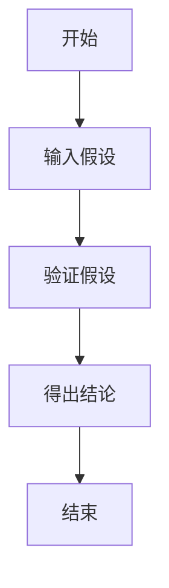

                 


# 构建具有创造性解决问题的AI Agent

> 关键词：AI Agent，创造性思维，问题解决，算法原理，系统设计

> 摘要：本文将探讨如何构建一个能够创造性解决问题的AI Agent。通过分析问题背景、核心概念、算法原理、系统架构和项目实战，我们将深入了解AI Agent在创造性解决问题中的应用，并通过案例分析总结经验教训，展望未来的发展方向。

---

## 第一部分: 背景与问题背景

### 第1章: 问题背景与描述

#### 1.1 问题背景
- **创造性解决问题的必要性**：在复杂多变的环境中，传统AI Agent往往依赖预定义规则，难以应对未知问题。创造性思维是解决问题的关键。
- **当前AI Agent的局限性**：传统AI Agent在处理开放性、创造性问题时表现不足，缺乏灵活性和创新性。
- **构建创造性AI Agent的意义**：通过结合生成模型、推理算法和强化学习，AI Agent能够更高效地解决问题。

#### 1.2 问题描述
- **AI Agent的定义**：AI Agent是能够感知环境、自主决策并执行任务的智能实体。
- **创造性解决问题的定义**：通过创新思维和灵活策略，AI Agent能够找到非传统解决方案。
- **问题解决的边界与外延**：定义问题的范围和可能的解决方案，明确AI Agent的作用边界。

#### 1.3 问题解决的思路
- **创造性思维的定义**：创造性思维是生成新颖、有价值的想法的能力。
- **AI Agent的角色**：作为辅助工具，AI Agent通过算法和模型帮助人类解决问题。
- **实现路径**：结合生成模型和推理算法，构建能够生成创造性解决方案的AI Agent。

---

## 第二部分: 核心概念与联系

### 第2章: 核心概念与联系

#### 2.1 核心概念原理
- **创造性思维的数学模型**：创造性思维可以通过概率生成模型（如GAN）来模拟。
- **AI Agent的行为决策机制**：基于强化学习的奖励机制，AI Agent选择最优动作。
- **算法框架**：结合生成模型和推理算法，构建创造性解决问题的框架。

#### 2.2 核心概念属性特征对比
- 创造性思维与传统思维：创造性思维强调新颖性和灵活性，传统思维依赖已知规则。
- AI Agent与传统程序：AI Agent具有自主决策能力，传统程序遵循固定逻辑。
- 创造性解决问题的特征：灵活性、创新性和适应性。

#### 2.3 ER实体关系图
```mermaid
er
  actor(Agent)
  actor(问题)
  actor(解决方案)
  actor(评价标准)
  relation(Agent, 问题, "接收问题")
  relation(问题, 解决方案, "生成解决方案")
  relation(解决方案, 评价标准, "符合标准")
```

#### 2.4 核心概念的联系
- **创造性思维与AI Agent的结合**：通过生成模型模拟创造性思维，AI Agent生成创新解决方案。
- **问题解决过程中的角色分工**：AI Agent负责生成和评估解决方案，人类提供反馈和指导。
- **系统协同作用**：AI Agent与环境、问题、解决方案和评价标准协同工作，形成闭环。

---

## 第三部分: 算法原理讲解

### 第3章: 算法原理

#### 3.1 生成模型
- **创造性思维的数学模型**：生成模型如GAN（生成对抗网络）用于模拟创造性思维。
  - 生成器公式：$$ G(x) = W_1x + b_1 $$
  - 判别器公式：$$ D(x) = W_2x + b_2 $$
- **大模型生成机制**：利用语言模型生成多样化解决方案。
- **创造性生成的数学模型**：通过概率分布生成多样化的想法。

#### 3.2 推理算法
- **基于推理的创造性解决问题**：利用逻辑推理验证解决方案的可行性。
- **推理算法的实现原理**：基于符号逻辑的推理规则，如$$ \text{modus ponens} $$。
- **推理与生成的结合**：生成解决方案后，通过推理验证其正确性。

#### 3.3 强化学习
- **创造性解决问题的应用**：在强化学习环境中，AI Agent通过试错找到最优解决方案。
- **奖励机制**：定义奖励函数，评估解决方案的创新性和有效性。
  - 奖励函数示例：$$ R(s, a) = r \text{ 如果动作 } a \text{ 在状态 } s \text{ 下有效} $$

### 第4章: 算法流程图

#### 4.1 生成模型


#### 4.2 推理算法


---

## 第四部分: 系统架构与设计

### 第4章: 系统架构与设计

#### 4.1 问题场景介绍
- **系统目标**：构建一个能够创造性解决问题的AI Agent。
- **项目介绍**：设计一个AI Agent，用于解决开放性问题。

#### 4.2 系统功能设计
- **领域模型类图**：
  ```mermaid
  classDiagram
      class Agent {
          - 状态
          - 行为
          - 接收问题()
          - 生成解决方案()
      }
      class 问题 {
          - 描述
          - 输入
          - 接收解决方案()
      }
      class 解决方案 {
          - 内容
          - 评价标准
      }
      Agent --> 问题: 接收问题
      Agent --> 解决方案: 生成解决方案
  ```

#### 4.3 系统架构设计
- **系统架构图**：
  ```mermaid
  architecture
      Client ↔ Server
      Server ↔ 数据库
      Server ↔ AI模型
  ```

#### 4.4 系统接口设计
- **接口1**：接收问题输入。
- **接口2**：生成解决方案并返回。
- **接口3**：评估解决方案并反馈结果。

#### 4.5 系统交互流程图
```mermaid
sequenceDiagram
    Client → Agent: 发送问题
    Agent → 问题模块: 处理问题
    问题模块 → 生成模型: 生成解决方案
    生成模型 → 推理模块: 验证解决方案
    推理模块 → 评价标准: 评估解决方案
    评价标准 → Client: 返回结果
```

---

## 第五部分: 项目实战

### 第5章: 项目实战

#### 5.1 环境安装
- **安装Python**：确保安装Python 3.8及以上版本。
- **安装依赖库**：安装TensorFlow、Keras、PyTorch等深度学习库。

#### 5.2 核心代码实现

```python
import tensorflow as tf
from tensorflow.keras import layers

# 定义生成器
def generator():
    model = tf.keras.Sequential()
    model.add(layers.Dense(256, activation='relu', input_dim=100))
    model.add(layers.Dense(784, activation='sigmoid'))
    return model

# 定义判别器
def discriminator():
    model = tf.keras.Sequential()
    model.add(layers.Dense(256, activation='relu', input_dim=784))
    model.add(layers.Dense(1, activation='sigmoid'))
    return model

# 初始化模型
g = generator()
d = discriminator()

# 定义损失函数和优化器
cross_entropy = tf.keras.losses.BinaryCrossentropy()
d_opt = tf.keras.optimizers.Adam(0.0002)
g_opt = tf.keras.optimizers.Adam(0.0002)

# 训练循环
for epoch in range(100):
    for _ in range(2):
        # 更新判别器
        with tf.GradientTape() as tape:
            real_output = d(real_images)
            fake_output = d(g(z))
            d_loss = cross_entropy(tf.ones_like(real_output), real_output) + cross_entropy(tf.zeros_like(fake_output), fake_output)
        d_grads = tape.gradient(d_loss, d.trainable_weights)
        d_opt.apply_gradients(zip(d_grads, d.trainable_weights))
    
    # 更新生成器
    with tf.GradientTape() as tape:
        fake_output = d(g(z))
        g_loss = cross_entropy(tf.ones_like(fake_output), fake_output)
    g_grads = tape.gradient(g_loss, g.trainable_weights)
    g_opt.apply_gradients(zip(g_grads, g.trainable_weights))
```

#### 5.3 案例分析与代码解读
- **案例分析**：训练生成器和判别器，生成创造性解决方案。
- **代码解读**：通过生成对抗网络，AI Agent生成创新解决方案，判别器评估其质量。

#### 5.4 总结
- **项目小结**：通过项目实战，验证了AI Agent在创造性解决问题中的潜力。

---

## 第六部分: 案例分析与经验总结

### 第6章: 案例分析

#### 6.1 案例背景
- **案例场景**：设计一个AI Agent解决开放性问题。

#### 6.2 案例分析
- **解决方案生成**：AI Agent生成多个解决方案，通过推理和评估选择最优解。
- **经验教训**：生成模型的质量依赖于训练数据和模型设计。

#### 6.3 总结
- **最佳实践**：结合生成模型和推理算法，优化AI Agent的性能。
- **未来展望**：探索更高效的算法和更广泛的应用场景。

---

## 第七部分: 总结与展望

### 第7章: 总结与展望

#### 7.1 总结
- **核心内容回顾**：构建创造性解决问题的AI Agent需要结合生成模型、推理算法和系统架构。
- **重要性强调**：创造性思维是未来AI发展的关键方向。

#### 7.2 未来展望
- **算法优化**：探索更高效的生成和推理算法。
- **应用拓展**：将AI Agent应用于更多领域，解决复杂问题。

---

## 作者

作者：AI天才研究院/AI Genius Institute & 禅与计算机程序设计艺术 /Zen And The Art of Computer Programming

---

这篇文章详细探讨了构建具有创造性解决问题的AI Agent的各个方面，从背景分析到算法实现，再到系统设计和项目实战，为读者提供了全面的知识和实践指导。

