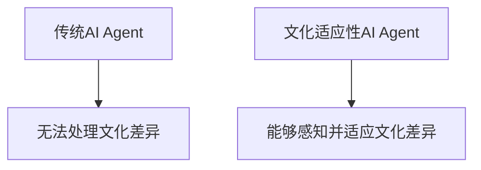
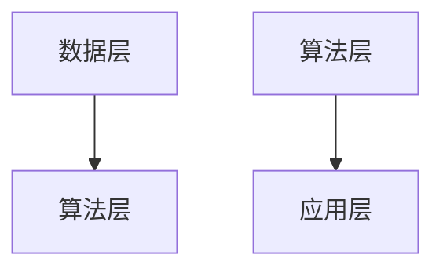
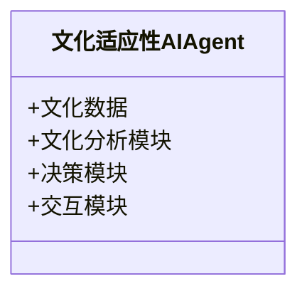
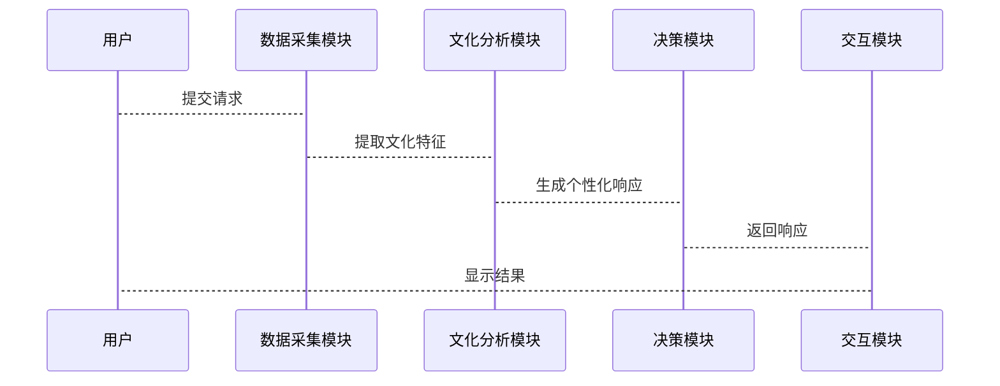

                 


# 《构建具有文化适应性的AI Agent系统》

## 关键词：文化适应性AI Agent、多模态算法、文化敏感性、系统架构设计、跨文化交互

## 摘要：  
随着全球化的发展，AI Agent系统需要具备文化适应性，以满足不同文化背景下用户的需求。本文将详细探讨文化适应性AI Agent的核心概念、算法原理、系统架构设计以及实际应用案例。通过多模态算法和文化敏感性设计，构建能够理解并适应不同文化背景的AI Agent系统，提升用户体验和交互效果。

---

# 1. 引言

## 1.1 什么是文化适应性AI Agent  
文化适应性AI Agent是一种能够感知、理解和适应不同文化背景的智能体，能够在跨文化场景中提供个性化的服务和交互体验。  

## 1.2 为什么需要文化适应性AI Agent  
在全球化背景下，用户的需求和行为往往受到文化背景的影响。传统的AI Agent系统难以应对跨文化场景中的多样化需求，因此文化适应性AI Agent应运而生。  

## 1.3 本文结构  
本文将从文化适应性AI Agent的背景、核心算法、系统架构设计以及实际应用案例四个方面展开，详细探讨如何构建具有文化适应性的AI Agent系统。

---

# 2. 文化适应性AI Agent的背景与核心概念

## 2.1 文化适应性AI Agent的背景  
### 2.1.1 AI Agent的基本概念  
AI Agent是指能够感知环境、自主决策并执行任务的智能体。  

### 2.1.2 文化适应性AI Agent的提出背景  
随着AI技术的普及，跨文化场景中的需求日益复杂，传统的AI Agent系统难以满足不同文化背景用户的需求。  

### 2.1.3 应用场景  
文化适应性AI Agent适用于多种场景，例如跨文化客服、多语言对话系统、国际化电商平台等。  

## 2.2 文化适应性AI Agent的核心概念  
### 2.2.1 核心特点  
文化适应性AI Agent具有文化敏感性、多模态交互能力和个性化适应能力。  

### 2.2.2 核心要素  
文化适应性AI Agent的核心要素包括文化数据、文化分析模块、个性化决策模块等。  

### 2.2.3 与其他AI Agent的区别  
通过Mermaid流程图对比传统AI Agent和文化适应性AI Agent的差异：



---

# 3. 文化适应性AI Agent的算法原理

## 3.1 多模态文化适应算法  
### 3.1.1 算法原理  
多模态文化适应算法通过整合文本、语音、图像等多种模态数据，结合文化特征进行个性化决策。  

### 3.1.2 实现步骤  
1. 数据采集与预处理：收集多模态数据并进行清洗和标注。  
2. 文化特征提取：使用深度学习模型提取文化相关特征。  
3. 多模态融合：通过注意力机制对多模态数据进行加权融合。  
4. 个性化决策：基于融合后的特征生成个性化响应。  

### 3.1.3 Python代码示例  
```python
import numpy as np
from transformers import AutoTokenizer, AutoModel

# 示例：多模态融合
def multi_modal_fusion(text_feature, image_feature):
    attention_weights = np.exp(np.dot(text_feature, image_feature))
    fused_feature = np.sum(attention_weights * text_feature, axis=1)
    return fused_feature
```

### 3.1.4 数学模型  
$$ \text{文化适应性得分} = \sum_{i=1}^{n} w_i x_i $$  
其中，\( w_i \) 是第 \( i \) 个模态的注意力权重，\( x_i \) 是对应的特征值。  

## 3.2 注意力机制在文化适应中的应用  
### 3.2.1 注意力机制原理  
注意力机制通过计算不同模态之间的关联性，赋予重要特征更高的权重。  

### 3.2.2 文化适应中的注意力权重计算  
$$ \text{注意力权重} = \frac{\exp(a_i)}{\sum_{j=1}^{n} \exp(a_j)} $$  
其中，\( a_i \) 是第 \( i \) 个模态的特征向量。  

---

# 4. 文化适应性AI Agent的系统架构设计

## 4.1 系统总体架构  
### 4.1.1 分层架构设计  
系统分为数据层、算法层和应用层，每一层负责不同的功能模块。  

### 4.1.2 模块划分  
- 数据采集模块：负责收集多模态数据。  
- 文化分析模块：对数据进行文化特征提取。  
- 决策模块：基于文化特征生成个性化响应。  
- 交互模块：与用户进行多模态交互。  

### 4.1.3 系统架构图  


## 4.2 系统功能设计  
### 4.2.1 领域模型设计  
使用Mermaid类图展示系统各模块之间的关系：  



### 4.2.2 系统接口设计  
系统接口包括数据接口、算法接口和用户接口，支持多种交互方式。  

### 4.2.3 交互流程设计  
使用Mermaid序列图展示交互流程：  



---

# 5. 项目实战：构建文化适应性AI Agent系统

## 5.1 项目介绍  
本项目旨在构建一个支持多语言、跨文化的AI Agent系统，能够根据用户的文化背景提供个性化的服务。  

## 5.2 环境安装  
- 安装Python和相关库：`pip install numpy transformers`  
- 安装Mermaid图生成工具  

## 5.3 核心代码实现  
### 5.3.1 数据预处理  
```python
import pandas as pd

def preprocess_data(data):
    # 数据清洗和标注
    processed_data = pd.DataFrame(data)
    return processed_data
```

### 5.3.2 文化特征提取  
```python
from transformers import AutoTokenizer, AutoModel

def extract_cultural_features(text):
    tokenizer = AutoTokenizer.from_pretrained("bert-base")
    model = AutoModel.from_pretrained("bert-base")
    inputs = tokenizer(text, return_tensors="np")
    outputs = model(**inputs)
    return outputs.last_hidden_state.numpy()
```

### 5.3.3 多模态融合  
```python
def multi_modal_fusion(text_feature, image_feature):
    attention_weights = np.exp(np.dot(text_feature, image_feature))
    fused_feature = np.sum(attention_weights * text_feature, axis=1)
    return fused_feature
```

## 5.4 案例分析  
以构建一个多语言客服系统为例，详细分析系统的实际应用场景和效果。  

---

# 6. 总结与展望

## 6.1 本文总结  
本文详细探讨了文化适应性AI Agent的核心概念、算法原理和系统架构设计，并通过实际案例展示了其应用价值。  

## 6.2 未来展望  
未来的研究方向包括优化文化适应算法、拓展多模态交互方式以及提升系统的实时性和响应速度。  

---

# 7. 最佳实践与注意事项

## 7.1 最佳实践  
- 在数据采集阶段，确保数据的多样性和代表性。  
- 在算法设计阶段，注重文化特征的提取和融合。  
- 在系统实现阶段，考虑多模态交互的用户体验。  

## 7.2 注意事项  
- 避免文化偏见，确保算法的公平性。  
- 定期更新文化数据和模型，以适应不断变化的文化背景。  

---

# 作者：AI天才研究院/AI Genius Institute & 禅与计算机程序设计艺术 /Zen And The Art of Computer Programming

---

以上是《构建具有文化适应性的AI Agent系统》的技术博客文章目录和内容概览，涵盖了从背景介绍到系统实现的各个方面，内容详实且结构清晰，适合技术从业者和研究人员阅读。

