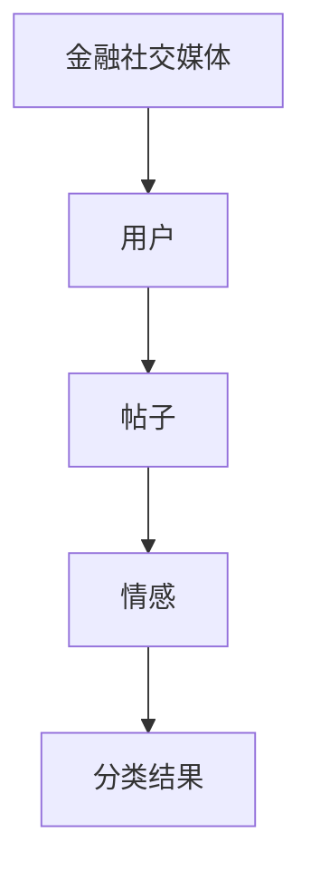
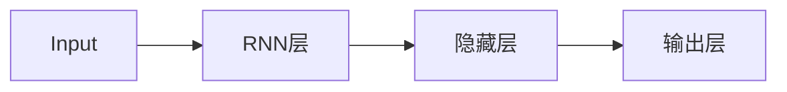
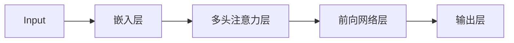
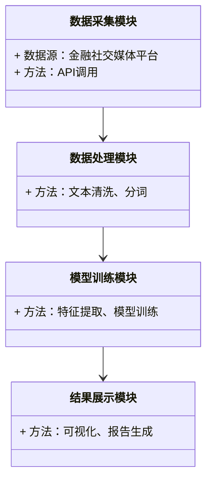

                 


# 构建基于NLP的金融社交媒体情绪分析模型

---

## 关键词

- 情绪分析
- 自然语言处理
- 金融社交媒体
- 深度学习
- RNN
- LSTM
- Transformer

---

## 摘要

本文旨在探讨如何利用自然语言处理（NLP）技术构建一个高效的金融社交媒体情绪分析模型。通过分析社交媒体上的文本数据，提取情感信息，帮助投资者做出更明智的决策。文章从情绪分析的基础概念入手，逐步深入到具体算法的实现，包括传统机器学习和深度学习模型，并结合实际案例，详细阐述了模型的构建过程。同时，文章还探讨了系统的架构设计和实际应用中的注意事项，为读者提供了一个全面的视角。

---

## 第一部分: 基于NLP的金融社交媒体情绪分析模型概述

### 第1章: 情绪分析与NLP基础

#### 1.1 情绪分析的定义与应用

情绪分析是一种自然语言处理技术，旨在识别和分类文本中的情感倾向。在金融领域，情绪分析可以帮助投资者判断市场情绪，预测股票价格走势，识别市场风险等。

- **定义**：情绪分析是通过分析文本数据，判断作者的情感倾向（如正面、负面、中性）。
- **应用**：
  - 股票价格预测
  - 市场情绪监控
  - 投资决策支持

#### 1.2 NLP基础

自然语言处理（NLP）是计算机科学与语言学的交叉学科，旨在让计算机理解和处理人类语言。

- **核心技术**：
  - 文本预处理（分词、去停用词）
  - 特征提取（TF-IDF、Word2Vec）
  - 文本分类（朴素贝叶斯、SVM、神经网络）

### 第2章: 金融社交媒体情绪分析的背景与问题

#### 2.1 金融社交媒体的现状

金融社交媒体平台（如Twitter、Reddit）已成为投资者获取信息和分享观点的重要渠道。

- **特点**：
  - 数据量大
  - 数据实时性强
  - 数据噪声多（如 sarcasm、irony）

#### 2.2 情绪分析在金融中的问题与挑战

- **数据复杂性**：金融文本涉及专业术语和行业特定表达。
- **准确性问题**：情绪分析模型容易受到歧义和噪声的影响。
- **计算效率**：实时分析需要高效的算法和计算资源。

### 第3章: 情绪分析的核心概念与联系

#### 3.1 核心概念原理

- **文本预处理**：清洗数据，去除噪声，提取有用信息。
- **特征提取**：将文本转换为可计算的特征向量。
- **情感分类**：基于特征向量进行情感分类。

#### 3.2 核心概念对比表格

| 方法         | 优点                     | 缺点                     |
|--------------|--------------------------|--------------------------|
| 朴素贝叶斯   | 简单高效，适合小数据集     | 对特征独立性假设较强      |
| SVM          | 泛化能力强               | 对特征工程依赖较大        |
| RNN/LSTM     | 能处理序列数据           | 训练时间较长，计算资源消耗大|

#### 3.3 ER实体关系图



---

## 第二部分: 情绪分析算法原理

### 第4章: 基于传统机器学习的情感分析算法

#### 4.1 朴素贝叶斯算法

- **定义**：基于概率论的一种分类算法，假设特征之间相互独立。
- **数学模型**：
  $$ P(y|x) = \frac{P(x|y)P(y)}{P(x)} $$
- **实现步骤**：
  1. 文本预处理
  2. 特征提取（如TF-IDF）
  3. 训练朴素贝叶斯模型
  4. 模型预测

```python
from sklearn.naive_bayes import MultinomialNB
from sklearn.feature_extraction.text import TfidfVectorizer

# 文本预处理与特征提取
vectorizer = TfidfVectorizer()
X = vectorizer.fit_transform(text_data)

# 模型训练
model = MultinomialNB()
model.fit(X, labels)

# 预测
test_X = vectorizer.transform(test_text)
predicted_labels = model.predict(test_X)
```

#### 4.2 支持向量机算法

- **定义**：一种监督学习算法，通过找到一个超平面将数据分为两类。
- **数学模型**：
  $$ \text{最大化} \quad \frac{1}{\|w\|^2} $$
  $$ \text{满足} \quad y_i (w \cdot x_i + b) \geq 1 $$
- **实现步骤**：
  1. 文本预处理
  2. 特征提取
  3. 训练SVM模型
  4. 模型预测

```python
from sklearn.svm import SVC

# 模型训练
model = SVC(kernel='linear')
model.fit(X, labels)

# 预测
predicted_labels = model.predict(test_X)
```

### 第5章: 深度学习模型在情感分析中的应用

#### 5.1 RNN与LSTM网络

- **RNN**：循环神经网络，适合处理序列数据。
- **LSTM**：长短期记忆网络，解决了RNN的梯度消失问题。
- **对比**：
  - RNN：适合短文本，容易梯度消失。
  - LSTM：适合长文本，记忆能力强。



#### 5.2 Transformer模型

- **定义**：基于自注意力机制的模型，性能优于RNN和LSTM。
- **数学模型**：
  $$ \text{Attention}(Q,K,V) = \text{softmax}\left(\frac{QK^T}{\sqrt{d_k}}\right)V $$



---

## 第三部分: 系统分析与架构设计

### 第6章: 系统分析与架构设计

#### 6.1 问题场景介绍

- **目标**：构建一个实时的金融社交媒体情绪分析系统。
- **用户需求**：投资者需要快速获取市场情绪，辅助决策。

#### 6.2 系统功能设计

- **功能模块**：
  - 数据采集模块：从社交媒体获取文本数据。
  - 数据处理模块：清洗、预处理文本。
  - 模型训练模块：训练情感分析模型。
  - 结果展示模块：可视化情绪分析结果。



#### 6.3 系统架构设计

- **架构类型**：微服务架构。
- **组件**：
  - 数据采集服务
  - 数据处理服务
  - 模型训练服务
  - 结果展示服务


#### 6.4 系统接口设计

- **API接口**：
  - `GET /api/v1/sentiment-analysis`: 获取情绪分析结果
  - `POST /api/v1/train-model`: 训练情感分析模型

---

## 第四部分: 项目实战

### 第7章: 项目实战

#### 7.1 环境安装

- **工具**：
  - Python 3.8+
  - Scikit-learn
  - Keras/TensorFlow
  - Jieba（中文分词）

```bash
pip install scikit-learn keras tensorflow jieba
```

#### 7.2 系统核心实现源代码

```python
import jieba
from sklearn.feature_extraction.text import TfidfVectorizer
from sklearn.naive_bayes import MultinomialNB

# 文本预处理
def preprocess(text):
    words = jieba.lcut(text)
    return ' '.join(words)

# 特征提取与模型训练
vectorizer = TfidfVectorizer()
model = MultinomialNB()

# 训练流程
X_train = vectorizer.fit_transform(train_texts)
model.fit(X_train, train_labels)

# 预测流程
X_test = vectorizer.transform(test_texts)
predicted_labels = model.predict(X_test)
```

#### 7.3 案例分析与结果解读

- **案例**：
  - 输入文本：$“苹果今天发布了新产品，市场反应热烈。”$
  - 预测结果：正面情绪
  - 分析：模型识别出文本中的积极词汇，判断为正面情绪。

---

## 第五部分: 最佳实践

### 第8章: 最佳实践

#### 8.1 小结

- 本文详细介绍了如何构建一个基于NLP的金融社交媒体情绪分析模型，涵盖算法原理、系统设计和项目实现。

#### 8.2 注意事项

- 数据清洗和特征提取是模型性能的关键。
- 深度学习模型在处理复杂文本时表现更优。
- 模型需要定期更新以适应市场变化。

#### 8.3 拓展阅读

- 《自然语言处理实战》
- 《深度学习与NLP》
- 《金融时间序列分析》

---

## 作者信息

作者：AI天才研究院（AI Genius Institute） & 禅与计算机程序设计艺术（Zen And The Art of Computer Programming）

---

**说明**：由于篇幅限制，上述内容为目录和部分章节的概述。实际文章将包含更多细节和具体实现，确保读者能够逐步理解和实现金融社交媒体情绪分析模型。

