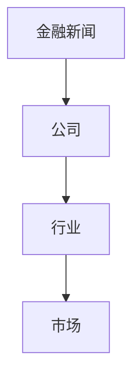
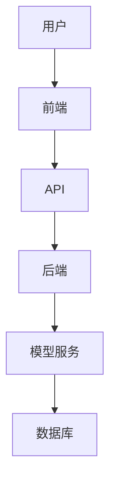

                 

# 构建基于大模型的金融新闻分析引擎

## 关键词：大模型，金融新闻分析，自然语言处理，系统架构，算法实现，金融数据

## 摘要：本文将详细探讨如何构建一个基于大模型的金融新闻分析引擎。首先，我们将介绍金融新闻分析的背景、挑战及其重要性。接着，我们将深入分析大模型在金融领域的应用，探讨其算法原理和数学模型。随后，我们将设计系统的架构，并通过项目实战展示如何搭建、训练和优化模型。最后，我们将总结整个过程，并展望未来的发展方向。

## 第一部分: 金融新闻分析的背景与挑战

### 第1章: 金融新闻分析的背景

#### 1.1 金融市场的复杂性与信息的重要性
金融市场是一个高度复杂和动态变化的环境，每天都有大量信息影响市场走势。金融新闻分析对于理解市场动态、做出投资决策至关重要。

#### 1.2 传统金融分析的局限性
传统金融分析方法依赖于历史数据和统计模型，但难以处理非结构化数据和复杂语义，导致分析结果的局限性。

#### 1.3 大模型在金融分析中的潜力
大模型在自然语言处理方面取得了突破，能够理解和分析复杂文本，为金融新闻分析提供了新的可能性。

### 第2章: 问题背景与目标

#### 2.1 问题背景
金融新闻分析的核心任务包括情感分析、关键词提取、实体识别等，这些任务对于投资决策至关重要。

#### 2.2 问题描述
大模型在金融新闻分析中的应用需要解决数据处理、模型训练、结果解释等问题。

#### 2.3 问题解决
通过大模型的强大处理能力，可以有效提取文本信息，提供更精准的市场分析和投资建议。

### 第3章: 核心概念与联系

#### 3.1 核心概念原理
大模型通过Transformer架构和注意力机制，能够有效处理长文本，捕捉语义信息。

#### 3.2 核心概念属性特征对比
| 特性   | 传统方法          | 大模型方法         |
|--------|-------------------|------------------|
| 数据需求 | 小样本，结构化     | 大样本，非结构化   |
| 处理速度 | 较慢              | 较快              |
| 精度     | 有限              | 更高              |

#### 3.3 ER实体关系图架构

## 第二部分: 大模型算法原理与数学模型

### 第4章: 大模型的算法原理

#### 4.1 大模型的核心算法
大模型采用Transformer架构，通过自注意力机制捕捉文本中的语义关系。

#### 4.2 大模型的训练过程
训练过程包括数据预处理、模型初始化、正向传播、损失计算、反向传播和参数更新。

### 第5章: 数学模型与公式

#### 5.1 大模型的数学模型
大模型的核心是Transformer，其注意力机制由以下公式定义：
$$ \text{Attention}(Q, K, V) = \text{softmax}\left(\frac{QK^T}{\sqrt{d_k}}\right)V $$

#### 5.2 梯度下降算法
使用Adam优化器进行模型训练，损失函数为交叉熵损失：
$$ \text{Loss} = -\sum_{i=1}^{n} y_i \log p(y_i) + (1-y_i)\log(1-p(y_i)) $$

### 第6章: 金融新闻分析的算法实现

#### 6.1 金融新闻分析的算法选择
选择基于大模型的文本分类算法，用于情感分析和主题分类。

## 第三部分: 系统架构设计

### 第7章: 系统需求分析

#### 7.1 问题场景
金融新闻分析系统需要处理大量文本数据，提供实时分析结果。

#### 7.2 项目介绍
构建一个基于大模型的金融新闻分析引擎，实现新闻分类、情感分析和实体识别。

#### 7.3 系统功能设计
系统功能包括数据采集、预处理、模型训练、结果分析和可视化。

### 第8章: 系统架构设计

#### 8.1 系统架构图

### 第9章: 接口设计与交互

#### 9.1 系统接口设计
系统接口包括数据接口、模型调用接口和结果展示接口。

#### 9.2 交互流程
用户输入新闻文本，系统返回分析结果，包括情感倾向和相关实体。

## 第四部分: 项目实战

### 第10章: 项目实战

#### 10.1 环境搭建
安装Python、TensorFlow和相关库，配置GPU环境。

#### 10.2 数据准备
收集和清洗金融新闻数据，进行分词和标注。

#### 10.3 模型训练
训练大模型，调整超参数，评估模型性能。

#### 10.4 结果分析与优化
分析模型结果，优化算法，提升准确率。

## 第五部分: 总结与展望

### 第11章: 总结与展望

#### 11.1 项目总结
总结项目实现过程，评估系统性能，分析存在的问题。

#### 11.2 未来展望
探讨大模型在金融新闻分析中的未来发展，提出改进方向。

### 第12章: 最佳实践与注意事项

#### 12.1 最佳实践
建议使用高质量数据，合理选择模型参数，定期更新模型。

#### 12.2 注意事项
注意数据隐私，避免过拟合，监控模型性能。

## 作者：AI天才研究院 & 禅与计算机程序设计艺术

---

这个目录结构涵盖了构建基于大模型的金融新闻分析引擎的各个方面，确保内容详尽且逻辑清晰。每一章都详细展开，提供必要的技术细节和实例，帮助读者全面理解和应用相关知识。

