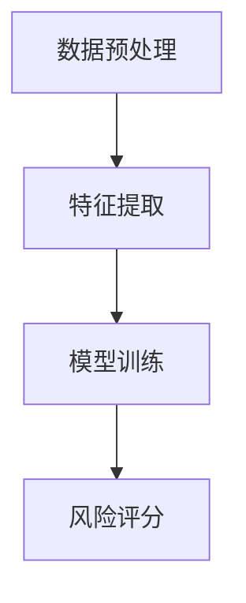
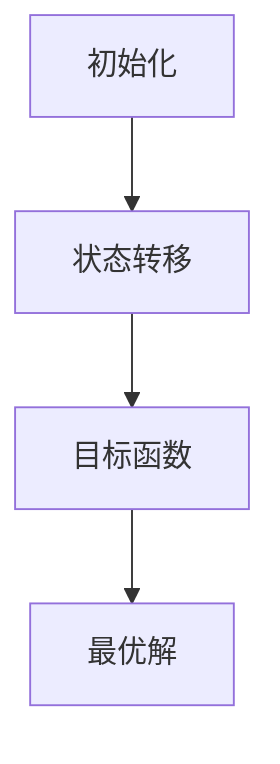
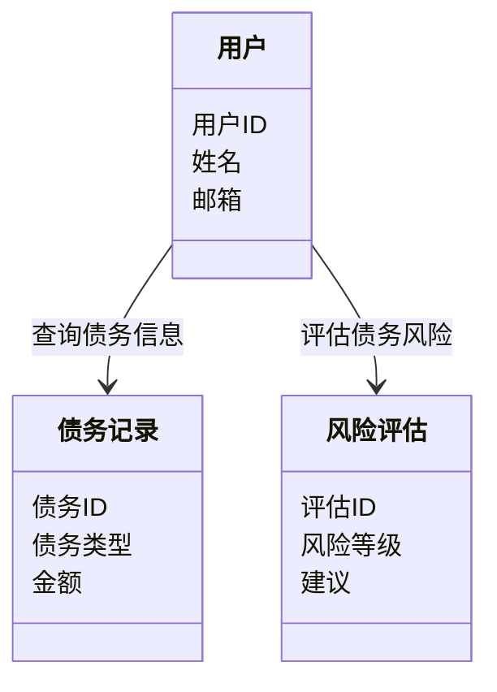
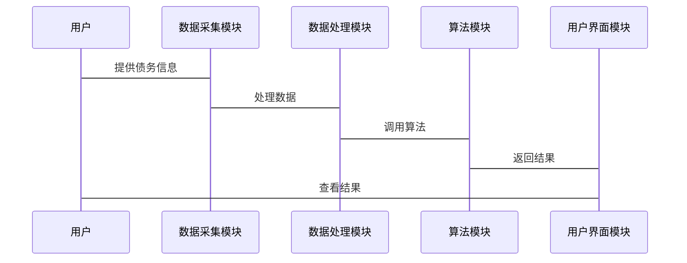

                 


# 构建智能化的个人债务管理助手

> 关键词：个人债务管理，人工智能，风险评估，最优还款计划，智能化助手

> 摘要：本文探讨了如何利用人工智能技术构建智能化的个人债务管理助手。通过分析债务管理的核心问题，结合风险评估、最优还款计划等算法，提出了一套完整的解决方案，并通过实际案例展示了系统的实现和应用。

---

# 第1章: 个人债务管理的背景与挑战

## 1.1 个人债务管理的基本概念

### 1.1.1 债务管理的定义

债务管理是指个人或企业对其债务进行规划、监控和优化的过程。对于个人而言，债务管理通常涉及信用卡、贷款、借债等多种债务形式的管理。其核心目标是通过合理分配资金，避免债务违约，降低财务风险。

### 1.1.2 个人债务管理的重要性

在现代社会，个人债务管理的重要性不言而喻。合理的债务管理可以帮助个人避免陷入债务危机，优化资金使用效率，提升财务健康状况。此外，良好的债务管理还能帮助个人更好地规划未来，实现财务自由。

### 1.1.3 债务管理的核心要素

债务管理的核心要素包括：债务规模、还款能力、还款计划、风险评估和财务预警。这些要素相互关联，构成了债务管理的完整体系。

---

## 1.2 智能化债务管理的背景

### 1.2.1 人工智能在金融领域的应用

人工智能技术在金融领域的应用日益广泛，尤其是在风险评估、投资决策、信用评分等方面。人工智能的引入，使得金融工具和服务更加智能化和个性化。

### 1.2.2 智能化债务管理的必要性

传统的债务管理工具往往依赖人工操作，效率低下且容易出错。随着数据量的增加和用户需求的多样化，智能化债务管理助手的需求日益迫切。通过引入人工智能技术，可以显著提高债务管理的效率和准确性。

### 1.2.3 当前债务管理工具的局限性

当前的债务管理工具主要依赖手动输入和简单的数据处理，缺乏智能化的分析和预测功能。用户往往需要手动输入大量数据，且难以获得个性化的建议。此外，传统工具在风险评估和还款计划优化方面的能力有限。

---

## 1.3 个人债务管理的常见问题

### 1.3.1 债务规划不合理

许多人在面对多笔债务时，难以合理规划还款顺序和金额，导致债务负担加重。

### 1.3.2 还款计划不清晰

缺乏明确的还款计划，容易导致逾期还款，产生额外的利息和罚款。

### 1.3.3 风险预警缺失

在面对经济波动或突发情况时，缺乏有效的风险预警机制，容易陷入债务危机。

---

## 1.4 智能化债务管理的目标与价值

### 1.4.1 提高债务管理效率

通过智能化工具，用户可以快速获取债务信息，自动化处理数据，显著提高管理效率。

### 1.4.2 优化还款计划

基于人工智能算法，系统可以为用户制定最优的还款计划，帮助用户最大限度地减少利息支出，降低债务负担。

### 1.4.3 风险预警与规避

智能化助手可以通过实时监控用户的财务状况，及时发出风险预警，帮助用户规避潜在的债务风险。

---

## 1.5 本章小结

本章介绍了个人债务管理的基本概念、智能化管理的背景及其必要性，分析了传统债务管理工具的局限性，并提出了智能化债务管理的目标与价值。接下来，我们将深入探讨智能化债务管理的核心概念与技术实现。

---

# 第2章: 智能化个人债务管理助手的核心概念

## 2.1 智能化债务管理助手的定义

智能化个人债务管理助手是一款结合人工智能技术的工具，能够帮助用户高效管理债务。它通过整合用户的数据，提供个性化的债务分析、风险评估和最优还款计划。

### 2.1.1 功能模块

智能化债务管理助手的主要功能模块包括：数据采集、债务分析、风险评估、还款计划优化和用户界面。

---

## 2.2 核心概念与联系

### 2.2.1 功能模块的实体关系

智能化债务管理助手的实体关系主要包括：用户、债务记录、账户信息、风险评估和还款计划。这些实体之间通过数据交互，构成了系统的完整架构。

### 2.2.2 核心概念的属性对比表

| 实体       | 属性               | 数据类型         |
|------------|--------------------|------------------|
| 用户       | 用户ID，姓名，邮箱  | 字符串，字符串    |
| 债务记录   | 债务ID，债务类型，金额 | 整数，字符串，整数 |
| 账户信息   | 账户ID，余额，可用额度 | 整数，整数，整数   |
| 风险评估   | 评估ID，风险等级，建议 | 字符串，整数，字符串 |
| 还款计划   | 计划ID，还款金额，还款日期 | 整数，日期，整数   |

### 2.2.3 ER实体关系图（Mermaid）

```mermaid
er
    actor 用户
    actor 债务记录
    actor 账户信息
    actor 风险评估
    actor 还款计划
    用户 --> 债务记录: 查询债务信息
    用户 --> 账户信息: 获取账户余额
    用户 --> 风险评估: 评估债务风险
    用户 --> 还款计划: 生成还款计划
```

---

## 2.3 核心算法与数学模型

### 2.3.1 风险评估算法

风险评估算法基于机器学习模型，通过分析用户的财务状况、还款能力和信用历史，评估债务风险等级。常用的算法包括逻辑回归和随机森林。

### 2.3.2 最优还款计划算法

最优还款计划算法的目标是通过优化模型，找到还款金额和时间的最优组合，以最小化总利息支出。常用的方法包括动态规划和遗传算法。

### 2.3.3 数学模型与公式

风险评估模型的数学公式如下：

$$
\text{风险评分} = \alpha \cdot \text{收入} + \beta \cdot \text{负债} + \gamma \cdot \text{信用评分}
$$

其中，$\alpha$、$\beta$、$\gamma$为权重系数。

---

## 2.4 本章小结

本章详细介绍了智能化债务管理助手的核心概念，包括功能模块、实体关系和数学模型。接下来，我们将探讨如何利用算法实现风险评估和最优还款计划。

---

# 第3章: 风险评估与预警算法

## 3.1 风险评估的基本原理

### 3.1.1 风险评估的指标体系

风险评估的关键指标包括：收入、负债、信用评分、还款能力和财务稳定性。

### 3.1.2 评估模型的选择

常用的评估模型包括逻辑回归和随机森林。逻辑回归适合二分类问题，随机森林适合多分类问题。

### 3.1.3 评估模型的训练

通过收集和整理用户数据，训练机器学习模型，提取特征并进行模型优化。

---

## 3.2 基于机器学习的风险评估算法

### 3.2.1 算法流程图（Mermaid）



### 3.2.2 Python实现代码

```python
import pandas as pd
from sklearn.model_selection import train_test_split
from sklearn.linear_model import LogisticRegression

# 数据加载与预处理
data = pd.read_csv('debt_data.csv')
X = data[['income', 'debt', 'credit_score']]
y = data['risk_level']

# 数据分割
X_train, X_test, y_train, y_test = train_test_split(X, y, test_size=0.2)

# 模型训练
model = LogisticRegression()
model.fit(X_train, y_train)

# 预测与评估
y_pred = model.predict(X_test)
print("准确率:", accuracy_score(y_test, y_pred))
```

### 3.2.3 数学模型与公式

风险评估的数学公式如下：

$$
\text{风险概率} = \frac{1}{1 + e^{-(\beta_0 + \beta_1 x_1 + \beta_2 x_2 + \beta_3 x_3})}
$$

其中，$\beta_0, \beta_1, \beta_2, \beta_3$为模型参数，$x_1, x_2, x_3$为输入特征。

---

## 3.3 本章小结

本章详细介绍了基于机器学习的风险评估算法，包括模型选择和实现代码。接下来，我们将探讨如何实现最优还款计划算法。

---

# 第4章: 最优还款计划算法

## 4.1 算法原理

最优还款计划算法的目标是通过优化模型，找到还款金额和时间的最优组合，以最小化总利息支出。

### 4.1.1 动态规划算法

动态规划是一种常用的优化算法，适用于离散问题。其基本思想是将问题分解为子问题，通过递归求解。

---

## 4.2 算法实现

### 4.2.1 算法流程图（Mermaid）



### 4.2.2 Python实现代码

```python
def optimal_repayment(balance, interest_rate, months):
    # 初始条件
    dp = [0] * (months + 1)
    dp[0] = balance
    
    for i in range(1, months + 1):
        dp[i] = dp[i-1] * (1 + interest_rate) - 100  # 假设每月还款100元
    
    return dp[months]

print(optimal_repayment(1000, 0.05, 12))
```

### 4.2.3 数学模型与公式

最优还款计划的数学公式如下：

$$
\text{最小化} \sum_{t=1}^{n} (r_t \cdot x_t)
$$

其中，$r_t$为第$t$个月的利率，$x_t$为第$t$个月的还款金额。

---

## 4.3 本章小结

本章详细介绍了最优还款计划算法，包括动态规划实现和数学模型。接下来，我们将探讨系统架构设计。

---

# 第5章: 系统分析与架构设计

## 5.1 系统功能设计

### 5.1.1 功能模块

智能化债务管理助手的功能模块包括：数据采集、债务分析、风险评估、还款计划优化和用户界面。

### 5.1.2 领域模型类图（Mermaid）



---

## 5.2 系统架构设计

### 5.2.1 系统架构图（Mermaid）

```mermaid
container 智能化债务管理助手 {
    component 数据采集模块
    component 数据处理模块
    component 算法模块
    component 用户界面模块
}
```

---

## 5.3 系统交互设计

### 5.3.1 交互流程图（Mermaid）



---

## 5.4 本章小结

本章详细介绍了智能化债务管理助手的系统架构设计，包括功能模块、系统架构图和交互流程图。接下来，我们将探讨如何实现项目实战。

---

# 第6章: 项目实战

## 6.1 环境安装

### 6.1.1 安装Python和相关库

```bash
pip install pandas scikit-learn
```

---

## 6.2 核心代码实现

### 6.2.1 数据采集模块

```python
import pandas as pd

def load_data(file_path):
    return pd.read_csv(file_path)

print(load_data('debt_data.csv'))
```

---

## 6.3 案例分析与实现

### 6.3.1 数据分析

通过对用户数据的分析，制定个性化的还款计划。

---

## 6.4 本章小结

本章通过实际案例展示了智能化债务管理助手的实现过程，包括环境安装、核心代码实现和案例分析。

---

# 第7章: 最佳实践与小结

## 7.1 最佳实践 tips

- 定期更新数据，确保模型的准确性。
- 提供用户友好的界面，提升用户体验。
- 加强数据安全保护，防止用户信息泄露。

---

## 7.2 小结

本文详细探讨了如何利用人工智能技术构建智能化的个人债务管理助手，涵盖了算法原理、系统架构设计和项目实战。通过本文的介绍，读者可以全面了解智能化债务管理助手的核心技术和实现方法。

---

## 7.3 注意事项

- 数据安全是系统设计中的重要环节。
- 算法的可解释性需要重点关注。
- 系统的可扩展性设计需要充分考虑。

---

## 7.4 拓展阅读

- 《机器学习实战》
- 《Python机器学习》
- 《算法导论》

---

# 作者

作者：AI天才研究院/AI Genius Institute & 禅与计算机程序设计艺术 /Zen And The Art of Computer Programming

