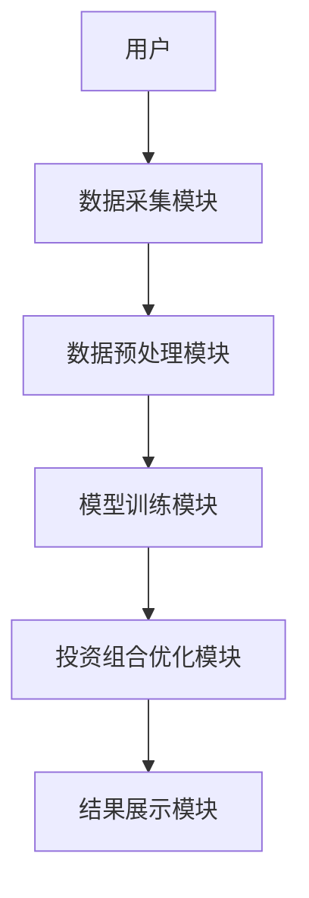

                 


# 构建智能化的个人投资组合ESG因素评估工具

> 关键词：智能化投资组合，ESG因素，机器学习，投资组合优化，风险管理

> 摘要：本文详细介绍了如何构建一个智能化的个人投资组合ESG因素评估工具。通过结合ESG（环境、社会、治理）投资理念与机器学习技术，提出了一种基于ESG评分的智能化投资组合优化方法。文章从ESG投资的背景与核心概念出发，详细探讨了数据收集与预处理、机器学习算法在ESG评估中的应用、ESG评分模型的构建与优化，以及智能化投资组合优化系统的整体架构设计。通过实际案例分析，展示了如何利用Python实现ESG评分模型，并基于模型结果构建最优投资组合。最后，本文总结了最佳实践、注意事项以及未来研究方向，为个人投资者提供了实用的指导与参考。

---

# 第一部分: 智能化投资组合与ESG评估基础

---

# 第1章: 个人投资组合与ESG概述

## 1.1 投资组合的基本概念

### 1.1.1 投资组合的定义与分类

投资组合是指将一定资金按照一定比例分配到不同资产或资产类别中的组合。常见的投资组合分类包括股票型、债券型、混合型、指数型等。投资组合的核心目标是在风险可控的前提下，实现收益的最大化。

### 1.1.2 个人投资组合的重要性

对于个人投资者而言，投资组合的重要性体现在以下几个方面：

1. **分散风险**：通过将资金分配到不同资产或行业，降低单一资产波动带来的风险。
2. **优化收益**：通过科学的资产配置，提高整体投资组合的收益。
3. **个性化需求**：根据个人的财务目标、风险承受能力和投资期限，制定个性化的投资策略。

### 1.1.3 投资组合的风险与收益平衡

投资组合的管理本质上是在风险与收益之间寻找平衡点。通过量化分析，投资者可以更好地理解不同资产之间的相关性，从而做出更明智的投资决策。

---

## 1.2 ESG投资的核心概念

### 1.2.1 环境（Environmental）因素

环境因素关注企业在环境保护方面的表现，包括碳排放、能源消耗、污染治理等方面。随着全球气候变化问题的加剧，环境因素在投资决策中的重要性日益凸显。

### 1.2.2 社会（Social）因素

社会因素关注企业在社会层面的表现，包括员工权益、劳动条件、社区关系、产品安全等方面。社会因素的评估有助于识别企业的社会责任履行情况。

### 1.2.3 治理（Governance）因素

治理因素关注企业的管理结构和治理机制，包括董事会构成、高管薪酬、股东权利、透明度等方面。良好的公司治理是企业长期稳定发展的基础。

---

## 1.3 ESG投资的背景与发展趋势

### 1.3.1 全球ESG投资的发展历程

ESG投资起源于20世纪60年代的环境运动，随着全球气候变化、社会不平等和公司治理问题的加剧，ESG投资逐渐从一种理念发展成为一种重要的投资策略。

### 1.3.2 ESG投资的现状与挑战

目前，全球ESG投资规模持续增长，但仍然面临数据不透明、评估标准不统一、实施难度大等问题。此外，ESG投资的短期收益与长期价值之间的矛盾也亟待解决。

### 1.3.3 ESG投资的未来趋势

未来，随着技术的进步和政策的支持，ESG投资将更加普及。同时，ESG数据的标准化和评估方法的科学化也将成为行业发展的重点。

---

## 1.4 本章小结

本章从投资组合的基本概念出发，详细介绍了ESG投资的核心理念，包括环境、社会和治理三个维度。同时，分析了ESG投资的背景、现状及未来发展趋势，为后续的ESG因素评估奠定了基础。

---

# 第2章: ESG因素与投资组合的关联性分析

## 2.1 ESG因素对投资组合的影响

### 2.1.1 ESG评分与投资收益的关系

研究表明，ESG评分较高的企业往往具有更低的财务风险和更强的长期盈利能力。因此，将ESG因素纳入投资组合的评估体系，有助于提高投资组合的长期收益。

### 2.1.2 ESG风险与投资组合的稳定性

ESG风险包括环境风险、社会风险和治理风险。通过评估投资组合中各资产的ESG风险，可以有效降低投资组合的整体波动性。

### 2.1.3 ESG因素对长期投资价值的影响

ESG因素不仅是企业社会责任的体现，更是企业长期价值的重要组成部分。忽视ESG因素可能导致投资组合面临更大的下行风险。

---

## 2.2 ESG投资的逻辑与框架

### 2.2.1 ESG投资的基本逻辑

ESG投资的基本逻辑是通过筛选具有较高ESG评分的企业，构建一个具有可持续发展潜力的投资组合。这种投资策略不仅关注企业的财务表现，还关注其社会责任履行情况。

### 2.2.2 ESG评估的标准化框架

为了确保ESG评估的科学性和可比性，需要建立统一的评估框架。常见的ESG评估框架包括GRI（全球报告倡议）、SASB（可持续会计准则委员会）和MSCI ESG评级等。

### 2.2.3 ESG数据的获取与处理

ESG数据的获取途径包括购买专业数据服务、使用开源数据集以及通过API接口获取实时数据。在实际应用中，需要对数据进行清洗、标准化和特征选择，以提高评估结果的准确性。

---

## 2.3 本章小结

本章重点分析了ESG因素对投资组合的影响，提出了基于ESG评分的投资组合优化逻辑，并介绍了常用的ESG评估框架和数据处理方法。

---

# 第3章: 数据收集与预处理

## 3.1 ESG数据的来源与特点

### 3.1.1 数据来源渠道分析

ESG数据的主要来源包括专业数据供应商（如MSCI、S&P Global）、上市公司年报、政府报告、新闻媒体等。

### 3.1.2 数据特征与挑战

ESG数据具有多样性、动态性和复杂性等特点。同时，数据质量和完整性也是实际应用中需要重点关注的问题。

### 3.1.3 数据清洗与标准化

数据清洗包括去除重复数据、处理缺失值、消除异常值等。数据标准化则是将不同来源的数据转换为统一格式，以便后续分析。

---

## 3.2 投资组合数据的结构化处理

### 3.2.1 股票数据的获取与处理

股票数据的获取可以通过金融数据API（如Yahoo Finance API）或使用开源数据集。在实际应用中，需要对股票数据进行清洗、补全和标准化处理。

### 3.2.2 ESG评分数据的整合

将ESG评分数据与股票数据进行整合，可以通过数据匹配、数据合并等方式实现。整合后的数据将包含股票的基本信息、历史价格、ESG评分等多维度信息。

### 3.2.3 数据特征的选择与优化

通过特征选择算法（如LASSO回归、随机森林特征重要性分析）筛选出对投资组合收益影响最大的特征，以提高模型的预测精度。

---

## 3.3 数据预处理的案例分析

### 3.3.1 数据清洗案例

假设我们从Yahoo Finance获取了某段时间内的股票数据，但发现其中有大量缺失值。我们需要通过插值方法（如均值插值、线性插值）将缺失值填补。

```python
import pandas as pd
import numpy as np

# 示例数据
data = {'date': ['2023-01-01', '2023-01-02', '2023-01-03', '2023-01-04'],
         'price': [100, np.nan, 105, 98]}
df = pd.DataFrame(data)

# 使用线性插值填补缺失值
df['price'].interpolate(method='linear', inplace=True)
print(df)
```

### 3.3.2 数据标准化案例

假设我们从不同数据源获取了多个股票的ESG评分数据，但评分尺度不一致。我们需要将这些数据标准化，以便后续分析。

```python
from sklearn.preprocessing import MinMaxScaler

# 示例数据
data = {'stock': ['A', 'B', 'C'],
         'esg_score': [0.8, 0.6, 0.9]}
df = pd.DataFrame(data)

# 使用最小-最大标准化
scaler = MinMaxScaler()
df['normalized_score'] = scaler.fit_transform(df[['esg_score']])
print(df)
```

### 3.3.3 数据特征选择案例

假设我们希望通过特征选择算法筛选出对股票收益影响最大的特征。

```python
from sklearn.ensemble import RandomForestRegressor
from sklearn.feature_selection import SelectFromModel

# 示例数据
X = df.drop('target', axis=1)
y = df['target']

# 使用随机森林特征重要性分析
model = RandomForestRegressor()
model.fit(X, y)
selector = SelectFromModel(model, prefit=True)
selected_features = selector.transform(X)
print(selected_features)
```

---

## 3.4 本章小结

本章详细介绍了ESG数据的来源、特点以及预处理方法。通过实际案例分析，展示了如何通过数据清洗、标准化和特征选择等技术，提高数据的质量和可用性。

---

# 第4章: ESG因素评估的机器学习算法

## 4.1 机器学习在ESG评估中的应用

### 4.1.1 机器学习的基本概念

机器学习是一种通过数据训练模型，从而实现预测或分类的技术。在ESG评估中，机器学习可以用于ESG评分预测、投资组合优化等任务。

### 4.1.2 机器学习在金融领域的应用

机器学习在金融领域的应用非常广泛，包括股票价格预测、风险管理、信用评分、投资组合优化等。

### 4.1.3 ESG评估中的机器学习模型选择

在选择机器学习模型时，需要考虑数据的规模、特征的类型以及模型的可解释性。常用的机器学习模型包括线性回归、支持向量机、随机森林、神经网络等。

---

## 4.2 常用的机器学习算法

### 4.2.1 线性回归模型

线性回归是一种简单而有效的回归模型，适用于线性关系的预测。

$$ y = \beta_0 + \beta_1x_1 + \beta_2x_2 + ... + \beta_nx_n $$

### 4.2.2 支持向量机（SVM）

支持向量机是一种强大的分类和回归模型，适用于高维数据的处理。

### 4.2.3 随机森林与梯度提升树

随机森林是一种基于树的集成模型，适用于特征重要性分析和复杂数据的处理。

### 4.2.4 神经网络与深度学习

神经网络是一种模仿人脑结构的模型，适用于复杂的非线性关系预测。

---

## 4.3 算法实现与优化

### 4.3.1 算法实现步骤

1. 数据预处理：清洗、标准化、特征选择。
2. 模型训练：选择合适的算法，训练模型。
3. 模型验证：通过交叉验证评估模型性能。
4. 模型优化：调整超参数，提高模型精度。

### 4.3.2 超参数优化与模型调参

通过网格搜索或随机搜索等方法，找到最优的超参数组合。

### 4.3.3 模型评估与验证

常用的评估指标包括均方误差（MSE）、R平方值、准确率、召回率等。

---

## 4.4 本章小结

本章介绍了机器学习在ESG评估中的应用，并详细讲解了常用的机器学习算法。通过超参数优化和模型调参，可以提高模型的预测精度。

---

# 第5章: 基于机器学习的ESG评分模型

## 5.1 模型构建与优化

### 5.1.1 数据特征选择与模型设计

通过特征选择算法筛选出对ESG评分影响最大的特征，构建模型。

### 5.1.2 模型训练与验证

使用训练数据训练模型，并通过验证数据评估模型性能。

### 5.1.3 模型优化与调参

通过网格搜索等方法，找到最优的超参数组合，提高模型性能。

---

## 5.2 模型评估与验证

### 5.2.1 评估指标与标准

常用的评估指标包括均方误差（MSE）、均方根误差（RMSE）、R平方值等。

### 5.2.2 模型性能分析

通过混淆矩阵、ROC曲线等方法，分析模型的性能。

### 5.2.3 模型的鲁棒性与可解释性

鲁棒性是指模型对数据扰动的抵抗能力，可解释性则是指模型结果的可解释程度。

---

## 5.3 实际案例分析

### 5.3.1 案例背景介绍

假设我们希望构建一个基于机器学习的ESG评分模型，用于预测股票的ESG评分。

### 5.3.2 数据准备与模型训练

1. 数据清洗与预处理。
2. 特征选择与数据分割。
3. 模型训练与验证。

### 5.3.3 模型评估与结果分析

通过模型预测结果与实际数据的对比，评估模型的准确性。

---

## 5.4 本章小结

本章详细介绍了基于机器学习的ESG评分模型的构建与优化方法，并通过实际案例展示了模型的应用。

---

# 第6章: 智能化投资组合优化系统

## 6.1 系统功能设计

### 6.1.1 系统功能模块

1. 数据采集模块：采集股票数据和ESG评分数据。
2. 数据预处理模块：清洗、标准化、特征选择。
3. 模型训练模块：构建ESG评分模型。
4. 投资组合优化模块：基于ESG评分构建最优投资组合。

### 6.1.2 系统功能流程

数据采集 → 数据预处理 → 模型训练 → 投资组合优化。

---

## 6.2 系统架构设计

### 6.2.1 系统架构图



### 6.2.2 系统接口设计

1. 数据采集模块接口：提供API接口，用于获取股票数据和ESG评分数据。
2. 模型训练模块接口：提供API接口，用于训练ESG评分模型。
3. 投资组合优化模块接口：提供API接口，用于构建最优投资组合。

---

## 6.3 系统实现与案例分析

### 6.3.1 环境安装

安装必要的Python库，如Pandas、Scikit-learn、TensorFlow等。

### 6.3.2 核心代码实现

```python
import pandas as pd
from sklearn.ensemble import RandomForestRegressor
from sklearn.metrics import mean_squared_error

# 数据加载
data = pd.read_csv('esg_data.csv')

# 特征选择
features = data.drop('target', axis=1)
target = data['target']

# 模型训练
model = RandomForestRegressor()
model.fit(features, target)

# 模型预测
predictions = model.predict(features)
print(mean_squared_error(target, predictions))
```

### 6.3.3 实际案例分析

通过实际数据展示模型的应用，并分析投资组合优化的结果。

---

## 6.4 本章小结

本章详细介绍了智能化投资组合优化系统的功能设计与架构设计，并通过实际案例展示了系统的实现过程。

---

# 第7章: 投资组合优化与风险管理

## 7.1 投资组合优化的数学模型

### 7.1.1 优化目标

最大化投资收益，最小化投资风险。

### 7.1.2 数学公式

$$ \text{目标函数：} \max \sum w_i r_i - \lambda \sum w_i^2 \sigma_i^2 $$

### 7.1.3 约束条件

$$ \sum w_i = 1 $$

其中，\( w_i \) 是第 \( i \) 个资产的权重，\( r_i \) 是第 \( i \) 个资产的预期收益，\( \sigma_i^2 \) 是第 \( i \) 个资产的方差，\( \lambda \) 是风险厌恶系数。

---

## 7.2 基于ESG评分的投资组合优化

### 7.2.1 ESG评分的权重分配

根据ESG评分对投资组合收益的影响，分配相应的权重。

### 7.2.2 投资组合的构建与调整

基于ESG评分和数学优化模型，构建最优投资组合，并根据市场变化进行动态调整。

---

## 7.3 风险管理与投资组合监控

### 7.3.1 风险管理策略

通过设定止损线、动态调整资产权重等方式，降低投资组合的风险。

### 7.3.2 投资组合的监控与评估

定期评估投资组合的收益与风险，确保其符合预定目标。

---

## 7.4 本章小结

本章从数学模型出发，详细介绍了投资组合优化的理论与方法，并提出了基于ESG评分的投资组合优化策略。

---

# 第8章: 项目实战与最佳实践

## 8.1 项目实战

### 8.1.1 环境安装

安装必要的Python库，如Pandas、Scikit-learn、Plotly等。

### 8.1.2 代码实现

```python
import pandas as pd
from sklearn.ensemble import RandomForestRegressor
from sklearn.metrics import mean_squared_error
import plotly.express as px

# 数据加载
data = pd.read_csv('esg_data.csv')

# 数据预处理
features = data.drop('target', axis=1)
target = data['target']

# 模型训练
model = RandomForestRegressor()
model.fit(features, target)

# 模型预测
predictions = model.predict(features)
print(mean_squared_error(target, predictions))

# 可视化
fig = px.scatter(data, x='esg_score', y='target', color='stock')
fig.show()
```

### 8.1.3 案例分析

通过实际数据展示模型的应用，并分析投资组合优化的结果。

---

## 8.2 最佳实践

### 8.2.1 数据处理建议

1. 数据清洗：去除缺失值和异常值。
2. 数据标准化：统一数据尺度。
3. 特征选择：筛选重要特征。

### 8.2.2 模型优化建议

1. 选择合适的算法：根据数据特点选择模型。
2. 调参优化：通过网格搜索找到最优参数。
3. 交叉验证：评估模型性能。

### 8.2.3 投资组合优化建议

1. 定期调整：根据市场变化动态优化。
2. 风险管理：设定止损线和风险控制指标。
3. 监控评估：定期评估投资组合的收益与风险。

---

## 8.3 本章小结

本章通过实际案例展示了项目的实现过程，并总结了最佳实践和注意事项，为读者提供了实用的指导。

---

# 第9章: 总结与展望

## 9.1 总结

本文详细介绍了构建智能化个人投资组合ESG因素评估工具的全过程，包括ESG投资的背景与核心概念、数据预处理、机器学习算法的应用、投资组合优化系统的架构设计以及实际案例分析。

---

## 9.2 展望

未来，随着技术的进步和数据的丰富，智能化投资组合ESG因素评估工具将更加智能化和个性化。同时，ESG数据的标准化和评估方法的科学化也将成为行业发展的重点。

---

# 作者：AI天才研究院/AI Genius Institute & 禅与计算机程序设计艺术 /Zen And The Art of Computer Programming

