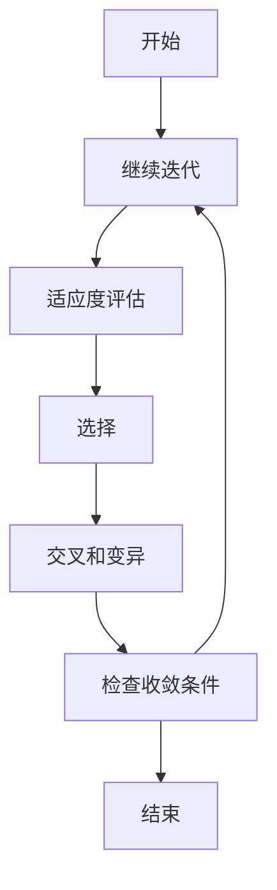

                 


# 构建智能化的个人税务筹划多目标动态优化助手

## 关键词：税务筹划、多目标优化、动态优化、人工智能、智能化助手

## 摘要：  
在个人税务筹划中，多目标动态优化是实现智能化税务管理的重要手段。本文详细介绍了构建智能化个人税务筹划多目标动态优化助手的背景、核心概念、算法原理、系统架构、项目实战及最佳实践，为读者提供全面的技术指导。

---

# 第1章: 智能化税务筹划的背景与问题描述

## 1.1 税务筹划的现状与挑战

### 1.1.1 税务筹划的基本概念  
税务筹划是指通过合法手段优化个人或企业的税务负担，最大化经济利益的过程。传统的税务筹划依赖人工计算和经验判断，效率低且容易出错。

### 1.1.2 传统税务筹划的局限性  
- 知识复杂性高：涉及多个税种和优惠政策，普通人难以掌握。  
- 信息更新慢：税法政策不断变化，人工更新效率低。  
- 计算复杂：多目标优化需要同时考虑多个因素，手工计算难以高效实现。  

### 1.1.3 智能化税务筹划的必要性  
随着人工智能和大数据技术的发展，智能化税务筹划成为可能。通过算法优化，可以实现快速、准确的税务规划。

## 1.2 多目标动态优化的税务筹划问题

### 1.2.1 多目标优化的基本概念  
多目标优化是指在多个目标之间寻求平衡的优化问题。例如，在税务筹划中，可能需要在税后利润最大化和风险最小化之间找到平衡。

### 1.2.2 税务筹划中的多目标问题  
- 最小化税负  
- 最大化现金流  
- 最小化税务风险  

### 1.2.3 动态优化的税务筹划场景  
动态优化是指在变化的环境中实时调整优化方案。例如，税率调整或政策变化时，需要实时更新税务规划。

---

# 第2章: 智能化税务筹划助手的核心概念

## 2.1 多目标优化模型

### 2.1.1 模型的基本构成  
- **目标函数**：定义优化目标，如税后利润最大化。  
- **约束条件**：限制条件，如收入、支出等。  
- **决策变量**：需要优化的变量，如投资分配比例。  

### 2.1.2 目标函数的定义  
以最大化税后利润为目标函数：  
$$\text{Maximize } \sum \text{收入} - \sum \text{支出} \times \text{税率}$$  

### 2.1.3 约束条件的设定  
例如，可支配收入的约束：  
$$\sum \text{支出} \leq \text{收入}$$  

## 2.2 动态优化算法

### 2.2.1 动态优化的基本原理  
动态优化算法通过迭代更新解决方案，以适应变化的环境。例如，遗传算法（GA）和模拟退火（SA）。

### 2.2.2 常见动态优化算法对比  
| 算法名称 | 原理 | 优点 | 缺点 |  
|---------|------|------|------|  
| 遗传算法 | 基于生物进化 | 具备全局搜索能力 | 计算复杂度高 |  
| 模拟退火 | 基于金属物理退火 | 能够跳出局部最优 | 收敛速度慢 |  

### 2.2.3 税务筹划中的动态优化实现  
以遗传算法为例，优化步骤如下：  
1. 初始化种群：生成随机的初始解。  
2. 适应度评估：计算每个解的税后利润。  
3. 选择：保留高适应度的解。  
4. 交叉和变异：生成新解。  
5. 重复步骤2-4，直到收敛。  

## 2.3 智能化助手的系统架构

### 2.3.1 系统功能模块划分  
- 数据采集：获取收入、支出等数据。  
- 数据分析：分析税务影响。  
- 优化算法：生成优化方案。  
- 结果可视化：展示最优解。  

### 2.3.2 系统架构的层次结构  
```
顶层架构：用户界面  
中间层：数据处理和优化算法  
底层：数据存储和接口调用  
```

---

# 第3章: 核心概念与联系

## 3.1 优化模型与算法的联系

### 3.1.1 优化模型的属性特征对比表  
| 属性 | 线性规划 | 非线性规划 | 多目标优化 |  
|------|----------|------------|------------|  
| 目标 | 单目标 | 单目标 | 多目标 |  
| 约束 | 线性 | 非线性 | 可线性或非线性 |  

### 3.1.2 算法与模型的ER实体关系图  
```mermaid
erDiagram
    税务助手 --> 优化模型: 使用
    优化模型 --> 算法: 实现
    算法 --> 数据: 处理
```

## 3.2 动态优化算法的流程图



---

# 第4章: 算法原理与数学模型

## 4.1 动态优化算法的数学模型

### 4.1.1 多目标优化的数学表达式  
$$\text{Maximize } f_1(x), f_2(x), \dots, f_n(x)$$  
$$\text{Subject to } g_1(x) \leq 0, \dots, g_m(x) \leq 0$$  

### 4.1.2 动态优化的数学公式  
以遗传算法为例：  
1. 初始化：$x_1, x_2, \dots, x_k$。  
2. 适应度计算：$f(x_i)$。  
3. 选择：保留适应度高的个体。  
4. 交叉：生成新个体。  
5. 变异：随机改变部分个体。  
6. 重复步骤2-5，直到收敛。  

---

# 第5章: 系统分析与架构设计

## 5.1 项目介绍

### 5.1.1 项目目标  
构建一个智能化的个人税务筹划助手，实现多目标动态优化。

### 5.1.2 项目范围  
适用于个人所得税、财产税等税种的优化。

## 5.2 系统功能设计

### 5.2.1 领域模型  


### 5.2.2 系统架构设计  
```mermaid
graph TD
    UI --> 业务逻辑: 发送请求
    业务逻辑 --> 数据库: 查询数据
    数据库 --> 优化算法: 调用算法
    优化算法 --> UI: 返回结果
```

---

# 第6章: 项目实战

## 6.1 环境搭建

### 6.1.1 开发工具  
- Python 3.8+  
- Jupyter Notebook  
- pip install numpy, matplotlib  

## 6.2 核心实现

### 6.2.1 数据处理  
```python
import numpy as np

def calculate_taxes(income, expenses):
    taxable_income = income - expenses
    tax = taxable_income * 0.1
    return tax
```

### 6.2.2 优化算法实现  
```python
def genetic_algorithm(population, fitness_fn):
    while not converged:
        fitness = fitness_fn(population)
        select(population, fitness)
        crossover(population)
        mutate(population)
    return best(population)
```

## 6.3 案例分析

### 6.3.1 实际案例  
假设某人年收入10万元，支出5万元，税率10%。优化目标是通过调整支出结构，降低税负。

---

# 第7章: 总结与展望

## 7.1 最佳实践  
- 定期更新税法政策。  
- 结合具体场景调整算法参数。  

## 7.2 小结  
智能化的个人税务筹划助手通过多目标动态优化，帮助用户实现高效、精准的税务规划。

## 7.3 注意事项  
- 数据准确性是关键。  
- 算法选择需结合实际场景。  

## 7.4 拓展阅读  
推荐书籍：《优化算法导论》、《人工智能入门》。

---

# 作者：AI天才研究院/AI Genius Institute & 禅与计算机程序设计艺术/Zen And The Art of Computer Programming

---

通过以上思考和结构化的内容，您可以根据需要进一步扩展和撰写具体的章节内容。

