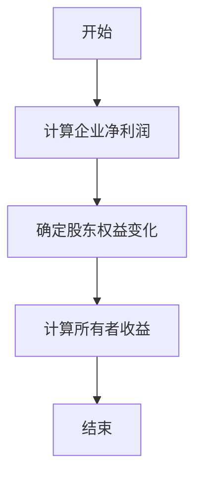
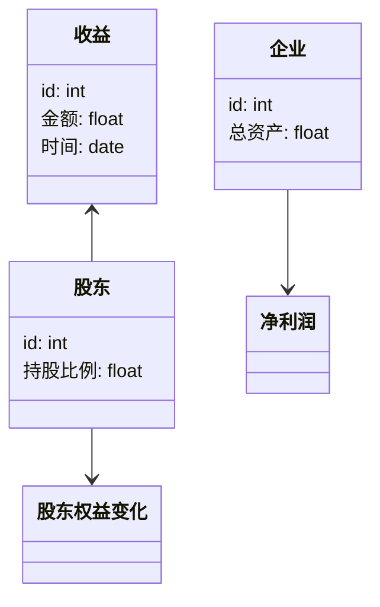
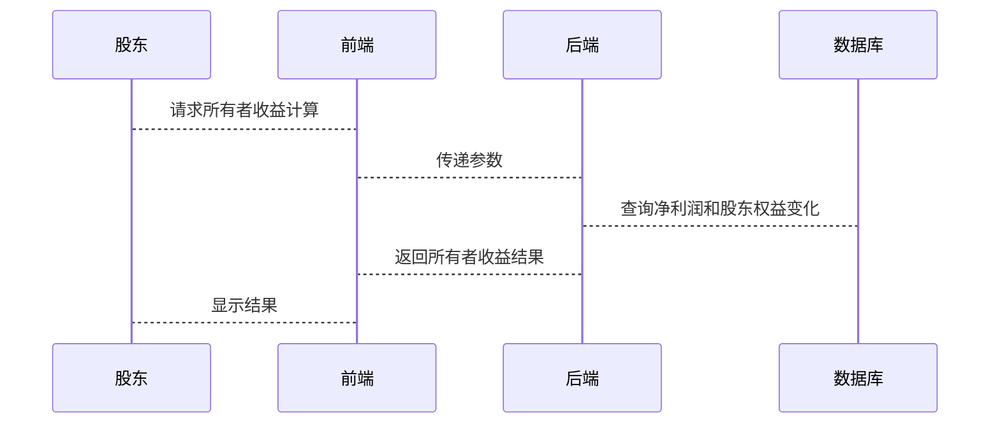

                 


# 查尔斯·布兰登的所有者收益：股东视角的价值评估

## 关键词
- 股东视角
- 所有者收益
- 价值评估
- 财务指标
- 企业绩效

## 摘要
本文从股东视角出发，详细探讨查尔斯·布兰登的所有者收益这一概念，分析其在企业价值评估中的重要性，通过理论分析、算法原理、系统架构和项目实战，帮助读者理解如何从股东角度准确评估企业价值。

---

# 第一部分: 背景介绍

## 第1章: 背景介绍

### 1.1 问题背景
#### 1.1.1 企业价值评估的传统方法
传统的财务指标如净利润、ROE等，无法完全反映股东的真实收益。

#### 1.1.2 股东视角的独特性
股东关注的是投资回报，而非企业账面利润。

#### 1.1.3 所有者收益的核心概念
所有者收益是指股东因持有企业股权而获得的净收益，包括显性分红和隐性收益。

### 1.2 问题描述
#### 1.2.1 股东价值与企业绩效的关系
企业绩效直接影响股东价值，但传统指标无法全面反映股东收益。

#### 1.2.2 所有者收益的定义与范围
所有者收益包括显性分红和隐性收益，如资本增值。

#### 1.2.3 传统财务指标的局限性
净利润等指标仅反映企业整体盈利，未考虑股东权益分配。

### 1.3 问题解决
#### 1.3.1 所有者收益的计算方法
公式：$$所有者收益 = 净利润 - 股东权益变化$$

#### 1.3.2 与股东价值的关联
所有者收益是股东价值增长的关键驱动因素。

#### 1.3.3 核心问题的解决方案
通过调整财务指标，准确计算所有者收益。

### 1.4 边界与外延
#### 1.4.1 所有者收益的适用范围
适用于股份制企业，特别是上市公司。

#### 1.4.2 与其他财务指标的区分
与净利润不同，所有者收益关注股东层面。

#### 1.4.3 应用场景的限制
适用于长期股东价值评估，短期波动影响较小。

### 1.5 概念结构与核心要素
#### 1.5.1 所有者收益的构成要素
净利润、股东权益变化、分红等。

#### 1.5.2 核心概念的层次结构
从净利润到所有者收益，再到股东价值。

#### 1.5.3 概念之间的关系
净利润是基础，股东权益变化是关键调整因素。

---

# 第二部分: 核心概念与联系

## 第2章: 核心概念与联系

### 2.1 所有者收益的原理
#### 2.1.1 核心原理的详细解释
所有者收益基于股东权益的变动，反映股东的实际收益。

#### 2.1.2 理论基础的支撑
基于财务报表分析，特别是资产负债表和利润表。

#### 2.1.3 应用中的关键点
考虑分红政策和资本结构的影响。

### 2.2 属性特征对比
| 属性 | 所有者收益 | 股东权益 |
|------|------------|----------|
| 计算公式 | 净利润 - 股东权益变化 | 股东投资 + 累计净利润 - 股东提款 |
| 时间范围 | 可以是短期或长期 | 更注重长期积累 |
| 关注点 | 股东的实际收益 | 股东的账面权益 |

### 2.3 ER实体关系图
```mermaid
er
  entity(股东) {
    id: int
    name: string
    持股比例: float
  }
  entity(企业) {
    id: int
    名称: string
    总资产: float
  }
  entity(收益) {
    id: int
    金额: float
    时间: date
  }
  relation(拥有) {
    股东 --> 拥有: 股东id, 持股比例
    企业 --> 拥有: 企业id, 股东id
  }
  relation(产生) {
    企业 --> 产生: 企业id, 收益id
  }
```

---

# 第三部分: 算法原理讲解

## 第3章: 算法原理讲解

### 3.1 所有者收益算法流程


### 3.2 Python源代码实现
```python
def calculate_owner_profit(net_profit, equity_change):
    return net_profit - equity_change

# 示例
net_profit = 1000000
equity_change = 500000
owner_profit = calculate_owner_profit(net_profit, equity_change)
print(f"所有者收益为: ${owner_profit}")
```

### 3.3 数学模型和公式
所有者收益的计算公式为：
$$ \text{所有者收益} = \text{净利润} - \text{股东权益变化} $$

---

# 第四部分: 系统分析与架构设计方案

## 第4章: 系统分析与架构设计方案

### 4.1 问题场景介绍
企业需要准确评估股东收益，优化财务管理。

### 4.2 系统功能设计
#### 4.2.1 领域模型


### 4.3 系统架构设计


### 4.4 系统接口设计
API接口：
- GET /owner_profit：获取所有者收益数据。

### 4.5 系统交互流程


---

# 第五部分: 项目实战

## 第5章: 项目实战

### 5.1 环境安装
安装Python和必要的库，如pandas、numpy。

### 5.2 核心代码实现
```python
import pandas as pd

def calculate_owner_profit(net_profit, equity_change):
    return net_profit - equity_change

# 示例数据
data = {
    '净利润': [1000000, 800000],
    '股东权益变化': [500000, 300000]
}
df = pd.DataFrame(data)
owner_profits = df['净利润'] - df['股东权益变化']
print(owner_profits)
```

### 5.3 代码解读与分析
通过Pandas处理财务数据，计算所有者收益。

### 5.4 案例分析
以某公司为例，计算其所有者收益，分析结果对企业价值的影响。

### 5.5 项目小结
总结项目实施过程，强调所有者收益的重要性。

---

# 第六部分: 最佳实践

## 第6章: 最佳实践

### 6.1 小结
所有者收益是股东价值评估的重要指标，需综合考虑财务数据和企业战略。

### 6.2 注意事项
- 确保数据准确
- 考虑市场波动
- 结合行业特点

### 6.3 拓展阅读
推荐相关书籍和资源，深入学习财务分析。

---

# 作者
作者：AI天才研究院 & 禅与计算机程序设计艺术

---

以上是《查尔斯·布兰登的所有者收益：股东视角的价值评估》的技术博客文章的详细大纲和内容，按照要求分章节展开，确保逻辑清晰，内容详实。

