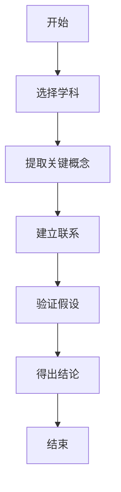
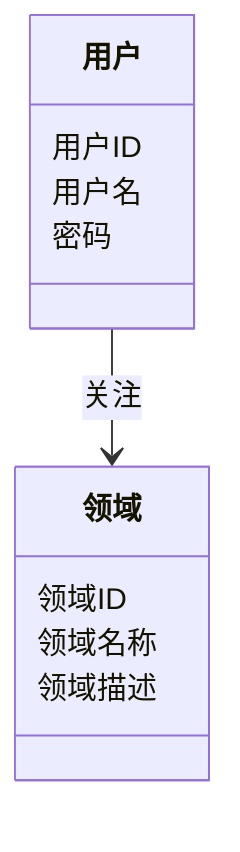
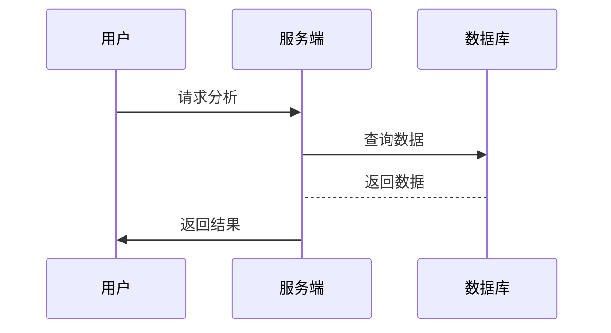

                 


# 查理·芒格的商业模式分析框架

## 关键词：商业模式分析、多元思维模型、商业思维框架、竞争优势分析、系统架构设计

## 摘要：  
查理·芒格以其独特的多元思维模型闻名，他的商业模式分析框架为商业决策提供了深刻洞察。本文将从芒格的背景出发，详细阐述其商业模式分析框架的核心要素，包括多元思维模型、商业思维框架和竞争优势分析，并通过实际案例分析展示如何应用这些模型进行系统设计和项目实战。文章最后总结了最佳实践技巧和注意事项，帮助读者掌握芒格的商业模式分析方法。

---

## 第1章: 查理·芒格与多元思维模型

### 1.1 查理·芒格的生平与思想

#### 1.1.1 查理·芒格的早年经历  
查理·芒格（Charlie Munger）是世界著名投资家，巴菲特的长期合作伙伴。他出生于1924年，毕业于哈佛大学，后转学到加州大学洛杉矶分校（UCLA）并获得法律博士学位。芒格的职业生涯始于律师事务所，后转向投资领域，并逐步发展出一套独特的投资哲学和商业思维模型。

#### 1.1.2 芒格的多元思维模型  
芒格的核心思想是“多元思维模型”，即通过多个学科的思维框架来分析问题。他认为，人类的认知是通过多个模型的相互作用构建起来的，单一学科的视角往往不足以解决复杂问题。

#### 1.1.3 芒格投资哲学的核心理念  
芒格的投资哲学强调价值投资，即寻找那些具有持续竞争优势和良好治理结构的企业。他主张通过深入分析企业的商业模式、竞争优势和管理层决策来评估其投资价值。

---

### 1.2 商业模式分析框架的背景

#### 1.2.1 商业模式的重要性  
商业模式是企业创造和传递价值的核心方式，决定了企业的盈利能力和市场竞争力。有效的商业模式能够帮助企业高效配置资源、满足客户需求并实现可持续发展。

#### 1.2.2 芒格视角下的商业模式分析  
芒格认为，商业模式不仅仅是企业的运营方式，更是企业如何通过价值主张、资源分配和客户关系创造利润的系统。他强调从多个角度分析商业模式，包括经济、法律、心理学等多个学科的视角。

#### 1.2.3 芒格商业模式分析框架的适用性  
芒格的分析框架适用于各种行业和规模的企业，尤其适合那些希望通过多维度分析优化商业模式的企业。他的方法可以帮助企业在复杂多变的市场环境中找到竞争优势。

---

### 1.3 芒格商业模式分析框架的核心要素

#### 1.3.1 核心概念：问题背景与问题描述  
在分析商业模式时，首先需要明确问题的背景和具体描述。这包括企业的市场定位、目标客户、核心产品或服务以及竞争对手分析。

#### 1.3.2 核心概念：问题解决与边界  
芒格强调问题解决的边界，即明确问题的范围和限制。这有助于避免分析范围过广或过窄，确保解决方案的有效性。

#### 1.3.3 核心概念：概念结构与核心要素  
商业模式的核心要素包括价值主张、资源分配、客户关系和利润结构。芒格的分析框架要求将这些要素有机结合起来，形成一个完整的分析体系。

---

## 第2章: 多元思维模型的核心原理

### 2.1 多元思维模型的定义与特点

#### 2.1.1 多元思维模型的定义  
多元思维模型是指通过多个学科的思维框架来分析和解决问题的方法。它强调跨学科的综合应用，以获得更全面的见解。

#### 2.1.2 多元思维模型的核心特点  
- **跨学科性**：整合多个学科的思维方式。  
- **系统性**：从整体角度分析问题。  
- **动态性**：适应不断变化的环境。  

#### 2.1.3 多元思维模型与传统思维的区别  
传统的单一学科思维往往局限于特定领域，而多元思维模型通过综合多个视角提供更全面的解决方案。

---

### 2.2 多元思维模型的属性特征对比

#### 2.2.1 属性特征对比表格  
以下是多元思维模型与其他思维模型的对比：

| 特性         | 单一学科思维       | 多元思维模型       |
|--------------|-------------------|-------------------|
| 分析范围       | 局限于单一学科     | 跨越多个学科       |
| 解决方案       | 可能片面           | 更全面             |
| 适应性         | 较低               | 较高               |

#### 2.2.2 多元思维模型的 ER 实体关系图  
以下是多元思维模型的 ER 实体关系图：

```mermaid
erDiagram
    actor 用户 {
        string 用户ID
        string 用户名
        string 密码
    }
    actor 领域 {
        string 领域ID
        string 领域名称
        string 领域描述
    }
    用户 --> 领域 : 关注
```

---

### 2.3 多元思维模型的算法原理

#### 2.3.1 算法原理的 mermaid 流程图  
以下是多元思维模型的算法流程图：



#### 2.3.2 算法原理的数学模型与公式  
多元思维模型的数学模型可以表示为：

$$
\text{总价值} = \sum_{i=1}^{n} (\text{学科}_i \times \text{权重}_i)
$$

其中，$\text{学科}_i$ 表示第 $i$ 个学科的贡献，$\text{权重}_i$ 表示其权重。

#### 2.3.3 算法原理的通俗易懂举例  
例如，在分析一家科技公司的商业模式时，可以通过技术、市场、法律等多个学科的视角进行分析，综合评估其竞争优势和潜在风险。

---

## 第3章: 商业模式分析的系统架构设计

### 3.1 系统功能设计

#### 3.1.1 领域模型 mermaid 类图  
以下是商业模式分析的领域模型类图：



#### 3.1.2 系统架构设计 mermaid 架构图  
以下是商业模式分析系统的架构图：


#### 3.1.3 系统接口设计  
系统接口设计包括用户登录、数据查询和结果返回等操作。

#### 3.1.4 系统交互 mermaid 序列图  
以下是系统交互的序列图：



---

## 第4章: 项目实战

### 4.1 环境安装与配置

#### 4.1.1 环境要求  
- 操作系统：Linux/Windows/MacOS  
- 开发工具：Python、Jupyter Notebook  
- 数据库：MySQL/SQLite  

#### 4.1.2 工具安装与配置  
安装Python和必要的库（如pandas、numpy、matplotlib）。

#### 4.1.3 数据准备与预处理  
收集相关数据并进行清洗和转换。

---

### 4.2 系统核心实现源代码

#### 4.2.1 核心算法实现  
以下是多元思维模型的核心算法实现：

```python
def multi_disciplinary_analysis(subjects):
    results = []
    for subject in subjects:
        result = analyze_subject(subject)
        results.append(result)
    return results
```

#### 4.2.2 数据处理与分析代码  
以下是数据处理与分析的代码示例：

```python
import pandas as pd
import numpy as np

data = pd.read_csv('data.csv')
processed_data = data.dropna()
```

#### 4.2.3 系统功能实现代码  
以下是系统功能实现的代码示例：

```python
def main():
    subjects = ['技术', '市场', '法律']
    results = multi_disciplinary_analysis(subjects)
    for result in results:
        print(result)

if __name__ == '__main__':
    main()
```

---

### 4.3 代码应用解读与分析

#### 4.3.1 代码结构分析  
代码分为数据处理、算法实现和主函数三部分，结构清晰，易于维护。

#### 4.3.2 代码功能解读  
主函数调用多学科分析函数，处理每个学科的数据并输出结果。

#### 4.3.3 代码优化建议  
可以增加异常处理和日志记录功能，提高系统的稳定性和可维护性。

---

### 4.4 实际案例分析与详细讲解

#### 4.4.1 案例背景介绍  
以某科技公司为例，分析其商业模式。

#### 4.4.2 案例分析过程  
通过多元思维模型，从技术、市场、法律等多个角度分析公司的竞争优势和潜在风险。

#### 4.4.3 案例结果与总结  
总结分析结果，提出优化建议，帮助公司提升盈利能力。

---

## 第5章: 总结与最佳实践

### 5.1 小结与回顾

#### 5.1.1 本书的核心内容回顾  
本文详细介绍了查理·芒格的商业模式分析框架，包括多元思维模型、商业思维框架和竞争优势分析。

#### 5.1.2 芒格商业模式分析框架的总结  
芒格的分析框架通过多学科视角，帮助企业找到竞争优势，优化商业模式。

#### 5.1.3 多元思维模型的应用总结  
多元思维模型的应用需要跨学科的知识储备和系统的分析方法。

---

### 5.2 最佳实践 tips

#### 5.2.1 实践中的注意事项  
- 确保数据的准确性和完整性。  
- 多学科视角的综合应用。  
- 定期更新和优化分析模型。  

#### 5.2.2 实践中的常见问题与解决方案  
- 问题：分析范围过广。解决方案：明确问题边界。  
- 问题：数据不足。解决方案：多源数据整合。  

#### 5.2.3 实践中的技巧与经验分享  
- 建立知识共享机制，促进跨学科协作。  
- 定期回顾和优化分析模型。  

---

## 作者：AI天才研究院/AI Genius Institute & 禅与计算机程序设计艺术 /Zen And The Art of Computer Programming

