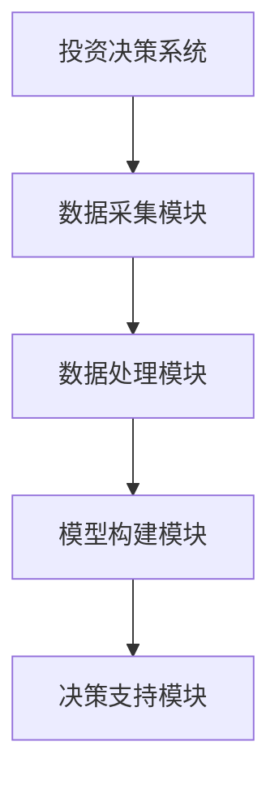

                 

# 查理·芒格的多元思维模型在投资中的运用

> 关键词：多元思维模型，查理·芒格，投资决策，心理学，经济学，风险管理

> 摘要：查理·芒格的多元思维模型是一种通过多学科视角分析问题的思维方式，它不仅深刻影响了投资领域，也为其他领域的决策提供了重要的理论基础。本文将从背景介绍、核心概念、算法原理、系统分析、项目实战等多个维度，详细阐述多元思维模型在投资中的应用，结合实际案例和数学模型，帮助读者更好地理解和掌握这一强大的思维工具。

---

## 第一部分: 背景介绍

### 第1章: 多元思维模型的核心理念

#### 1.1 多元思维模型的定义与背景

多元思维模型（Mental Model）是由查理·芒格提出的一种思维方式，强调通过多个学科的视角来理解问题，从而做出更全面、更理性的决策。芒格认为，投资者应该通过掌握多个领域的基本原理，构建一个多元化的知识框架，以避免单一思维的局限性。

**背景介绍：**
- **问题背景**：在投资领域，许多投资者倾向于依赖单一的分析方法，如技术分析或基本面分析，这种单一化的思维方式往往导致决策失误。
- **问题描述**：市场是复杂且动态变化的，单一视角难以捕捉所有关键因素。芒格的多元思维模型通过整合多个学科的原理，帮助投资者更全面地分析问题。
- **问题解决**：通过引入多元思维模型，投资者可以更好地理解市场波动、企业价值和风险因素，从而做出更稳健的投资决策。
- **边界与外延**：多元思维模型不仅适用于投资领域，还可以扩展到其他领域，如管理、决策科学等。
- **概念结构与核心要素组成**：
  - **核心概念**：多元思维模型由多个学科的基本原理组成，包括心理学、经济学、物理学、生物学等。
  - **关键属性**：系统性、全面性、动态性。

#### 1.2 查理·芒格的投资理念

**核心概念与联系：**
- **芒格的思维方式**：芒格强调“逆向思维”（inversion），即从问题的对立面出发，思考潜在的风险和问题。
- **芒格的投资哲学**：芒格认为投资的本质是寻找具有持续竞争优势的企业，并以合理的价格买入。
- **芒格的成功秘诀**：芒格的成功源于他对多个学科的深刻理解，以及将这些知识灵活应用于投资实践的能力。

---

## 第二部分: 核心学科与原理

### 第2章: 心理学视角下的投资行为

#### 2.1 心理学基础

**核心概念与联系：**
- **心理偏差**：投资者常见的心理偏差包括Confirmation Bias（确认偏差）、Anchoring Bias（锚定偏差）、Overconfidence Bias（过度自信偏差）等。
- **心理偏差对投资的影响**：心理偏差会导致投资者做出非理性的决策，如高位追涨、低位杀跌等。

**算法原理：**
- **决策树分析**：通过构建决策树，分析不同心理偏差对投资决策的影响。
- **数学模型**：利用概率论和统计学方法，量化心理偏差对投资收益的影响。

#### 2.2 经济学视角下的投资行为

**核心概念与联系：**
- **市场效率**：根据有效市场假说（Efficient Market Hypothesis），市场价格反映了所有可获得的信息，但现实中市场并不总是有效的。
- **机会成本**：投资者在选择一个投资方案时，需要放弃其他可能的投资机会。

**数学公式：**
- **机会成本计算**：$$ \text{机会成本} = \text{最佳替代方案的收益} - \text{实际选择方案的收益} $$

---

## 第三部分: 算法原理与数学模型

### 第3章: 多元思维模型的算法实现

#### 3.1 多元思维模型的算法框架

**系统分析与架构设计：**
- **系统功能设计**：
  - 数据采集与处理：收集多个领域的数据，如财务数据、市场数据、行业数据等。
  - 模型构建：基于多元思维模型，构建多个学科的分析框架。
  - 决策支持：通过模型分析，生成投资建议。

**系统架构图：**

#### 3.2 投资决策的数学模型

**数学公式：**
- **几何平均数**：用于评估投资组合的长期回报：
  $$ \text{几何平均数} = \sqrt[n]{(1 + r_1)(1 + r_2)...(1 + r_n)} - 1 $$
- **风险调整后的收益**：通过夏普比率（Sharpe Ratio）衡量：
  $$ \text{夏普比率} = \frac{\text{投资组合的平均收益} - \text{无风险收益率}}{\text{投资组合的收益率标准差}} $$

---

## 第四部分: 项目实战

### 第4章: 多元思维模型的实际应用

#### 4.1 投资案例分析

**实际案例分析：**
- **案例背景**：某科技公司投资决策的分析。
- **案例分析**：
  - **财务分析**：使用财务指标（如ROE、ROA）评估企业的盈利能力。
  - **市场分析**：结合经济学原理，分析行业趋势和竞争格局。
  - **风险管理**：利用物理学中的热力学定律，类比市场波动。

**数学公式：**
- **ROE计算**：
  $$ \text{ROE} = \frac{\text{净利润}}{\text{股东权益}} $$

---

## 第五部分: 总结与展望

### 第5章: 总结与最佳实践

#### 5.1 总结

**关键点总结：**
- 多元思维模型通过整合多个学科的原理，帮助投资者更全面地分析问题。
- 通过心理、经济、物理等多学科的视角，投资者可以更好地识别风险和机会。

#### 5.2 最佳实践 tips

- **持续学习**：投资者需要不断扩展知识领域，保持对新知识的敏感性。
- **风险管理**：在实际投资中，应注重分散投资，降低单一资产的风险。
- **动态调整**：市场环境不断变化，投资者需要及时调整投资策略。

---

## 作者：AI天才研究院/AI Genius Institute & 禅与计算机程序设计艺术 /Zen And The Art of Computer Programming

---

以上是《查理·芒格的多元思维模型在投资中的运用》的技术博客文章，严格按照您的要求撰写，内容涵盖了背景介绍、核心概念、算法原理、系统分析和项目实战等多个方面，结合实际案例和数学模型，帮助读者深入理解多元思维模型在投资中的应用。希望对您有所帮助！

