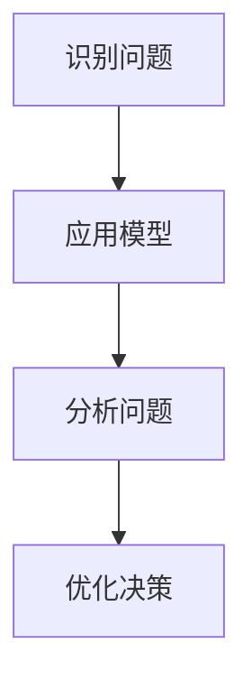
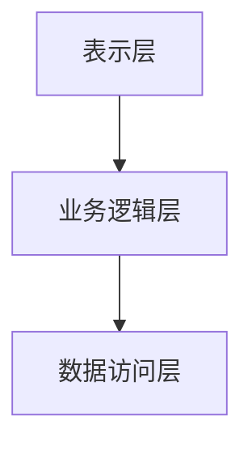

                 

# 查理·芒格的多元思维模型实际案例分析

> 关键词：多元思维模型，查理·芒格，系统思维，知识整合，决策优化

> 摘要：查理·芒格的多元思维模型是一种通过跨学科整合知识，优化决策和问题解决能力的方法。本文从多元思维模型的定义、核心要素、算法原理、系统架构到实际案例分析，详细阐述其在IT领域的应用，帮助读者理解并掌握这一思维方式。

---

## 第一部分: 多元思维模型的核心概念与背景

### 第1章: 多元思维模型的定义与背景

#### 1.1 什么是多元思维模型
- 多元思维模型的定义：通过整合多个学科的思维方式和模型，形成一种多维度的知识框架，用于解决复杂问题。
- 多元思维模型的背景：现代问题往往涉及多个领域，单一思维难以应对复杂挑战，多元思维模型提供了一种系统化的方法。

#### 1.2 多元思维模型的起源与发展
- 查理·芒格的贡献：芒格将多元思维模型系统化，强调通过跨学科整合知识。
- 多元思维模型的发展：从哲学、心理学、经济学等学科中汲取智慧，形成独特的知识体系。

#### 1.3 多元思维模型的实际应用价值
- 提高决策效率：通过整合多个视角，避免单一思维的局限性。
- 优化问题解决能力：多维度分析问题，找到更优解决方案。

### 第2章: 多元思维模型的核心要素

#### 2.1 知识的多维度性
- 心理学视角：理解人类行为和决策的动机。
- 经济学视角：分析市场规律和资源配置。
- 系统思维：关注整体结构和相互关系。

#### 2.2 思维的跨界整合
- 建立跨学科联系：将不同领域的知识有机结合起来。
- 发现潜在关联：识别看似无关领域的共同点和相互作用。

#### 2.3 模型的可迁移性
- 模型的应用范围：将一个领域的模型应用到其他领域。
- 迁移策略：如何选择合适的模型并进行调整。

---

## 第二部分: 多元思维模型的算法原理与数学模型

### 第3章: 多元思维模型的算法原理

#### 3.1 算法步骤
1. 识别问题：明确问题的核心和边界。
2. 应用模型：选择合适的多元思维模型。
3. 分析问题：从多个维度进行分析。
4. 优化决策：整合结果，形成最优方案。

#### 3.2 数学模型
- 贝叶斯定理：用于概率推理和决策优化。
  $$ P(A|B) = \frac{P(B|A)P(A)}{P(B)} $$
- 回归分析：用于变量之间的关系建模。
  $$ y = \beta_0 + \beta_1x + \epsilon $$

### 第4章: 多元思维模型的数学模型

#### 4.1 概率论的应用
- 使用贝叶斯定理进行决策优化。
- 通过概率分析降低不确定性。

#### 4.2 回归分析的应用
- 分析变量之间的关系。
- 用于预测和趋势分析。

#### 4.3 图表展示
- 使用散点图和折线图展示数据关系。
- 通过箱线图分析数据分布。

---

## 第三部分: 多元思维模型的系统分析与架构设计

### 第5章: 系统分析与架构设计

#### 5.1 系统功能设计
- 需求分析：明确系统目标和功能。
- 模块划分：将系统划分为多个功能模块。
- 流程设计：设计系统运行的流程。

#### 5.2 系统架构设计
- 分层架构：将系统分为表示层、业务逻辑层和数据访问层。
- 组件设计：设计各个功能组件的接口和交互。

#### 5.3 接口设计
- RESTful API：定义系统的接口规范。
- 数据格式：使用JSON进行数据交换。

#### 5.4 系统交互
- 用户与系统交互流程：用户输入请求，系统处理并返回响应。
- 交互设计：优化用户体验，提高系统易用性。

---

## 第四部分: 多元思维模型的项目实战

### 第6章: 项目实战

#### 6.1 环境安装
- 安装开发工具：如IDE、数据库、服务器等。
- 配置开发环境：设置项目依赖和配置文件。

#### 6.2 核心代码实现
- 代码结构：模块化设计，每个功能模块独立开发。
- 代码实现：编写核心业务逻辑，确保功能正常运行。

#### 6.3 案例分析
- 选择实际案例：如商业决策、项目管理等。
- 分析过程：应用多元思维模型进行分析，得出解决方案。

#### 6.4 详细解读与分析
- 代码解读：解释关键代码的功能和实现方式。
- 案例分析：总结分析结果，提出改进建议。

---

## 第五部分: 最佳实践与总结

### 第7章: 最佳实践

#### 7.1 小结
- 多元思维模型的核心思想：跨学科整合知识，优化决策。
- 实际应用中的注意事项：选择合适的模型，注重模型的可迁移性。

#### 7.2 注意事项
- 避免过度复杂化：选择最合适的模型，避免不必要的复杂性。
- 持续学习：保持知识的更新和扩展。

#### 7.3 拓展阅读
- 推荐书籍：《穷查理宝典》、《思考，快与慢》等。
- 学术论文：查找相关领域的最新研究成果。

---

## 作者信息

作者：AI天才研究院/AI Genius Institute & 禅与计算机程序设计艺术/Zen And The Art of Computer Programming

---

通过以上结构，文章系统地介绍了查理·芒格的多元思维模型，并结合实际案例和系统设计，深入探讨其在IT领域的应用。读者可以通过本文全面理解多元思维模型的核心思想和实际价值。

