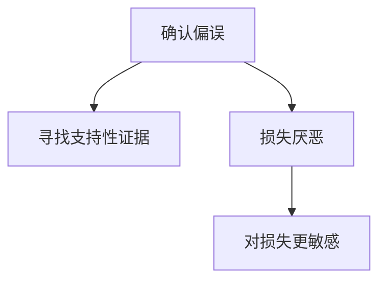

                 


# 查理·芒格的心理学偏见在投资中的应用

> 关键词：心理学偏见，投资决策，查理·芒格，认知偏差，投资策略

> 摘要：本文深入探讨了查理·芒格提出的心理学偏见在投资中的应用，分析了这些偏见如何影响投资者的决策，并提供了识别和纠正这些偏见的方法。通过结合理论与实际案例，本文为投资者提供了一套基于心理学偏见的投资决策框架，帮助他们在复杂的投资环境中做出更明智的选择。

---

## 第1章: 心理学偏见与投资概述

### 1.1 心理学偏见的定义与重要性

心理学偏见是指人们在认知、判断和决策过程中，由于内在的心理机制或外部环境的影响，导致的系统性偏离客观事实的现象。在投资领域，这些偏见可能导致投资者做出非理性的决策，从而影响投资结果。

- **定义**：心理学偏见是人类在信息处理过程中，由于认知局限、情感影响或外部环境的干扰，导致的决策偏差。
- **重要性**：了解和克服心理学偏见是投资者提高决策质量、避免重大损失的关键。

### 1.2 查理·芒格的投资哲学

查理·芒格是沃伦·巴菲特的长期合作伙伴，他提出的投资哲学强调了心理偏见对投资决策的影响。

- **生平与思想体系**：芒格不仅是一位成功的投资者，还是一位心理学家，他对人类的认知偏差有着深刻的研究。
- **核心理念**：芒格认为，投资者的决策过程是认知偏差的温床，克服这些偏差是实现长期投资成功的关键。

### 1.3 投资中的常见心理学偏见

芒格列举并分析了许多影响投资决策的心理学偏见，以下是其中几种常见的偏见：

- **确认偏误**：投资者倾向于寻找支持自己观点的信息，而忽视相反的证据。
- **损失厌恶**：投资者对损失的厌恶程度远超过对收益的追求，导致他们在亏损时做出非理性决策。
- **过度自信**：投资者往往对自己的判断过于自信，忽视市场的不确定性。
- **心理账户**：投资者将资金分割成不同的心理账户，导致决策时考虑不周全。

---

## 第2章: 心理学偏见的核心原理

### 2.1 心理学偏见的分类与特征

心理学偏见可以分为认知性偏见、情感性偏见和行为性偏见三类。

- **认知性偏见**：源于人类认知的局限性，如确认偏误和忽略概率。
- **情感性偏见**：由情绪波动引发，如损失厌恶和过度自信。
- **行为性偏见**：表现在实际操作中的偏差，如从众行为和趋利避害。

### 2.2 偏见之间的关系与对比

了解不同偏见之间的关系有助于更好地识别和纠正它们。

- **相互作用**：确认偏误可能与损失厌恶相互作用，导致投资者在面对亏损时更加固执。
- **特征对比表**：通过对比表，可以清晰地看到不同偏见的特点和表现形式。

| 偏见类型 | 特征描述 | 示例 |
|----------|-----------|------|
| 确认偏误 | 寻找支持性证据 | 过度关注利好消息 |
| 损失厌恶 | 对损失更敏感 | 过度规避风险 |

- **ER实体关系图**：通过ER图展示偏见之间的关系，帮助投资者理解它们如何影响决策。



---

## 第3章: 心理学偏见的识别与纠正算法

### 3.1 偏见识别算法

识别心理学偏见需要结合数据分析和模式识别。

- **基于概率的偏见识别**：通过统计方法检测数据中的异常模式。
- **基于统计的偏见识别**：利用回归分析等方法识别偏见的特征。
- **基于机器学习的偏见识别**：使用分类算法识别偏见类型。

### 3.2 偏见纠正算法

纠正偏见需要结合算法和策略调整。

- **基于决策树的偏见纠正**：通过决策树模型调整决策边界。
- **基于神经网络的偏见纠正**：利用深度学习模型学习正确的决策模式。
- **基于贝叶斯的偏见纠正**：通过贝叶斯定理更新概率，减少偏见影响。

### 3.3 算法实现与代码

以下是一个简单的Python代码示例，用于识别确认偏误：

```python
import pandas as pd
from sklearn.tree import DecisionTreeClassifier

# 示例数据
data = {
    '投资决策': ['买入', '卖出', '买入', '卖出'],
    '市场信号': [1, 0, 1, 0],
    '历史收益': [0.1, 0.2, -0.1, -0.2]
}

df = pd.DataFrame(data)

# 训练决策树模型
model = DecisionTreeClassifier()
model.fit(df[['市场信号', '历史收益']], df['投资决策'])

# 预测偏见类型
predicted_bias = model.predict([[1, 0.1], [0, -0.2]])

print(predicted_bias)
```

---

## 第4章: 数学模型与公式

### 4.1 概率论与期望值

概率论是分析投资决策的重要工具，期望值可以帮助投资者评估决策的潜在收益。

- **概率论公式**：
  $$ P(A) = \frac{N_A}{N} $$
  其中，\( P(A) \) 是事件 \( A \) 的概率，\( N_A \) 是事件 \( A \) 的发生次数，\( N \) 是总样本数。
- **期望值公式**：
  $$ E[X] = \sum_{i=1}^{n} P(x_i) \cdot x_i $$

### 4.2 贝叶斯定理

贝叶斯定理可以用于更新投资决策的概率。

- **贝叶斯公式**：
  $$ P(A|B) = \frac{P(B|A) \cdot P(A)}{P(B)} $$

---

## 第5章: 系统分析与架构设计

### 5.1 投资决策支持系统

构建一个投资决策支持系统可以帮助投资者识别和纠正心理偏见。

- **系统功能设计**：
  - 数据预处理：清洗和转换数据。
  - 特征提取：提取与偏见相关的特征。
  - 模型训练：训练偏见识别和纠正模型。
  - 结果输出：生成投资建议。

- **系统架构设计**：
  ```mermaid
  graph TD
      A[投资者输入] --> B[数据预处理]
      B --> C[特征提取]
      C --> D[模型训练]
      D --> E[结果输出]
  ```

---

## 第6章: 项目实战

### 6.1 环境安装与工具准备

- **工具安装**：安装Python、Pandas、Scikit-learn等库。
- **数据准备**：获取历史市场数据和投资者决策数据。

### 6.2 核心代码实现

以下是核心代码示例：

```python
import numpy as np
from sklearn.model_selection import train_test_split
from sklearn.metrics import accuracy_score

# 数据准备
X = np.array([...])
y = np.array([...])

# 数据分割
X_train, X_test, y_train, y_test = train_test_split(X, y, test_size=0.2)

# 训练模型
model = DecisionTreeClassifier()
model.fit(X_train, y_train)

# 预测结果
y_pred = model.predict(X_test)

# 计算准确率
print(accuracy_score(y_test, y_pred))
```

### 6.3 实际案例分析

通过分析实际案例，验证算法的有效性。

---

## 第7章: 最佳实践与总结

### 7.1 最佳实践

- **定期反思**：定期回顾自己的投资决策，识别偏见。
- **分散投资**：通过分散投资降低单一偏见的影响。
- **持续学习**：不断学习新知识，提升自己的认知水平。

### 7.2 总结

本文通过分析查理·芒格提出的心理学偏见，结合算法和系统设计，为投资者提供了一套识别和纠正偏见的框架。投资者通过理解和应用这些方法，可以做出更理性的投资决策，实现长期的财务目标。

---

作者：AI天才研究院/AI Genius Institute & 禅与计算机程序设计艺术 /Zen And The Art of Computer Programming

