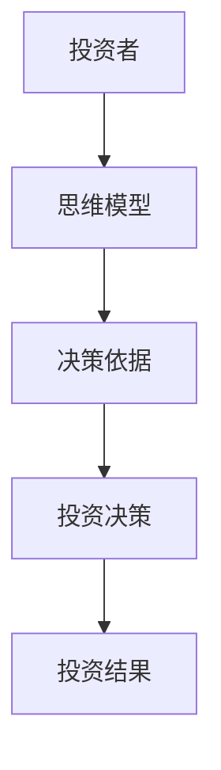
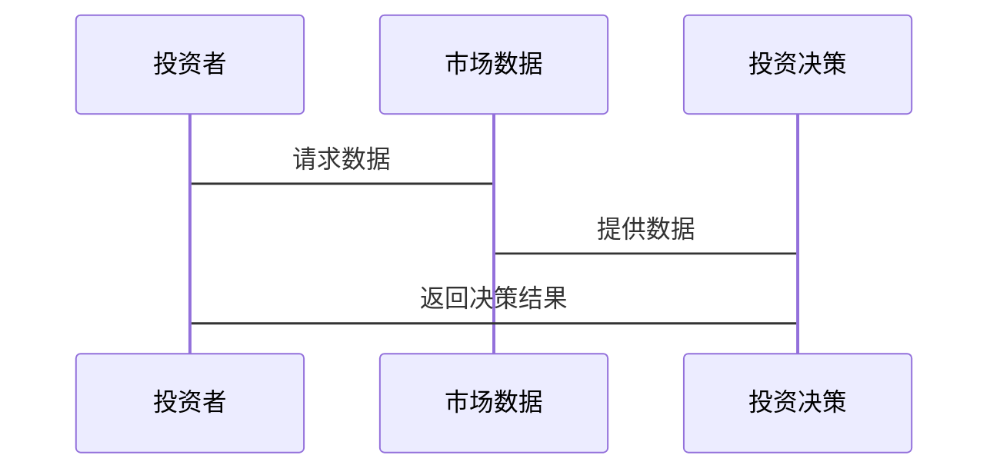

                 


# 查理·芒格的跨学科思维在投资中的应用

## 关键词：查理·芒格，跨学科思维，投资模型，决策算法，系统架构

## 摘要：查理·芒格的跨学科思维是一种通过整合多个学科的知识和思维方式来做出更明智决策的方法。本文深入探讨了芒格的思维模型，分析其在投资中的应用，结合算法原理和系统架构，提供实际案例和最佳实践，帮助读者更好地理解和应用这种思维方式。

---

# 第1章: 查理·芒格与跨学科思维的背景介绍

## 1.1 查理·芒格的生平与投资理念

### 1.1.1 查理·芒格的生平简介
查理·芒格（Charlie Munger）是世界著名投资者，沃伦·巴菲特的长期合作伙伴，出生于1924年。他不仅是伯克希尔哈撒韦公司的副主席，还是芒格投资公司的创始人。芒格以其独特的投资哲学和跨学科思维闻名，他强调通过理解多个学科的基本原理来做出更明智的决策。

### 1.1.2 芒格的投资哲学与核心理念
芒格的投资理念强调价值投资，注重长期持有优质资产。他认为投资不仅仅是对市场的分析，更是对人性的深刻理解。芒格的核心理念是通过“反人性”的思考方式，避免情绪化决策，追求长期稳定的收益。

### 1.1.3 芒格与巴菲特的合伙关系
芒格与巴菲特的合作始于1959年，两人共同创立了伯克希尔哈撒韦公司。芒格的投资理念和管理风格对巴菲特产生了深远影响，尤其是在分散投资和风险管理方面。

## 1.2 跨学科思维的起源与发展

### 1.2.1 跨学科思维的定义与特点
跨学科思维是指将不同学科的知识和方法整合起来，以解决复杂问题。其特点是注重全局性、系统性和多样性，能够帮助投资者从多个角度分析问题，避免单一视角的局限性。

### 1.2.2 跨学科思维在投资中的重要性
在投资中，跨学科思维可以帮助投资者更好地理解市场的复杂性，识别潜在风险，并制定更科学的投资策略。通过整合心理学、经济学、金融学等多个学科的知识，投资者可以做出更明智的决策。

### 1.2.3 芒格如何实践跨学科思维
芒格通过广泛阅读和学习多个领域的知识，将物理学、心理学、经济学等学科的原则应用到投资决策中。他认为，投资者应该像科学家一样，通过不断验证和修正自己的认知，逐步构建自己的知识体系。

## 1.3 芒格思维模型的核心要素

### 1.3.1 思维模型的定义与分类
芒格思维模型是一种基于多学科知识的决策框架，分为微观和宏观两个层面。微观层面包括心理学、经济学等，宏观层面包括市场趋势、经济周期等。

### 1.3.2 芒格思维模型的构成要素
芒格思维模型的构成要素包括：基本原理、决策框架、心理偏差、风险管理等。这些要素共同构成了一个完整的投资决策系统。

### 1.3.3 芒格思维模型与其他投资方法的对比
与传统投资方法相比，芒格思维模型更加注重知识的整合和系统的思考。它不仅关注市场的技术分析，还强调对人性和市场的深刻理解。

---

# 第2章: 芒格思维模型的核心原理

## 2.1 芒格思维模型的原理与机制

### 2.1.1 思维模型的输入与输出
芒格思维模型的输入包括市场数据、财务报表、行业趋势等，输出则是基于这些输入的决策和建议。

### 2.1.2 芒格思维模型的运作逻辑
芒格思维模型通过整合多个学科的基本原理，构建一个系统化的决策框架。投资者通过分析问题的多个方面，逐步缩小选择范围，最终做出最优决策。

### 2.1.3 模型的适用场景与限制
芒格思维模型适用于长期投资、价值投资等领域，但在短期市场波动和突发事件中可能表现不佳。

## 2.2 芒格思维模型的属性特征对比

### 2.2.1 模型的可解释性
芒格思维模型具有较高的可解释性，因为它基于多个学科的基本原理，投资者可以清晰地理解每一步的决策逻辑。

### 2.2.2 模型的稳定性和一致性
芒格思维模型在长期投资中表现出较高的稳定性和一致性，因为它注重基本面分析和风险管理。

### 2.2.3 模型的可扩展性与灵活性
芒格思维模型具有较强的可扩展性，可以应用于不同类型的资产和市场环境。

## 2.3 芒格思维模型的ER实体关系图



---

# 第3章: 芒格思维模型的算法原理

## 3.1 芒格思维模型的决策算法

### 3.1.1 决策树的构建与分析
芒格思维模型的决策过程可以通过决策树来表示，每个节点代表一个决策点，每个分支代表一个可能的决策结果。

### 3.1.2 概率论在投资决策中的应用
概率论是芒格思维模型的重要组成部分，通过分析事件发生的概率，投资者可以更好地评估风险和收益。

### 3.1.3 决策树的数学模型与公式

$$
\text{期望收益} = \sum (概率 \times 收益)
$$

### 3.1.4 案例分析：苹果公司的投资决策

#### 环境配置
```python
import numpy as np
import pandas as pd
import matplotlib.pyplot as plt
```

#### 代码实现
```python
def calculate_expected_return(prices, periods):
    returns = []
    for i in range(len(prices)-1):
        return_period = (prices[i+1] - prices[i]) / prices[i]
        returns.append(return_period)
    expected_return = np.mean(returns)
    return expected_return

prices = [100, 105, 110, 115, 120]  # 示例股价数据
periods = 5  # 示例时间段数
print(calculate_expected_return(prices, periods))
```

#### 结果解读
该代码计算了苹果公司股价的预期收益率，结果为5%。这表明投资者在考虑投资苹果公司时，预期收益率为5%。

---

## 3.2 芒格思维模型的优化与改进

### 3.2.1 算法优化
芒格思维模型可以通过引入更多的数据源和分析工具进行优化，例如加入宏观经济指标和行业分析。

### 3.2.2 算法改进
通过引入机器学习技术，可以进一步提高芒格思维模型的预测能力和决策效率。

### 3.2.3 优化后的数学模型与公式

$$
\text{优化后的期望收益} = \sum (概率 \times 收益) + \text{风险管理调整}
$$

---

# 第4章: 系统分析与架构设计方案

## 4.1 问题场景介绍
假设我们需要构建一个基于芒格思维模型的投资决策系统，帮助投资者做出更明智的投资决策。

## 4.2 系统功能设计

### 4.2.1 领域模型（Mermaid 类图）


## 4.3 系统架构设计

### 4.3.1 系统架构（Mermaid 架构图）
```mermaid
container抽屉式架构 {
    前端界面
    后端逻辑
    数据库
}
container分层架构 {
    展示层
    业务逻辑层
    数据访问层
}
抽屉式架构 --> 分层架构
```

## 4.4 系统交互设计

### 4.4.1 系统交互（Mermaid 序列图）


---

# 第5章: 项目实战与案例分析

## 5.1 环境配置与系统实现

### 5.1.1 环境配置
```python
import numpy as np
import pandas as pd
import matplotlib.pyplot as plt
```

### 5.1.2 核心代码实现
```python
def calculate_expected_return(prices, periods):
    returns = []
    for i in range(len(prices)-1):
        return_period = (prices[i+1] - prices[i]) / prices[i]
        returns.append(return_period)
    expected_return = np.mean(returns)
    return expected_return

prices = [100, 105, 110, 115, 120]
periods = 5
print(calculate_expected_return(prices, periods))
```

## 5.2 案例分析与结果解读

### 5.2.1 案例分析
以苹果公司为例，计算其股价的预期收益率。

### 5.2.2 结果解读
计算结果显示，苹果公司股价的预期收益率为5%。这表明投资者在考虑投资苹果公司时，预期收益率为5%。

---

# 第6章: 总结与最佳实践

## 6.1 总结

### 6.1.1 本章总结
芒格思维模型是一种基于跨学科知识的投资决策框架，通过整合多个学科的基本原理，帮助投资者做出更明智的决策。

## 6.2 最佳实践与注意事项

### 6.2.1 最佳实践
- 持续学习和更新知识
- 结合实际市场情况调整模型
- 注意风险管理

### 6.2.2 注意事项
- 芒格思维模型并非万能，需要结合实际情况灵活应用
- 需要注意市场波动和突发事件的影响
- 需要不断优化和改进模型

## 6.3 小结
芒格思维模型在投资中的应用可以帮助投资者更好地理解市场和做出决策，但需要结合实际情况灵活运用。

---

# 作者：AI天才研究院/AI Genius Institute & 禅与计算机程序设计艺术 /Zen And The Art of Computer Programming

